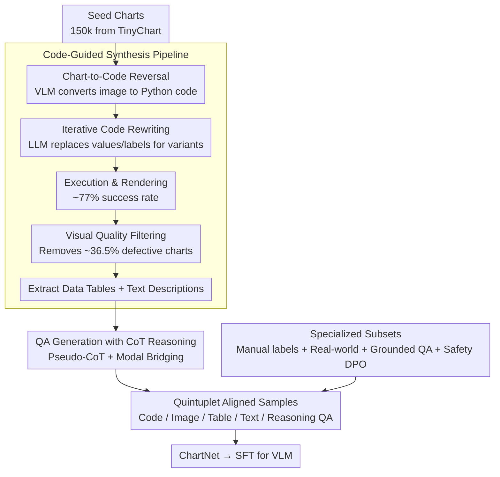

# ChartNet: A Million-Scale, High-Quality Multimodal Dataset for Robust Chart Understanding

**Conference**: CVPR 2026  
**arXiv**: [2603.27064](https://arxiv.org/abs/2603.27064)  
**Code**: [HuggingFace](https://huggingface.co/datasets/ibm-granite/ChartNet)  
**Area**: Signal Communication  
**Keywords**: Chart understanding, multimodal dataset, code-guided synthesis, vision-language models, data visualization  

## TL;DR

This paper proposes ChartNet, a million-scale chart understanding dataset containing 1.5 million high-quality multimodal aligned samples. Through a code-guided synthesis pipeline, it generates quintuplet data (code, image, data table, text description, and reasoning-based QA) covering 24 chart types and 6 plotting libraries. A 2B model fine-tuned on ChartNet outperforms GPT-4o and 72B open-source models.

## Background & Motivation

Chart understanding requires models to simultaneously reason across geometric visual patterns, structured numerical data, and natural language, which remains a weak point for current Vision-Language Models (VLMs):

1.  **Severe data bottleneck**: Existing datasets are significantly lacking in scale, scope, or multimodal coverage. Many focus on single tasks (e.g., QA or description generation) and lack critical modalities such as plotting code, grounding annotations, or reasoning traces.
2.  **Limited chart types**: Widely used benchmarks like ChartQA cover only three chart types (bar, line, pie) and bias toward basic data extraction questions.
3.  **Insufficient scale**: Most datasets range from tens to hundreds of thousands of samples, which is insufficient for training frontier large models.
4.  **Lack of multimodal alignment**: Few datasets provide complete alignment between chart images, executable code, underlying data tables, text descriptions, and reasoning chains.

The core insight of ChartNet is that **charts are programmatically generated**—executable plotting code can serve as a structured intermediate representation for data visualization, allowing data generation and augmentation to be performed in code space rather than image space.

## Method

### Overall Architecture

The key insight of ChartNet is that since charts are programmatically generated, it is more effective to use executable plotting code as a structured intermediate representation rather than fabricating data in image space. The data production pipeline centers on this idea: first, a VLM "reverses" seed charts into executable plotting code; next, an LLM iteratively rewrites the code to generate diverse variants; these are then executed to render images, which undergo visual quality filtering to remove defects. Finally, the system combines image and code contexts to extract data tables, text descriptions, and QA with reasoning to form quintuplet aligned samples. Specialized multi-source sub-sets are also used to fill gaps unreachable by synthetic data.

### Key Designs

**1. Code-Guided Synthesis Pipeline: Moving Data Augmentation from Image Space to Code Space**

Ensuring precise alignment of values and labels is difficult when performing augmentation directly on images, whereas code naturally carries structured data semantics. ChartNet selects 150k seed charts from TinyChart and uses pixtral-large-instruct-2411 for Chart-to-Code Reconstruction. Subsequently, gpt-oss-120b iteratively rewrites the code—replacing numerical values and labels while maintaining contextual relevance—allowing a single seed chart to branch into numerous variants.

The code execution success rate is approximately 77%. After rendering, a visual quality filter removes about 36.5% of defective images. Human evaluation reveals that this filtering reduces the proportion of "readability issues" from 14.9% to 5.9%, demonstrating that generating in code space combined with visual-side gatekeeping achieves both scale and quality.

**2. QA Generation with CoT Reasoning: Supplementing Reasoning Traces via Modal Bridging**

Most chart datasets only provide answers without reasoning processes, preventing models from learning the "thought process." Based on the Vision-R1 framework, ChartNet uses pixtral-large-instruct-2411 to generate complex multi-stage reasoning questions and constructs a four-step "Pseudo-CoT" sequence (Summary → Caption → Reasoning → Conclusion). The clever design here is modal bridging: image content is first transcribed into text summaries and captions, allowing the language model to reason even without direct visual access. Finally, gpt-oss-120b outputs detailed reasoning traces with `<think>` and `<answer>` tags.

**3. Full-Spectrum Coverage via Specialized Subsets: Filling Gaps in Synthetic Data**

Pure synthetic data may lack authenticity, authority, and safety. ChartNet uses several specialized subsets to address these areas:

-   **Manually Annotated Subset** (96,643 items): High-quality aligned data verified and annotated by humans.
-   **Real-World Charts** (30k items): Sourced from authoritative entities like the World Bank and Pew Research, covering economics, technology, and environment.
-   **Grounded QA Pairs**: Generates template-based grounded QA by extracting geometry-aware annotations from plotting code.
-   **Safety Alignment Data** (7,600 items): Adversarial questions and safe/unsafe response pairs targeting sensitive topics for DPO.

By layering real distributions and safety supervision onto the quintuplet data, the fine-tuned model gains exposure to authoritative real-world charts and basic safety alignment capabilities.

### Loss & Training

The VLMs are trained using standard Supervised Fine-Tuning (SFT):
-   Training data covers four tasks: Chart-to-Code, Chart-to-Table, Chart-to-Text, and Chart QA with CoT Reasoning.
-   Models use default hyperparameters from the TRL framework.
-   Evaluation is conducted on an independent held-out set of 2,000 samples.
-   Automatic evaluation uses GPT-4o as a judge (except for QA tasks, which use RapidFuzz for fuzzy matching).

## Key Experimental Results

### Main Results - ChartNet Evaluation Set

| Model | Chart Recon (Exec/Code-D/Code-S/Img) | Data Extract | Summary | QA w/CoT |
|:---|:---:|:---:|:---:|:---:|
| granite-vision-2B | 63.4/60.7/67.0/77.2 | 53.8 | 64.0 | 59.9 |
| **+ ChartNet** | **90.4/72.8/90.0/92.8** | **70.3** | **83.9** | **65.0** |
| llava-7B | 45.3/27.0/52.9/59.6 | 17.0 | 51.2 | 55.1 |
| **+ ChartNet** | **83.9/69.4/88.6/91.5** | **58.8** | **80.3** | **70.3** |
| GPT-4o | 95.9/48.8/77.2/88.2 | 46.7 | 77.1 | 61.1 |

The fine-tuned **2B model outperforms GPT-4o** (Data Extraction 70.3 vs 46.7, Summary 83.9 vs 77.1).

Comparison with larger off-the-shelf models:

| Model | Data Extract | Summary | QA w/CoT |
|:---|:---:|:---:|:---:|
| Qwen2-VL-72B | 50.3 | 75.9 | 60.3 |
| Mistral-24B | 53.2 | 79.8 | 60.0 |
| **granite-2B + ChartNet** | **70.3** | **83.9** | **65.0** |

### Ablation Study / Public Benchmarks

ChartCap Summarization (granite-vision-2B):
-   Baseline: BLEU_4=1.6, METEOR=6.4, ROUGE_L=9.6
-   +ChartNet: BLEU_4=12.4, METEOR=30.1, ROUGE_L=24.9

ChartMimic-v2 Code Generation (granite-vision-2B):
-   Baseline: v2-direct=30.84
-   +ChartNet: v2-direct=58.42 (+27.58)

Ultra-compact models also gained significant capabilities: SmolVLM-256M and Granite-Docling-258M transitioned from zero capability to usable performance.

### Key Findings

1.  **Data Quality > Model Scale**: In domains like chart understanding where vision, numbers, and language are tightly coupled, providing high-quality code-aligned multimodal supervision is far more effective than simply increasing model size.
2.  **Consistent Improvement Across Scales**: All models from 256M to 7B showed significant gains across all tasks, with the magnitude of improvement being independent of model size.
3.  **Value of Code as Intermediate Representation**: Chart-to-Code alignment training provides structural supervision for programmatic understanding of charts.
4.  **Largest Gains in Data Extraction**: While GPT-4o achieved only 46.7%, the ChartNet fine-tuned 2B model reached 70.3%, highlighting the value of tight code-data-image alignment.
5.  **Generalization to Real-World Data**: Synthetic data capabilities successfully generalize to real benchmarks like ChartCap and ChartMimic-v2.

## Highlights & Insights

-   **Performing data augmentation in code space rather than image space** is an elegant design—code naturally provides a structured representation that makes multimodal alignment more precise.
-   The quintuplet alignment (code, image, table, text, reasoning QA) is more comprehensive than any existing dataset.
-   The result of a 2B model surpassing GPT-4o and 72B models strongly demonstrates the value of high-quality, domain-specific data.
-   The inclusion of a safety alignment subset provides necessary infrastructure for AI safety in the chart domain.

## Limitations & Future Work

-   Heavy reliance on synthetic data; while real-world subsets exist, their smaller proportion may lead to domain shift.
-   Seed charts are sourced solely from TinyChart, which may limit initial diversity.
-   A code execution success rate of 77% means approximately 23% of generation efforts are wasted.
-   Even after visual filtering, 5.9% of charts still exhibit quality issues.
-   Evaluation relies on GPT-4o as a judge, which may introduce systematic bias.
-   Lack of evaluation for deep understanding capabilities such as complex mathematical reasoning or statistical analysis within charts.

## Related Work & Insights

-   **UniChart/TinyChart**: Pioneering multi-task chart datasets, but with smaller scales and less modal coverage than ChartNet.
-   **ChartQA**: Widely used but limited to 3 chart types and 14k samples, approaching performance saturation.
-   **CoSyn**: Also uses code-guided synthesis but is limited to 3 libraries and fewer chart types.
-   **Insight**: The code-guided data synthesis paradigm can be extended to other "programmatically generated" visual understanding tasks, such as 3D scene understanding or UI understanding.

## Rating

-   **Novelty**: 7/10 — The concept of code-guided synthesis is not entirely new, but the systematic and large-scale execution is outstanding.
-   **Experimental Thoroughness**: 9/10 — Comprehensive evaluation across multiple models, scales, tasks, and benchmarks.
-   **Writing Quality**: 8/10 — Clear structure, detailed comparison tables, and well-defined contributions.
-   **Value**: 9/10 — As the largest open-source chart understanding dataset, it holds high value for the community; the "2B > GPT-4o" result is impressive.

<!-- RELATED:START -->

## Related Papers

- [\[CVPR 2026\] Towards Open-Vocabulary Industrial Defect Understanding with a Large-Scale Multimodal Dataset](towards_open-vocabulary_industrial_defect_understanding_with_a_large-scale_multi.md)
- [\[ICLR 2026\] TABLET: A Large-Scale Dataset for Robust Visual Table Understanding](../../ICLR2026/multimodal_vlm/tablet_a_large-scale_dataset_for_robust_visual_table_understanding.md)
- [\[ICLR 2026\] ChartGalaxy: A Dataset for Infographic Chart Understanding and Generation](../../ICLR2026/multimodal_vlm/chartgalaxy_a_dataset_for_infographic_chart_understanding_and_generation.md)
- [\[CVPR 2026\] ENC-Bench: A Benchmark for Evaluating MLLMs in Electronic Navigational Chart Understanding](enc-bench_a_benchmark_for_evaluating_multimodal_large_language_models_in_electro.md)
- [\[CVPR 2026\] SketchVL: Policy Optimization via Fine-Grained Credit Assignment for Chart Understanding and More](sketchvl_policy_optimization_via_fine-grained_credit_assignment_for_chart_unders.md)

<!-- RELATED:END -->
