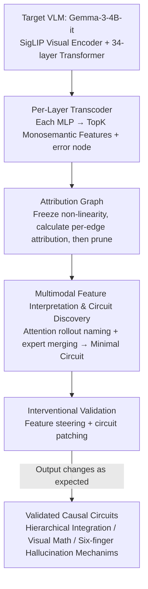

# Circuit Tracing in Vision-Language Models: Understanding the Internal Mechanisms of Multimodal Thinking

**Conference**: CVPR 2026 Findings  
**arXiv**: [2602.20330](https://arxiv.org/abs/2602.20330)  
**Code**: [github.com/UIUC-MONET/vlm-circuit-tracing](https://github.com/UIUC-MONET/vlm-circuit-tracing)  
**Area**: Multimodal VLM  
**Keywords**: interpretability, circuit tracing, transcoder, attribution graph, feature steering

## TL;DR

This paper proposes the first circuit tracing framework specifically for VLMs. By training per-layer transcoders in Gemma-3-4B and constructing attribution graphs, the authors reveal mechanisms including hierarchical multimodal integration, visual mathematics circuits, and the internal origins of "six-finger" hallucinations. The causal controllability of these circuits is validated through feature steering and circuit patching.

## Background & Motivation

**Background**: VLMs (such as CLIP, LLaVA, and GPT-4o) have achieved significant success in tasks like visual question answering, image captioning, and complex visual reasoning. However, their internal working mechanisms remain opaque "black boxes," which is a critical issue for high-risk applications like medical imaging, autonomous driving, and content moderation.

**Limitations of Prior Work**: Mechanistic interpretability for LLMs (e.g., circuit discovery, induction heads analysis, activation patching) has progressed rapidly, but remains almost entirely confined to text-only models. VLMs face unique challenges—integrating two modalities with different statistical properties and discovering meaningful visual-linguistic correspondences. Existing VLM interpretability work primarily focuses on high-level analysis (attention visualization, probing), which is inherently correlational rather than causal.

**Key Challenge**: There is a lack of understanding regarding how VLMs bind visual features to tokens, how they implement cross-modal reasoning, and how visual and linguistic attention are coordinated. While sparse autoencoders and transcoders have successfully decomposed polysemantic representations in LLMs, they have not yet been applied to multimodal scenarios.

**Goal**: Establish the first complete VLM circuit tracing framework to systematically analyze the internal computational mechanisms of multimodal reasoning.

**Key Insight**: Extend the validated LLM paradigm of "transcoder + attribution graph" to multimodal settings, developing new methods for image token processing, bidirectional attention, and cross-modal information flow unique to VLMs.

**Core Idea**: Decompose polysemantic representations into interpretable monosemantic features by inserting transcoders into each MLP layer of the VLM. Combined with attribution graphs to trace causal relationships between features, this allows for the discovery and verification of sparse computational circuits driving multimodal reasoning.

## Method

### Overall Architecture

This paper seeks to answer a previously unexplored question: How do VLMs internally "unify" images and text during thinking? Prior methods like attention visualization and probing only capture correlations. The authors adapt the "transcoder + attribution graph" paradigm, proven by Anthropic for text-only LLMs, to the multimodal domain, establishing an end-to-end analysis pipeline. First, a transcoder is attached to each MLP layer of the target model to decompose entangled polysemantic representations into sparse monosemantic features. Second, an attribution graph is constructed with these features as nodes, calculating the exact causal contribution along each edge from input token embeddings through intermediate features to output logits. Finally, combined with attention analysis and expert annotation, the minimal circuit driving a specific behavior is extracted and validated via intervention experiments. The analysis targets Gemma-3-4B-it, which utilizes a SigLIP visual encoder (patch size 14, 896×896 input, 4096 patch tokens pooled into 256 soft image tokens) and a 34-layer transformer for the language side ($d_{model}=2560$, $d_{ff}=10240$).

### Key Designs

**1. Per-Layer Transcoder: Replacing MLPs with Interpretable Monosemantic Features**

Direct analysis of MLP internal representations is unfeasible due to superposition, where a single neuron encodes multiple unrelated concepts. The authors insert a transcoder at the position of each MLP layer: an encoder projects the input $x \in \mathbb{R}^{d_{model}}$ into a high-dimensional feature space $z(x) = \text{ReLU}(W_{enc}x + b_{enc})$, keeping only the $k=48$ strongest activations via TopK. The decoder then reconstructs the original MLP output: $\text{TC}(x) = W_{dec}z(x) + b_{dec}$. Each feature corresponds to a pair consisting of an encoder column and a decoder row, making an additive contribution to the output. This translates "what this layer calculated" into a small set of nameable features. TopK is preferred over $\ell_1$ penalties as it avoids hyperparameter tuning for sparsity and yields more consistent features. Transcoders are chosen over SAEs because they mimic the input-output behavior of the MLP, maintaining computational equivalence necessary for causal attribution. To maintain precision, reconstruction residuals $e(x) = \text{MLP}(x) - \text{TC}(x)$ are explicitly treated as "error nodes" in the circuit.

**2. Attribution Graph: Mapping the Causal Chain into an Additive Graph**

Once monosemantic features are obtained, their inter-dependencies must be determined. Under a fixed input, the model is locally linear; by freezing all non-linearities (ReLU, attention softmax, LayerNorm), the network degrades into a series of linear mappings. Causal contribution between source and target features is defined as:

$$A_{s \to t} = a_s \cdot w_{s \to t}, \qquad w_{s \to t} = f_{dec}^{(s)\top}\, J^\blacktriangledown_{(s) \to (t)}\, f_{enc}^{(t)}$$

Here, the virtual weight $w_{s \to t}$ links the source feature's decoder vector, the Jacobian of the frozen residual stream, and the target feature's encoder vector. A key property of this definition is that a node's pre-activation equals the sum of its incoming attributions ($h_t = \sum_{s} A_{s \to t}$), providing a **complete additive explanation**. The graph is simplified by pruning edges with negligible attribution ($|A_{s \to t}| < \epsilon$), maintaining cumulative influence thresholds between 0.80 and 0.98, and ensuring the final sparse graph covers at least 95% of the logit probability mass.

**3. Multimodal Feature Interpretation & Circuit Discovery: Naming Features and Extracting Circuits**

Features are initially just indices. Text token features are identified by commonalities in top-k activation samples. Image token features pose a greater challenge; the authors use attention rollout from the SigLIP encoder. By selecting heads with the lowest entropy (highest focus) in the final $K$ layers and multiplying them across layers, a rolled-over attention map is generated, showing which image region the feature attends to. Human experts then merge functionally similar features into nodes. To manage scale, the authors use an ad hoc strategy: they only analyze the ~1000 features involved in the current attribution graph rather than pre-computing the entire model's feature set.

**4. Interventional Validation: Causal Proof via Steering and Patching**

To prove a circuit genuinely drives behavior, the authors use two interventions. **Feature steering** forces a feature's activation to a target value $v_{\ell,t,i}$ during forward propagation, updating the residual stream via $\Delta z = v - z(x)$ and $h_{\ell,t} \leftarrow h_{\ell,t} + \Delta z \cdot d_{\ell,i}$ to observe predicted changes in output. **Circuit patching** transplants a feature patch from Circuit A to a structurally similar position in Circuit B. For example, suppressing "Mars" visual features while injecting "Earth" visual features to check if subsequent feature activations and the final logit flip consistently to Earth-related concepts.

## Key Experimental Results

### Transcoder Training Config

| Component | Configuration |
|------|------|
| Training Data | SmoLIM2 Text (144K) + ImageNet (144K) + Cauldron QA (72K) |
| Optimizer | AdamW, lr = $2 \times 10^{-4} \times \sqrt{2^{14} / (N_{latents} \times d_{model})}$ |
| Scale | batch size 12, 30K steps, 8×H100, ~60 hours |
| Sparsity | TopK, $k=48$ |
| Feature Dim | $d_{feat} = N_{latents} \times d_{model} \times 34$ |

### Ablation of Extension Factor $N_{latents}$

| Extension Factor $N_{latents}$ | Dead Feature Trend | Layer Variations |
|------------------------|--------------|---------|
| 32 | Highest; many features unused | Dead feature ratio especially high in early layers (L3) |
| **64 (Selected)** | Moderate; best balance of utility and quality | Most dense activation patterns in middle layers (L15) |
| 128 | Lowest; but FVU slightly increases | Increased feature redundancy in high layers |

### FVU Comparison: Multimodal vs. Text-only

| Training Data | Mid-layer FVU (~L15) | High-layer FVU (~L30) | Analysis |
|---------|----------------------|---------------------|---------|
| Text-only (SmoLIM2) | Higher | Similar to multimodal | Lacks visual constraints; insufficient mid-layer explanation |
| **Text+Image (Ours)** | **Significantly Lower** | **Slightly Lower** | Visual features provide extra constraints, especially during integration |

### Key Findings

- **Hierarchical Integration**: Jointly encoded features for visual and semantic concepts only emerge above Layer 20. Early layers remain modality-independent, supporting the "progressive binding hypothesis."
- **Visual Math Circuits**: For image-based arithmetic (e.g., rendered $1+2$), the model computes partly in visual space. Intermediate layers show visual features for the result "3" that activate consistently across contexts.
- **Six-finger Hallucination Mechanism**: This is not a single failure mode but an interaction of: (1) SigLIP encoder producing embeddings over-emphasizing generic "hand" semantics; (2) Internal circuits amplifying hand-related features; and (3) Visual features for the number "6" being suppressed while hand features strongly activate the "five" circuit.
- **Parallel Pathways & Late Convergence**: Gemma-3 maintains independent visual and semantic representation streams even in deep layers. For example, "shuttle" features triggered by Mars images reflect visual associations independent of semantics. These pathways merge only at the final layers.

## Highlights & Insights

- Implements the first complete circuit tracing for VLMs, successfully extending LLM methodology to multimodal contexts.
- The analysis of the "six-finger" hallucination provides deep insight: it is an emergent result of encoder bias, circuit competition, and the drowning out of counting circuits.
- Discovery that the language model portion of the VLM maintains an independent visual representation space where feature clustering is driven by visual similarity rather than semantic categories.
- Practical ad hoc feature analysis strategy significantly reduces costs while maintaining interpretability.

## Limitations & Future Work

- **Ours** only analyzes Gemma-3-4B; the universality of findings across models with different architectures remains unverified.
- Per-layer transcoders cannot capture cross-layer superposition, leading to redundant visual features in the attribution graph.
- Visual encoder attention maps sometimes struggle to locate relevant regions, limiting annotation quality.
- Circuit discovery still relies on manual expert annotation, which is difficult to scale or use for direct model fine-tuning.

## Related Work & Insights

- **Extension of LLM Circuit Tracing**: Builds upon the work of Anthropic and Lindsey et al., but adapted for image tokens and cross-modal flows.
- **Causal vs. Correlational**: Unlike traditional attention visualization or probing, this framework uses intervention experiments to prove that identified circuits genuinely drive model behavior.
- **Transcoders over SAEs**: Because transcoders mimic the MLP's input-output transformation, they are more appropriate for discovering the causal computational paths within the model.

## Rating

- Novelty: ⭐⭐⭐⭐⭐
- Experimental Thoroughness: ⭐⭐⭐⭐
- Writing Quality: ⭐⭐⭐⭐⭐
- Value: ⭐⭐⭐⭐⭐

<!-- RELATED:START -->

## Related Papers

- [\[CVPR 2026\] Mechanisms of Object Localization in Vision-Language Models](mechanisms_of_object_localization_in_vision-language_models.md)
- [\[CVPR 2026\] EduDiag: A Benchmark for Educational Diagnostic Reasoning with Error Tracing and Correction on Large Multimodal Models](edudiag_a_benchmark_for_educational_diagnostic_reasoning_with_error_tracing_and_.md)
- [\[CVPR 2026\] Thinking with Programming Vision: Towards a Unified View for Thinking with Images](thinking_with_programming_vision_towards_a_unified_view_for_thinking_with_images.md)
- [\[ICLR 2026\] Visual Symbolic Mechanisms: Emergent Symbol Processing in Vision Language Models](../../ICLR2026/multimodal_vlm/visual_symbolic_mechanisms_vlm.md)
- [\[CVPR 2026\] All Roads Lead to Rome: Incentivizing Divergent Thinking in Vision-Language Models](all_roads_lead_to_rome_incentivizing_divergent_thinking_in_vision-language_model.md)

<!-- RELATED:END -->
