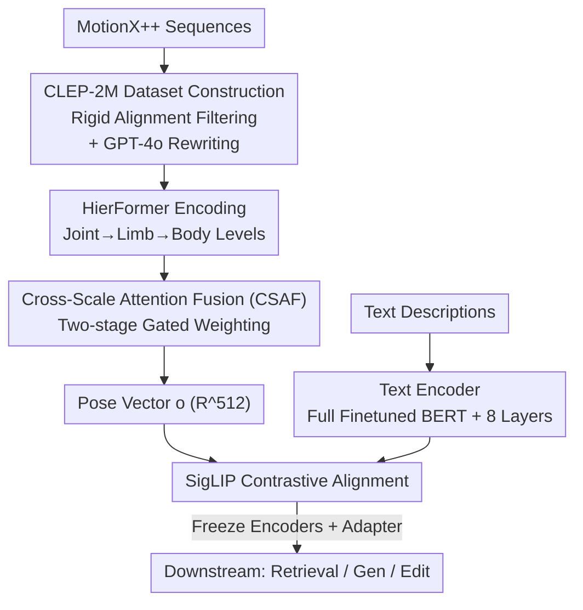

# CLEP: Contrastive Language-Pose Pretraining

**Conference**: CVPR 2026  
**Paper**: [CVF Open Access](https://openaccess.thecvf.com/content/CVPR2026/html/Jia_CLEP_Contrastive_Language-Pose_Pretraining_CVPR_2026_paper.html)  
**Code**: Not public (No repository link provided in original text)  
**Area**: Multimodal VLM / Human Understanding  
**Keywords**: Pose-Language Alignment, Contrastive Pretraining, Hierarchical Pose Encoder, Cross-Scale Attention, 3D Human Pose

## TL;DR
CLEP adapts CLIP-style contrastive learning to "3D Human Pose ↔ Natural Language". By combining the hierarchical pose encoder HierFormer (joint/limb/full-body levels + Cross-Scale Attention Fusion, CSAF) with the self-constructed CLEP-2M dataset (2 million pairs) for contrastive pretraining, it boosts mRecall on PoseScript-H zero-shot retrieval from 5.9 to 34.8 (nearly 6x) and outperforms baselines in downstream tasks like pose generation and editing.

## Background & Motivation
**Background**: Understanding human pose is the foundation for various applications such as pose-conditioned image generation, text-driven person retrieval, motion editing, and mesh recovery. Natural language can describe pose semantics (e.g., "left hand raised to shoulder height, body leaning slightly forward") much more finely than action categories. Therefore, "pose-language alignment" is considered a fundamental capability for human-centric multimodal understanding and generation. CLIP has demonstrated that image-text alignment unlocks powerful zero-shot capabilities; the pose domain naturally seeks to replicate this success.

**Limitations of Prior Work**: Early efforts like PoseScript only contained approximately 100k pose-text pairs, with small scale and narrow description diversity, causing contrastive objectives to learn very little and limiting alignment capability. Subsequent works like ChatPose, UniPose, and ChatHuman leveraged LLMs (sometimes with external expert tools) for pose generation/estimation. However, they bypassed explicit alignment in a shared embedding space, leading to noise, low efficiency, and accumulated errors across layers, resulting in fragmented representations.

**Key Challenge**: The quality of pose-language alignment is hindered by two factors: first, the lack of a pose representation that **understands human structure** (PoseScript flattens joint coordinates into fixed-length vectors, losing the "joint → limb → full body" hierarchy and failing to adapt to different skeleton configurations); second, the lack of **large-scale, semantically rich** pose-language paired data. Addressing only one is insufficient.

**Goal**: To develop a foundational model that explicitly aligns pose and language in a shared space from both the representation and data levels.

**Key Insight**: The human body is inherently hierarchical—from fine-grained joints (fingertips, toes) to high-level components (torso, limbs). The authors design a hierarchical Transformer pose encoder to capture both local details and global structure, then align it with text using contrastive learning.

**Core Idea**: Implement the CLIP paradigm for 3D pose-language via "HierFormer (with CSAF) + 2M self-constructed pairs + SigLIP loss" to learn transferable aligned representations.

## Method

### Overall Architecture
CLEP is a dual-tower contrastive pretraining framework. The pose branch uses the HierFormer encoder, while the text branch uses a finetuned BERT (plus 8 Transformer layers); both towers are aligned in a shared space using a contrastive loss. To enable this, the authors first solved the data scarcity problem by extracting diverse key poses from MotionX++ sequences and rewriting descriptions via GPT-4o to create CLEP-2M. During pretraining, both towers are trained jointly; for downstream use, both encoders are frozen, and lightweight adapters are attached for retrieval, generation, and editing tasks.

The pipeline from top to bottom is: **Dataset Construction → Hierarchical Pose Encoding (HierFormer) → Cross-Scale Attention Fusion (CSAF) to get Pose Vector → SigLIP Contrastive Alignment with Text Encoder → Frozen Encoders + Adapters for Downstream Tasks**.

### Key Designs

**1. CLEP-2M Dataset Construction: Filtering key poses via rigid alignment error and augmenting semantics with GPT-4o**

The primary bottleneck was that PoseScript only had 100k pairs with poor descriptions. However, simply using every frame from MotionX++ sequences would create redundant supervision (neighboring frames are nearly identical). The solution is to keep only "informative key poses": for adjacent frames $P_1, P_2$, the optimal scale $s$, rotation $R$, and translation $t$ are calculated to align $P_1$ to $P_2$. The alignment residual is defined as:

$$\sum_{i=1}^{n}\sum_{d=1}^{3}\left| s\cdot(R\cdot P_1(i))_d + t_d - P_2(i)_d \right|$$

where $i$ indexes joints and $d$ indexes spatial dimensions. Poses are retained only when this residual exceeds a threshold, ensuring diversity. For semantics, GPT-4o with specific prompts generated more human-like descriptions. Quality control involved a GPT-4o self-assessment (0–10 score, rewriting if below 4) and manual inspection of 5000 samples by 15 volunteers, with over 95% passing fluency and semantic checks. The resulting 2M pairs reflect a 20x increase in scale.

**2. HierFormer: Encoding joints/limbs/body in three levels**

HierFormer treats each keypoint as an independent token. At the **Joint Level**, Transformer blocks model spatial dependencies between joints. At the **Limb Level**, joints are grouped semantically (e.g., shoulder-elbow-wrist), and 1D convolutions extract local limb features followed by a Transformer. Finally, at the **Full-Body Level**, limbs are aggregated into larger regions (arms, legs, torso, head) and encoded. Formally, for each level $i\in\{l,b\}$:

$$E_i = T^{(i)}\!\left(\left\{\mathrm{Conv}\!\left(E_{i-1}[G_i(k)]\right)\right\}_{k=1}^{K_i}\right)$$

where $G_i(k)$ is the joint index set for the $k$-th unit of level $i$, $E_i\in\mathbb{R}^{n_i\times d}$ are the features, and $T^{(i)}$ is the Transformer block. This "tokenize joints + hierarchical aggregation" allows the encoder to capture both fingertip-level details and full-body structure while remaining compatible with arbitrary skeleton configurations.

**3. Cross-Scale Attention Fusion (CSAF): Two-stage gating to determine scale importance**

CSAF uses two stages of dynamic weighting. **Stage 1 (Intra-scale refinement)**: For each scale $i\in\{j,l,b\}$, $E_i$ acts as the query and the concatenation of other scales $[E_{k\neq i}]$ acts as key/value for Scale Attention:

$$C_i = \mathrm{softmax}\!\left(\frac{(W_{Q_i}E_i)(W_{K_i}[E_{k\neq i}])^\top}{\sqrt{d_k}}\right)(W_{V_i}[E_{k\neq i}])$$

A gated residual merges cross-scale information: $E'_i = g_i\cdot E_i + (1-g_i)\cdot C_i$, where $g_i=\sigma(\mathrm{MLP}(E_i))\in[0,1]^{n_i\times 1}$ balances original info and cross-scale context. **Stage 2 (Inter-scale aggregation)**: Refined $E'_i$ are mean-pooled across the spatial dimension $n_i$ to get global vectors $\bar E_j,\bar E_l,\bar E_b$. A scalar gate $g_i=\sigma(\mathrm{MLP}(\bar E_i))$ weights their final contributions to the pose vector:

$$o = \sum_{i\in\{j,l,b\}} g_i\cdot \bar E_i,\quad o\in\mathbb{R}^{512}$$

This allows the model to emphasize the most informative scale dynamically based on the input.

**4. Full Text Encoder Finetuning + SigLIP Loss**

On the text side, CLEP's 2M pairs allow for full finetuning of BERT plus an additional 8-layer Transformer (512 hidden dimensions). The alignment objective uses SigLIP loss instead of standard InfoNCE, treating contrastive alignment as pairwise binary classification:

$$L_{\text{SigLIP}} = \frac{1}{N^2}\sum_{i=1}^{N}\sum_{j=1}^{N}\log\!\left(1+\exp\!\left(-z_{ij}\cdot(\tau\cdot\langle x_i,y_j\rangle + b)\right)\right)$$

where $z_{ij}=1$ for positive pairs and $z_{ij}=-1$ for negatives. SigLIP is more efficient and stable for training with small batches.

### Loss & Training
Pretraining: Both towers are trained on CLEP-2M using SigLIP for 30 epochs (Batch 1024, LR 1e-4) taking 12 hours on a single H100. Finetuning: Encoders are frozen while lightweight adapters are tuned on PoseScript for 20 epochs (LR 8e-4, Batch 512). Pose editing follows the objectives defined in PoseFix.

## Key Experimental Results

### Main Results
**Zero-shot Retrieval (Table 2)** — Pretrained on CLEP-2M and tested on PoseScript without seeing its distribution:

| Test Set | Method | mRecall↑ | pose→text R@1 | text→pose R@1 |
|--------|------|----------|---------------|---------------|
| PoseScript-H | PoseScript (Trained on -A) | 5.9 | 2.3 | 1.4 |
| PoseScript-H | Ours (Zero-shot) | **34.8** | 16.2 | 15.8 |
| PoseScript-A | Ours (Zero-shot) | 43.6 | 13.1 | 19.2 |

mRecall jumps from 5.9 to 34.8 on human-annotated PoseScript-H, despite CLEP never seeing the target distribution.

**Finetuned Retrieval (Table 1)**:

| Test Set | PoseScript | Ours | Gain |
|--------|-----------|------|------|
| PoseScript-A | 72.8 | **83.4** | +10.6 |
| PoseScript-H | 40.9 | **51.4** | +10.5 |
| CLEP-2M | 64.98 | **75.69** | +10.7 |

### Ablation Study
Incremental contribution of components on CLEP-2M mRecall↑:

| Configuration | mRecall | Description |
|------|---------|------|
| Baseline (Flattened + InfoNCE) | 64.98 | Starting point |
| + Hierarchical Representation | 67.90 | +2.92, hierarchy introduced |
| + SA (Scale Attention) | 69.64 | +1.74, CSAF Stage 1 |
| + GatedHead (Gated Fusion) | 72.79 | +3.15, CSAF Stage 2 |
| + SigLIP Loss | **75.69** | +2.90, replaces InfoNCE |

### Key Findings
- The **GatedHead (+3.15)** and **SigLIP (+2.90)** provide the most significant gains, suggesting that fusion strategies and loss functions are as critical as the hierarchical architecture itself.
- Under **identical data conditions** (PoseScript baseline trained on CLEP-2M), CLEP still leads by a large margin (75.69 vs 64.98), proving architectural superiority.
- Zero-shot gains are the most dramatic, highlighting the value of large-scale, semantically diverse pretraining for distribution generalization.

## Highlights & Insights
- **Adapting CLIP to 3D Pose**: CLEP proves that "domain-specific structure priors + large data + contrastive learning" works for new modalities.
- **Joint Tokenization**: Treating joints as tokens instead of a single vector enables compatibility with any skeleton configuration, facilitating cross-dataset reuse.
- **CSAF Gating Logic**: The two-stage gating (intra-scale refine, inter-scale aggregate) allows the model to choose scales dynamically based on input semantics—a design transferable to any multi-scale feature fusion task.
- **SigLIP over InfoNCE**: An gain of +2.9 suggests SigLIP should be prioritized over InfoNCE when working with smaller batches or constrained resources.

## Limitations & Future Work
- **Non-public Code/Data**: Repository links are missing, which may hinder reproducibility ⚠️.
- **GPT-4o Dependency**: Descriptions are generated and self-evaluated by GPT-4o, introducing potential "judge-as-contestant" bias.
- **Sub-optimal Editing**: Performance in rotation ELBO/geodesic distance slightly trails PoseFix, indicating room for better fine-grained rotation control.
- Future directions include open-sourcing data, incorporating independent description auditing, and extending hierarchical encoding to temporal motion sequences.

## Related Work & Insights
- **vs PoseScript**: PoseScript flattens joints and freezes BERT with small data; CLEP uses tokenized hierarchy, full BERT finetuning, and 2M pairs, outperforming it even under equal data conditions.
- **vs ChatPose/ChatHuman**: These rely on LLMs/tools without explicit representation-level alignment; CLEP provides a shorter, more controllable path via direct contrastive alignment.
- **vs MotionCLIP**: MotionCLIP maps motion into the general CLIP space; CLEP argues for a **pose-aware** representation to bridge semantic gaps.

## Rating
- Novelty: ⭐⭐⭐⭐ First to design a hierarchical encoder + large-scale dataset for 3D pose-text alignment.
- Experimental Thoroughness: ⭐⭐⭐⭐ Strong zero-shot results across retrieval, generation, and editing.
- Writing Quality: ⭐⭐⭐⭐ Logic is clear; formulas are well-defined.
- Value: ⭐⭐⭐⭐ Provides a reusable foundational model for human-centric multimodal tasks.

<!-- RELATED:START -->

## Related Papers

- [\[CVPR 2026\] From 3D Pose to Prose: Biomechanics-Grounded Vision-Language Coaching](from_3d_pose_to_prose_biomechanics-grounded_vision-language_coaching.md)
- [\[CVPR 2026\] Concept-Aware Batch Sampling Improves Language-Image Pretraining](concept-aware_batch_sampling_improves_language-image_pretraining.md)
- [\[CVPR 2026\] TIPSv2: Advancing Vision-Language Pretraining with Enhanced Patch-Text Alignment](tipsv2_patch_text_alignment.md)
- [\[CVPR 2026\] SynCLIP: Synonym-Coherent Language-Image Pretraining for Robust Open-Vocabulary Dense Perception](synclip_synonym-coherent_language-image_pretraining_for_robust_open-vocabulary_d.md)
- [\[CVPR 2026\] Joint-Aligned Latent Action: Towards Scalable VLA Pretraining in the Wild](joint-aligned_latent_action_towards_scalable_vla_pretraining_in_the_wild.md)

<!-- RELATED:END -->
## Related Papers

- [\[CVPR 2026\] Mocap-2-to-3: Multi-view Lifting for Monocular Motion Recovery with 2D Pretraining](mocap-2-to-3_multi-view_lifting_for_monocular_motion_recovery_with_2d_pretrainin.md)
- [\[CVPR 2026\] LCA: Large-scale Codec Avatars - The Unreasonable Effectiveness of Large-scale Avatar Pretraining](lca_large-scale_codec_avatars_the_unreasonable_effectiveness_of_large-scale_avata.md)
- [\[CVPR 2026\] Sign Language Recognition in the Age of LLMs](sign_language_recognition_llms.md)
- [\[CVPR 2025\] Pose Priors from Language Models](../../CVPR2025/human_understanding/pose_priors_from_language_models.md)
- [\[NeurIPS 2025\] CPEP: Contrastive Pose-EMG Pre-training Enhances Gesture Generalization on EMG Signals](../../NeurIPS2025/human_understanding/cpep_contrastive_pose-emg_pre-training_enhances_gesture_generalization_on_emg_si.md)

<!-- RELATED:END -->
