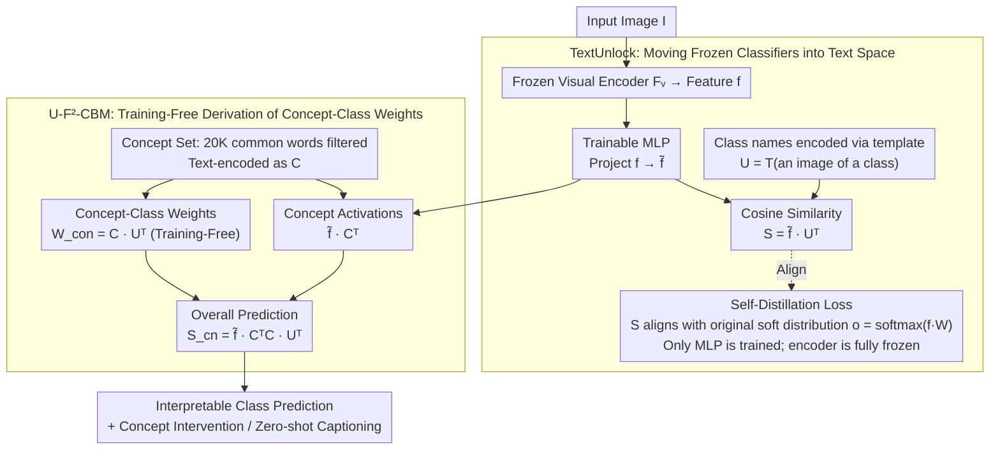

# CLIP-Free, Label-Free, Unsupervised Concept Bottleneck Models

**Conference**: CVPR 2026 Findings  
**arXiv**: [2503.10981](https://arxiv.org/abs/2503.10981)  
**Code**: To be confirmed  
**Area**: Multimodal VLM  
**Keywords**: Concept Bottleneck Model, Interpretability, Knowledge Distillation, Unsupervised Classification, Vision-Language Alignment, Zero-shot Image Captioning

## TL;DR

The TextUnlock method is proposed to align the output distribution of any frozen visual classifier with the vision-language correspondence space. This enables the construction of a fully unsupervised concept bottleneck model (U-F²-CBM) that requires no CLIP, no labels, and no training of linear probes, outperforming supervised CLIP-based CBMs across 40+ models.

## Background & Motivation

**Value of Concept Bottleneck Models (CBMs)**: CBMs map dense features into human-interpretable concept activations and then linearly combine them to predict categories. They are essential tools for interpretability, but existing methods rely heavily on CLIP to provide image-concept annotations.

**Limitations of CLIP Dependency**: When using CLIP to generate concept annotations, CBMs are anchored to the CLIP embedding space. Consequently, legacy models must be explained through CLIP's similarity concepts rather than their own learned representations. This also introduces CLIP's internal biases (e.g., typographic bias).

**Challenges with Legacy Expert Models**: In real-world scenarios, high-performance task-specific legacy models often exist. Retraining these using CLIP's massive image-text corpus is unrealistic due to high computational costs and data requirements.

**High Cost of Manual Annotation**: Methods that do not use CLIP require manual annotation of image-concept associations, which is time-consuming and expensive.

**Linear Probe Training Requirement**: All existing CBM methods require training a linear classifier on top of concept activations to map concepts to categories, making them not fully unsupervised.

**Retraining Alters Decision Distributions**: Further fine-tuning of legacy models changes their original decision processes, which is typically undesirable.

## Method

### Overall Architecture

**Ours** Goal: To transform a **frozen off-the-shelf visual classifier** into an interpretable CBM without relying on CLIP, labels, or training any linear probes. It consists of two stages: first, using TextUnlock to train a lightweight MLP that projects frozen classifier features into the text embedding space while maintaining the original classification distribution; second, performing concept discovery and concept-category prediction directly in this aligned space without any additional training.

### Key Designs

**1. TextUnlock: Moving Frozen Classifiers into Text Space Without Altering Decisions**

A long-standing issue with CBMs is the need for CLIP to label image-concepts, anchoring the model to the CLIP space and inheriting its biases. TextUnlock instead uses the classifier's own output distribution for alignment. Given a frozen visual classifier $F$ (visual encoder $F_v$ + linear head $W$) and an arbitrary text encoder $T$, it first trains an MLP to project visual features $f = F_v(I)$ into $\tilde{f} = \text{MLP}(f) \in \mathbb{R}^m$, which shares the same space as the text. Then, $K$ class names are encoded using the template "an image of a {class}" as $U \in \mathbb{R}^{K \times m}$ to serve as a new classification head. Finally, the cosine similarity $S = \tilde{f} \cdot U^T$ is aligned to the original classifier's soft distribution $o = \text{softmax}(f \cdot W)$. Since only the MLP is updated and the original encoder/head are frozen, the model enters the text space without changing the original decision distribution.

**2. U-F²-CBM: Deriving Concept-Class Weights via Text Similarity Without Training Probes**

Existing CBMs must train a linear classifier over concept activations, preventing them from being fully unsupervised. **Key Insight**: Since both the class weights $U$ and the concept set originate from the same text encoder, the mapping from concepts to categories can be directly "calculated." Specifically, $Z = 20K$ common English words are selected and strictly filtered (removing class name matches, hypernyms/hyponyms, synonyms, etc.) to be encoded as $C \in \mathbb{R}^{Z \times m}$. The image's concept activation is $\tilde{f} \cdot C^T \in \mathbb{R}^Z$. The concept-class classifier requires no training; it is simply set as $W^{con} = C \cdot U^T \in \mathbb{R}^{Z \times K}$. The weights represent the text similarity between each concept and each class name. Thus, the overall prediction is:

$$S_{cn} = (\tilde{f} \cdot C^T) \cdot (C \cdot U^T) = \tilde{f} \cdot \underbrace{C^T C}_{\text{Gram Matrix}} \cdot U^T$$

Interestingly, when the Gram matrix $C^T C$ degrades to the identity matrix, the expression reverts to the original feature classifier $\tilde{f} \cdot U^T$. This implies that the CBM transformation essentially inserts a concept Gram matrix into the original classifier, providing an intuitive explanation for adding interpretability with nearly no loss in accuracy.

### Loss & Training

$$L = -\sum_{i=1}^{K} o_i \log\left(\frac{e^{s_i}}{\sum_{j=1}^{K} e^{s_j}}\right)$$

This loss is equivalent to the KL divergence between the original distribution $o$ and the predicted distribution (up to a constant entropy term). This **Mechanism** can be viewed as a form of self-distillation—distilling the original model's distribution into its vision-language correspondence distribution. Crucially, no ground-truth labels are required; only the class name texts are needed.

## Key Experimental Results

### Main Results

**TextUnlock Classification Accuracy Maintenance** (ImageNet-1K Val, 17 models):

| Model | TextUnlock Top-1 | Original Top-1 | Δ |
|------|---------|-------|------|
| ResNet50 | 75.80 | 76.13 | −0.33 |
| EfficientNetv2-M | 84.95 | 85.11 | −0.16 |
| ViT-B/16 | 80.70 | 81.07 | −0.37 |
| Swinv2-Base | 83.72 | 84.11 | −0.39 |
| BeiT-L/16 | 87.22 | 87.34 | −0.12 |
| DINOv2-B | 84.40 | 84.22 | **+0.18** |

Across 40 models, the average accuracy drop is only approximately **0.2 percentage points**.

**U-F²-CBM vs. Supervised CLIP-based CBM** (ImageNet-1K):

| Method | Model | Top-1 |
|------|------|-------|
| LF-CBM (Supervised) | CLIP ViT-B/16 | 75.4 |
| DN-CBM (Supervised) | CLIP ViT-B/16 | 79.5 |
| DCBM-SAM2 (Supervised) | CLIP ViT-L/14 | 77.9 |
| **U-F²-CBM (Ours)** | ViT-B/16v2 | **83.2** |
| **U-F²-CBM (Ours)** | ConvNeXtV2-B@384 | **86.4** |

Even an ImageNet-only trained ResNet50 (73.9) outperforms the CLIP ResNet50 CBM (72.9) trained on 400M image-text pairs.

### Cross-Dataset Generalization

| Dataset | Method | Model | Accuracy |
|--------|------|------|------|
| Places365 | CDM (CLIP) | CLIP-RN50 | 52.70 |
| Places365 | **Ours** | DenseNet161 | **53.42** |
| EuroSAT | Baseline (CLIP) | CLIP-ViT-B/16 | 88.57 |
| EuroSAT | **Ours** | ResNet50 | **94.22** |
| DTD | Baseline (CLIP) | CLIP-ViT-B/16 | 61.86 |
| DTD | **Ours** | ResNet50 | **68.88** |

The method is equally effective on domain-specific (scene/satellite/texture) and fine-grained, low-class-count datasets.

### Ablation Study & Key Findings

- **Training Efficiency**: Only a lightweight MLP is trained (visual encoder, text encoder, and linear head are all frozen). This can be completed on standard hardware with significantly lower data requirements than CLIP training.
- **Concept Set Flexibility**: The concept set can be replaced arbitrarily at inference time (on-the-fly) by encoding new concepts with the text encoder.
- **Concept Intervention**: Predictions can be controlled and biases fixed (e.g., textual explanations of arm bias in the "dumbbell" class) by explicitly intervening in the bottleneck layer concepts.
- **Zero-shot Image Captioning**: Combining TextUnlock with ZeroCap allows any visual classifier to perform zero-shot image captioning. ConvNeXtV2@384 achieves CIDEr=17.9 and SPICE=6.9 on COCO, surpassing CLIP-based methods (CIDEr=14.6, SPICE=5.5).

## Highlights & Insights

- **Novelty**: Simultaneously achieves CLIP-free, Label-free, and unsupervised concept-category classification, making it the first fully unsupervised CBM.
- **Core Idea**: elegant mathematical insight showing the CBM transformation is equivalent to inserting a concept Gram matrix into the original classifier, which reverts to the original classifier when the matrix is the identity.
- **Experimental Thoroughness**: Validated on over 40 models across CNN/Transformer/Hybrid architectures, demonstrating architecture independence.
- **Value**: High data efficiency; training on ImageNet-1K alone outperforms CLIP models trained on 400M pairs.
- **Function**: Allows for flexible switching of concept sets at inference time without retraining.

## Limitations & Future Work

- Concept discovery quality depends on the semantic space of the text encoder; weak encoders may lead to imprecise concept activations.
- Concept redundancy introduced by the Gram matrix may affect performance when the number of concepts is extremely large.
- Zero-shot image captioning lags behind CLIP-based methods in n-gram metrics like BLEU-4/METEOR (requiring complementary compositional description strategies).
- The method is only validated on classification; it has yet to be extended to more complex tasks like detection or segmentation.
- Concept filtering relies on manual rules (removing hypernyms, etc.), which may miss some semantic leakage.

## Related Work & Insights

- **Traditional CBM**: Koh et al. [ICML 2020] proposed the original CBM, requiring manual concept annotations.
- **Label-Free CBM (LF-CBM)**: Uses CLIP for image-concept labeling, removing manual work but creating CLIP dependency.
- **CLIP-Based CBMs**: LaBo, CDM, and DN-CBM calculate concept activations directly in the CLIP embedding space.
- **Decoding Visual Features to Text**: DeVIL and LIMBER train autoregressive generators to decode visual features into text but depend on annotated data and alter classifier distributions.
- **T2C**: Trains a linear layer to map any classifier to the CLIP visual space but still relies on CLIP and discards the original class distribution.
- **Ours (U-F²-CBM)**: Completely independent of CLIP/VLM, requires no annotated data, preserves original decision distributions, and derives concept-category classifiers unsupervised.

## Rating

- Novelty: ⭐⭐⭐⭐⭐ — The construction of a fully unsupervised CBM that is triple-free is a major contribution.
- Experimental Thoroughness: ⭐⭐⭐⭐⭐ — 40+ models, 4 datasets, plus ablation, intervention, and zero-shot captioning.
- Writing Quality: ⭐⭐⭐⭐ — Clear mathematical derivations with elegant Gram matrix insights.
- Value: ⭐⭐⭐⭐⭐ — Removes CLIP dependency for interpretable CBMs with high universality.

<!-- RELATED:START -->

## Related Papers

- [\[CVPR 2026\] Concept-wise Attention for Fine-grained Concept Bottleneck Models](coat_cbm_concept_wise_attention.md)
- [\[CVPR 2026\] GTR-Turbo: Merged Checkpoint is Secretly a Free Teacher for Agentic VLM Training](gtr_turbo_merged_checkpoint_free_teacher.md)
- [\[CVPR 2026\] Concept Regions Matter: Benchmarking CLIP with a New Cluster-Importance Approach](concept_regions_matter_benchmarking_clip_with_a_new_cluster-importance_approach.md)
- [\[ICML 2026\] CLIP Tricks You: Training-free Token Pruning for Efficient Pixel Grounding in Large Vision-Language Models](../../ICML2026/multimodal_vlm/clip_tricks_you_training-free_token_pruning_for_efficient_pixel_grounding_in_lar.md)
- [\[CVPR 2026\] Octopus: History-Free Gradient Orthogonalization for Continual Learning in Multimodal Large Language Models](octopus_history-free_gradient_orthogonalization_for_continual_learning_in_multim.md)

<!-- RELATED:END -->
