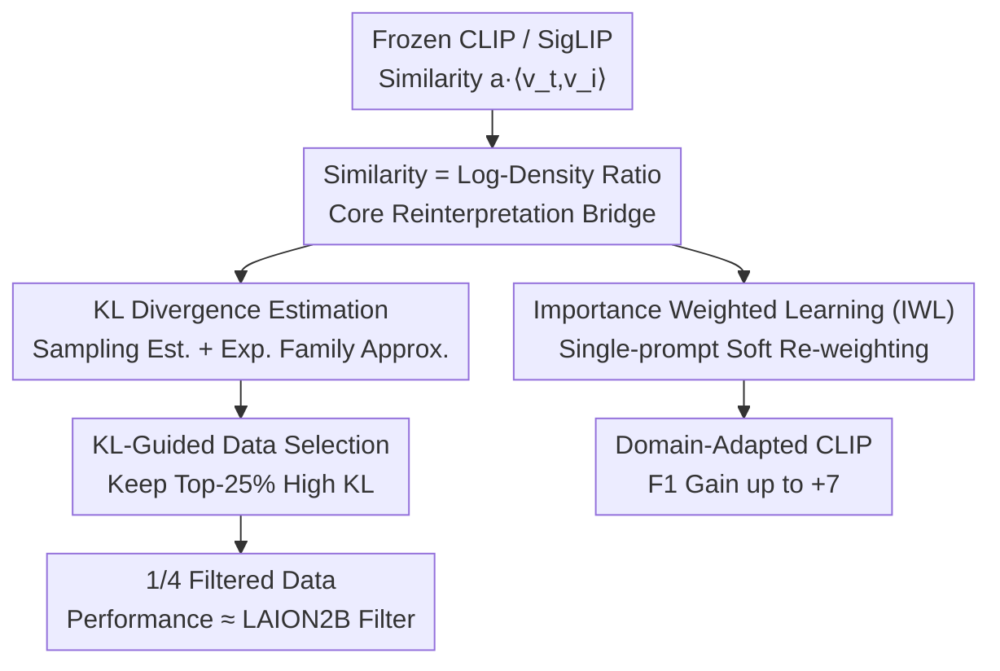

# CLIP-like Model as a Foundational Density Ratio Estimator

**Conference**: CVPR 2026  
**arXiv**: [2506.22881](https://arxiv.org/abs/2506.22881)  
**Code**: https://github.com/fumiyauchiyama/CLIP_Density_Ratio (Available)  
**Area**: Multimodal VLM  
**Keywords**: Density Ratio Estimation, Contrastive Learning, Importance Weighting, KL Divergence, Data Selection

## TL;DR
This paper reinterprets contrastively trained vision-language models like CLIP/SigLIP as "off-the-shelf density ratio estimators." The similarity scores implicitly optimized by contrastive objectives are shown to be proportional to log-density ratios. This enables two training-free capabilities: single-prompt importance-weighted pre-training (F1 gain up to +7 points) and image-text KL divergence estimation (measuring semantic diversity for data filtering, achieving results comparable to LAION2B filtering).

## Background & Motivation

**Background**: Density ratio ($p(x)/q(x)$), the ratio of two probability densities, is a core tool in statistical machine learning, serving as the foundation for importance weighting, divergence estimation, and likelihood-free inference. Classical direct estimation methods include KLIEP, uLSIF, LogReg (which transforms density ratio estimation into logistic regression), and Noise Contrastive Estimation (NCE). Modern large-scale vision-language models like CLIP and SigLIP are specifically trained using contrastive objectives such as InfoNCE or NCE.

**Limitations of Prior Work**: Although CLIP-like models theoretically possess the capability to estimate high-dimensional multimodal density ratios, the community almost exclusively utilizes them as "embedders/retrievers"—extracting embeddings to compute cosine similarity for downstream classification or retrieval. The "density ratio structure" implicitly learned during contrastive training has never been systematically exploited. Meanwhile, while classical density ratio estimation methods have clear theoretical foundations, they require training a separate estimator for every pair of distributions, which is costly and difficult to generalize.

**Key Challenge**: On one hand, traditional density ratio estimators require customized training for each pair of distributions, suffering from poor generalization and high costs. On the other hand, CLIP models, already trained on billions of image-text pairs and encoding vast relationships between marginal and conditional distributions, have their probabilistic reasoning capabilities neglected and are used only as feature extractors.

**Goal**: To treat CLIP-like models as "pre-trained, general-purpose density ratio estimators" and verify the algorithmic capabilities unlocked by this perspective. This is decomposed into: (1) providing a unified derivation of how contrastive objectives encode density ratios; (2) validating this in importance-weighted learning; and (3) validating this in KL divergence estimation and data selection.

**Key Insight**: NCE has long proven that contrastive objectives model the log-density ratio of two distributions (e.g., Skip-gram in Word2Vec approximates pointwise mutual information). Applying this conclusion directly to CLIP: the image-text similarity $a\langle v_t, v_i\rangle$ optimized by InfoNCE is proportional to $\log \frac{p_T(t\mid i)}{p_T(t)}$, making the similarity score itself a log-density ratio estimate.

**Core Idea**: Instead of re-training any estimators, the similarity scores of CLIP are directly read as log-density ratios and applied to importance weighting and KL divergence estimation in a training-free manner.

## Method

### Overall Architecture

This work focuses on "reinterpretation + two applications" without training new model architectures. The overall logic is: first, rewrite the contrastive objective mathematically into the form of a density ratio (a unified theoretical bridge), then derive two independent downstream applications—Importance Weighted Learning (domain-adaptive pre-training) and KL Divergence Estimation (semantic diversity measurement and data selection). All applications use a **ready-made, frozen** CLIP without introducing additional trained estimators.

### Key Designs

**1. Similarity as Log-Density Ratio: A Unified Bridge Rewriting Contrastive Objectives**

This is the foundation of the paper, addressing the pain point that "what CLIP similarity scores actually estimate has never been clearly explained." The authors prove that embeddings $v_i, v_t$ trained with InfoNCE/NCE satisfy:

$$\frac{p_T(t\mid i)}{p_T(t)}=\frac{\exp(a\langle v_t,v_i\rangle)}{Z(i)},\qquad Z(i):=\mathbb{E}_{t\sim p_T(\cdot)}\big[\exp(a\langle v_t,v_i\rangle)\big]$$

This represents the ratio of the "conditional distribution of text given an image" to the "marginal distribution of text." Its logarithm is proportional to the inner product of image-text embeddings, where $a$ is the logit scale and $Z(i)$ is a normalization term depending only on image $i$. Due to the symmetry of the model objective, this also holds for images (Eq. 2). This step elevates "CLIP similarity" from an empirical alignment score to a density ratio estimator with clear probabilistic meaning. Since it is a density ratio, $Z$ often cancels out as a constant in many scenarios.

**2. Importance Weighted Learning (IWL): Domain Adaptation via a Single Prompt**

The covariate shift assumption in domain adaptation posits that the conditional distribution $p(\cdot\mid x)$ remains invariant while the input image distribution $p_I(x)$ changes. To estimate the test loss $L_{\text{test}}=\mathbb{E}_{x\sim p_I^{\text{train}}}\big[\frac{p_I^{\text{test}}(x)}{p_I^{\text{train}}(x)}\,l(x)\big]$, traditional methods require training another density ratio estimator. The key observation here is approximating the "test domain" as a conditional distribution given a certain prompt $t$: $p_I^{\text{test}}(\cdot)\approx p_I(\cdot\mid t)$. The weights are then directly given by Eq. 2: $\frac{p_I^{\text{test}}(x)}{p_I^{\text{train}}(x)}\propto \exp(a\langle v_x,v_t\rangle)$, where the normalization $Z(t)$ is constant across samples and can be ignored.

Thus, a single domain prompt (e.g., "A photo of food") can compute soft weights for each pre-training sample. The re-weighted CLIP pre-training loss is:

$$L'_{\text{CLIP}}=-\sum_{j=1}^{N} e^{a\langle u_{i_j},u_{t^\dagger}\rangle}\Big(\log\frac{\exp s(t_j,i_j)}{\sum_k \exp s(t_k,i_j)}+\log\frac{\exp s(t_j,i_j)}{\sum_k \exp s(t_j,i_k)}\Big)$$

Where $u$ is the embedding from another pre-trained CLIP (e.g., ViT-L-14, LAION) and $t^\dagger$ is the prompt describing the target domain. This works because images closer to the domain prompt receive higher weights, acting as a **soft selection** that is more robust than hard filtering—especially when prompts only loosely characterize the domain or proxy metrics are imperfect. ⚠️ In implementation, the logit scale $a$ is reduced from approx. 100 to 10 to prevent overflow in mixed-precision training.

**3. Density-Ratio-Based KL Divergence Estimation: Quantifying Modal Information Gain**

The second application estimates the KL divergence between image and text $D_{\text{KL}}(i):=\mathrm{KL}(p_T(\cdot\mid i)\,\|\,p_T(\cdot))$ (Information Gain) and the reverse $D_{\text{KLR}}(i):=\mathrm{KL}(p_T(\cdot)\,\|\,p_T(\cdot\mid i))$. To avoid the error accumulation of traditional methods, the paper provides two training-free estimates: (i) **Sampling Estimation**: Substitute Eq. 1 into the KL definition, approximating it using similarities over a candidate text set $\mathcal{D}_T$ (Eq. 10/11) via softmax-weighted sums and log-sum-exps of $a\langle v_t,v_i\rangle$; (ii) **Exponential Family Approximation**: Treat the conditional distribution of text for a fixed image as an exponential family ($a v_t$ as sufficient statistics, $v_i$ as natural parameters). Using the quadratic expansion of KL between two parameters of an exponential family yields:

$$D_{\text{KL}}(i)\approx a^2 (v_i-\bar v_I)^\top G_T (v_i-\bar v_I),\quad G_T:=\mathbb{E}_{t}\big[(v_t-\bar v_T)(v_t-\bar v_T)^\top\big]$$

This is the "squared norm of centered embeddings under a covariance metric." Further definitions include the empirical $D_W$ (using sample covariance $\hat G_T$) and the simplified $D_C:=a^2\|v_i-\hat v_I\|^2$ (using only Euclidean norm). These metrics reveal that samples with high $D_{\text{KL}}$ are semantically diverse with rare contexts. $D_C$ is strongly negatively correlated with "frequency/log-likelihood," whereas $D_{\text{KL}}$ is nearly uncorrelated with frequency metrics, indicating it captures a different dimension of information.

**4. KL-Guided Data Selection: Refining Pre-training Data with High KL Samples**

Based on the finding that High KL = High Semantic Information, the authors use it as a filtering signal. Unlike existing filters like CLIPScore which only consider image-text "alignment," this measures the "influence" of a single sample on the global distribution. The approach is simple: for each $(t,i)$ in the DataComp pool, calculate $D_{\text{KL}}(t)$ or $D_{\text{KL}}(i)$, and retain only the Top-25% samples. CLIP is then pre-trained on this 1/4 subset. This serves as a complementary signal: CLIPScore measures consistency, while KL measures how "informative" a sample is relative to the global distribution. Experiments show that using only the frozen CLIP + density ratio, text-side KL filtering outperforms no filtering by 5–8 percentage points on ImageNet1k zero-shot and achieves an average score comparable to LAION2B filtering on 38 tasks—despite using only 1/4 of the data. The authors note that text-side KL is more effective than image-side, as "measuring text informativeness" maps more directly to image-text alignment.

## Key Experimental Results

### Main Results: Data Selection (DataComp small scale, 38 tasks)

| Filtering Method | Modality | IN1k Zero-shot Acc. | 38-task Avg. |
|------------------|----------|--------------------|--------------|
| No Filtering     | —        | 0.025              | 0.132        |
| LAION2B          | —        | 0.031              | 0.133        |
| Basic Heuristics | —        | 0.030              | 0.142        |
| CLIPScore        | —        | **0.051**          | **0.173**    |
| $D_{\text{KL}}$  | Text     | 0.0300             | 0.1337       |
| $D_{\text{KLR}}$ | Text     | 0.0325             | 0.1344       |
| $D_C$            | Text     | 0.0312             | 0.1319       |
| $D_{\text{KL}}$  | Image    | 0.0216             | 0.1220       |

> Text-side $D_{\text{KL}}/D_{\text{KLR}}/D_C$ using 1/4 of the data reaches or slightly exceeds LAION2B and Basic heuristics; however, CLIPScore remains the strongest baseline. KL is positioned as a "complementary signal" to be combined with alignment scores.

Importance Weighted Learning (IWL): Pre-training on CC12M with re-weighting using domain prompts like "A photo of food/pets/flowers." Evaluations on Food101 / Oxford-IIIT Pet / Flowers102 zero-shot classification show that at the 4–6 epoch checkpoints, accuracy is 2–8 points higher and F1 is 3–7 points higher than the standard CLIP loss baseline.

### Ablation Study: Correlation between KL and Existing Metrics (Pearson, for images)

| Existing Metrics | $D_{\text{KL}}$ | $D_{\text{KLR}}$ | $D_C$      | $D_W$ |
|------------------|---------------|----------------|------------|-------|
| Conformity [18]  | -0.255        | 0.015          | **-1.000** | 0.093 |
| $\log p(x)$ [2]  | -0.346        | 0.096          | -0.626     | 0.389 |
| Raw Norm [9]     | -0.089        | -0.046         | -0.731     | -0.120|

### Key Findings
- **$D_C$ is perfectly negatively correlated with Conformity (-1.000)**: The $D_C$ derived from the exponential family perspective is equivalent to the negative of Conformity (ignoring constants), providing a unified density-ratio explanation for frequency/commonality metrics.
- **$D_{\text{KL}}$ captures a different dimension**: It is nearly uncorrelated with frequency metrics ($\log p(x)$, Raw Norm), proving semantic diversity $\neq$ frequency.
- **N-gram coverage validates semantic diversity**: In deciles sorted by $D_{\text{KL}}$, the top-2500 trigrams cover 60% of occurrences in the lowest KL group, but only about half or less in the high KL group, quantifying the higher lexical diversity of high KL samples.
- **Text-side KL > Image-side**: Measuring text informativeness is more effective for filtering than measuring image informativeness.

## Highlights & Insights
- **Strong transferability of the "frozen model as estimator" perspective**: Reusing the implicit mathematical meaning of training objectives requires zero additional training. This can be extended to any NCE/InfoNCE model (audio, recommendation, graph-graph contrastive).
- **Single-prompt soft re-weighting = ultra-low-cost domain adaptation**: No need to construct domain datasets or labels; a single description of the target domain provides soft weights for billions of samples, which is more robust than hard filtering for rough domain descriptions.
- **Exponential family approximation turns KL into a closed-form norm**: $D_C=a^2\|v_i-\hat v_I\|^2$ is almost zero-cost yet acts as a plug-and-play probe for data quality and rarity.
- **KL is orthogonal to CLIPScore**: "Alignment" and "Informativeness" are two different axes. Future filtering could first threshold alignment and then select high-information samples within that set.

## Limitations & Future Work
- **Strong distribution assumptions**: The core requirement is that the conditional/marginal density ratios learned by CLIP equal those of the true training data. Bias in pre-training data directly affects estimator accuracy.
- **Small experimental scale**: IWL is tested on CC12M and data selection on the smallest DataComp pool. Scaling to larger data/models (especially whether logit scale $a \approx 100$ can be used for larger gains) is unverified.
- **Finite sample approximation for KL**: Estimates depend on a limited set of candidate text/images; bias and variance are influenced by embeddings, temperature, and sampling strategies.
- **Inferior to CLIPScore when used alone**: KL does not outperform CLIPScore for data selection. Combining KL with alignment scores is proposed but not yet implemented or evaluated.

## Related Work & Insights
- **vs. Classical Density Ratio Estimation (KLIEP / uLSIF / LogReg / NCE)**: Traditional methods estimate ratios from samples but require custom training for each pair. This paper advocates reusing CLIP as a general estimator—training-free and cross-modal—despite being constrained by pre-training distribution assumptions.
- **vs. Word2Vec Density Ratio Interpretation [19, 26]**: Previous work reinterpreted Skip-gram as pointwise mutual information/KL in NLP; this work extends this to high-dimensional vision-language models for downstream applications like domain adaptation and data selection.
- **vs. CLIPScore [14] Data Filtering**: CLIPScore measures alignment to identify noise; KL measures informativeness relative to the global distribution. They are orthogonal and complementary.
- **vs. Conformity [18] / Whitened CLIP [2] / Raw Norm [9]**: These frequency/commonality metrics are unified under the exponential family framework by this paper ($D_C \equiv -\text{Conformity}$), while $D_{\text{KL}}$ introduces the new dimension of semantic diversity.

## Rating
- Novelty: ⭐⭐⭐⭐⭐ Reinterpreting CLIP as a general density ratio estimator is a clean and insightful perspective with two training-free applications.
- Experimental Thoroughness: ⭐⭐⭐ Validated but on a small scale (CC12M / DataComp small). KL does not exceed CLIPScore; combination strategies are left for future work.
- Writing Quality: ⭐⭐⭐⭐ Clear theoretical derivation and logical application layers; equations are well-connected to motivations.
- Value: ⭐⭐⭐⭐ Provides a transferable paradigm for "reusing implicit contrastive objectives." Single-prompt domain adaptation and KL data probes have practical potential.

<!-- RELATED:START -->

- **SigLIP**: Sigmoid Loss for Language-Image Pre-training (Zhai et al., ICCV 2023)
- **DataComp**: Purifying Diffusion Models with CLIP (Gadre et al., NeurIPS 2023)
- **Logit Scale Analysis**: On the temperature parameter in InfoNCE (various)

<!-- RELATED:END -->

## Related Papers

- [\[CVPR 2026\] A More Word-like Image Tokenization for MLLMs](a_more_word-like_image_tokenization_for_mllms.md)
- [\[CVPR 2026\] β-CLIP: Text-Conditioned Contrastive Learning for Multi-Granular Vision-Language Alignment](b-clip_text-conditioned_contrastive_learning_for_multi-granular_vision-language_.md)
- [\[CVPR 2026\] Reconstructing CLIP for Open-Vocabulary Dense Perception](reconstructing_clip_for_open-vocabulary_dense_perception.md)
- [\[CVPR 2026\] Reevaluating the Intra-Modal Misalignment Hypothesis in CLIP](reevaluating_the_intra-modal_misalignment_hypothesis_in_clip.md)
- [\[CVPR 2026\] Conan: Progressive Learning to Reason Like a Detective over Multi-Scale Visual Evidence](conan_progressive_learning_to_reason_like_a_detective_over_multi-scale_visual_ev.md)

<!-- RELATED:END -->
