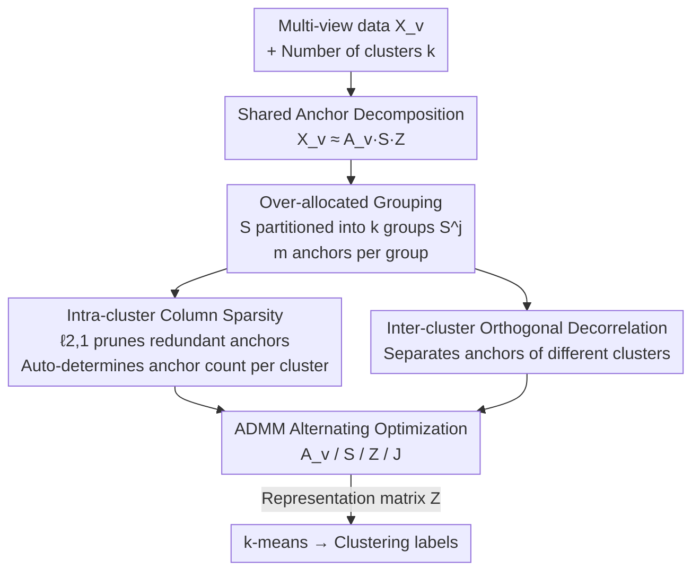

# Cluster-aware Anchor Learning for Multi-View Clustering

**Conference**: CVPR 2026  
**Paper**: [CVF Open Access](https://openaccess.thecvf.com/content/CVPR2026/html/Chen_Cluster-aware_Anchor_Learning_for_Multi-View_Clustering_CVPR_2026_paper.html)  
**Code**: Not available  
**Area**: Multi-view Clustering  
**Keywords**: anchor learning, multi-view subspace clustering, $\ell_{2,1}$ column sparsity, cluster-aware anchors, orthogonal decorrelation  

## TL;DR
To address the drawbacks of "globally fixed anchor counts and treating every cluster equally" in anchor-based multi-view clustering, CAL partitions the consensus anchor matrix into $k$ groups by cluster. It applies column-sparsity penalties to each group to automatically determine the number of anchors per cluster and pulls anchors of different clusters apart via inter-cluster orthogonal regularization. It outperforms 10 SOTAs in ACC/NMI across 8 benchmarks.

## Background & Motivation
**Background**: Subspace methods are mainstream in Multi-view Clustering (MVC), where a self-representation matrix $\mathbf{Z}_v\in\mathbb{R}^{n\times n}$ is learned for each view before spectral clustering. However, constructing an $n\times n$ affinity graph requires $O(n^3)$ time and $O(n^2)$ memory, which is computationally prohibitive for large samples. Consequently, anchor-based strategies were introduced: selecting/learning a small set of $l$ anchors from $n$ samples and replacing the dense self-representation with an "anchor-sample" relationship matrix, reducing complexity to linear growth with $n$.

**Limitations of Prior Work**: The quality of anchors directly determines the representation matrix and subsequent clustering results. However, almost all methods **pre-fix the total number of anchors** $l$, either setting $l=k$ (the number of clusters) or a small multiple of $k$, implicitly **assuming each cluster requires an equal number of anchors**. In reality, clusters vary significantly in scale, density, information richness, and internal structure. Complex clusters suffer from insufficient anchors (information loss), while simple clusters are given too many (redundancy), both of which degrade anchor quality.

**Key Challenge**: Anchor budgets are "globally uniform," whereas the optimal number of anchors for real data is "cluster-level heterogeneous." Existing adaptive works (such as 3AMVC, which selects anchor counts per view) only achieve view-specificity; none have learned how many anchors each cluster should retain at the **cluster (class) granularity**.

**Goal**: To adaptively determine the number of valid consensus anchors for **each cluster** within a unified optimization framework.

**Key Insight**: Rather than "selecting" the number of anchors, it is better to **deliberately over-allocate**—initially assigning $m$ anchors per cluster (totaling $mk$) and using structured sparsity to "zero out" redundant columns. The remaining columns constitute the anchors actually needed by that cluster. Pruning is more differentiable and easier to optimize than selection.

**Core Idea**: Grouping the consensus anchor matrix by cluster + intra-group column sparsity to automatically determine anchor counts + inter-group orthogonality to enhance discriminability. "Initial over-allocation followed by pruning" replaces "fixed initialization followed by learning."

## Method

### Overall Architecture
The inputs to CAL are the data from $V$ views $\{\mathbf{X}_v\}_{v=1}^{V}\in\mathbb{R}^{d_v\times n}$ and the number of clusters $k$. The output is the clustering labels obtained by performing k-means on the representation matrix $\mathbf{Z}$. It adopts the classic anchor-based MVSC decomposition framework $\mathbf{X}_v\approx\mathbf{A}_v\mathbf{S}\mathbf{Z}$: where $\mathbf{A}_v\in\mathbb{R}^{d_v\times mk}$ is the orthogonal projection for the $v$-th view, $\mathbf{S}\in\mathbb{R}^{mk\times mk}$ is the **consensus anchor matrix** shared across views, and $\mathbf{Z}\in\mathbb{R}^{mk\times n}$ is the representation matrix. Since $\mathbf{S}$ is shared across all views, it naturally captures both cross-view consistency and view-specific complementarity (fused at the anchor level).

The key innovation lies in CAL no longer setting the anchor count $l=k$, but **over-allocating it to $mk$** and partitioning the columns of $\mathbf{S}$ into $k$ continuous groups $\mathbf{S}=[\mathbf{S}^1,\dots,\mathbf{S}^k]$, where each group $\mathbf{S}^j\in\mathbb{R}^{mk\times m}$ is exclusive to one cluster. Redundant anchors are pruned within each group using $\ell_{2,1}$ column sparsity (automatically determining the anchor count for that cluster), while inter-group orthogonal regularization ensures anchors from different clusters are dissimilar. The entire system is solved alternatingly via ADMM, with each subproblem having a closed-form solution or standard solver.

### Key Designs

**1. Over-allocated Grouping: Replacing "globally fixed anchor count" with "one group per cluster, undetermined count"**

This step directly addresses the pain point of "prior fixed $l$ and uniform treatment of clusters." Instead of predicting how many anchors each cluster needs (a hard-to-optimize discrete quantity), CAL **generously assigns $m$ anchors to each cluster** initially, totaling $mk$, and partitions the columns of the learned consensus anchor matrix into $k$ continuous sub-blocks:
$$\mathbf{S}=[\mathbf{S}^1,\mathbf{S}^2,\dots,\mathbf{S}^j,\dots,\mathbf{S}^k],\quad \mathbf{S}^j\in\mathbb{R}^{mk\times m}.$$
The $m$ columns of each $\mathbf{S}^j$ are candidate anchors for the $j$-th cluster. Thus, "how many anchors each cluster should have" shifts from a preset hyperparameter to a result **automatically determined during optimization** by subsequent sparsity penalties—$m$ is merely an upper bound, and the actual number retained is data-driven (experiments show performance stabilizes for $m\ge 5$, indicating low sensitivity to $m$).

**2. Intra-cluster ℓ2,1 Column Sparsity: Letting each cluster decide its own anchor count**

With grouping established, how does "pruning" occur? CAL applies an $\ell_{2,1}$-norm penalty to the transpose of each sub-block:
$$\big\|(\mathbf{S}^j)^{T}\big\|_{2,1}=\sum_{t=1}^{m}\big\|\mathbf{S}^j_{(:,t)}\big\|_2,$$
where $\mathbf{S}^j_{(:,t)}$ is the column corresponding to the $t$-th anchor of that cluster. $\ell_{2,1}$ is a "group sparsity" operator—it forces an entire unimportant anchor column **to zero as a whole**, rather than sparsifying elements sporadically. This retains only the most discriminative anchor columns for each cluster. Columns compressed to zero mean "this cluster does not need this anchor," effectively selecting the number of anchors per cluster automatically and allowing it to vary across clusters (heterogeneous shrinkage). This is the core mechanism for replacing "fixed anchor counts" with "cluster-level sparsity learning."

**3. Inter-cluster Orthogonal Decorrelation: Separating anchors to enhance separability**

Ensuring each cluster has refined anchors is insufficient—if anchors from different clusters are highly similar, the block structure of the representation matrix becomes blurred. CAL adds a decorrelation regularizer to every pair of anchor sub-blocks $(\mathbf{S}^j,\mathbf{S}^h)$:
$$\sum_{1\le j\neq h\le k}\big\|(\mathbf{S}^j)^{T}\mathbf{S}^h\big\|_F^2.$$
Minimizing this pushes anchor groups of different clusters toward mutual orthogonality (low cross-correlation). This explicitly encourages "each cluster to be described by its own unique, non-overlapping set of anchors," thereby strengthening inter-cluster discriminability and resulting in a cleaner block (cluster) structure in $\mathbf{Z}$. Ablation studies show this term alone (variant iii) significantly outperforms the backbone and complements the sparsity term.

Combining these elements, the total objective function of CAL is:
$$
\min_{\mathbf{A}_v,\mathbf{S},\mathbf{Z}}\ \sum_{v=1}^{V}\big\|\mathbf{X}_v-\mathbf{A}_v\mathbf{S}\mathbf{Z}\big\|_F^2
+\lambda_1\sum_{j=1}^{k}\big\|(\mathbf{S}^j)^T\big\|_{2,1}
+\lambda_2\sum_{1\le j\neq h\le k}\big\|(\mathbf{S}^j)^{T}\mathbf{S}^h\big\|_F^2
+\lambda_3\|\mathbf{Z}\|_F^2,
$$
subject to $\mathbf{A}_v^T\mathbf{A}_v=\mathbf{I},\ \mathbf{Z}\ge0,\ \mathbf{Z}^T\mathbf{1}=\mathbf{1}$. The first term represents shared anchor reconstruction; the $\lambda_1$ term handles intra-cluster pruning; the $\lambda_2$ term handles inter-cluster decorrelation; and $\lambda_3\|\mathbf{Z}\|_F^2$ regularizes the representation matrix.

### Loss & Training
Since the $\ell_{2,1}$ term is non-differentiable, CAL introduces an auxiliary variable $\mathbf{J}^j$ (with the constraint $(\mathbf{S}^j)^T=(\mathbf{J}^j)^T$), formulates an augmented Lagrangian, and uses ADMM for alternating updates. Each subproblem has a clean solution:

- **Updating $\mathbf{A}_v$**: With other variables fixed, this reduces to $\max_{\mathbf{A}_v}\mathrm{Tr}(\mathbf{A}_v^T\mathbf{X}_v\mathbf{Z}^T\mathbf{S}^T)$ under orthogonal constraints. The optimal solution is given by the SVD of $\mathbf{X}_v\mathbf{Z}^T\mathbf{S}^T$ as $\mathbf{A}_v^*=\mathbf{U}\mathbf{V}^T$.
- **Updating $\mathbf{S}$**: Setting the derivative of each group to zero leads to a **Sylvester equation**, which is solved for $\mathbf{S}^j$ using a standard solver and then concatenated.
- **Updating $\mathbf{Z}$**: A quadratic programming (QP) problem is solved column-wise under the constraints $\mathbf{Z}\ge0, \mathbf{Z}^T\mathbf{1}=\mathbf{1}$, where $\mathbf{G}=2(V\mathbf{S}^T\mathbf{S}+\lambda_2\mathbf{I})$.
- **Updating $\mathbf{J}^j$**: The $\ell_{2,1}$ minimization operator has a closed-form soft-thresholding solution—let $\mathbf{M}=\frac{\mathbf{P}^j}{\mu}+(\mathbf{S}^j)^T$; columns are shrunk by $\frac{\|\mathbf{M}_{:,i}\|_2-\lambda_1/\mu}{\|\mathbf{M}_{:,i}\|_2}\mathbf{M}_{:,i}$ if $\|\mathbf{M}_{:,i}\|_2>\frac{\lambda_1}{\mu}$, otherwise zeroed (implementing "whole-column pruning").
- **Updating multipliers $\mathbf{P}^j$ and $\mu$**: $\mathbf{P}^j\leftarrow\mathbf{P}^j+\mu((\mathbf{S}^j)^T-(\mathbf{J}^j)^T)$, $\mu\leftarrow\min(\rho\mu,\mu_{\max})$.

The overall complexity is $O(m^3k^3n+m^2k^2n+m^2kn+mk^2dn+mdkn)$, which is linear with the sample size $n$ since $mk\ll n$, preserving the scalability of the anchor method. $\lambda_1, \lambda_2, \lambda_3$ are grid-searched over $\{10^{-4},\dots,10^{4}\}$; convergence typically occurs within 15 iterations.

## Key Experimental Results

### Main Results
On 8 benchmarks (sample sizes ranging from 210 to 63,896), CAL was compared against 10 SOTAs. The table below lists ACC (selected datasets, bold denotes ours):

| Dataset | FPMVS | 3AMVC | CAMVC | ALPC | CAL (Ours) | Gain (vs. 2nd best) |
|--------|-------|-------|-------|------|------|------|
| MSRC | 0.6048 | 0.6200 | 0.9190 | 0.8286 | **0.9429** | +2.39% |
| Dermatology | 0.8408 | 0.5750 | 0.9330 | 0.9469 | **0.9721** | +2.52% |
| 100Leaves | 0.3513 | 0.3378 | 0.7500 | 0.7516 | **0.8300** | +7.84% |
| OutdoorScene | 0.6693 | 0.5336 | 0.6514 | 0.7199 | **0.7716** | +5.17% |
| ALOI | 0.3318 | 0.4965 | 0.5987 | 0.0968 | **0.7417** | +11.97%* |
| YTF20 | 0.6965 | 0.6253 | 0.7648 | 0.7432 | **0.8172** | +3.45% |

NMI results are also leading: Dermatology 0.9407, 100Leaves 0.9390, ALOI 0.8574, YTF20 0.8385, being optimal for most datasets. The most significant improvement occurs on ALOI (ACC +11.97%), a dataset with highly heterogeneous inter-class structures, validating the value of "per-cluster adaptive anchors." ⚠️ ALPC's unusually low 0.0968 on ALOI is noted; "Gain" is calculated against the next highest method.

### Ablation Study
Three variants were tested on MSRC, Dermatology, and HW (ACC):

| Configuration | MSRC | Dermatology | HW | Description |
|------|------|------|------|------|
| (i) Backbone (No sparsity/decorrelation) | 0.6524 | 0.6508 | 0.4930 | Shared anchor reconstruction baseline |
| (ii) + Column Sparsity | 0.8429 | 0.9358 | 0.9045 | Added intra-cluster ℓ2,1 pruning |
| (iii) + Inter-cluster Decorrelation | 0.9143 | 0.9609 | 0.9285 | Added orthogonal regularization |
| **(Full) CAL** | **0.9429** | **0.9721** | **0.9405** | Mutual complementarity |

### Key Findings
- **Both modules are effective and complementary**: Adding column sparsity alone (ii) increased ACC on HW from 0.4930 to 0.9045 (+41 points). Adding decorrelation (iii) also consistently outperformed the backbone. The full model is universally optimal, showing that "adaptive anchor pruning" and "increasing inter-cluster anchor separation" address orthogonal issues.
- **Unexpectedly high contribution from the decorrelation term**: Variant iii (orthogonality only) outperformed variant ii across three datasets, suggesting inter-cluster separability is an undervalued bottleneck in prior anchor methods.
- **Minimal sensitivity to $m$**: ACC remains stable for $m\ge5$. Visualizations (Fig.5/6) show that the number of effective anchors retained varies by cluster (heterogeneous shrinkage), directly supporting the cluster-specific anchor count hypothesis.
- **Fast convergence**: Following initial fluctuations due to random initialization in the first 3–5 rounds, the objective value stabilizes within 15 rounds.

## Highlights & Insights
- **The "Over-allocate then prune" paradigm is highly transferable**: It transforms the difficult-to-optimize discrete "anchor count selection" into a continuous column-sparsity problem. The $\ell_{2,1}$ property of zeroing whole columns naturally maps to "deleting an anchor," which is much more elegant than searching for an anchor count. This logic can be applied to any discrete budget problem involving "how many prototypes/experts to use."
- **Focus on cluster-level anchor adaptability**: While previous adaptive works focused on view-specificity, CAL drills down to the class-level and integrates it into a unified optimization.
- **Closed-form/standard solutions for each subproblem** (SVD, Sylvester, QP, Soft-thresholding): This leads to a clean ADMM implementation without the need for tuning complex inner iterations, making it highly reproducible.
- **Significant gains from the inter-group orthogonal regularizer**: This suggests that future anchor methods should treat "anchor discriminability" as a first-class citizen rather than just focusing on reconstruction error.

## Limitations & Future Work
- **Complexity is sensitive to $k$**: The total complexity includes an $O(m^3k^3n)$ term. When the number of clusters $k$ is large (e.g., 100Leaves has 100 classes), QP solving costs increase significantly. The paper lacks a runtime comparison for large $k$. ⚠️ Real-world time/memory curves are missing; "linearity with $n$" is primarily a theoretical analysis.
- **Still requires predefined $m$ and $k$**: While insensitive to $m$, $k$ remains a required input, leaving "unknown cluster count" scenarios unaddressed.
- **Grid search for three $\lambda$ parameters**: Despite claims of hyperparameter robustness, they are still tuned per dataset. A mechanism for adaptively determining $\lambda$ is missing.
- **Potential improvements**: Replacing column sparsity with stronger structures (e.g., bi-directional sparsity for anchors and samples) or incorporating $k$ into the learning process to move toward "full adaptability."

## Related Work & Insights
- **vs. FPMVS (Wang et al.)**: FPMVS sets the anchor count $l$ directly to $k$ (one anchor per cluster) and learns anchors and graphs jointly with a fixed global budget. CAL over-allocates to $mk$ and prunes, meaning anchor counts become a learned result, which is markedly better for heterogeneous clusters.
- **vs. 3AMVC (Ma et al.)**: 3AMVC uses an HBNC strategy for adaptive anchor counts at a **view-specific** level. CAL descends to **class-level** granularity. These approaches are orthogonal, and CAL significantly outperforms 3AMVC on most benchmarks.
- **vs. CAMVC (Zhang et al.) / ALPC (Chen et al.)**: These enhance discriminability via clustering structures on hidden anchors or shared semantic constraints, but maintain fixed anchor counts. CAL's unique contribution is "per-cluster variable anchor counts + inter-cluster orthogonality," showing clear advantages on datasets like MSRC and ALOI.

## Rating
- Novelty: ⭐⭐⭐⭐ First MVSC to adapt anchor counts at the cluster level; clean "over-allocate + column sparsity" logic
- Experimental Thoroughness: ⭐⭐⭐⭐ 8 datasets × 4 metrics × 10 baselines + ablation/sensitivity/visualization/convergence; lacks runtime measurement
- Writing Quality: ⭐⭐⭐⭐ Clear chain from motivation to mechanism to optimization; complete formulas and algorithms
- Value: ⭐⭐⭐⭐ The "over-allocate then prune" paradigm is transferable and significantly improves performance on heterogeneous cluster structures

<!-- RELATED:START -->

## Related Papers

- [\[CVPR 2026\] Learning Anchor in Dual Orthogonal Space for Fast Multi-view Clustering](learning_anchor_in_dual_orthogonal_space_for_fast_multi-view_clustering.md)
- [\[CVPR 2026\] Scalable Multi-View Subspace Clustering with Tensorized Anchor Guidance](scalable_multi-view_subspace_clustering_with_tensorized_anchor_guidance.md)
- [\[CVPR 2026\] Reliable Clustering Number Estimation for Contrastive Multi-View Clustering](reliable_clustering_number_estimation_for_contrastive_multi-view_clustering.md)
- [\[CVPR 2026\] Anti-Degradation Lifelong Multi-View Clustering](anti-degradation_lifelong_multi-view_clustering.md)
- [\[CVPR 2026\] Multi-Hierarchical Contrastive Spectral Fusion for Multi-View Clustering](multi-hierarchical_contrastive_spectral_fusion_for_multi-view_clustering.md)

<!-- RELATED:END -->
