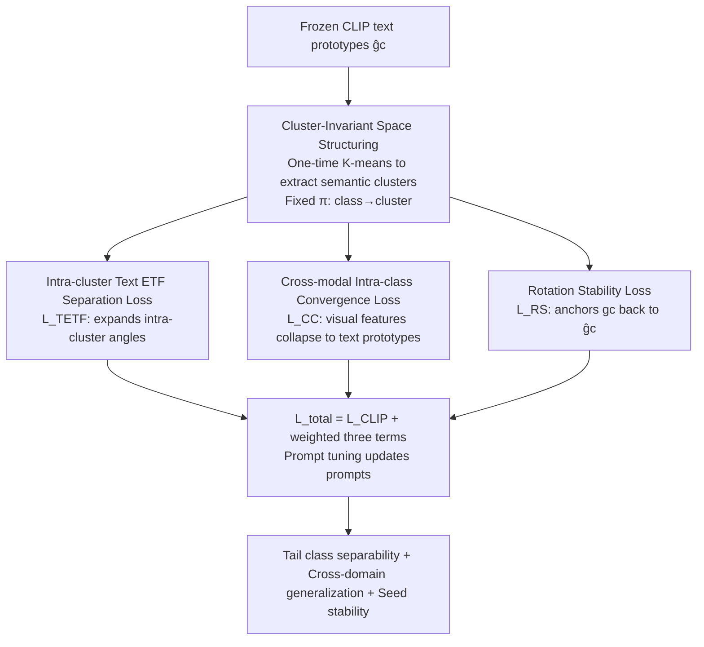

# Cluster-Aware Neural Collapse Prompt Tuning for Long-Tailed Generalization of Vision-Language Models

**Conference**: CVPR 2026  
**Paper**: [CVF Open Access](https://openaccess.thecvf.com/content/CVPR2026/html/Guo_Cluster-Aware_Neural_Collapse_Prompt_Tuning_for_Long-Tailed_Generalization_of_Vision-Language_CVPR_2026_paper.html)  
**Code**: None  
**Area**: Multimodal VLM  
**Keywords**: Prompt tuning, Neural Collapse, Long-tail recognition, ETF, Semantic clustering  

## TL;DR
CPT constrains the "Neural Collapse / ETF equiangular separation" from **all global classes** to the **internal semantic clusters** inherent in pre-trained VLMs. By incorporating a rotation stability loss that anchors learnable text prototypes to frozen ones, it enhances tail-class separability in long-tailed prompt tuning without destroying CLIP's global semantic hierarchy—outperforming SOTAs like DPC/DeKg/NPT across 11 datasets.

## Background & Motivation
**Background**: Prompt tuning has become the mainstream lightweight approach for adapting vision-language models (VLM) like CLIP—freezing the backbone and learning only a few prompt tokens, which saves computation while preserving transferability. To improve class separability, recent methods have drawn inspiration from **Neural Collapse (NC)**: during the terminal phase of training, features of the same class collapse to a single prototype, while prototypes of different classes form an **Equiangular Tight Frame (ETF)**, where pairwise angles are equal and separation is maximized. Consequently, some methods apply a **global ETF** constraint directly to the text prototypes of **all classes** to push apart inter-class angular margins, hoping to prevent tail classes from being dominated by head classes.

**Limitations of Prior Work**: The authors identify two critical flaws in global ETF. First, it **flattens the semantic hierarchy** learned by the VLM—classes with similar semantics in pre-trained models should naturally be closer. Forcing all off-diagonal similarities to be the same reduces the effective rank of the similarity matrix, harming cross-dataset and OOD generalization (visualized in Fig.1a-c: global ETF pushes prototypes into a simplex, causing semantic clusters to disappear). Second, ETF only constrains **relative angles** and not **absolute orientation**. Global rotation of the prototypes does not change pairwise angles but causes training to drift across different random seeds, making SOTA precision highly sensitive to seeds (Fig.1d).

**Key Challenge**: There is a trade-off between tail-class separability (requiring stronger geometric separation) and cross-domain generalization (requiring preservation of pre-trained semantic structures)—global ETF sacrifices the latter for the former, and incomplete constraints lead to training instability.

**Goal**: In the context of prompt tuning, achieve (i) enhanced tail-class separability, (ii) preservation of transferrable global semantic structure, and (iii) stability across random seeds.

**Key Insight**: Since pre-trained VLMs already encode "semantic clusters," **do not apply ETF to the entire label space; apply it locally within each semantic cluster**. This pulls apart classes within a cluster while retaining pre-trained differences between clusters.

**Core Idea**: A triple set of "intra-cluster ETF + cross-modal convergence + rotation anchoring" is used to **confine NC constraints to local semantic neighborhoods**, preventing the global semantics from being flattened.

## Method

### Overall Architecture
CPT is built upon standard CLIP prompt tuning: the image encoder $G_v$ and text encoder $G_t$ are frozen, and learnable continuous prompts are inserted. An image $x$ yields visual features $f\in\mathbb{R}^d$ via the visual encoder, and a class $c$ yields learnable text prototypes $g_c\in\mathbb{R}^d$ via the text encoder; the frozen prototype of the same class **without prompts** is denoted as $\hat g_c$. Beyond the original contrastive loss $L_{\text{CLIP}}$, CPT adds two major components: first, **cluster-invariant space structuring**—running K-means once on frozen VLM text features to obtain $M$ semantic clusters and fixing this partition as a "semantic fence"; then, **NC-driven separability optimization** within each fence, shaped by three complementary losses. The entire pipeline follows the principle of "defining semantic neighborhoods first, then applying collapse constraints within them," ensuring local strength while keeping the global structure intact.

### Key Designs

**1. Cluster-Invariant Space Structuring: Confining ETF within pre-trained semantic fences**

This step addresses the issue of global ETF flattening semantic hierarchy. The authors run K-means **only once** using the **frozen text features** $\{\hat g_c\}$ to obtain $M$ disjoint semantic clusters $\{\hat S_1,\dots,\hat S_M\}$, with each cluster centroid $\hat\mu_m=\frac{1}{|\hat S_m|}\sum_{c\in\hat S_m}\hat g_c$. Crucially, **no re-clustering occurs**: a fixed mapping $\pi:\mathcal{C}\to\{1,\dots,M\}$ is established where $\pi(c)=m\iff c\in\hat S_m$. During training, all learnable text prototypes $g_c$ and their visual features $\{f_{c,i}\}$ are confined within $S_{\pi(c)}$. This frozen partition offers two benefits: preserving the high-level semantic structure (the root of transfer and OOD generalization) and preventing high-variance target instability caused by changing cluster memberships at each gradient step. Subsequent NC constraints **only take effect within clusters**, while inter-cluster geometry is allowed to maintain its pre-trained separation, preserving a higher-rank, richer similarity structure.

**2. Intra-cluster Text ETF Separation Loss $L_{\text{TETF}}$: Expanding inter-class angles in confusing semantic neighborhoods**

In CLIP, each class has only one text embedding generated from labels, which the authors use as the class prototype. Within each cluster $S_m$, $k_m$ normalized text prototypes $\tilde P_m$ are collected to construct a cosine similarity matrix $C_m=\tilde P_m^\top\tilde P_m$. The ideal ETF should make all off-diagonal terms equal. The constraint is:

$$L_{\text{TETF}}=\frac{1}{M}\sum_{m=1}^{M}\left\|\,C_m+\frac{1}{k_m-1}(\mathbf{1}-I)\,\right\|_F^2,$$

where $\mathbf{1}$ is the all-ones matrix and $I$ is the identity matrix. The term $-\frac{1}{k_m-1}$ represents the ideal pairwise cosine value for a simplex ETF. This loss increases inter-class separation **within the same semantic neighborhood**—the exact region where tail classes are most vulnerable to being subsumed by head classes. The essential difference from global ETF is that it **never forces unrelated clusters to be equidistant**, thereby achieving local separability (benefiting rare classes) without flattening the global semantic hierarchy.

**3. Cross-modal Intra-class Convergence Loss $L_{\text{CC}}$: Collapsing visual features toward corresponding text prototypes**

NC predicts that upon convergence, all samples of the same class align with a single prototype. The authors **cross-modalize** this intuition: $N_c$ visual features of class $c$ are collapsed toward its text prototype $g_c$:

$$L_{\text{CC}}=\frac{1}{K}\sum_{c=1}^{K}\left(\frac{1}{N_c}\sum_{i=1}^{N_c}\left\|\frac{f_{c,i}}{\|f_{c,i}\|_2}-\frac{g_c}{\|g_c\|_2}\right\|_2^2\right).$$

This compresses intra-class angular dispersion while enforcing cross-modal alignment: image features of class $c$ are explicitly pulled toward the prompt-tuned text prototype, making the text prototype the "intra-cluster anchored semantic center." This completes the "intra-class compactness" half of the NC constraints alongside intra-cluster ETF separation.

**4. Rotation Stability Loss $L_{\text{RS}}$: Anchoring absolute orientation to eliminate seed drift**

This term targets the second flaw of global ETF—ETF only defines **relative geometry (pairwise angles)**, leaving absolute orientation free. Global rotation of prototypes barely changes $L_{\text{TETF}}$, but because CLIP relies on the alignment of visual/text encoders, this drift amplifies into seed-to-seed variance in downstream accuracy. The authors use L1 loss to softly anchor each learnable prototype back to its frozen counterpart:

$$L_{\text{RS}}=\frac{1}{K}\sum_{c=1}^{K}\|g_c-\hat g_c\|_1.$$

It penalizes large deviations from the original pre-trained representation while allowing for adaptation. Geometrically, it **fixes the otherwise free global rotation**, preventing prototype drift across different seeds. Experiments show this significantly reduces variance and improves reproducibility.

### Loss & Training
The final objective is the weighted sum of the contrastive loss and three cluster-aware NC losses:

$$L_{\text{total}}=L_{\text{CLIP}}+\lambda_{\text{TETF}}L_{\text{TETF}}+\lambda_{\text{CC}}L_{\text{CC}}+\lambda_{\text{RS}}L_{\text{RS}}.$$

Default weights are $\lambda_{\text{TETF}}=0.25,\ \lambda_{\text{CC}}=0.15,\ \lambda_{\text{RS}}=0.10$ (derived from sensitivity analysis on ImageNet base-to-new). The backbone used is ViT-B/16, which is frozen while only prompts are updated.

## Key Experimental Results

Datasets: 11 classification benchmarks. Long-tail is simulated using exponential decay downsampling with imbalance ratios $\tau=\min\{n_k\}/\max\{n_k\}\in\{1,0.25,0.06\}$, fixing $\max\{n_k\}=16$. Three protocols are evaluated: base-to-new, cross-dataset, and domain generalization.

### Main Results: Base-to-New (Average of 11 Datasets, Harmonic Mean H)

| Imbalance Ratio | MaPLe | CoPrompt | NPT | DeKg | DPC | Ours |
|-----------------|-------|----------|-----|------|-----|-----------|
| τ=1 (Balanced)  | 78.25 | 78.72    | 78.31 | 80.12 | 79.62 | **80.28** |
| τ=0.25          | 71.38 | 72.24    | 72.98 | 72.99 | 72.92 | **73.58** |
| τ=0.06 (Heavy)  | 69.12 | 71.04    | 71.76 | 71.50 | 71.75 | **72.47** |

When balanced, CPT is comparable to the strongest methods (not sacrificing normal generalization for long-tailed scenarios); as the tail becomes heavier (smaller $\tau$), CPT's lead over SOTA becomes more pronounced, validating the value of "preserving pre-trained semantic structure + local strong constraints." In Cross-Dataset transfer (trained on ImageNet, tested on 10 target sets), CPT averages 67.78%, surpassing NPT (67.11%), DeKg (66.92%), and DPC (66.27%).

### Ablation Study (11 Dataset Harmonic Mean, including two imbalance ratios)

| Configuration | τ=0.25 B2N / Cross / DG | τ=0.06 B2N / Cross / DG | Function |
|---------------|-------------------------|-------------------------|----------|
| Baseline (No 3 losses) | 70.35 / 63.89 / 57.99 | 69.99 / 63.84 / 57.03 | Prompt tuning only |
| +$L_{\text{TETF}}$ | 72.03 / 65.75 / 59.21 | 71.10 / 64.88 / 57.92 | Intra-cluster ETF alone contributes most |
| +$L_{\text{TETF}}$+$L_{\text{CC}}$ | 73.22 / 66.03 / 59.66 | 71.85 / 65.49 / 58.56 | Further gain from intra-class convergence |
| +$L_{\text{TETF}}$+$L_{\text{RS}}$ | 72.42 / 65.94 / 59.49 | 71.93 / 65.63 / 58.64 | Improved with rotation stability |
| Full (CPT) | **73.58 / 66.76 / 60.16** | **72.47 / 65.97 / 59.12** | Optimal synergy |

### Key Findings
- **$L_{\text{TETF}}$ is the primary driver**: Separately adding it increases τ=0.25 base-to-new from 70.35 to 72.03 (+1.68), the largest delta among the three, showing "intra-cluster local separation" is the core source of tail-class separability.
- **Three terms are complementary**: $L_{\text{CC}}$ (compactness) and $L_{\text{RS}}$ (orientation) both provide incremental gains. Using all three achieves the best performance across every protocol, proving they shape different dimensions of the geometry.
- **Stability gains**: Fig.1d in the paper shows CPT's variance across seeds on EuroSAT is significantly lower than NPT's, supporting the design intent of $L_{\text{RS}}$.
- **Scenario preference**: The heavier the tail and the more cross-domain the task, the greater CPT's relative advantage; gains on balanced data are limited—it is specifically designed for long-tailed/distribution shift scenarios.

## Highlights & Insights
- **"Local ETF" is a key conceptual shift**: Shrinking NC constraints from the global label space to intra-cluster local neighborhoods resolves the trade-off between "geometric separation vs. semantic fidelity"—achieving tail separation without compressing the similarity matrix rank.
- **$L_{\text{RS}}$ identifies the hidden flaw of ETF**: ETF defines relative geometry but ignores absolute orientation. Using an L1 anchor term to fix this "free" degree of freedom is a simple yet insightful design to solve seed sensitivity.
- **Frozen clustering partitions** avoid optimization noise from "targets jumping with gradients"—treating semantic fences as constants rather than variables is a simple but effective engineering choice.
- **Near-zero additional inference cost**: Since all three losses are training-time constraints, inference remains standard CLIP prompt tuning.

## Limitations & Future Work
- **The number of clusters $M$ and K-means quality are hidden hyperparameters**: The semantic fence relies on one-time K-means quality. The paper lacks a full discussion on robustness when $M$ is poorly chosen (implementation details are in supplementary materials).
- **Reliance on frozen VLM semantic clusters**: If the pre-trained model itself has poor semantic structure in certain domains (e.g., medical/remote sensing), the frozen fence might consolidate those errors.
- **Imbalance simulated only via exponential downsampling**: The synthetic $\tau$-controlled long-tail might not reflect real-world distributions.
- **Loss weights require tuning**: Default weights were chosen based on ImageNet; their optimality and sensitivity across other datasets are not fully detailed in the main text.

## Related Work & Insights
- **vs. Global ETF Prompt Tuning (e.g., NPT)**: These apply ETF to all classes, whereas CPT applies it only intra-cluster; CPT preserves pre-trained inter-cluster geometry to avoid rank reduction, making it more stable for OOD/cross-domain tasks.
- **vs. Logit Adjustment / Re-weighting**: These methods change scoring at the classifier level (calibrate priors) but do not reorganize the feature space. CPT directly **shapes the representation space**, addressing the root of "re-weighting hurts generalization."
- **vs. DPC / DeKg**: While these focus on knowledge distillation or decoupling, CPT focuses on reconciling NC geometry with pre-trained semantic hierarchies.

## Rating
- Novelty: ⭐⭐⭐⭐ "Local ETF + Rotation Anchoring" addresses two major flaws of global ETF.
- Experimental Thoroughness: ⭐⭐⭐⭐ Extensive datasets, imbalance ratios, and protocols.
- Writing Quality: ⭐⭐⭐⭐ Clear correspondence between motivations, mechanisms, and losses.
- Value: ⭐⭐⭐⭐ Zero inference cost, plug-and-play loss terms for long-tailed VLM adaptation.

<!-- RELATED:START -->

## Related Papers

- [\[CVPR 2026\] Towards Calibrating Prompt Tuning of Vision-Language Models](towards_calibrating_prompt_tuning_of_vision-language_models.md)
- [\[CVPR 2026\] CAPT: Confusion-Aware Prompt Tuning for Reducing Vision-Language Misalignment](capt_confusion-aware_prompt_tuning_for_reducing_vision-language_misalignment.md)
- [\[CVPR 2026\] Improving Calibration in Test-Time Prompt Tuning for Vision-Language Models via Data-Free Flatness-Aware Prompt Pretraining](improving_calibration_in_test-time_prompt_tuning_for_vision-language_models_via_.md)
- [\[ICLR 2026\] Long-tailed Test-Time Adaptation for Vision-Language Models](../../ICLR2026/multimodal_vlm/long-tailed_test-time_adaptation_for_vision-language_models.md)
- [\[CVPR 2026\] FedMPT: Federated Multi-Label Prompt Tuning of Vision-Language Models](fedmpt_federated_multi-label_prompt_tuning_of_vision-language_models.md)

<!-- RELATED:END -->
