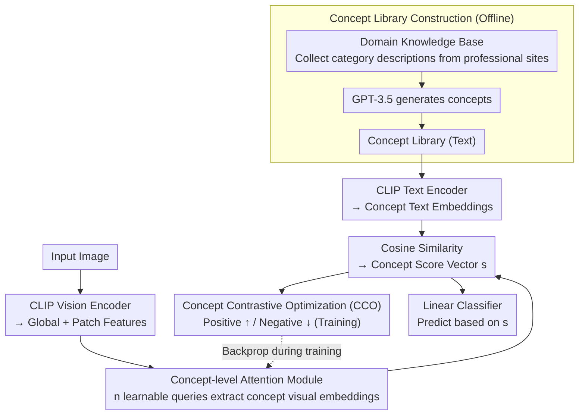

# Concept-wise Attention for Fine-grained Concept Bottleneck Models

**Conference**: CVPR 2026  
**arXiv**: [2604.15748](https://arxiv.org/abs/2604.15748)  
**Code**: None (Public after acceptance)  
**Area**: Multimodal VLM  
**Keywords**: Concept Bottleneck Models, Interpretability, CLIP, Contrastive Learning, Fine-grained Alignment

## TL;DR

CoAt-CBM achieves adaptive fine-grained image-concept alignment through learnable concept-level visual queries and Concept Contrastive Optimization (CCO), surpassing existing concept bottleneck models and black-box models while maintaining high interpretability.

## Background & Motivation

**Background**: Concept Bottleneck Models (CBMs) provide clear interpretable decision paths by first predicting a set of human-understandable concepts and then making final classifications based on concepts. Recent works utilize pre-trained vision-language models like CLIP to enhance CBM performance.

**Limitations of Prior Work**: Existing VLM-based CBMs face two key limitations. First, when calculating concept scores, they either rely on frozen coarse-grained global features (ResCBM, HybridCBM), leading to a coarse-to-fine granularity mismatch; or use Optimal Transport (DOT-CBM) to assign patch tokens, which relies on pre-trained structural priors and incurs high computational costs. Second, the commonly used BCE loss processes each concept independently, ignoring inter-concept exclusivity and failing to utilize negative concepts as references to improve the discriminability of positive concepts.

**Key Challenge**: Pre-training bias leads to inaccurate fine-grained alignment between visual features and textual concepts, while independently optimized loss functions prevent the model from learning the relative importance between concepts.

**Goal**: Achieve adaptive fine-grained image-concept alignment while simultaneously improving classification performance and interpretability.

**Key Insight**: Introduce learnable concept-level visual queries to adaptively decouple visual features, and replace BCE with contrastive constraints to model relationships between concepts.

**Core Idea**: Each concept is assigned a learnable query. An attention mechanism is used to extract concept-specific representations from visual features, which are then optimized via multi-positive contrastive loss to improve the relative ranking of concept scores.

## Method

### Overall Architecture

CoAt-CBM addresses the issue of "inaccurate concept score calculation" in VLM-based CBMs: either through frozen global features causing granularity mismatch, or through heavy Optimal Transport alignment. The approach equips each concept with a dedicated "probe" to actively extract relevant parts from visual features and employs a new loss for inter-concept referencing.

The workflow proceeds as follows: A domain knowledge base and concept library are first constructed offline to determine which human-readable concepts correspond to each category. During inference, the CLIP vision encoder encodes the image into global and patch features. The concept-level attention module uses a set of learnable queries to extract a concept-specific visual embedding for each concept from these features. These embeddings are compared with textual embeddings of concepts using cosine similarity to generate a concept score vector. During training, Concept Contrastive Optimization (CCO) applies contrastive constraints to the score vector based on positive and negative concept sets. Finally, a linear classifier makes predictions based solely on this score vector—since the decision is entirely based on readable concepts, the entire path remains interpretable.

### Key Designs

**1. Domain Knowledge Concept Library Construction: Refining the Concept Set**

Targeting upstream issues—where letting an LLM generate concepts solely from its internal knowledge leads to hallucinations or omissions, and purely learnable concept vectors lack clear semantics—this method first collects knowledge descriptions for each category from domain-specific websites to form a Class Knowledge Base. These descriptions are then used as prompts for GPT-3.5-Turbo to generate concepts for each category. Concepts are thus derived from external domain knowledge rather than limited internal model knowledge, suppressing hallucinations and filling gaps, providing a reliable and semantically clear foundation for downstream attention and contrastive optimization.

**2. Concept-level Attention Module: Allowing Concepts to "Find Evidence"**

Addressing the granularity mismatch where a single global feature fails to align with hundreds of fine-grained concepts. This module defines a learnable query $\mathbf{q}_i \in \mathbb{R}^{d_k}$ for each of the $n$ concepts. Global and patch features $\mathbf{Z}$ from CLIP are projected into keys and values. Each query undergoes scaled dot-product attention to calculate weights over patches $\bm{\alpha}_i = \text{Softmax}(\mathbf{K}\mathbf{q}_i / \sqrt{d_k})$, then aggregates them into a concept-specific visual embedding $\mathbf{e}_i = \mathbf{V}^\top \bm{\alpha}_i$. Different queries automatically specialize during training, learning to focus on different image regions. For instance, in a bird image from CUB-200, the query for the concept "red crown" focuses on head patches, while "striped wings" targets the wing area—dynamically decoupling visual features into concept-specific representations without relying on frozen global features or heavy structural priors like OT.

**3. Concept Contrastive Optimization (CCO): Using Concepts as Reference Frames**

Addressing defects at the loss level—where standard BCE treats concepts as independent binary classifications, failing to learn that relevant concepts should have higher scores than irrelevant ones. CCO uses the CLIP text encoder to generate textual embeddings, which are compared with the concept visual embeddings via cosine similarity to obtain the score vector $\mathbf{s}$. For an image, scores are split into a positive set $\mathbf{s}^+$ (associated with the image category) and a negative set $\mathbf{s}^-$ (irrelevant). A multi-positive contrastive loss pushes the positive set up and the negative set down:

$$\mathcal{L}_{CCO} = -\log \frac{\sum \exp(s_i^+/\tau)}{\sum \exp(s_i^+/\tau) + \sum \exp(s_i^-/\tau)}$$

where $\tau$ is the temperature. Unlike BCE, which calibrates absolute scores in isolation, CCO explicitly models the relative magnitude between positive and negative concepts, using negative concepts as references to enhance the discriminability of positive ones.

### Loss & Training

The total loss is $\mathcal{L} = \mathcal{L}_{cls} + \lambda \mathcal{L}_{CCO}$, combining classification loss with weighted contrastive loss, with $\lambda$ defaulting to 0.5. The backbone uses CLIP-ViT-L/14, optimized with AdamW on a single 3090.

## Key Experimental Results

### Main Results

| Method | Interpretable | CIFAR-10 | CIFAR-100 | CUB-200 |
|------|--------|----------|-----------|---------|
| Linear Probe | ✗ | 97.93 | 87.26 | 85.48 |
| HybridCBM | ✓ | 97.91 | 86.22 | 84.25 |
| DOT-CBM | ✓ | 97.75 | 84.75 | 83.76 |
| **CoAt-CBM (Ours)** | **✓** | **98.51** | **89.19** | **89.13** |

### Ablation Study

| Configuration | CIFAR-10 CDR | CIFAR-10 CC |
|------|-------------|------------|
| CoAt-CBM w/o CCO | 9.88 | 25.48 |
| CoAt-CBM_BCE | 82.16 | 85.42 |
| **CoAt-CBM (Ours)** | **89.64** | **94.76** |

### Key Findings

- CoAt-CBM surpasses the black-box Linear Probe while maintaining full interpretability, challenging the notion that interpretability necessarily sacrifices performance.
- A Gain of 4.88% (89.13 vs 84.25) is achieved on CUB-200, highlighting significant improvements in fine-grained classification.
- CCO is critical for interpretability metrics: CDR increases from 9.88% to 89.64%, indicating that while BCE-trained models might classify accurately, their concept scores are inconsistent with image content.
- The concept-level attention module consistently outperforms Adapter and LoRA alternatives.

## Highlights & Insights

- **CCO reveals fundamental defects in BCE**: Even when classification is accurate, BCE-trained models nearly fail in concept-level interpretability (CDR only 9.88%). CCO introduces inter-concept contrast, aligning score rankings highly with actual image content.
- **Significant few-shot advantage**: CoAt-CBM outperforms Linear Probe and LoRA-LP across 1-shot to 16-shot settings, demonstrating that concept priors provide effective inductive biases.
- **Clear Category-Concept Association visualization**: CCO transforms the category-concept association matrix from a noisy state into a clear diagonal structure.

## Limitations & Future Work

- Concept library quality depends on domain knowledge collection; it may be incomplete for obscure domains.
- The per-concept query design may face memory bottlenecks when the number of concepts is extremely large.
- Current validation is primarily on classification; extension to complex tasks like detection or segmentation remains to be explored.

## Related Work & Insights

- **vs HybridCBM**: HybridCBM uses learnable concept vectors to capture missing concepts but still uses frozen global features; CoAt-CBM achieves finer alignment via attention.
- **vs DOT-CBM**: DOT-CBM uses Optimal Transport to align patches and concepts, which is computationally expensive and structural-prior dependent; CoAt-CBM is more flexible and efficient.
- **vs PCBM**: PCBM constructs concept bottlenecks using projection distances; its accuracy is limited by the quality of global features.

## Rating

- Novelty: ⭐⭐⭐⭐ The combination of concept-level attention and CCO effectively addresses two key problems.
- Experimental Thoroughness: ⭐⭐⭐⭐⭐ Covers 10 datasets and comprehensive interpretability evaluations across few-shot to full-shot settings.
- Writing Quality: ⭐⭐⭐⭐ Clear problem analysis and persuasive interpretability metrics.
- Value: ⭐⭐⭐⭐⭐ Significant practical impact as it is the first time an interpretable CBM fully surpasses black-box models.

<!-- RELATED:START -->

## Related Papers

- [\[CVPR 2026\] CLIP-Free, Label-Free, Unsupervised Concept Bottleneck Models](clip-free_label_free_unsupervised_concept_bottleneck_models.md)
- [\[CVPR 2026\] DeAR: Fine-Grained VLM Adaptation by Decomposing Attention Head Roles](dear_fine-grained_vlm_adaptation_by_decomposing_attention_head_roles.md)
- [\[CVPR 2026\] Vision-Language Models Encode Clinical Guidelines for Concept-Based Medical Reasoning](vision-language_models_encode_clinical_guidelines_for_concept-based_medical_reas.md)
- [\[CVPR 2026\] No Hard Negatives Required: Concept Centric Learning Leads to Compositionality without Degrading Zero-shot Capabilities of Contrastive Models](no_hard_negatives_required_concept_centric_learning_leads_to_compositionality_wi.md)
- [\[CVPR 2026\] Dictionary-Aligned Concept Control for Safeguarding Multimodal LLMs](dictionary_aligned_concept_control_for_safeguarding_multimodal_llms.md)

<!-- RELATED:END -->
