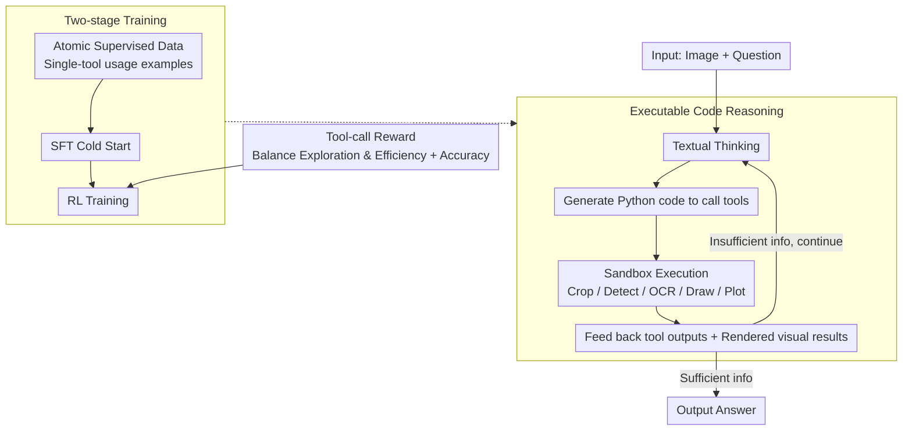

# CodeDance: A Dynamic Tool-integrated MLLM for Executable Visual Reasoning

**Conference**: CVPR 2026  
**arXiv**: [2512.17312](https://arxiv.org/abs/2512.17312)  
**Code**: [https://CodeDance-VL.github.io](https://CodeDance-VL.github.io)  
**Area**: Multimodal VLM / Tool Use  
**Keywords**: Executable Visual Reasoning, Tool Integration, Code Generation, Reinforcement Learning, Emergent Behavior

## TL;DR
CodeDance is proposed to utilize executable code as a universal solver for visual reasoning. The MLLM generates code to define, combine, and execute multiple tools, rendering intermediate visual results (bboxes, lines, and charts) to support a verifiable reasoning chain. Through RL training with a tool-call reward that balances exploration and efficiency, emergent behaviors—such as unseen tool combinations and cross-task transfer—are observed. The 7B model outperforms GPT-4o on benchmarks for counting, visual search, and chart QA.

## Background & Motivation

1.  **Background**: o3 demonstrates the capability of "thinking with tools," alternating between reasoning and tool execution. However, existing open-source methods either rely solely on text-based CoT, use fixed schemas (e.g., only predicting bbox coordinates), or utilize single-step pipelines.
2.  **Key Challenge**: (1) Pure text CoT cannot dynamically interact with visual inputs or verify intermediate results; (2) fixed schemas limit flexibility and composability; (3) o3 remains a closed-source black-box system.
3.  **Core Idea**: Code serves as the most universal "tool-use language." CodeDance enables MLLMs to generate and execute Python code to orchestrate tools, compute intermediate results, and render visual artifacts. **Emergent behaviors** (new tool invocation patterns, combinations, and cross-task transfers not seen during training) are discovered through RL training.

## Method

### Overall Architecture

CodeDance aims to enable MLLMs to "think with tools" similarly to o3, while remaining open-source, composable, and interpretable. It utilizes **executable Python code** as a unified tool-invocation language. During reasoning, the model alternates between textual thinking and generating code to call various tools (cropping, detection, OCR, drawing, and plotting). The code is executed in a sandbox, and the tool outputs along with rendered intermediate visual results are fed back into the model. This "code reasoning" capability is acquired through two-stage training: an SFT cold start using atomic supervised data, followed by RL using a tool-call reward that balances exploration and efficiency, leading to the emergence of novel tool combinations.

### Key Designs

**1. Executable Code Reasoning: Using Code as a Universal Tool-Use Language**

Pure text CoT lacks the ability to truly interact with visual inputs or verify intermediate results, while fixed schemas (e.g., predicting only bbox coordinates) restrict flexibility. CodeDance allows the model to alternate between "textual thinking" and "code execution." After reasoning in text, the model generates Python code to invoke tools. The results and rendered visual artifacts from the sandbox are returned to the model, which then continues reasoning or writes new code. Since code inherently supports variables, loops, conditions, and function definitions, its expressiveness far exceeds fixed schemas. This approach significantly improves performance at the same model scale while making the reasoning chain traceable and verifiable.

**2. Two-stage Training: Atomic Supervised Cold Start + RL Refinement**

To address the model's initial inability to write standardized tool-invocation code, "atomic supervised" data (demonstrating single-tool usage) is used for an SFT cold start. Subsequently, RL optimization is performed using a combination of tool-call rewards and task accuracy rewards. While SFT provides atomic capabilities, the RL stage is responsible for composing these capabilities into novel tool chains and transferring them to new tasks, which explains why emergent behaviors appear specifically during RL.

**3. Tool-call Reward: Learning to Use Tools Moderately**

Tool usage is not always "the more, the better": too few calls result in insufficient information, while too many lead to over-use and inefficiency. A reward mechanism is designed to balance exploration and efficiency, encouraging the model to invoke the right number of tools at the appropriate time. Experiments show that this balanced reward is more effective than an "always use tools" reward and is critical for the emergence of high-quality tool-use behaviors.

## Key Experimental Results

### Main Results

| Model | CountBench | PixmoCount | V*Bench | ChartQA |
| :--- | :---: | :---: | :---: | :---: |
| GPT-4o | 87.9 | - | 67.5 | 86.7 |
| Qwen2.5-VL-7B | 76.5 | 50.4 | 76.4 | 86.3 |
| Deepeyes-7B | 80.4 | 57.2 | 90.4 | 78.2 |
| **CodeDance-7B** | **91.2** | **77.1** | 84.8 | **87.5** |

Gains of +19.2% on CountBench and +53.0% on PixmoCount were achieved compared to the Qwen2.5-VL-7B baseline.

### Case Studies of Emergent Behavior
- Unseen tool combinations (e.g., chained calls of zoom + count + compare).
- Cross-task transfer (transferring region detection used in chart analysis to counting tasks).
- Spontaneous generation of verification code (drawing detection results for visual cross-checking).

### Key Findings
- Code is significantly more expressive than fixed schemas, leading to substantial performance gains at equivalent model sizes.
- Emergent behaviors are a critical outcome of RL and do not appear during the SFT stage.
- Tool usage is not monotonic; a balanced reward outperforms an "always use tools" strategy.

## Highlights & Insights
- **Code as a Universal Reasoning Medium**: More executable than text CoT and more flexible than fixed schemas, naturally supporting variables, loops, and logic.
- **Emergence in RL Training**: Observed novel tool combinations and cross-task transfer, reflecting a transition from atomic capabilities to creative synthesis similar to emergent properties in LLMs.
- **Verifiable Reasoning**: The combination of code and rendered visual intermediates makes the reasoning chain fully traceable and verifiable.

## Limitations & Future Work
- Code execution requires a sandbox environment, increasing deployment complexity compared to text-only models.
- The toolset is currently predefined; dynamic discovery and integration of new tools remain a challenge.

## Rating
- Novelty: ⭐⭐⭐⭐⭐ Executable code reasoning + RL emergent behavior.
- Experimental Thoroughness: ⭐⭐⭐⭐ Multiple benchmarks (Counting/Search/Chart) + Emergence analysis.
- Writing Quality: ⭐⭐⭐⭐ Intuitive demonstration of emergent behaviors.
- Value: ⭐⭐⭐⭐⭐ Significant advancement in VLM tool use and reasoning paradigms.

<!-- RELATED:START -->

## Related Papers

- [\[CVPR 2026\] Visual Reasoning through Tool-supervised Reinforcement Learning](visual_reasoning_through_tool-supervised_reinforcement_learning.md)
- [\[CVPR 2026\] Perception Programs: Unlocking Visual Tool Reasoning in Language Models](perception_programs_visual_tool_reasoning.md)
- [\[CVPR 2026\] CodeV: Code with Images for Faithful Visual Reasoning via Tool-Aware Policy Optimization](codev_code_with_images_for_faithful_visual_reasoning_via_tool-aware_policy_optim.md)
- [\[CVPR 2026\] ARM-Thinker: Reinforcing Multimodal Generative Reward Models with Agentic Tool Use and Visual Reasoning](arm-thinker_reinforcing_multimodal_generative_reward_models_with_agentic_tool_us.md)
- [\[CVPR 2026\] Don't Show Pixels, Show Cues: Unlocking Visual Tool Reasoning in Language Models via Perception Programs](dont_show_pixels_show_cues_unlocking_visual_tool_reasoning_in_language_models_vi.md)

<!-- RELATED:END -->
