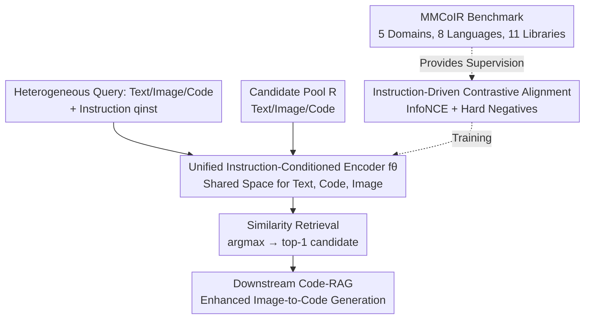

# CodeMMR: Bridging Natural Language, Code, and Image for Unified Retrieval

**Conference**: CVPR 2026  
**Paper**: [CVF Open Access](https://openaccess.thecvf.com/content/CVPR2026/html/Geng_CodeMMR_Bridging_Natural_Language_Code_and_Image_for_Unified_Retrieval_CVPR_2026_paper.html)  
**Code**: Not provided (No public repository link in the paper)  
**Area**: Multimodal VLM  
**Keywords**: Multimodal code retrieval, Unified embedding space, Instruction-conditioned contrastive learning, Code-RAG, MMCoIR benchmark  

## TL;DR
Addressing the gap where "code retrieval only considers text and ignores visual rendering," this paper introduces MMCoIR, the first multimodal and multilingual code retrieval benchmark (covering 5 visual domains, 8 languages, and 11 libraries). Based on Qwen2VL, the authors develop CodeMMR using instruction-conditioned contrastive learning to project text, code, and images into a unified semantic space. CodeMMR outperforms strong baselines like VLM2Vec-v2 and GME by approximately 10 points in average nDCG@10. Integrating it into RAG workflows further improves the execution rate and visual fidelity of image-to-code generation.

## Background & Motivation
**Background**: Code search is typically modeled as Information Retrieval (IR), serving as critical infrastructure for software engineering and increasingly for Code-RAG—retrieving relevant code snippets for LLMs to mitigate hallucinations and enhance generation reliability. Mainstream code IR models (e.g., CodeSearchNet, CoIR, CodeXEmbed) focus on semantic similarity between "Natural Language $\leftrightarrow$ Code."

**Limitations of Prior Work**: Real-world software artifacts are inherently multimodal—code may define web layouts, render charts, or generate SVG/UML diagrams. Developers often need to "see what this code renders" or, conversely, "find the code that generates this image." However, existing code IR systems are almost exclusively text-centric, treating code as plain text while ignoring the underlying visual and structural semantics.

**Key Challenge**: Supporting composite retrieval like "Image $\to$ Code" or "Text + Image $\to$ Code" requires aligning heterogeneous modalities (text, code, image) into the same embedding space. While general multimodal embedding models (CLIP, VLM2Vec, GME) are strong in text-image tasks, they perform poorly on the long-ignored "Code" modality, lacking knowledge of the correspondence between structured code (like PlantUML, TikZ, or SVG XML) and its rendered output.

**Goal**: (1) Provide a benchmark for systematic evaluation of multimodal and multilingual code retrieval; (2) Train a unified model that allows a single retriever to process text/code/image queries and generalize across domains and languages.

**Key Insight**: The differences between retrieval intents (Image $\to$ Code, Code $\to$ Image, Text $\to$ Code, Text + Image $\to$ Code) can be explicitly clarified using a natural language **instruction** $q_{inst}$ (e.g., "Please retrieve the code matching this image"). Consequently, "instruction conditioning + contrastive alignment" is used as the key to unifying various tasks.

**Core Idea**: Use instruction-conditioned multimodal contrastive alignment to encode natural language, code, and images into **the same shared semantic space**, enabling a single retriever to handle all combinations of multimodal code retrieval.

## Method

### Overall Architecture
The objective of CodeMMR is straightforward: given a query $q$ (which can be text $q_t$, image $q_i$, code $q_c$, or combinations like $q_{t,i}$ or $q_{t,c}$) and an instruction $q_{inst}$ describing the retrieval intent, select the most relevant target $r^*$ (also in any modality) from a heterogeneous candidate pool $R$. The pipeline involves "Unified Encoding $\to$ Similarity Retrieval $\to$ (Optional) Downstream Code-RAG."

The retrieval target is formalized as finding the candidate with the maximum similarity in the shared space:

$$r^* = \arg\max_{r \in R}\big( f_\theta(q, q_{inst})^\top f_\theta(r) \big)$$

where $f_\theta(\cdot)$ is a parameterized multimodal encoder. The query side includes the instruction while the candidate side does not, yet they share weights to project into the same space. This encoder is trained via instruction-driven contrastive alignment using supervision from the MMCoIR benchmark.

### Key Designs

**1. Unified Instruction-Conditioned Retrieval: Projecting Text/Code/Image into a Shared Space**

The pain point is that current code IR tasks (Image $\to$ Code, Code $\to$ Image, Text $\to$ Code) are fragmented, and general multimodal models cannot understand code. CodeMMR uses a **single encoder** $f_\theta$ to process three modalities simultaneously, appending a natural language instruction $q_{inst}$ to the query side to declare retrieval direction and domain context (e.g., "Please retrieve the code matching this image"). Queries are encoded as $h_{q} = f_\theta(q, q_{inst})$ and candidates as $h_{r} = f_\theta(r)$. Retrieval is performed by maximizing the inner product in the shared space. The advantage of instructions is decoupling "task semantics" from the model architecture: for datasets with only image-code pairs and no instructions, standardized prompts are used to specify input/output modalities; for composite queries (e.g., $q_{t,i} \to r_c$, where text comes from code editing prompts like "change node color to purple"), the same mechanism applies. Thus, a single model can switch between text-to-code, image-to-code, text+image-to-code, and inverse visual retrieval without requiring dedicated retrievers for each direction.

**2. Instruction-Driven Contrastive Alignment: Aligning Heterogeneous Modalities with InfoNCE and Hard Negatives**

CodeMMR initializes from a pre-trained VLM (Qwen2VL-2B-Instruct) and performs instruction-conditioned alignment using an InfoNCE-based contrastive loss. For a batch of $B$ query-positive pairs $\{(q_i, r_i^+)\}$, the loss is:

$$L_{ret} = -\frac{1}{B}\sum_{i=1}^{B} \log \frac{\phi(h_{q_i}, h_{r_i^+})}{\phi(h_{q_i}, h_{r_i^+}) + \sum_{r_i^-\in N}\phi(h_{q_i}, h_{r_i^-})}$$

where $\phi(h_q, h_r) = \exp(\frac{1}{\tau} h_q^\top h_r)$ is the temperature-scaled similarity with $\tau=0.02$. Negative samples include both in-batch negatives and hard negatives mined from semantically similar samples. Hard negatives are crucial because code retrieval involves many "similar but incorrect" distractors (e.g., charts with different data but same type). Training updates only the language model component (LoRA r=8, bf16) while freezing the vision encoder, using EOS pooling and $\ell_2$ normalization for embeddings. This allows a VLM that originally only understood text-image to learn fine-grained correspondences between code tokens and rendered visuals.

**3. MMCoIR Benchmark: The First Multimodal and Multilingual Code Retrieval Testbed**

MMCoIR unifies 5 representative visual domains: Web UI (WebSight/Web2Code/Sketch2Code), Data Charts (Chart2Code/ChartGen/ChartEdit), Vector Graphics SVG (SVGStack/MMSVG), Diagrams (DiagramGenBenchmark/DATIKZv3), and Software Engineering UML (PlantUML). It covers 8 programming languages (HTML/CSS/JS/Python/XML/LaTeX/PlantUML, etc.) and 11 libraries. Using a unified schema, it supports single-modality and composite retrieval (over ten query $\to$ target combinations). Text queries include both natural image descriptions and instructional editing prompts. Some datasets (Sketch2Code, ChartEdit, DiagramGenBenchmark) are reserved for testing to evaluate out-of-distribution generalization and novel tasks like "Text + Code $\to$ Image."

### Loss & Training
The contrastive loss used is $L_{ret}$ (InfoNCE, $\tau=0.02$, in-batch + hard negatives). Implementation details: 8×A100-80G, per-device batch size 64 (global 512), text truncated to 256 tokens, AdamW ($lr=5\times10^{-5}$, 100 warmup steps, total 1000 steps, linear scheduler). Vision encoder is frozen; only the LM is updated via LoRA. Total training time is approximately 30 hours.

## Key Experimental Results

### Main Results (MMCoIR seen datasets, average across 8 subsets)

| Model | Avg Hit@1 | Avg nDCG@10 |
|------|-----------|-------------|
| UniIR (CLIP SF) | 9.0 | 15.9 |
| VLM2Vec (7B) | 19.3 | 28.2 |
| GME (2B) | 46.0 | 51.5 |
| GME (7B) | 49.5 | 53.8 |
| VLM2Vec-v2 (2B) | 53.3 | 58.0 |
| UniIR-FT (Fine-tuned) | 36.6 | 42.9 |
| **CodeMMR (2B)** | **65.4** | **68.0** |
| CodeMMR (2B)-Mix | 65.2 | 66.5 |

CodeMMR scores ~10 points higher in nDCG@10 than the runner-up VLM2Vec-v2 and 20+ points higher than the fine-tuned UniIR.

### Domain Difficulty & Unseen Tasks (Representative Values, CodeMMR-2B)

| Setting | Domain/Task | Metric | CodeMMR | Strongest Baseline |
|------|---------|------|---------|----------|
| seen | UML (PlantUML) | Hit@1 | 100.0 | 100.0 (VLM2Vec-v2) |
| seen | WebUI (WebSight qc→ri) | nDCG@10 | 92.8 | 83.7 (VLM2Vec-v2) |
| seen | SVG (SVGStack qi→rc) | nDCG@10 | 19.7 | 9.3 (VLM2Vec-v2) |
| unseen | ChartEdit qc→ri | nDCG@10 | 100.0 | 95.4 (VLM2Vec-v2) |
| unseen | ChartEdit qt,c→ri | nDCG@10 | 43.2 | 32.5 (VLM2Vec-v2) |
| unseen | Sketch2Code qi→rc | nDCG@10 | 1.5 | 2.1 (VLM2Vec-2B) |

UML is the easiest (short code, 100% via symbolic matching); SVG is the hardest (long code, high compositionality, geometric complexity). Hand-drawn sketches (Sketch2Code) show poor performance across all models, indicating the visual gap between sketches and rendered layouts remains unresolved.

### Ablation Study

| Configuration | Key Result | Description |
|------|---------|------|
| CodeMMR vs CodeMMR-Mix | 68.0 vs 66.5 nDCG@10 | Mixing general image-text retrieval data yielded **no gain** (slight decrease). |
| Input Length 128→512 | SVG 7.5→13.7 | Increasing sequence length consistently improves performance, especially in structure-dense domains like SVG. |

### Key Findings
- **Specialized Data Trumps Volume**: Mixing large-scale general image-text retrieval data did not help, suggesting MMCoIR provides sufficient cross-modal supervision. Code retrieval requires "on-target" code-visual pairs rather than general pairs.
- **Input Length is a Bottleneck for Structured Code**: The default 256 tokens truncate critical syntax in long XML-like codes; extending to 512 consistently improves scores.
- **Asymmetric Modality Alignment**: Code $\to$ Image is often easier than Image $\to$ Code (especially in SVG), suggesting that inferring long structural code from visuals is more difficult than the reverse.
- **Retrieval Quality Transfers to Generation**: RAG-retrieved code snippets provide reliable structure/style priors, improving MLLM performance in ChartMimic across Low-Level dimensions (Text/Layout/Type/Color).

## Highlights & Insights
- **Official Incorporation of "Code" as a Retrieval Modality**: While previous universal embeddings expanded into images/videos, this work is the first to include code and its "rendered visual semantics" into a unified space.
- **Instruction Conditioning as a Low-Cost Unification Tool**: Without changing architecture, appending instructions handles over ten combinations of query $\to$ target tasks.
- **Hard Negatives are Crucial for Code Retrieval**: High density of "similar type, different detail" distractors makes hard negative mining a core requirement for distinguishing between similar code/images.
- **Evidence of the Retrieval $\to$ Generation Loop**: Beyond retrieval metrics, the paper proves that better retrieval directly translates to higher execution rates and visual fidelity in image-to-code generation.

## Limitations & Future Work
- SVG and other long-context domains remain challenging (Image $\to$ Code Hit@1 is in the single digits); long-context retrieval is a clear future direction.
- Performance on abstract visual inputs (Sketch2Code) remains low, and composite reasoning (Text + Code $\to$ Image) is significantly weaker than single-modality directions.
- Training was only conducted on Qwen2VL-2B (LoRA); the potential of larger backbones or unfreezing the vision encoder for complex domains like SVG was not fully explored.

## Related Work & Insights
- **vs VLM2Vec/VLM2Vec-v2**: These are also based on Qwen2VL with instruction-conditioned contrastive embeddings but lack specific code alignment. CodeMMR outperforms them by ~10 points on average nDCG@10.
- **vs UniIR/MagicLens**: UniIR uses shared encoders for multiple retrieval tasks but is limited to traditional images/text. Building on the "instruction unification" idea, CodeMMR extends the modality to code.
- **vs Traditional Code IR**: Prior works treat code as plain text. CodeMMR highlights the inherent multimodality of code and formally introduces the visual modality into code retrieval and code-RAG.

## Rating
- **Novelty**: ⭐⭐⭐⭐⭐ (Successfully integrates code and its rendered visual semantics into unified multimodal retrieval with a matching benchmark)
- **Experimental Thoroughness**: ⭐⭐⭐⭐ (Covers 5 domains, 8 languages, seen/unseen setups, and RAG downstream; however, limited to a single 2B backbone)
- **Writing Quality**: ⭐⭐⭐⭐ (Clear task formalization and benchmark structure)
- **Value**: ⭐⭐⭐⭐⭐ (The benchmark and model have direct utility for the retrieval foundation of intelligent programming systems)

<!-- RELATED:START -->

## Related Papers

- [\[CVPR 2026\] HBridge: H-Shape Bridging of Heterogeneous Experts for Unified Multimodal Understanding and Generation](hbridge_h-shape_bridging_of_heterogeneous_experts_for_unified_multimodal_underst.md)
- [\[CVPR 2026\] RetFormer: Multimodal Retrieval for Enhancing Image Recognition](retformer_multimodal_retrieval_for_enhancing_image_recognition.md)
- [\[CVPR 2026\] Camouflage-aware Image-Text Retrieval via Expert Collaboration](camouflage-aware_image-text_retrieval_via_expert_collaboration.md)
- [\[CVPR 2026\] UARE: A Unified Vision-Language Model for Image Quality Assessment, Restoration, and Enhancement](uare_a_unified_vision-language_model_for_image_quality_assessment_restoration_an.md)
- [\[CVPR 2026\] R4-CGQA: Retrieval-based Vision Language Models for Computer Graphics Image Quality Assessment](r4-cgqa_retrieval-based_vision_language_models_for_computer_graphics_image_quali.md)

<!-- RELATED:END -->
