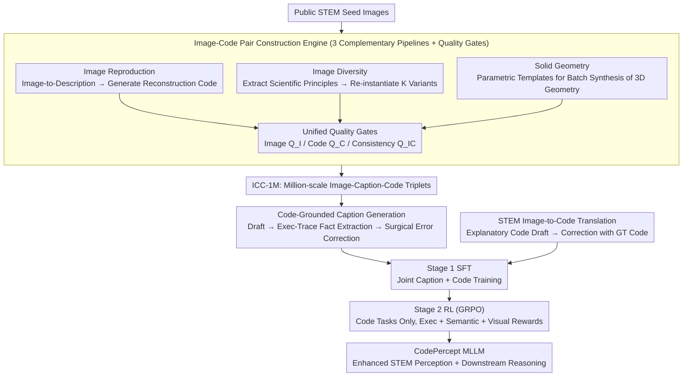

# CodePercept: Code-Grounded Visual STEM Perception for MLLMs

**Conference**: CVPR 2026  
**arXiv**: [2603.10757](https://arxiv.org/abs/2603.10757)  
**Code**: [TongkunGuan/Qwen-CodePercept](https://github.com/TongkunGuan/Qwen-CodePercept)  
**Area**: Multimodal VLM / STEM Perception  
**Keywords**: STEM Visual Perception, Executable Code, Image Reconstruction, Code-Grounded Captioning, Multimodal Large Model, Perception Enhancement

## TL;DR

Through systematic scaling analysis, it is discovered that perception, rather than reasoning, is the true bottleneck for MLLMs in the STEM field. The CodePercept paradigm is proposed using executable Python code as an anchoring medium. It constructs a million-scale ICC-1M dataset and the STEM2Code-Eval benchmark. Following two-stage training (SFT+RL), the STEM visual perception and downstream reasoning capabilities of MLLMs are significantly improved.

## Background & Motivation

**Background**: Current research focuses extensively on enhancing the reasoning capabilities of MLLMs through reinforcement learning (cold-start data, RL reward design, unimodal reasoning data transfer). However, the fundamental question remains: do STEM task failures stem from insufficient perception or insufficient reasoning?

**Limitations of Prior Work**: The authors decoupled STEM visual reasoning into two independent stages: perception (image→caption) and reasoning (caption→answer). By fixing one side and independently scaling the other on the MathVision dataset, it was found that scaling perception consistently outperforms scaling reasoning (e.g., Perception@32B+Reasoning@4B significantly outperforms Perception@4B+Reasoning@32B). This proves that perception is the real lever for STEM visual reasoning, yet systematic solutions for perception are nearly non-existent.

**Key Challenge**: Intuitive solutions—utilizing GPT/Gemini to generate descriptive captions for knowledge distillation—face two fatal flaws: (1) Teacher models are prone to hallucinations regarding spatial relations and quantitative details; (2) Complex STEM images suffer from "descriptive aphasia," where natural language cannot accurately characterize structural information such as auxiliary line constructions or polyhedral spatial relationships.

**Goal**: (1) How to systematically enhance the STEM visual perception capabilities of MLLMs? (2) How to directly evaluate perception capability rather than using question-answering accuracy as a proxy metric?

**Key Insight**: Executable code naturally possesses precise semantics, verifiability, and structured expression—correct reconstruction code can only be generated if the image is fully understood. Code serves as a more precise "structured caption" than natural language.

**Core Idea**: Use executable Python code as a precise perception medium for STEM images, serving simultaneously as a training signal (Code-Grounded Captioning + Image-to-Code) and an evaluation standard (fidelity of code-reconstructed images).

## Method

### Overall Architecture

CodePercept addresses an overlooked issue: the bottleneck for MLLMs in STEM tasks is perception, not reasoning—they fail to "see" auxiliary lines, 3D structures, and precise coordinates. The core strategy uses **executable Python code** as the perception anchor: code that can redraw an image can only be written if the image is truly understood. The pipeline consists of three steps: an image-code pair construction engine generates ground-truth reconstruction code for existing STEM images (ICC-1M dataset), these pairs are used for two training tasks (Image-to-Caption and Image-to-Code), and training concludes with Stage 1 SFT followed by Stage 2 Reinforcement Learning (GRPO), all based on the Qwen3-VL series.

### Key Designs

**1. Image-Code Pair Construction Engine: Building a Million-scale Image-Code Dataset via Three Complementary Pipelines**

This paradigm requires massive data pairing "images with precise reconstruction code." Since raw STEM data lacks code annotations, and direct LLM image-to-code generation is low-quality, three pipelines are used. "Image Reproduction" generates detailed text descriptions first, then prompts the model to write matplotlib reconstruction code based on the "image + description"—though its diversity is limited by the source database. "Image Diversity" solves this by extracting underlying scientific principles $G_{\text{principle}}$ from seed images and re-instantiating K different visual variants; for example, a Domino puzzle principle like "combinatorial counting" can be redrawn as circular wheels, triangular stacks, or grid diagrams. "Solid Geometry" addresses LLM weaknesses in 3D geometry code using a parametric template library (e.g., cube unfolding, orthographic projections, cross-section analysis). All outputs pass through three quality gates: image quality $Q_I$, code quality $Q_C$, and image-code consistency $Q_{IC}$.

**2. Code-Grounded Caption Generation: Using Ground-Truth Code to Eliminate Caption Hallucination**

Traditional distillation uses strong models to generate descriptive captions, which often hallucinate spatial relations. Ours uses code as a factual arbiter in three steps. First, "Native Caption" lets the MLLM write a draft $t_{\text{draft}}$. Second, "Code Analysis" avoids directly parsing complex code (with recursion or nested loops) and instead uses an execution tracker $\xi(\mathbf{c})$ to record precise coordinates, dimensions, and z-order layers to extract verified visual facts $t_{\text{code}}$. Third, "Code-Grounded Refinement" uses these facts to surgically correct quantitative and spatial errors in the draft while maintaining a natural language style:

$$t_{\text{new}} = G_{\text{refine}}\big(G_{\text{caption}}(\mathbf{x}),\, G_{\text{analyze}}(\mathbf{c}, \xi(\mathbf{c}))\big)$$

The execution tracker is key—it simplifies the difficult task of "understanding complex code" into "reading execution logs."

**3. STEM Image-to-Code Translation: Providing Structural Signals Beyond Natural Language**

Captions are limited by "descriptive aphasia" regarding structures like auxiliary lines or 3D spatial relationships. Consequently, a second task trains the model to generate executable reconstruction code directly from images. The MLLM first writes a code draft $c_{\text{draft}}$ with step-by-step decomposition and parameter explanations (highly explanatory but potentially factually incorrect), which is then corrected using ground-truth code to yield:

$$c_{\text{new}} = G_{\text{refine}}\big(G_{\text{code}}(\mathbf{x}),\, \mathbf{c}\big)$$

Code complements natural language by directly expressing geometric relationships and mathematical constraints through programming constructs.

### Loss & Training

- **Stage 1 (SFT)**: Based on Qwen3-VL, jointly training image captioning and image-to-code translation on ICC-1M for 1 epoch using 32 A100 GPUs.
- **Stage 2 (RL)**: Applies GRPO reinforcement learning to the code generation task only, using 10,000 samples. The reward function includes format rewards $r_{\text{fmt}}$ (correct code block formatting) and content rewards $r_{\text{cnt}}$ (execution success rate + GPT-4o assessed code semantic equivalence + image visual similarity).

## Key Experimental Results

### Main Results (STEM2Code-Eval Image Reconstruction)

| Model | Image Score | Code Score | Avg | Exec Rate |
|------|-----------|-----------|------|-----------|
| Gemini2.5-Pro-Thinking | 68.89 | 75.41 | 72.15 | 91.7% |
| GPT5-Thinking | 64.97 | 64.98 | 64.98 | 96.6% |
| Qwen3-VL-4B-Instruct | 24.55 | 26.42 | 25.49 | 79.4% |
| CodePercept-4B-S1 | 38.13 | 43.43 | 40.78 | 80.7% |
| **CodePercept-4B-R1** | **47.17** | **45.86** | **46.52** | **91.3%** |
| Qwen3-VL-32B-Instruct | 36.85 | 39.98 | 38.42 | 81.8% |
| **CodePercept-32B-R1** | **68.97** | **62.53** | **65.75** | **95.9%** |

### Perception Ability Evaluation (Captioner-Solver Setup, LLM Solver: Qwen3-30A3-Thinking)

| Model (Captioner) | MathVision | MathVista | MathVerse | DynaMath | WeMath | LogicVista | Avg |
|------|------|------|------|------|------|------|------|
| Qwen3-VL-4B-Instruct | 54.21 | 67.30 | 64.59 | 69.40 | 46.10 | 54.14 | 59.29 |
| CodePercept-4B-S1 | **57.63** | **69.60** | **65.59** | **71.38** | **47.81** | **60.40** | **62.07** |
| Qwen3-VL-32B-Instruct | 58.55 | 72.20 | 71.09 | 75.78 | 48.00 | 62.19 | 64.63 |
| CodePercept-32B-S1 | **62.27** | **72.90** | **71.70** | **77.41** | **54.19** | **65.33** | **67.30** |

### Ablation Study

| Data Configuration | MathVision Gain | Avg Gain |
|---------|---------------|---------|
| Image Reproduce Only | Baseline | Baseline |
| + Image Diversity | +Significant | +Significant |
| + Solid Geometry | +Further Improvement | +Further Improvement |
| + CodeCap (Code-Grounded Caption) | +Additional Gain | Complementary |
| + ImCode (Image-to-Code) | Highest | Highest |

### Key Findings

- CodePercept-4B-R1 increased the Image Score on STEM2Code-Eval from 24.55 to 47.17 (+92%) and the Exec Rate from 79.4% to 91.3%, proving that the RL stage effectively enhances code quality.
- The Avg Score of CodePercept-32B-R1 (65.75) is comparable to GPT5-Thinking (64.98), approaching the strongest closed-source models using only open-source weights.
- Perception improvements directly translate to downstream reasoning: when CodePercept-32B-S1 is used as a captioner, downstream reasoning improves by an average of 2.7 points.
- Code and captions are complementary: training with only captions or only code is less effective than joint training.

## Highlights & Insights

- Scaling analysis reveals "perception as the bottleneck"—while most research focuses on reasoning (RL, CoT, reward design), perception performance is the true constraint in STEM. This finding may redirect future research.
- Paradigm shift using code as a perception medium—code serves as a "verifiable, executable structured caption." Spatial relations and precise values that natural language cannot describe are explicitly expressed in code. The execution tracker solves the issue of LLMs struggling to understand complex code.
- The "abstraction-to-reinstantiation" strategy in the Image Diversity Pipeline provides an efficient data augmentation path—rather than simple enhancement, it offers conceptual diversification while maintaining scientific rigor, applicable to other scientific data construction.

## Limitations & Future Work

- The STEM2Code-Eval benchmark includes only 1,000 samples; the coverage of STEM sub-fields and difficulty distribution may be insufficient.
- Code reconstruction relies on matplotlib, which is inapplicable to non-2D visual content such as real experimental photos or microscopic images.
- The reward function in the RL stage relies on GPT-4o scoring, introducing external model bias.
- The 3D geometry template library is manually designed, limiting its coverage to specific template types.

## Related Work & Insights

- **vs. Traditional STEM Reasoning Enhancement** (KeyeVL, InternS1): These focus on the reasoning side (RL, CoT); Ours proves that the perception side is the real lever—investing compute in perception yields higher returns.
- **vs. Knowledge Distillation**: Traditional caption generation is limited by teacher model hallucinations; CodePercept uses code execution results as ground truth to eliminate hallucinations, providing more reliable knowledge transfer.
- **vs. Domain-Specific Code Generation** (UI-to-code, Chart-to-code): These works target downstream applications, whereas CodePercept's image-code pairing serves dual values in evaluation and training.

## Rating

- Novelty: ⭐⭐⭐⭐⭐ Scaling analysis revealing perception bottlenecks + code as a perception medium is a paradigm-level innovation.
- Experimental Thoroughness: ⭐⭐⭐⭐ 6 STEM benchmarks + STEM2Code-Eval + ablations, though the RL ablation could be more granular.
- Writing Quality: ⭐⭐⭐⭐ Clear logic; scaling analysis plots are highly persuasive.
- Value: ⭐⭐⭐⭐⭐ Potentially redirects STEM multimodal research from reasoning to perception.

<!-- RELATED:START -->

## Related Papers

- [\[CVPR 2026\] GeoTikzBridge: Advancing Multimodal Code Generation for Geometric Perception and Reasoning](geotikzbridge_advancing_multimodal_code_generation_for_geometric_perception_and_.md)
- [\[CVPR 2026\] Linking Perception, Confidence and Accuracy in MLLMs](linking_perception_confidence_and_accuracy_in_mllms.md)
- [\[CVPR 2026\] Widget2Code: From Visual Widgets to UI Code via Multimodal LLMs](widget2code_from_visual_widgets_to_ui_code_via_multimodal_llms.md)
- [\[CVPR 2026\] SPARROW: Learning Spatial Precision and Temporal Referential Consistency in Pixel-Grounded Video MLLMs](sparrow_learning_spatial_precision_and_temporal_referential_consistency_in_pixel.md)
- [\[CVPR 2026\] Enhancing Descriptive Captions with Visual Attributes for Multimodal Perception](enhancing_descriptive_captions_with_visual_attributes_for_multimodal_perception.md)

<!-- RELATED:END -->
