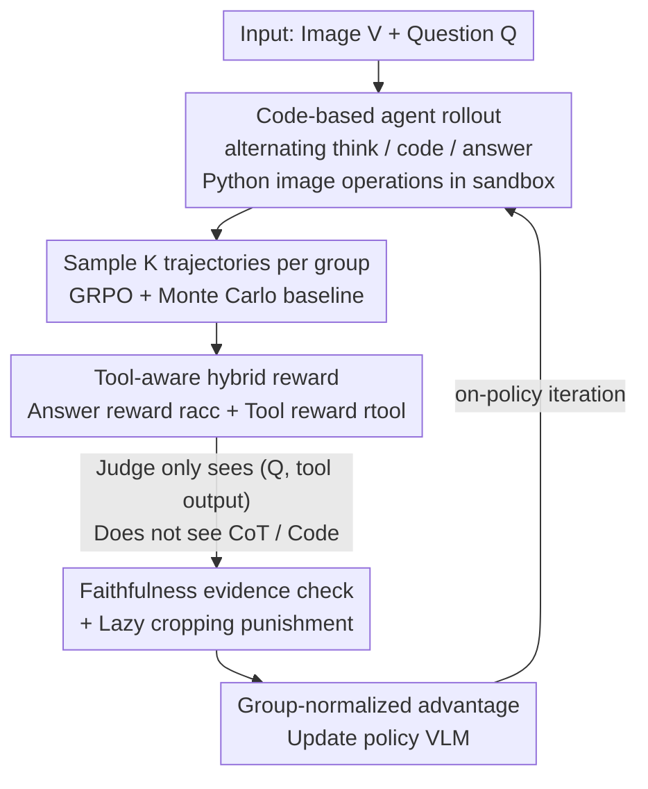

# CodeV: Code with Images for Faithful Visual Reasoning via Tool-Aware Policy Optimization

**Conference**: CVPR 2026  
**Paper**: [CVF Open Access](https://openaccess.thecvf.com/content/CVPR2026/html/Hou_CodeV_Code_with_Images_for_Faithful_Visual_Reasoning_via_Tool-Aware_CVPR_2026_paper.html)  
**Code**: https://github.com/RenlyH/CodeV  
**Area**: Multimodal VLM / Agent / Reinforcement Learning  
**Keywords**: Visual Agent, Faithful Reasoning, Tool-use Reward, Process-level RL, GRPO  

## TL;DR
This paper discovers that visual agents capable of "thinking with images" often **answer correctly but use tools unfaithfully** (e.g., cropping the wrong area but guessing the right answer). It proposes CodeV, which represents visual tools as executable Python code and utilizes Tool-Aware Policy Optimization (TAPO) on top of GRPO. TAPO introduces a **process-level dense reward that only evaluates tool outputs without inspecting the chain-of-thought**. Consequently, CodeV maintains or improves accuracy across 10 benchmarks while increasing the faithful tool-use rate to 1.3–2× that of baselines.

## Background & Motivation
**Background**: Advanced visual agents (e.g., DeepEyes, Pixel-Reasoner, o3) increasingly adopt the "think with images" paradigm—interleaving image operations like cropping, rotation, and segmentation during reasoning to ground answers in visual evidence. Training typically involves a two-stage curriculum: SFT for cold-starting tool-use, followed by RLVR (Reinforcement Learning from Verifiable Rewards) using final answer correctness and tool-invocation bonuses.

**Limitations of Prior Work**: The authors conducted a faithfulness diagnostic experiment, using GPT-4o as a judge to determine whether intermediate crops successfully captured the target objects. The results were striking: on the V* benchmark, **even when the final answer was correct**, only 57% of tool calls by DeepEyes and 43% by Pixel-Reasoner were faithful. Frequently, models cropped irrelevant areas or ignored tool outputs entirely while guessing the answer from text cues/options. High accuracy often masks unfaithful reasoning, leading benchmarks to overestimate true visual tool capabilities.

**Key Challenge**: The root cause lies in two reward design flaws. First is **outcome dominance**: rewards focus solely on final answer correctness or tool invocation, providing zero supervision over "how" tools are used. This lack of step-level credit assignment encourages policies to learn "hallucinatory" tool calls or meaningless operations to exploit the system (reward hacking). Second is **reward sparsity**: early rollouts on hard problems often receive zero rewards, leading to unstable optimization, while naive invocation bonuses perversely encourage "lazy" behavior like cropping oversized, useless boxes.

**Goal**: To **incentivize VLMs to produce faithful reasoning grounded in tool outputs** without training a hackable independent reward model or supervising unverifiable chain-of-thought (CoT) tokens, all while maintaining or improving final accuracy.

**Core Idea**: Treat tool use as "a sequence of verifiable decisions." Transform GRPO with a **process-level dense reward that inspects only tool inputs/outputs (not CoT)**, making supervision both easy to verify and hard to hack. Use Python code as the unified tool interface to allow natural calls to rich image manipulation libraries.

## Method

### Overall Architecture
CodeV instantiates "agentic visual reasoning" as an agent that **generates code to view images**. Training consists of two stages: **Stage 1 SFT cold-start** and **Stage 2 TAPO reinforcement learning**.

An agent's rollout is a trajectory $\tau = (\mathbf{x}, a_1, o_1, \dots, a_T)$, where the input $\mathbf{x}=(V,Q)$ contains an image and a question. Each action $a_t \sim \pi_\theta(\cdot \mid \mathbf{x}, h_{t-1})$ is based on the history $h_{t-1}$ and belongs to one of three types: `<think>` (free-text reasoning), `<code>` (Python code executed in a restricted sandbox with read-only access to image $V$), or `<answer>` (terminating the trajectory). Only `<code>` blocks generate observations $o_t$ (logs + optional derived images) added back to the context. The entire tool-use process is integrated into the token-level policy, requiring **no external controller**.

Stage 1 uses trajectories containing multi-step code reasoning (like Thyme-SFT) to teach the model how to crop and refine. Stage 2 performs GRPO-style on-policy rollouts using a **hybrid reward system** (accuracy + faithfulness). Rewards are group-normalized to estimate relative advantage for policy updates.

### Key Designs

**1. Code-based Tool Interface: Unified Image Manipulation via Python Sandbox**

Addressing the limitations of external heavy API tools, CodeV uses executable Python programs within `<code>` blocks. These execute in a restricted sandbox, providing deterministic, verifiable intermediate products (like crop coordinates or statistics). This leverages the model's pre-trained code capabilities, making tool invocation natural and expressive while providing clean objects for process rewards (more reliable than judging reasoning text).

**2. TAPO Hybrid Reward: Injecting Tool Faithfulness into Dense Signals**

To address outcome-only reward limitations, TAPO adds a **dense process reward for tool steps** to the GRPO framework. The total reward is a weighted sum:

$$R(\tau) = \lambda_{\text{acc}}\, r^{\text{acc}}(\tau) + \lambda_{\text{tool}}\, r^{\text{tool}}(\tau)$$

Where $r^{\text{acc}}$ measures answer quality (exact match, program match, or LLM-as-a-judge), and $r^{\text{tool}}$ averages tool scores across steps: $r^{\text{tool}}(\tau)=\frac{1}{|\mathcal{T}_{\text{tool}}|}\sum_{t\in\mathcal{T}_{\text{tool}}} r^{\text{tool}}_t$. The objective is the GRPO objective with PPO-style clipping:

$$\mathbb{E}_{\tau,t}\Big[\min\big(r_t(\theta)A_t,\ \text{clip}(r_t(\theta),1-\epsilon,1+\epsilon)A_t\big)\Big] - \beta\,\mathbb{D}_{\text{KL}}(\pi_\theta \| \pi_{\text{ref}})$$

The advantage $A_t$ is calculated via group-relative rewards. High-temperature sampling allows trajectories to diverge; better tool steps lead to higher total rewards, **selectively increasing the probability of decisive tool actions**. A key constraint is $|\lambda_{\text{tool}}| < |\lambda_{\text{acc}}|$, ensuring answer correctness remains the primary signal.

**3. Tool Reward as "Evidence Check": Judge Sees Outputs, Not Thinking**

To prevent reward hacking, the judge **only inspects non-model-generated context** $(Q, o_t, \text{metadata})$—the question and sandbox output (cropped images, coordinates, stats). The judge (Qwen2.5-VL-32B) assesses: "Does this tool output provide useful evidence to answer $Q$?" This setup is robust because the judge **never sees the CoT or code**, meaning it cannot be deceived by persuasive reasoning.

**4. Redline Mechanism and Lazy Cropping Suppression**

To prevent models from "lazy cropping" (e.g., cropping a giant, useless box to get an invocation bonus), CodeV uses: (1) **SFT shaping**, where cold-start data prioritizes localized, high-resolution crops; and (2) **Judge criteria**, where the judge focuses on whether the crop clearly contains the required target. Large, cluttered crops that make the target invisible fail the check. For tasks not requiring visual search, $r^{\text{tool}}_t$ defaults to near 0, and penalties are strictly applied to "redline" behaviors like invalid coordinates or repeated null operations.

### Loss & Training
A two-stage curriculum: Stage 1 SFT on Thyme-SFT for 3 epochs. Stage 2 reinforcement learning using a cleaned dataset (based on Thinklite-70K and DeepEyes-47K, excluding OK-VQA and high-accuracy samples to ensure relative advantage within groups). RL hyperparameters: rollout/training batch size 256, 8 rollouts per sample, 200 update steps, temperature 1.0, learning rate $1\times10^{-6}$. Base model: Qwen2.5-VL-7B.

## Key Experimental Results

### Main Results
Comparing CodeV-7B against open-source baselines and GPT-4o (all 7B models configured for tool-use):

| Benchmark | Type | CodeV-7B | GPT-4o | Qwen2.5-VL-7B | Pixel-Reasoner-7B |
|-----------|------|----------|--------|---------------|-------------------|
| VLMBlind | Perception | **46.6** | 45.1 | 43.9 | 42.6 |
| V\* | Visual Search | **84.8** | 64.4 | 75.0 | 79.6 |
| HRBench-4K-all | High-Res Search| 76.1 | 63.1 | 68.6 | 70.1 |
| MathVista | Math Reasoning | **71.8** | 61.3 | 67.9 | 71.2 |
| MathVerse-Mini| Math Reasoning | **49.2** | 63.7 | 45.5 | 46.9 |
| MathVision-Mini| Math Reasoning | 33.6 | 50.2 | 21.4 | 26.3 |

CodeV achieves 84.8 on V\*, significantly outperforming GPT-4o (64.4) and Qwen2.5-VL-7B (75.0). It secures state-of-the-art results among open-source models in perception and math, narrowing the gap with closed-source models.

### Faithfulness Evaluation
Comparing faithful tool invocation rates on V\* and HRBench-4K:

| Model | Rel. Faithful Tool Use Rate | Remarks |
|-------|-----------------------------|---------|
| CodeV | Highest (~1.3–2× baseline) | Accuracy increases simultaneously |
| DeepEyes | ~57% on V\* | Often crops wrong area but answers correctly |
| Pixel-Reasoner | ~43% on V\* | Same as above |
| Thyme | Single digits | <10% of rollouts actually call tools |

CodeV outperforms Pixel-Reasoner/DeepEyes by double digits, proving TAPO successfully grounds decisions in visual evidence.

### Ablation Study
**Training Stage Ablation** (Avg. Benchmarks):

| Configuration | Reasoning | Perception | Description |
|---------------|-----------|------------|-------------|
| Qwen2.5-VL-7B | 49.7 | 62.8 | Base |
| Zero-RL (No SFT) | 52.9 | 67.0 | Improvement but rapidly collapses to text-only |
| Cold-start SFT | 47.7 | 61.7 | Slightly lower but richer tool-use rollouts |
| **CodeV (SFT+TAPO)** | **54.2** | **69.7** | Best performance, +6-8 points over SFT |

**Reward Design Ablation** (Starting from SFT):

| Reward Design | Reasoning | Perception | Description |
|---------------|-----------|------------|-------------|
| Accuracy only | 51.2 | 67.5 | Gains lead to text-only reasoning drift |
| + Consistency | 50.4 | 67.6 | No significant change |
| + GPT-5-nano Judge | 52.4 | 68.7 | Modest gains |
| **CodeV (Full TAPO)** | **54.2** | **69.7** | Optimal across all metrics |

### Key Findings
- **Cold-start SFT is indispensable**: Instruct models cannot naturally convert "knowing how to code" into "using code to solve visual problems." Without SFT, RL usually converges to text-only reasoning to avoid the "cost" of tool use.
- **Process Rewards > Outcome Rewards**: Accuracy-only rewards eventually penalize tool use if the model can guess correctly. Only step-level tool rewards preserve both accuracy and faithfulness.
- **Judge Model Replaceability**: Using a smaller judge (GPT-5-nano) still yields gains, though the 32B model is superior, indicating method robustness.

## Highlights & Insights
- **The "Judge Output, Not CoT" paradigm is ingenious**: It bypasses the difficulty of supervising unverifiable reasoning tokens. Since the judge cannot see the "thinking," it cannot be manipulated, focusing purely on the objective utility of the visual evidence.
- **Faithfulness Diagnosis is a Contribution**: Decoupling accuracy from correct tool usage reveals a systematic overestimation of tool capabilities in existing benchmarks.
- **Code as a Unified Interface**: Using Python for all operations leverages pre-trained coding skills while ensuring intermediate outputs are naturally verifiable.

## Limitations & Future Work
- **Dependency on a Strong Judge**: TAPO quality depends on the Qwen-32B judge's judgment. Judge bias/cost is a hidden dependency.
- **Faithfulness Definition focused on Search**: Defining faithfulness as "cropping the target" works for visual search but is less clear for global reasoning or counting.
- **Scalability**: Tested mainly on 7B models; whether reward hacking becomes more prevalent in larger models remains to be seen.

## Related Work & Insights
- **vs. DeepEyes/Pixel-Reasoner**: They use outcome-dominant rewards, leading to 43–57% faithfulness. CodeV embeds faithfulness into dense process rewards, doubling faithful usage.
- **vs. Thyme**: Thyme uses consistency rewards, but in practice, <10% of rollouts actually use tools. CodeV's sandbox check forces real tool execution.
- **vs. Standard GRPO/RLVR**: TAPO's dense tool reward provides step-level credit assignment while keeping answer correctness as the primary signal, maintaining stability.

## Rating
- Novelty: ⭐⭐⭐⭐⭐ Process reward for outputs (not CoT) targets the core of agentic reward hacking.
- Experimental Thoroughness: ⭐⭐⭐⭐ Extensive benchmarks and faithfulness metrics, though focused on one scale (7B).
- Writing Quality: ⭐⭐⭐⭐ Clear motivation and mechanism.
- Value: ⭐⭐⭐⭐⭐ Quantifies the "correct but unfaithful" trap and provides a transferable paradigm for tool-using agents.

<!-- RELATED:START -->

## Related Papers

- [\[CVPR 2026\] HiconAgent: History Context-aware Policy Optimization for GUI Agents](hiconagent_history_context-aware_policy_optimization_for_gui_agents.md)
- [\[CVPR 2026\] Visual Reasoning through Tool-supervised Reinforcement Learning](visual_reasoning_through_tool-supervised_reinforcement_learning.md)
- [\[CVPR 2026\] ARM-Thinker: Reinforcing Multimodal Generative Reward Models with Agentic Tool Use and Visual Reasoning](arm-thinker_reinforcing_multimodal_generative_reward_models_with_agentic_tool_us.md)
- [\[CVPR 2026\] VOLD: Reasoning Transfer from LLMs to Vision-Language Models via On-Policy Distillation](vold_reasoning_transfer_from_llms_to_vision-language_models_via_on-policy_distil.md)
- [\[CVPR 2026\] SpaceTools: Tool-Augmented Spatial Reasoning via Double Interactive RL](spacetools_tool-augmented_spatial_reasoning_via_double_interactive_rl.md)

<!-- RELATED:END -->
