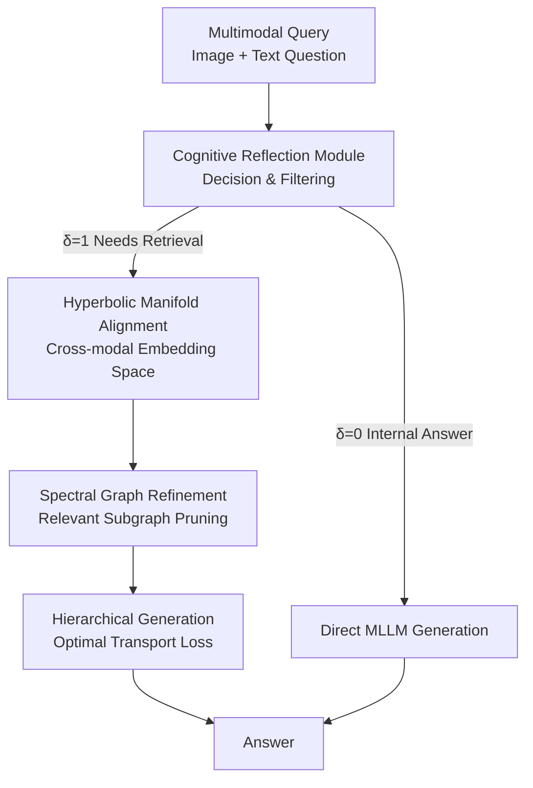

# CogniVerse: Revolutionizing Multi-Modal Retrieval-Augmented Generation with Cognitive Reflection and Geometric Reasoning

**Conference**: CVPR 2026  
**arXiv**: [2605.29602](https://arxiv.org/abs/2605.29602)  
**Code**: None (Not provided in the paper)  
**Area**: Multimodal VLM / Retrieval-Augmented Generation (MMRAG) / Graph Learning  
**Keywords**: Multimodal RAG, Adaptive Retrieval, Hyperbolic Embedding, Spectral Graph Refinement, Optimal Transport

## TL;DR
CogniVerse introduces a "brain-like reflection-retrieval-synthesis" three-step process into Multimodal RAG: first, a cognitive reflection module determines if external knowledge is needed and filters relevant content; second, image-text data and knowledge graphs are aligned in hyperbolic space with spectral-based subgraph pruning; finally, an optimal transport loss is used to generate answers that balance local accuracy and global coherence. It outperforms MuRAG/MMCoQA/GraphRAG across three MMQA datasets in accuracy, coherence, and retrieval precision while reducing latency.

## Background & Motivation
**Background**: Multimodal Retrieval-Augmented Generation (MMRAG) is the dominant paradigm for knowledge-intensive Multimodal Question Answering (MMQA). It retrieves relevant content from external knowledge bases (images, text, knowledge graphs) and combines them with Multimodal Large Language Models (MLLMs) to compensate for parametric memory limitations.

**Limitations of Prior Work**: The authors identify four specific issues: (1) **Retrieval Noise**—similarity-based embedding retrieval often fetches "keyword-overlapping but irrelevant" documents due to semantic mismatch; (2) **Cross-modal Misalignment**—visual, textual, and graph embeddings fail to align in Euclidean space, causing incoherent generation; (3) **Lack of Adaptive Reasoning**—static retrieval strategies ignore problem difficulty, resulting in redundant retrieval for simple questions (introducing noise) and insufficient retrieval for multi-hop complex problems; (4) **Generation Incoherence**—it is difficult to simultaneously maintain token-level local accuracy and global semantic consistency during generation.

**Key Challenge**: Current methods treat retrieval as a "thoughtless preprocessing step" and assume Euclidean space can capture complex cross-modal non-linear relationships. These assumptions lead to missed relevant information, retrieval of unnecessary noise, and poor alignment of retrieved content.

**Goal**: To enable MMRAG to "assess internal knowledge, selectively retrieve, and coherently synthesize" like a human, while providing mathematical guarantees for retrieval alignment and graph refinement.

**Key Insight**: The authors draw an analogy to human cognitive steps—introspection (assess), selective acquisition (retrieved), and coherent synthesis (synthesize)—supported by three mathematical tools: information geometry (hyperbolic alignment), spectral graph theory (subgraph pruning), and optimal transport (generation coherence).

**Core Idea**: Replace "static retrieval + Euclidean similarity + cross-entropy generation" with a suite of "cognitive reflection for retrieval gating + hyperbolic manifold alignment + spectral subgraph refinement + optimal transport for local-global balance."

## Method

### Overall Architecture
CogniVerse is a three-stage serial MMRAG pipeline. The input is a multimodal query $\mathcal{Q}=(\mathcal{I},\mathcal{T})$ (image + text), and the output is an answer $\mathcal{Y}$. In the first stage, the **Cognitive Reflection Module (CRM)** determines whether external knowledge is required (decision variable $\delta\in\{0,1\}$). If the model can answer internally, it proceeds directly to MLLM generation; otherwise, it triggers the second stage. The second stage, the **Multimodal Retrieval Module**, aligns multimodal data in hyperbolic space and applies spectral refinement to prune relevant subgraphs from the knowledge graph. The third stage, the **Hierarchical Generation Module**, feeds the query, relevant documents, and refined triplets into the MLLM using an optimal transport loss. Each stage is supported by mathematical tools and respective convergence theorems (Theorem 3.1 for Hyperbolic Alignment, Lemma 3.2 for Spectral Pruning, and Theorem 3.3 for OT Generation).

### Key Designs

**1. Cognitive Reflection Module (CRM): Assessing Self-Knowledge and Relevance**

To address "static retrieval and noise," CRM operates in two steps: First, it uses a pre-trained MLLM $\mathcal{M}$ to calculate the maximum likelihood confidence $\sigma(\mathcal{Q})=\max_{\mathcal{Y}}p(\mathcal{Y}\mid\mathcal{Q})$ for a query. This is compared against a learnable threshold $\theta$ to get a binary decision—if $\sigma(\mathcal{Q})>\theta$, then $\delta=0$ (internal knowledge is sufficient). Otherwise, $\delta=1$ triggers retrieval. After retrieval, a lightweight classification head $\phi$ evaluates each candidate document $\mathcal{D}_i=(\mathcal{D}_i^v,\mathcal{D}_i^t)$ for relevance $r_i=\mathrm{sigmoid}(\mathcal{M}(\mathcal{Q},\mathcal{D}_i;\phi))$, retaining only documents where $r_i>0.5$ in the set $\mathcal{D}_{\text{rel}}$. The module is trained using a contrastive loss $\mathcal{L}_{\text{CRM}}$ to distinguish positive and negative documents: $-\sum_{\mathcal{Q}}[\sum_{\mathcal{D}_i\in\mathcal{D}^+}\log r_i+\sum_{\mathcal{D}_j\in\mathcal{D}^-}\log(1-r_j)]$. This stage mimics human "introspection"—35% of queries were judged to require no retrieval in experiments, saving latency and blocking noise.

**2. Hyperbolic Manifold Alignment: Capturing Non-linear Cross-modal Relationships**

To solve "Euclidean misalignment," visual/textual/query embedding functions $\mathcal{E}^v,\mathcal{E}^t,\mathcal{E}^q$ are mapped to a Riemannian manifold $\mathcal{M}$ with a metric tensor $g$. The goal is to minimize the geodesic distance between the query and positive knowledge samples: $\mathcal{L}_{\text{geo}}=\mathbb{E}_{\mathcal{Q},\mathcal{D}^+}[d_{\mathcal{M}}(\mathcal{E}^q(\mathcal{Q}),\mathcal{E}^v(\mathcal{D}^v))+d_{\mathcal{M}}(\mathcal{E}^q(\mathcal{Q}),\mathcal{E}^t(\mathcal{D}^t))]$. For computability, $\mathcal{M}$ is approximated by a hyperbolic space $\mathbb{H}^n$ with constant negative curvature (Lorentz model), where $d_{\mathbb{H}^n}(x,y)=\mathrm{arccosh}(-\langle x,y\rangle_{\mathbb{L}})$. Hyperbolic space volume grows exponentially with radius, making it ideal for hierarchical structures and complex semantic relations compared to Euclidean cosine similarity. Theorem 3.1 argues that the loss converges to a unique global minimum under Lipschitz continuity and bounded curvature assumptions.

**3. Spectral Graph Refinement: Pruning Knowledge Graphs via Laplacian Eigenvectors**

To address "irrelevant triplets in multi-hop reasoning," given a knowledge graph $G=(V,E)$ and Laplacian matrix $L=D-A$, the model first computes query-relevance $r_i$ for each vertex. It then seeks a subset that preserves high-relevance vertices while minimizing internal "smoothness" (Laplacian quadratic form): $\min_{S\subseteq V}\sum_{(i,j)\in E,\,i,j\in S}(r_i-r_j)^2$ s.t. $\sum_{i\in S}r_i\ge\eta$. This is equivalent to a constrained Rayleigh quotient minimization $\min_x \frac{x^TLx}{x^Tx}$, solved using the eigenvectors corresponding to the smallest non-zero eigenvalues of $L$. Lemma 3.2 uses the Cheeger inequality to bound the cut size by $O(\sqrt{\lambda_2})$. Intuitively, low-frequency eigenvectors correspond to the "smoothest" partitions, allowing the model to retain core communities related to the query and prune irrelevant branches. Triplets are also encoded in $\mathbb{H}^n$.

**4. Hierarchical Generation + Optimal Transport Loss: Balancing Accuracy and Coherence**

The generation function $\mathcal{G}:(\mathcal{Q},\mathcal{D}_{\text{rel}},G')\to\mathcal{Y}$ is implemented by an MLLM. The loss is two-tiered: a local standard cross-entropy loss $\mathcal{L}_{\text{local}}=-\sum_t\log p(y_t\mid y_{<t},\cdots)$ for token accuracy, and a global 2-Wasserstein distance $\mathcal{L}_{\text{global}}=W_2(p_{\mathcal{Y}},p_{\mathcal{Y}^*})$ between generated and reference distributions in the embedding space for semantic consistency. The total loss is $\mathcal{L}_{\text{gen}}=\alpha\mathcal{L}_{\text{local}}+(1-\alpha)\mathcal{L}_{\text{global}}$ ($\alpha=0.7$). Wasserstein distance provides tolerance—if tokens differ but semantics are close, the loss remains low—making generation more coherent. **Query Dropout** is added during training: query inputs are masked with probability $p(t)=0.5\exp(-t/T)$ to force the model to rely on retrieved knowledge.

### Loss & Training
Two-phase training (Algorithm 1): Phase 1 trains the CRM (optimizing $\phi$ and decision-making); Phase 2 jointly trains retrieval and generation. If $\delta=1$, the full pipeline (retrieval+alignment+spectral refinement+generation) is updated; if $\delta=0$, only generation is updated. The total loss is $\mathcal{L}_{\text{total}}=\beta\mathcal{L}_{\text{CRM}}+\gamma\mathcal{L}_{\text{geo}}+(1-\beta-\gamma)\mathcal{L}_{\text{gen}}$. Implementation: MLLM is a fine-tuned LLaVA-13B, hyperbolic dimensions 128, optimized via Riemannian SGD. Spectral refinement uses the top 10 eigenvectors of the Wikidata graph. Trained for 20 epochs, batch 32, AdamW ($lr=10^{-4}$), with a knowledge base of 10M documents and 1M graph nodes.

## Key Experimental Results

### Main Results
Evaluation on Encyclopedic-VQA (221k), MultiModalQA (29.7k), and WebQA (41.6k). Metrics: Accuracy, Coherence (RoBERTa cosine), Retrieval Precision (RP), and Latency.

| Dataset | Metric | CogniVerse | MMCoQA (Sub-opt) | GraphRAG | MuRAG |
|--------|------|------|------|------|------|
| Encyclopedic-VQA | Accuracy(%) | **84.3** | 78.5 | 76.8 | 74.2 |
| Encyclopedic-VQA | Coherence | **0.91** | 0.85 | 0.83 | 0.82 |
| Encyclopedic-VQA | RP(%) | **78.4** | 70.1 | 68.7 | 65.3 |
| Encyclopedic-VQA | Latency(s) | 0.42 | 0.45 | 0.50 | 0.48 |
| MultiModalQA | Accuracy(%) | **82.7** | 75.9 | 73.4 | 71.6 |
| WebQA | Accuracy(%) | **79.5** | 72.6 | 70.1 | 68.4 |

CogniVerse outperforms MMCoQA by 6–7% in accuracy across datasets. It achieves a higher coherence of 0.89–0.91 and RP of 78.4%. Latency is lower (0.40–0.42s) because CRM bypasses retrieval for 35% of queries.

### Ablation Study (MultiModalQA)

| Configuration | Accuracy(%) | Coherence | RP(%) | Note |
|------|---------|------|------|------|
| CogniVerse (Full) | **82.7** | **0.90** | **76.8** | Full Model |
| w/o CRM | 76.4 | 0.84 | 68.2 | Static retrieval: Acc −6.3, RP −8.6 |
| w/o Hyperbolic | 78.9 | 0.86 | 71.5 | Acc −3.8 |
| w/ Euclidean | 77.2 | 0.85 | 70.3 | Acc −5.5, Coherence −0.05 |
| w/o Spectral Refinement | 77.8 | 0.85 | 69.7 | Acc −4.9 |
| w/ Static Graph Retrieval| 76.5 | 0.84 | 68.9 | Acc −6.2, RP −7.9 |
| w/o OT Loss | 79.3 | 0.83 | 76.8 | Coherence −0.07, Acc −3.4 |

### Key Findings
- **CRM is the Critical Component**: Removing it leads to the largest drops (Acc −6.3, RP −8.6), validating that "whether to retrieve + noise filtering" is vital for MMRAG.
- **Geometric Alignment Effectiveness**: Euclidean space dropped performance by 5.5%, proving that manifold choice significantly impacts hierarchical semantic preservation.
- **OT Loss for Coherence**: Replacing OT with cross-entropy mainly hurts coherence (−0.07), confirming its role in ensuring global semantic consistency.
- **Robustness and Generalization**: With 20% noise docs, WebQA accuracy only dropped from 82.7 to 80.1 (vs. MMCoQA dropping to 68.3). Zero-shot cross-dataset performance (74.2%) also beat baselines.

## Highlights & Insights
- **"Whether to retrieve" as a Learnable Decision**: CRM uses confidence gating to skip retrieval for 35% of samples, demonstrating an adaptive RAG approach that saves latency and reduces noise.
- **Hyperbolic Space for Multimodal Hierarchy**: Using $\mathbb{H}^n$ instead of Euclidean space aligns with the intuition that knowledge is naturally hierarchical.
- **Spectral Theory for Subgraph Pruning**: Formulating retrieval as Laplacian quadratic form minimization allows for a theoretically grounded (Cheeger bound) pruning of entities.
- **Local/Global Dual Optimization**: Combining Cross-Entropy and Wasserstein loss addresses both token accuracy and distributional coherence.

## Limitations & Future Work
- **Theoretical Assumptions**: Convergence theorems rely on strong assumptions (Lipschitz continuity, bounded curvature) that may not fully hold in practice.
- **No Open Source**: The code is not available, and training on 10M docs/1M graph nodes with 8×A100 presents high reproduction barriers.
- **CRM Single Scalar Threshold**: Using $\sigma$ as the sole criterion risks overconfidence where the model produces "hallucinations" with high certainty.
- **Spectral Scalability**: Repeatedly calculating Laplacian eigenvectors for massive graphs is costly. While top-10 eigenvectors were used, further discussion on real-time decomposition overhead is needed.
- **Future Directions**: CRM could use calibration for more reliable confidence; spectral refinement could be optimized via incremental solvers; OT loss could utilize Sinkhorn approximations.

## Related Work & Insights
- **vs MuRAG / MMCoQA**: These use Euclidean embeddings and static retrieval; CogniVerse introduces hyperbolic alignment and CRM gating, leading to higher performance and lower latency.
- **vs GraphRAG**: GraphRAG uses static multi-hop retrieval, whereas CogniVerse dynamically prunes subgraphs using spectral theory, providing a 6.2% accuracy advantage.
- **vs CLIP/BLIP-2**: Retrieval-free baselines lag significantly (55–69%), confirming that external retrieval is necessary for knowledge-intensive MMQA.

## Rating
- Novelty: ⭐⭐⭐⭐ Systematically integrates information geometry, spectral theory, and optimal transport into MMRAG.
- Experimental Thoroughness: ⭐⭐⭐⭐ Comprehensive coverage of datasets, ablations, and robustness, though lacks various MLLM backbone verifications.
- Writing Quality: ⭐⭐⭐ Formulas and theorems are complete, though the title is slightly hyperbolic and some theoretical proofs are condensed.
- Value: ⭐⭐⭐⭐ The combination of adaptive retrieval and geometric alignment offers a practical reference for MMRAG deployment.

<!-- RELATED:START -->

## Related Papers

- [\[CVPR 2026\] Socratic-Geo: Synthetic Data Generation and Cross-Modal Geometric Reasoning via Multi-Agent Interaction](socratic-geo_synthetic_data_generation_and_cross-modal_geometric_reasoning_via_m.md)
- [\[CVPR 2026\] R4: Retrieval-Augmented Reasoning for Vision-Language Models in 4D Spatio-Temporal Space](r4_retrieval-augmented_reasoning_for_vision-language_models_in_4d_spatio-tempora.md)
- [\[CVPR 2026\] Wan-Weaver: Interleaved Multi-modal Generation via Decoupled Training](wan-weaver_interleaved_multi-modal_generation_via_decoupled_training.md)
- [\[CVPR 2026\] Hierarchical Attacks for Multi-Modal Multi-Agent Reasoning](hierarchical_attacks_for_multi-modal_multi-agent_reasoning.md)
- [\[CVPR 2026\] LASAR: Towards Spatio-temporal Reasoning with Latent Cognitive Map](lasar_towards_spatio-temporal_reasoning_with_latent_cognitive_map.md)

<!-- RELATED:END -->
