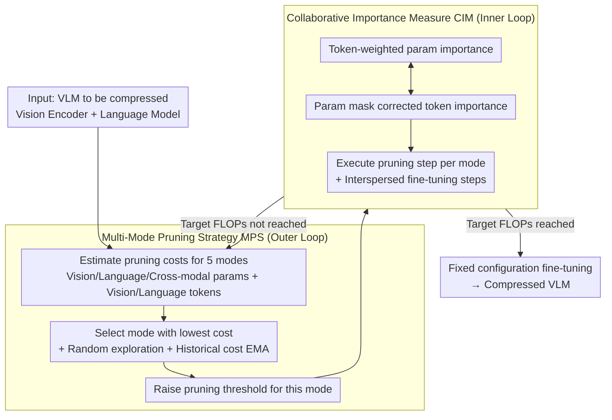

# CoMP: Collaborative Multi-Mode Pruning for Vision-Language Models

**Conference**: CVPR 2026  
**arXiv**: [2604.02956](https://arxiv.org/abs/2604.02956)  
**Code**: [https://github.com/Wuzimeng/CoMP.git](https://github.com/Wuzimeng/CoMP.git)  
**Area**: Multimodal VLM  
**Keywords**: Model Pruning, Vision-Language Models, Parameter Pruning, Token Pruning, Collaborative Compression

## TL;DR

CoMP proposes a collaborative multi-mode pruning framework that eliminates the inconsistency between parameter and token pruning metrics through Collaborative Importance Measure (CIM) and adaptively selects the optimal pruning mode for each stage through Multi-Mode Pruning Strategy (MPS), significantly outperforming single-mode and simple joint pruning schemes at high pruning ratios.

## Background & Motivation

VLMs based on the Transformer architecture have a computational complexity of $O(N^2D + ND^2)$, where $N$ is the sequence length and $D$ is the feature dimension. Parameter pruning reduces $D$ while token pruning reduces $N$, making them complementary.

**Two core challenges**: (1) **Inconsistent importance measurement**—the calculation of parameter importance depends on all tokens, but token pruning removes some tokens, leading to parameter importance being dominated by unimportant tokens. Conversely, token importance depends on all parameters, but parameter pruning removes some parameters, leading to distorted token importance. (2) **Fixed application of pruning modes**—in progressive pruning, each stage typically prunes parameters and tokens in the same fixed order, but the optimal pruning mode varies across different stages.

## Method

### Overall Architecture

CoMP addresses the conflict between the two sets of importance metrics when performing parameter and token pruning simultaneously on the same VLM. It organizes pruning into a nested loop: the outer loop periodically determines what to prune in the current stage through the Multi-Mode Pruning Strategy (MPS)—selecting one from five modes: vision parameters, language parameters, cross-modal parameters, vision tokens, and language tokens; the inner loop calculates the respective importance scores for parameters and tokens via the Collaborative Importance Measure (CIM) and executes a single pruning step according to the mode selected by the outer loop. The two loops alternate: each mode switch is interspersed with several training steps to progressively approach the target FLOPs; once the target is reached, the pruning configuration is fixed, followed by fine-tuning to recover performance—thus, CoMP is not a training-free method but integrates pruning into the fine-tuning process.

### Key Designs

**1. Collaborative Importance Measure (CIM): Preventing importance metrics from contaminating each other**

Parameter and token pruning are mature individually, but interfere when combined. Parameter importance is accumulated across all tokens; once a batch of tokens is pruned, this accumulation is dominated by tokens that should not have participated, leading to distorted parameter importance. Conversely, token importance depends on all parameters; if parameters are pruned, the token ranking also shifts. Empirical tests with CoMP show that the tokens contributing most to parameter importance overlap by less than 30% with the top-ranked tokens for token importance, indicating the two metrics are largely inconsistent. CIM's approach is to have both sides "inform" each other: when calculating parameter importance, a token-weighted input norm is introduced where input is weighted by the current importance of the token, reducing the contribution of unimportant tokens. When calculating token importance, the parameter side's pruning mask is passed into the attention weight matrix, so pruned parameters no longer affect token ranking. Both metrics are calculated based on the "post-pruning true state" of the other side, eliminating mutual contamination at the source.

**2. Multi-Mode Pruning Strategy (MPS): Dynamically selecting the most efficient pruning mode at each stage to compress vision and language according to their respective redundancy**

A common practice in progressive pruning is to prune parameters and then tokens in a fixed order at each stage. However, the optimal mode changes over time—early in the process, model redundancy is high and primarily concentrated in tokens, making token pruning low-cost. In later stages, parameter and token redundancy become comparable, and mutual interference intensifies, causing the optimal mode to shift. Fixed sequences fail to adapt. MPS divides pruning into multiple stages and subdivides options into five modes: vision parameters, language parameters, cross-modal parameters, vision tokens, and language tokens. Each stage estimates a "pruning cost" $r$ for these five modes—the accuracy loss per unit of FLOPs reduction on the validation set—and executes the mode with the lowest cost. To avoid being misled by step-wise noise, an Exponential Moving Average (EMA) of costs is maintained for each mode to integrate historical information, and random exploration is performed with probability $\rho$ (using weighted softmax sampling based on the interval since the last execution) to avoid getting trapped in local optima by greedily selecting the same mode.

Breaking down modes by modality is the key benefit here: since the five modes are modality-specific, MPS's cost comparison naturally allows vision and language to be compressed at different rates—whichever is currently "cheaper" to prune is pruned more. This leads to a non-uniform but superior compression ratio without requiring manual specification of pruning rates for each modality. This scheduling logic of "estimate cost—select optimal—with exploration" essentially applies the Multi-Armed Bandit concept to pruning scheduling.

### Loss & Training

CoMP embeds pruning into the fine-tuning process rather than being training-free. Training steps are interspersed between mode switches. Pruning thresholds are raised progressively, importance scores are accumulated, and masks are smoothly decayed (following the UPop approach) until the model reaches target FLOPs. After that, the pruning configuration is fixed, and the compressed model undergoes a final round of fine-tuning for recovery. The "pruning cost" used by MPS is estimated directly from the precision change per unit FLOPs on the validation set.

## Key Experimental Results

### Main Results

| Method | NLVR2 (50% Pruning) | NLVR2 (70% Pruning) | VQA | Image-Text Retrieval |
|------|----------------|----------------|-----|---------|
| Parameter pruning only | Moderate | Poor | Moderate | Moderate |
| Token pruning only | Moderate | Poor | Moderate | Moderate |
| Simple Joint | Moderate | Poor | Moderate | Moderate |
| **CoMP** | **Best** | **Significantly Better** | **Best** | **Best** |

The advantage is particularly significant at high pruning ratios (70%+).

### Ablation Study

| Configuration | High Pruning Ratio Performance | Description |
|------|--------------|------|
| w/o CIM (Independent measures) | Significant drop | Inconsistent measures lead to incorrect pruning |
| w/o MPS (Fixed mode) | Drop | Non-optimal mode sequence |
| w/o Random exploration | Slight drop | Trapped in local optima |
| Full CoMP | Best | All components are necessary |

### Key Findings

- The contribution of CIM is more pronounced at high pruning ratios—the impact of metric inconsistency is smaller at low pruning ratios.
- MPS adaptive mode selection avoids manual hyperparameter tuning—the optimal strategy varies across tasks and models.
- The optimal pruning ratios for vision and language components are indeed different; uniform pruning is suboptimal.

## Highlights & Insights

- **Discovery of Metric Inconsistency**: The interference between parameter and token importance measures was previously overlooked; the collaborative design of CIM elegantly solves this.
- **Adaptive Mode Selection**: Borrows ideas from Multi-Armed Bandits (cost estimation + exploration) to achieve automated strategy selection in pruning.
- **High Pruning Ratio Advantage**: The greatest advantage is observed in high compression rate scenarios most needed for actual deployment.

## Limitations & Future Work

- Mode selection in MPS increases the computational overhead of the pruning process.
- Currently only validated on the BLIP family; applicability to architectures like LLaVA needs further testing.
- The dynamic nature of token pruning at inference requires specialized inference optimization.
- Future work could explore joint compression with quantization.

## Related Work & Insights

- **vs UPop/EViT**: Single-mode pruning methods; performance drops sharply at high compression rates.
- **vs Simple Joint Pruning**: Does not handle metric inconsistency; results are inferior to individual single-mode pruning.
- **vs DepGraph/PLATON**: Dedicated parameter pruning methods; lack compression in the token dimension.

## Rating

- Novelty: ⭐⭐⭐⭐ The discovery of the metric inconsistency problem and the CIM design are innovative.
- Experimental Thoroughness: ⭐⭐⭐⭐ Comprehensive testing across multiple tasks and pruning ratios.
- Writing Quality: ⭐⭐⭐⭐ Clear problem analysis and intuitive illustrations.
- Value: ⭐⭐⭐⭐ Direct practical value for VLM deployment.

<!-- RELATED:START -->

## Related Papers

- [\[ICCV 2025\] METEOR: Multi-Encoder Collaborative Token Pruning for Efficient Vision Language Models](../../ICCV2025/multimodal_vlm/meteor_multi-encoder_collaborative_token_pruning_for_efficient_vision_language_m.md)
- [\[CVPR 2026\] Mostly Text, Smart Visuals: Asymmetric Text-Visual Pruning for Large Vision-Language Models](mostly_text_smart_visuals_asymmetric_text-visual_pruning_for_large_vision-langua.md)
- [\[CVPR 2026\] VisPlay: Self-Evolving Vision-Language Models](visplay_self-evolving_vision-language_models.md)
- [\[CVPR 2026\] TransPrune: Token Transition Pruning for Efficient Large Vision-Language Model](transprune_token_transition_pruning_for_efficient_large_vision-language_model.md)
- [\[CVPR 2026\] VisMem: Latent Vision Memory Unlocks Potential of Vision-Language Models](vismem_latent_vision_memory_unlocks_potential_of_vision-language_models.md)

<!-- RELATED:END -->
