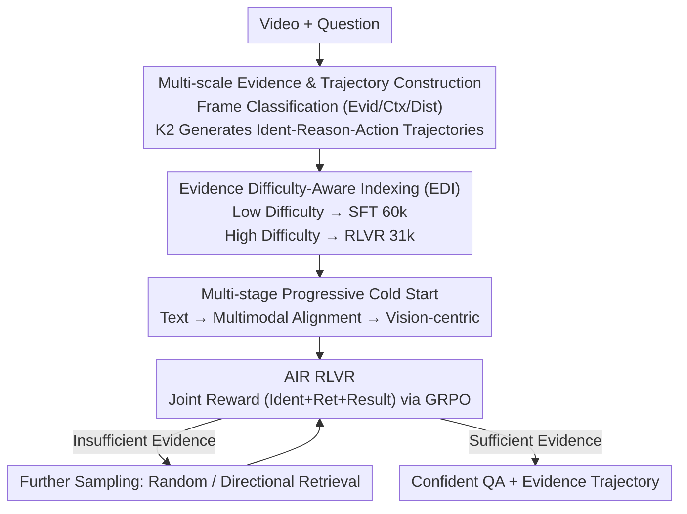

# Conan: Progressive Learning to Reason Like a Detective over Multi-Scale Visual Evidence

**Conference**: CVPR 2026  
**Paper**: [CVF Open Access](https://openaccess.thecvf.com/content/CVPR2026/html/Ouyang_Conan_Progressive_Learning_to_Reason_Like_a_Detective_over_Multi-Scale_CVPR_2026_paper.html)  
**Code**: https://github.com/OuyangKun10/Conan  
**Area**: Multimodal VLM / Video Reasoning  
**Keywords**: Video Reasoning, Evidence Localization, RLVR, Frame Retrieval, Multi-step Reasoning

## TL;DR
Conan enables a 7B video multimodal large model to work like a detective: first classifying frames into evidence/context/distractor, then reasoning while deciding whether "evidence is sufficient to answer or more frames need to be retrieved." Developed via the self-constructed Conan-91k dataset, a three-stage cold start, and AIR RLVR with joint rewards, it achieves a 10.5% average improvement over the Qwen2.5-VL-7B base across six multi-step reasoning benchmarks, outperforming GPT-4o on most leaderboards.

## Background & Motivation
**Background**: Video reasoning requires accumulating visual information across frames and performing multi-step logical deduction to reach grounded conclusions. Inspired by the success of RLVR (Reinforcement Learning from Verifiable Rewards) in LLM reasoning, recent works have migrated this paradigm to the video domain via two routes: pure text CoT (e.g., Video-R1) and Video-CoT incorporating frame retrieval (e.g., Video-MTR, Rewatch-R1).

**Limitations of Prior Work**: The pure text CoT route fails to "anchor" reasoning to actual visual evidence, often resulting in hallucinated chains based on linguistic priors where conclusions seem plausible but mismatch video content. Although retrieval routes introduce visual evidence, they suffer from **poor evidence localization**—retrieved frames are weakly correlated with the question, leading to unreliable reasoning paths. Furthermore, some methods are trained on benchmark-specific training sets (e.g., Video-Holmes, LongVideoReason), making it difficult to distinguish genuine reasoning improvements from in-domain overfitting.

**Key Challenge**: To perform reliable multi-step video reasoning, "where to find evidence (localization)" and "how to reason given evidence (deduction)" must be synergistic. Reasoning without retrieval leads to hallucinations, while retrieval without judging sufficiency leads to chaotic sampling. Existing methods decouple these tasks.

**Goal**: To equip MLLMs with multi-scale, evidence-anchored multi-step reasoning capabilities. This involves two sub-problems: ① how to automatically construct high-quality reasoning data containing "evidence localization + multi-step deduction + confident decision-making"; ② how to design a training curriculum that progressively teaches the model to reason across multi-scale evidence.

**Key Insight**: Analogizing the reasoning process to a detective solving a case—identifying relevant frames across scales (context vs. evidence), linking clues across frames to form a coherent deduction chain, and adaptively deciding whether to "conclude" or "investigate further."

**Core Idea**: Replacing unidirectional text CoT or blind retrieval with a cyclic "Identification-Reasoning-Action" paradigm, jointly optimizing localization and deduction within a single trajectory.

## Method

### Overall Architecture
Conan takes a "video + question" as input and outputs an answer with an evidence trajectory. Its core is a **cyclic three-step reasoning trajectory**: each round performs frame identification (classifying frames as evidence/context/distractor), followed by evidence reasoning (analyzing the problem based on accumulated clues), and finally action decision—choosing between **randomly sampling new frames** (if no evidence exists), **directional retrieval of frames near evidence segments** (if partial evidence is insufficient), or **confident answering** to terminate the loop.

The learning process is split into data construction and training: first, a strong LLM (Kimi K2) automatically expands GenS-Video-150K into 91,000 detective-style reasoning trajectories (Conan-91k), stratified by evidence difficulty. This is followed by two curriculum stages: multi-stage progressive cold start (SFT) to activate reasoning from text-only to vision-centric, and AIR RLVR using joint rewards via GRPO to refine identification, retrieval, and results simultaneously.

### Key Designs

**1. Multi-scale Evidence & Detective Reasoning Trajectory Construction**

Addressing the lack of visual anchors or coarse localization in existing data, Conan first utilizes frame-level relevance scores from GenS-Video-150K to classify frames into: **evidence frames** (directly sufficient for answering), **context frames** (providing auxiliary clues), and **distractor frames** (irrelevant). This multi-scale classification forms the foundation. An automated pipeline then leverages Kimi K2 to generate interleaved video-text reasoning trajectories. For each round, 16 frames are sampled; actions are decided based on evidence proportions—Random Frames Sampling if only distractors exist, Specific Frames Retrieval if context/evidence is present but below a dynamic threshold, or Confident Question Answering if evidence is sufficient. K2 generates coherent text that analyzes the QA and justifies actions based on frame descriptions and timestamps.

**2. Evidence Difficulty-Aware Indexing (EDI): Curriculum from "Easy" to "Hard"**

To quantify reasoning difficulty, the authors define the **Evidence Difficulty Index (EDI)**. Given the evidence ratio $P = m/N$ (where $m$ is the count of evidence frames and $N$ is total frames) and the temporal variance of evidence frames $\mathrm{Var} = \frac{1}{m}\sum_{i=1}^{m}(x_i - \bar{x})^2$:

$$\mathrm{EDI} = (1 - P)\cdot \mathrm{Var}.$$

A higher EDI indicates sparser, more temporally dispersed evidence requiring harder multi-hop reasoning. Samples are stratified: 60k low-EDI samples (up to 3 rounds) are assigned to the SFT stage to build fundamentals, while 31k high-EDI samples are assigned to the RLVR stage for high-difficulty multi-hop optimization.

**3. Multi-stage Progressive Cold Start + AIR RLVR**

The **Multi-stage Progressive Cold Start** (SFT on Conan-CoT-60k) consists of three steps: ① Textual Reasoning—using 10k low-EDI single-round samples with text descriptions only to build temporal/causal logic; ② Multimodal Alignment—using 25k 1-round + 10k 2-round samples, inserting visual frames alongside text; ③ Vision-centric Reasoning—using the full 60k set to force deep multi-step reasoning directly on visual frames.

The **AIR RLVR** stage (on Conan-RLVR-31k) refines the trajectory using reward shaping: Format reward $R_{fmt}$, Result reward $R_o$ (accuracy for MCQ, ROUGE for open-ended), and process rewards including Identification reward $R_{ide}$ (accuracy of classifying evidence/context) and Retrieval reward $R_{ret}$ (proportion of evidence/context in retrieved frames). The joint reward is:

$$R_J = \begin{cases} R_{fmt} + R_o + R_{ide} + R_{ret}, & R_o > 0,\\ R_{fmt} + R_o, & \text{otherwise}. \end{cases}$$

Process rewards are only unlocked if the answer is correct ($R_o > 0$), preventing the model from gaming format or retrieval rewards.

### Main Results

| Model | #Params | MMR-V | Video-Holmes | VRBench | VCRBench | Human-P&C | LVR | Avg. VR | Avg. LU |
|------|---------|-------|--------------|---------|----------|-----------|-----|---------|---------|
| GPT-4o | - | 44.0 | 42.0 | 76.7 | 54.0 | 48.4 | 63.1 | 54.7 | - |
| Qwen2.5-VL-72B | 72B | 39.1 | 40.2 | 72.7 | 50.8 | 55.7 | 72.3 | 55.1 | 53.4 |
| Qwen2.5-VL-7B (Base) | 7B | 30.1 | 28.5 | 66.4 | 46.5 | 48.2 | 61.8 | 46.9 | 48.0 |
| Video-R1 (Text CoT) | 7B | 36.3 | 36.5 | 69.5 | 48.0 | 49.8 | 70.3 | 51.7 | 53.8 |
| Video-MTR (Video CoT) | 7B | 36.5 | 35.7 | 69.7 | 48.1 | 47.2 | 57.3 | 49.1 | 53.5 |
| **Ours (Conan)** | 7B | **42.7** | **44.6** | **81.0** | **51.0** | **52.3** | **72.8** | **57.4** | **54.9** |

### Ablation Study
| Configuration | Overall | Note |
|------|---------|------|
| **Ours (Full)** | **57.4** | Full Model |
| w/o multi-scale evidence | 53.8 | Context treated as distractor |
| w/o difficulty sampling | 55.2 | Replaced with random sampling |
| w/o cold-start | 51.0 | Directly to RLVR (highest drop) |
| w/o identification reward | 53.8 | No $R_{ide}$ |
| w/o retrieval reward | 54.0 | No $R_{ret}$ |

### Key Findings
- **Cold start is the primary driver**: Removing cold start drops performance to 51.0 (-6.4), with the vision-centric stage being the most critical.
- **Process rewards are essential**: Removing identification or retrieval rewards leads to significant drops, confirming their role in refining localization and retrieval efficiency.
- **Conan as a superior retriever**: When used as a frame retriever for other models, Conan's retrieved frames result in the highest downstream accuracy.

## Highlights & Insights
- **Learning "When to Retrieve"**: Framing the decision to retrieve as a learnable action (Random, Specific, or QA) allows the model to judge evidence sufficiency rather than using fixed-K retrieval.
- **Formalized Difficulty**: The EDI metric $(1-P)\cdot \mathrm{Var}$ provides a concise way to quantify multi-hop complexity based on evidence sparsity and distribution.
- **Gated Process Rewards**: The "correctness-gated" reward ($R_o > 0$ for process credit) effectively prevents reward hacking.

## Limitations & Future Work
- **Static Retrieval**: The model currently retrieves existing frames; future work could explore "chain-of-frame" reasoning where frames are dynamically generated.
- **Teacher Dependency**: The quality of Conan-91k is bounded by Kimi K2 and the quality of the source GenS relevance scores.
- **Evaluation Budget**: Fixed round limits (3) and frame counts (16/32) may limit performance on extremely long videos requiring more exploration.

## Rating
- Novelty: ⭐⭐⭐⭐ 
- Experimental Thoroughness: ⭐⭐⭐⭐⭐ 
- Writing Quality: ⭐⭐⭐⭐ 
- Value: ⭐⭐⭐⭐

## Related Papers

- [\[CVPR 2026\] Select Less, Reason More: Prioritizing Evidence Purity for Video Reasoning](select_less_reason_more_prioritizing_evidence_purity_for_video_reasoning.md)
- [\[CVPR 2026\] Perceptual-Evidence Anchored Reinforced Learning for Multimodal Reasoning](perceptual-evidence_anchored_reinforced_learning_for_multimodal_reasoning.md)
- [\[CVPR 2026\] DocSeeker: Structured Visual Reasoning with Evidence Grounding for Long Document Understanding](docseeker_long_document_understanding.md)
- [\[CVPR 2026\] PACT: Phase-Like Transition Constraints in Adapter-Based Continual Learning of Vision-Language Models](pact_phase-like_transition_constraints_in_adapter-based_continual_learning_of_vi.md)
- [\[CVPR 2026\] A More Word-like Image Tokenization for MLLMs](a_more_word-like_image_tokenization_for_mllms.md)

<!-- RELATED:END -->

<!-- RELATED:START -->

## Related Papers

- [\[CVPR 2026\] Perceptual-Evidence Anchored Reinforced Learning for Multimodal Reasoning](perceptual-evidence_anchored_reinforced_learning_for_multimodal_reasoning.md)
- [\[CVPR 2026\] GUI-SAGE: Enhancing GUI Automation with Self-Explanatory Learning](gui-sage_enhancing_gui_automation_with_self-explanatory_learning.md)
- [\[CVPR 2026\] Select Less, Reason More: Prioritizing Evidence Purity for Video Reasoning](select_less_reason_more_prioritizing_evidence_purity_for_video_reasoning.md)
- [\[CVPR 2026\] CLIP-like Model as a Foundational Density Ratio Estimator](clip-like_model_as_a_foundational_density_ratio_estimator.md)
- [\[CVPR 2026\] CoVR-R: Reason-Aware Composed Video Retrieval](covr-rreason-aware_composed_video_retrieval.md)

<!-- RELATED:END -->
