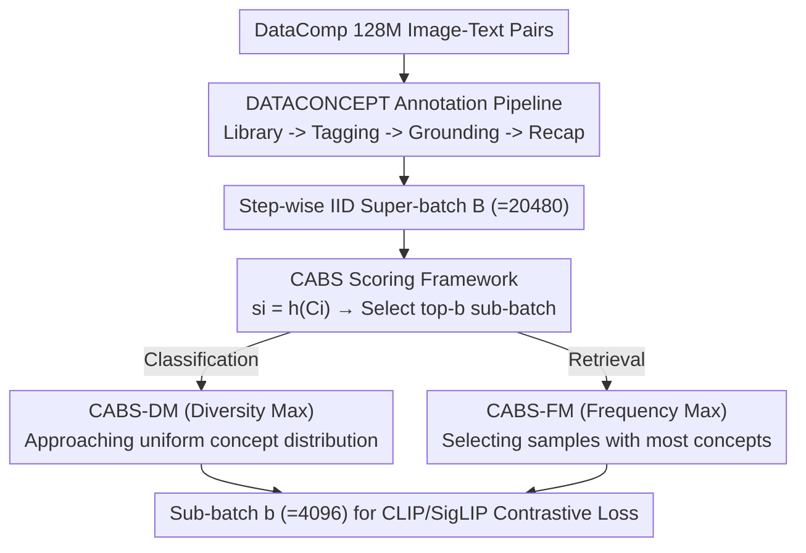

# Concept-Aware Batch Sampling Improves Language-Image Pretraining

**Conference**: CVPR 2026  
**Paper**: [CVF Open Access](https://openaccess.thecvf.com/content/CVPR2026/html/Ghosh_Concept-Aware_Batch_Sampling_Improves_Language-Image_Pretraining_CVPR_2026_paper.html)  
**Code**: https://cabs-vlp.github.io  
**Area**: Multi-modal VLM  
**Keywords**: Vision-Language Pretraining, Data Curation, Online Batch Sampling, Concept Distribution, CLIP/SigLIP  

## TL;DR
This paper transforms "data curation" from offline, sample-level, concept-agnostic filtering into online, batch-level, concept-aware sampling. The authors first annotate 128 million image-text pairs with fine-grained concepts (DATACONCEPT), then utilize a pluggable scoring function, CABS, to select sub-batches from a super-batch during training that match target concept distributions—using "Diversity Maximization" for classification and "Frequency Maximization" for retrieval. This achieves a 7% gain in classification and a 9.1% gain in retrieval across 28 benchmarks.

## Background & Motivation
**Background**: The generalization capability of vision-language models like CLIP/SigLIP stems from web-scale image-text pair pretraining. To improve quality, the dominant approach is data curation: filtering out low-quality samples using metrics like CLIP scores or rewriting captions to be more descriptive using LLMs. DataComp has standardized these curation schemes into a benchmark.

**Limitations of Prior Work**: Existing curation methods share three common issues. First, they are **offline**—producing a static subset based on preset rules; once data is discarded, it is difficult to reuse for other tasks, accelerating "data wall" issues. Second, they are **sample-level**—judging quality only at the single-sample granularity while ignoring the **concept-level** distribution of the entire dataset (e.g., which objects are frequent or rare). Third, they are **concept-agnostic / black-box**—relying on SOTA black-box models as filters, which is non-transparent and propagates the model's own biases into the curated dataset.

**Key Challenge**: The fundamental issue is that "quality" lacks a universal definition—the desired concept distributions for classification tasks and retrieval tasks are fundamentally different. The authors demonstrate that ImageNet (classification) images are mostly single-object, whereas MSCOCO (retrieval) naturally consists of complex scenes with multiple objects. An offline, fixed subset cannot be optimal for both task types simultaneously.

**Goal**: To dynamically shape the concept distribution of each batch during training according to downstream task requirements without pre-discarding any data, ensuring this mechanism is reproducible, controllable, and open-source.

**Key Insight**: Explicitly label concept information into the data and formulate batch construction as a parameterizable problem of "selecting top-k based on target concept distribution scores." Changing the scoring function allows for changing the objective without re-processing the dataset.

**Core Idea**: Replace "offline, concept-agnostic sample filtering" with "online, concept-aware batch sampling," allowing the same data pool with concept annotations to adapt to different downstream tasks by switching the scoring function.

## Method

### Overall Architecture
The method consists of two layers. The **Data Layer** upgrades the 128M DataComp image-text pairs into DATACONCEPT: each sample is appended with detected concept labels, bounding boxes, per-concept confidence scores, and a concept-aware synthetic caption. The **Training Layer** is CABS (Concept-Aware Batch Sampling): at each step, a **super-batch of size $B$** is sampled IID from the data pool. A concept-aware scoring function $h$ scores each sample, and the top-$b$ samples are selected to form the actual **sub-batch** fed into the contrastive loss ($b=(1-f)B$, where $f$ is the filtering ratio). Different $h$ functions result in different sampling strategies: CABS-DM (Diversity Maximization) for classification and CABS-FM (Frequency Maximization) for retrieval. Concept annotations are used only for sample selection and do not enter the contrastive loss itself.

### Key Designs

**1. DATACONCEPT: Explicit Concept Annotations for Distribution Control**

To select samples by concept distribution during training, the concepts contained in each sample must be known. The authors built a four-step annotation pipeline. First, **Concept Library Construction**: Expanding existing concepts to 19,261 by aggregating, de-duplicating, and safety-filtering labels from RAM++, V3Det, and OpenImages. Second, **Concept Tagging**: Using the RAM++ image tagging model to assign concept labels. Third, **Concept Grounding**: Since RAM++ provides only labels, GroundingDINO is used to provide bounding boxes. This includes **Confidence Seeding** (using only RAM++ labels with confidence $\ge 0.75$ as prompts) and **Multi-resolution Ensemble** (fusing predictions from resolutions {384, 512, 800, 1000} via Weighted Box Fusion to reduce hallucinations). The grounded vocabulary converges to 12,253 concepts ($\mathcal{V}$), with each sample $i$ getting a concept set $C_i$. Fourth, **Concept-Aware Recaptioning**: Using Qwen2-VL-7B to generate cleaner, concept-aligned synthetic captions $R_i$ based on $C_i$ and the original alt-text $T_i$.

The value of this step is transforming the "concept distribution" from implicit metadata into readable, computable metadata for every sample.

**2. CABS: Pluggable Framework for Batch Sampling**

This is the core mechanism. Given a super-batch $B$ sampled IID, the target sub-batch size is $b=(1-f)B$, where $f \in [0,1)$ is the filtering ratio (default $f=0.8$, $B=20480$, $b=4096$). For each sample $i$ with annotation $C_i$, CABS computes:

$$s_i = h(C_i; B, \theta_h),$$

where $h(\cdot)$ is a concept-aware heuristic gain function and $\theta_h$ represents strategy-specific parameters. The sub-batch is formed by $B_{sub}=\mathrm{TopK}_{i\in B}(s_i, k=b)$. This framework includes IID sampling as a special case by setting $h(i)=1$. This allows practitioners to induce different batch distributions in real-time without modifying the offline dataset.

**3. CABS-DM: Diversity Maximization for Long-tail Classification**

Targeting classification tasks where common concepts are over-represented in IID batches, CABS-DM aims for a uniform concept frequency. It sets a target cap $t_c$ (as $\theta_h$) for each concept $c$ and uses an iterative scoring function:

$$h_{DM}(i) = \frac{1}{|C_i|}\sum_{c\in C_i}\left(\frac{t_c-n_c}{t_c}+\frac{1}{F_c}\right),\quad \text{if } n_c<t_c;\quad 0,\ \text{if } n_c\ge t_c,$$

where $n_c$ is the current count of concept $c$ in the sub-batch and $F_c$ is the global frequency of $c$. The **balance gain** $(t_c-n_c)/t_c$ prioritizes unfilled concepts, while the **rare reward** $1/F_c$ promotes long-tail concepts. This deterministic greedy algorithm selects $i^\star=\arg\max_i h_{DM}(i)$ and updates $n_c$ iteratively.

**4. CABS-FM: Frequency Maximization for Multi-object Retrieval**

Retrieval benchmarks (MSCOCO, Flickr) require understanding multi-object compositions. CABS-FM uses a simple gain function: $h_{FM}(i)=|C_i|$, selecting samples with the highest concept multiplicity to provide denser scenes for compositional generalization.

### Loss & Training
The objective remains the standard CLIP/SigLIP contrastive loss. Annotations are used only for selection. Training follows DataComp hyperparameters (batch size 4096) for fair comparison. The main experiments use a budget of "128M samples seen." With $f=0.8$, the effective epoch size is 1/5th of IID, putting CABS in a data-constrained/repetition setting.

## Key Experimental Results

### Main Results: Significant Gains for CABS-DM (Clf) and CABS-FM (Ret)

| Task/Model | Config | IID | Ours | Gain |
|--------|------|------|------|------|
| Clf ImageNet-Val · ViT-B-32-CLIP (alt) | CABS-DM | 15.2 | 18.6 | +3.4 |
| Clf Avg(Clf) · ViT-B-32-CLIP (recap) | CABS-DM | 33.0 | 35.5 | +2.5 |
| Clf ImageNet-Val · ViT-B-16-SigLIP (recap) | CABS-DM | 27.4 | 32.3 | +4.9 |
| Ret Avg(Ret) · ViT-B-32-CLIP (alt) | CABS-FM | 12.9 | 16.4 | +3.5 |
| Ret Avg(Ret) · ViT-B-32-CLIP (recap) | CABS-FM | 32.6 | 41.6 | +9.0 |
| Ret Flickr · ViT-B-16-SigLIP (recap) | CABS-FM | 57.0 | 63.5 | +6.5 |

The reported "7% classification gain and 9.1% retrieval gain" represent the maximum increases across configurations. Notably, concept-aware recaptioning alone provides a massive boost (+11.6% on SigLIP ImageNet), with CABS providing further improvements.

### Ablation Study: Comparison with SOTA Curation (ViT-B-32-CLIP)

| Method | Type | Avg(Clf) | IN-Val | Let-It-Wag! |
|------|------|------|------|------|
| IID | Baseline | 28.2 | 15.2 | 5.1 |
| MetaCLIP | Offline Concept Balance | 26.9 | 16.9 | 5.3 |
| GRIT-VLP | Online Hard Negative | 27.5 | 15.0 | 6.3 |
| MAFA | Online Hard Negative | 27.9 | 15.0 | 5.6 |
| **CABS-DM** | Online Concept Balance | **30.7** | **18.6** | **7.5** |

CABS-DM outperforms the offline MetaCLIP by +2.9 (Avg-Clf) and +3.8 (IN-Val). Online hard-negative methods like GRIT-VLP and MAFA struggle to beat the IID baseline on CLIP.

### Key Findings
- **Compatibility with CLIPScore Filtering**: Applying CABS on the top-30% CLIP score data ($f=0.5$) still yields significant gains over IID, despite higher repetition.
- **Longer Training (1.28B Samples)**: CABS acts as a **3.2x (DM) / 2x (FM) compute multiplier** while IID is compute-constrained. The gain persists even when deep into the data-constrained regime.
- **Synergy**: The greatest contribution comes from the combination of concept-aware recaptioning and task-adaptive sampling.

## Highlights & Insights
- **Unified Framework**: Re-framing curation as "Super-batch -> Score -> Top-k" makes IID a special case ($h=1$) and allows task-specific distributions with a single line of code.
- **Task-Adaptive Distribution**: Demonstrating that classification needs "uniformity" (DM) while retrieval needs "density" (FM) confirms that data quality is task-dependent.
- **Reuse > Filtering**: Treating concept annotation as an amortized investment allows the same data pool to be reused for different tasks, mitigating the "data wall."
- **Engineering Cleverness**: The rare reward $1/F_c$ in DM ensures long-tail coverage while improving efficiency by selecting rare concepts early in the greedy process.

## Limitations & Future Work
- **Annotation Cost**: The pipeline (RAM++, GroundingDINO, Qwen2-VL) is computationally expensive, though the authors argue it is amortized over multiple training runs.
- **Runtime Overhead**: Greedy selection adds overhead as the filtering ratio $f$ increases.
- **Scale Limits**: Experiments were conducted up to ViT-B and 1.28B samples; performance at true SOTA scales is unverified.
- **Fixed Scoring**: The function $h$ is constant throughout training. Future work could explore curriculum schedules or unified functions for joint classification-retrieval optimization.

## Related Work & Insights
- **vs. MetaCLIP (Offline)**: Similar goals but MetaCLIP uses offline substring matching and static caps. CABS is online, greedy, and doesn't discard data, significantly outperforming MetaCLIP.
- **vs. GRIT-VLP / MAFA (Online Hard Negative)**: These focus on "sample difficulty" via embedding similarity. CABS introduces "concept composition" as a new dimension for online sampling.
- **vs. JEST / ACID**: These are closed-source/non-reproducible. CABS provides the first reproducible task-adaptive online batch sampling scheme.

## Rating
- Novelty: ⭐⭐⭐⭐⭐ Reframes data curation as online concept-level sampling via a unified framework.
- Experimental Thoroughness: ⭐⭐⭐⭐⭐ 28 benchmarks, 4 backbones, comprehensive SOTA comparisons and ablations.
- Writing Quality: ⭐⭐⭐⭐ Clear formulas and logic, though some implementation details are relegated to the appendix.
- Value: ⭐⭐⭐⭐⭐ Open-source DATACONCEPT + CABS provides a directly usable solution for VLM pretraining.

<!-- RELATED:START -->

## Related Papers

- [\[CVPR 2026\] SynCLIP: Synonym-Coherent Language-Image Pretraining for Robust Open-Vocabulary Dense Perception](synclip_synonym-coherent_language-image_pretraining_for_robust_open-vocabulary_d.md)
- [\[CVPR 2026\] TIPSv2: Advancing Vision-Language Pretraining with Enhanced Patch-Text Alignment](tipsv2_patch_text_alignment.md)
- [\[CVPR 2026\] CLEP: Contrastive Language-Pose Pretraining](clep_contrastive_language-pose_pretraining.md)
- [\[CVPR 2026\] Improving Calibration in Test-Time Prompt Tuning for Vision-Language Models via Data-Free Flatness-Aware Prompt Pretraining](improving_calibration_in_test-time_prompt_tuning_for_vision-language_models_via_.md)
- [\[CVPR 2026\] CICA: Coupling Confidence-Aware Pretraining with Confidence-Informed Attention for Robust Multimodal Sentiment Analysis](cica_coupling_confidence-aware_pretraining_with_confidence-informed_attention_fo.md)

<!-- RELATED:END -->
