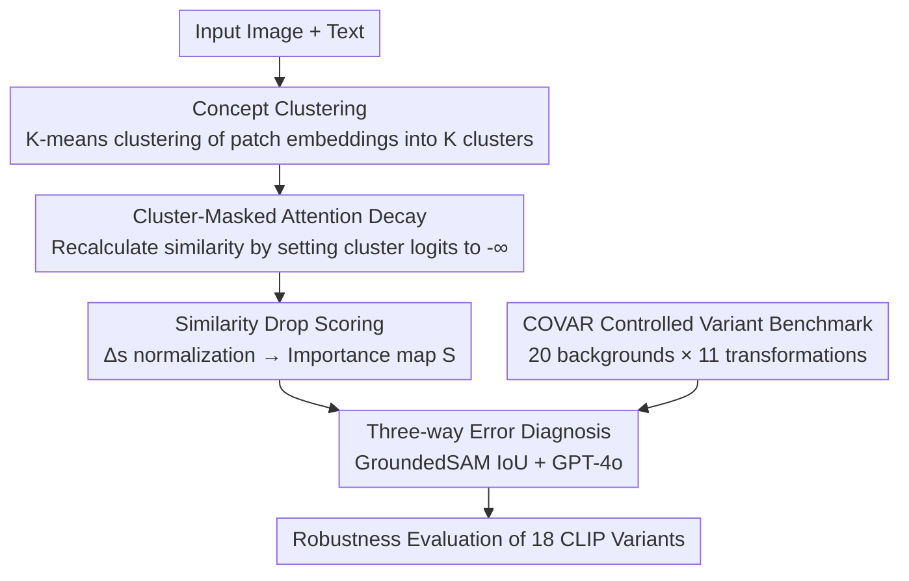

# Concept Regions Matter: Benchmarking CLIP with a New Cluster-Importance Approach

**Conference**: CVPR 2026  
**Paper**: [CVF Open Access](https://openaccess.thecvf.com/content/CVPR2026/html/Agarwal_Concept_Regions_Matter_Benchmarking_CLIP_with_a_New_Cluster-Importance_Approach_CVPR_2026_paper.html)  
**Code**: None (Not provided in the paper)  
**Area**: Multimodal VLM / Interpretability  
**Keywords**: CLIP Interpretability, Spurious Correlation, Background Dependency, Concept Clustering, Robustness Benchmark

## TL;DR
The paper proposes a training-free CLIP explanation method called CCI (clustering image patches into semantic clusters, masking attention by cluster, and quantifying contributions via similarity drops). This method reveals that "most CLIP errors are fine-grained confusion rather than background dependency." Additionally, the authors build the COVAR benchmark to systematically evaluate the spurious correlation tendencies of 18 CLIP variants across controlled transformations.

## Background & Motivation
**Background**: Contrastive Vision-Language Models like CLIP demonstrate strong generalization in zero-shot classification, retrieval, and open-vocabulary recognition. However, they are frequently found to rely on "spurious correlations"—making decisions based on backgrounds rather than the objects themselves (e.g., labeling a bird near water as a "water ouzel"). To quantify background dependency, the CounterAnimals (CA) benchmark splits images into easy/hard sets based on CLIP's own accuracy, with the hard set assumed to contain "non-typical backgrounds" to detect background sensitivity.

**Limitations of Prior Work**: The authors point out two major flaws in using "accuracy as a proxy" like CA. First, a drop in accuracy does not necessarily imply background interference—CLIP can "look at the correct object but still misclassify" (e.g., looking at a jaguar but predicting cheetah) or "rely on the background but happen to guess correctly" (e.g., identifying a water ouzel via the water surface). Second, compressing rich visual variations (viewpoint, scale, pose, composition) into a binary easy/hard split masks the true sources of error.

**Key Challenge**: Diagnosing "exactly which region of the image CLIP relies on" requires a **faithful** and **region-level** explanation tool. However, existing explanation methods (GradCAM, Grad-ECLIP, MaskCLIP, RISE, etc.) either produce noisy, fragmented pixel-level saliency maps due to gradient-based approaches or break the input distribution by replacing regions with black blocks/noise tokens, leading to unstable explanations. Without reliable tools, background dependency can only be indirectly inferred via accuracy.

**Goal**: ① Create a faithful, semantically coherent, region-level, training-free explanation method; ② Decompose CLIP errors—identifying whether they are driven by background, fine-grained confusion, or robustness issues like scale/viewpoint; ③ Build a benchmark with factors that can be changed in a controlled manner to fairly evaluate many CLIP variants.

**Core Idea**: Instead of perturbing at the pixel level, the method directly utilizes **CLIP's own patch embeddings** to cluster the image into semantically coherent "concept clusters." These clusters are then masked in the attention layers to observe the drop in image-text similarity, using the "similarity drop" as the causal contribution of each concept to the prediction.

## Method

### Overall Architecture
The paper follows two main lines: the explanation method **CCI (Concept Cluster Importance)** and the controlled benchmark **COVAR**. CCI runs at inference time without modifying or retraining the model: given an image, CLIP's patch embeddings are used for K-means clustering to obtain $K$ semantic clusters. Then, for each cluster, its attention logits in all Transformer layers are set to $-\infty$, preventing the CLS token from aggregating information from that cluster. Image-text similarity is recalculated, and a larger drop indicates higher importance for that cluster. The relative drops are normalized and weighted to produce a spatial importance heatmap. Using this "what CLIP actually looked at" map, combined with Foreground/Background masks from GroundedSAM, errors are categorized into foreground-driven or background-driven. GPT-4o further identifies which foreground errors are fine-grained confusions. Finally, COVAR places objects into 20 backgrounds with 11 structural transformations (scale/viewpoint/flip/rotation/translation/crop), generating 396k controlled samples for a systematic diagnosis of 18 CLIP variants.

### Key Designs

**1. Concept Clustering: Extracting semantically coherent regions using CLIP's representations**

The pain point is straightforward: pixel-level superpixels (SLIC/LIME) are not aligned with model representations, and gradient methods are noisy. CCI performs clustering in CLIP's patch embedding space. Given the token sequence $Z=[z_{\text{CLS}}, z_1, \dots, z_N]$ from the image encoder, only patch embeddings $X=\{z_i\}_{i=1}^N$ (which encode local semantics) are used for K-means to obtain $C=\{C_1,\dots,C_K\}$ (default $K=7$). Each cluster groups "semantically similar patches," naturally corresponding to a coherent concept area (e.g., shark teeth, clock numbers) rather than random pixel blocks. This ensures that subsequent "masking-scoring" operates on **semantically meaningful regions**, forming the foundation for CCI's region-level explanation.

**2. Cluster-Masked Attention Decay + Similarity Drop Scoring: Quantifying "concept contribution" as a causal measure**

To measure a cluster's contribution, CCI does not modify pixels but directly cuts off attention. For cluster $C_k$, a binary mask $m_k(j)=1$ is constructed if $j\in C_k$, otherwise $0$. The logits are modified before the attention softmax in every layer and every head:

$$\hat{A}^{(l)}_k(i,j) = \begin{cases} A^{(l)}(i,j), & m_k(j)=0 \\ -\infty, & m_k(j)=1 \end{cases}$$

Setting logits to $-\infty$ ensures the CLS token aggregates zero information from that cluster. After masking, a new CLS embedding $\hat{z}_{\text{CLS},k}$ is obtained, and similarity $s_k=\cos(\hat{z}_{\text{CLS},k}, t)$ is calculated. Defining the similarity drop as $\Delta s_k = s - s_k$, weights are normalized as $w_k = \Delta s_k / \sum_{j=1}^{K}\Delta s_j$. The final spatial importance map is $S=\sum_{k=1}^{K} w_k \cdot m_k$. 

This approach is elegant because masking at the attention logit level avoids replacing pixels, thereby **preserving the input distribution** (avoiding inconsistencies of RISE-style noise), and because it operates on semantic clusters, the explanation is coherent and region-aligned. $\Delta s_k$ essentially represents "how much the model's judgment degrades without this concept," providing a direct causal signal.

**3. Three-way Error Diagnosis: Breaking down "accuracy drops" into Background / Fine-grained / Others**

To quantify the cause of errors, the authors use GroundedSAM to obtain ground-truth Foreground (FG) and Background (BG) masks for ImageNet-1k and CA. The CCI heatmap for the **predicted class** is overlapped with FG/BG masks using IoU. If the overlap is on the background, it is a background-driven error (BG-Er); if on the foreground, it is a foreground-driven error (FG-Er). For FG-Er, GPT-4o determines if the predicted and ground-truth classes are "visually similar" (e.g., siamang vs chimpanzee); if so, it is categorized as fine-grained confusion (Fine-Er). The conclusion is counterintuitive: BG-Er accounts for only a small portion (9.1% in ImageNet, 6.7% in CA), and background error rates are nearly identical between CA's easy and hard sets, debunking the assumption that accuracy gaps stem from background correlation. The majority of errors are Fine-Er (46.6% in ImageNet, 60.4% in CA).

**4. COVAR Controlled Variant Benchmark: Isolating factors to expose broader failure modes**

CA only provides 2 backgrounds per class and lacks control over viewpoint/scale/flip/crop. COVAR is constructed by selecting 33 classes from ImageNet (50 images each) and using the Emu2 image editing model to synthesize each image into 20 different GPT-4o-designed backgrounds (indoor/outdoor), resulting in 33,000 "Bg-varied" images. Each Bg-varied image is then expanded via 11 structural transformations (4 scales, 2 viewpoints, flips, etc.) to a total of 396,000 images. This allows isolation of which perturbation is most damaging. Experiments show that **Scale** is most lethal; it not only drops accuracy but nearly doubles BG-Er, indicating that models rely more on backgrounds when objects are small.

## Key Experimental Results

### Main Results: CCI Explanation Faithfulness (ImageNet-1k, Deletion↓ / Insertion↑ AUC)
Faithfulness is measured by Deletion (replacing important pixels with noise, checking how fast top-1/5 accuracy drops) and Insertion (gradually revealing important pixels).

| Method | Del@1 ↓ | Del@5 ↓ | Ins@1 ↑ | Ins@5 ↑ |
|------|---------|---------|---------|---------|
| GradCAM | 0.3417 | 0.5628 | 0.2682 | 0.4454 |
| MaskCLIP | 0.2848 | 0.4885 | 0.3335 | 0.5351 |
| Grad-ECLIP (runner-up) | 0.2464 | 0.4272 | 0.3838 | 0.5993 |
| **CCI (Ours)** | **0.1809** | **0.3276** | **0.4175** | **0.6518** |

CCI achieves new SOTA across the board, with Del@5 dropping from 0.4272 to 0.3276.

### MS COCO Cross-modal Retrieval Faithfulness (Karpathy split, IR/TR)

| Method | Del-IR@5 ↓ | Del-TR@5 ↓ | Ins-IR@5 ↑ | Ins-TR@5 ↑ |
|------|------------|------------|------------|------------|
| MaskCLIP | 0.2841 | 0.2949 | 0.2953 | 0.3514 |
| Grad-ECLIP (runner-up) | 0.2670 | 0.2933 | 0.3203 | 0.3761 |
| **CCI (Ours)** | **0.1056** | **0.1184** | **0.3513** | **0.3943** |

Notably, CCI improves Del-IR@5 by **over 2x** compared to the runner-up Grad-ECLIP.

### Error Source Diagnosis (CCI + GroundedSAM + GPT-4o)

| Dataset/Subset | BG-Er | Fine-Er | Key Finding |
|-------------|-------|---------|----------|
| ImageNet-1k | 9.1% | 46.6% | Background errors are a minority; fine-grained is the main cause. |
| CounterAnimals | 6.7% | 60.4% | BG error rates are nearly identical in easy/hard sets. |
| COVAR Bg-varied | 15.6% | (Dominant) | BG-Er increases significantly compared to CA when changing bg. |
| COVAR Scale | Significant increase | Dominant | Shrinking scale nearly doubles BG-Er (e.g., 50.7% for ViT-B/32). |

### Key Findings
- **Accuracy is a poor proxy**: Easy and hard sets in CA have nearly identical background error rates (~6.2% vs 7.3%), proving that the "accuracy drop = background dependency" assumption is flawed.
- **Scale is the most difficult perturbation**: In COVAR, scale changes simultaneously lower accuracy and double BG-Er (small object → higher background reliance). Viewpoint changes drop accuracy but do **not** significantly increase BG-Er, marking it as a general robustness issue rather than background dependency.
- **Large model != More robust**: While models like ViT-bigG or ViT-H/14 (DFN-5B) show high accuracy on Bg-varied, their BG-Er under scale perturbation still reaches ~30–33%. Models trained on curated data (DataComp-1B) show lower background dependency, indicating **pre-training data quality is as important as model size**.
- **Finer patches help**: Under DataComp-1B, ViT-B/16's BG-Er is lower than ViT-B/32 across almost all perturbations (30.5% vs 50.7% under scale), suggesting finer patches reduce background reliance.

## Highlights & Insights
- **"Similarity drop" as a clean causal measure**: Masking attention logits without replacing pixels preserves the input distribution and raises the explanation unit to the semantic cluster level. This addresses both the noise of gradient methods and the instability of perturbation methods—a strategy applicable to any attention-based VLM.
- **Falsifying a popular benchmark's assumptions**: The most insightful part is using CCI to quantitatively debunk CounterAnimals' core assumption, decomposing "spurious background correlation" into BG-Er, Fine-Er, and Robustness.
- **Controlled data generation paradigm**: Using Emu2 + GPT-4o for "Same Object × 20 Backgrounds × 11 Transformations" scales the benchmark from 2 backgrounds to systematic control, a paradigm reusable for any robustness study aiming to isolate confounding factors.

## Limitations & Future Work
- COVAR is synthesized via generative editing (Emu2); the realism and potential artifacts of synthesized backgrounds/transforms might affect the generalizability of the findings ⚠️.
- The error attribution chain relies on GroundedSAM's masks and GPT-4o's visual similarity judgments; these steps introduce their own errors.
- CCI requires one forward pass per cluster (K extra inferences). $K$ is a hyperparameter (default 7), adding overhead for large images or large $K$.
- Potential mitigations (multi-scale alignment, RobustMixGen, equivariant attention) are suggested but not empirically validated on COVAR.

## Related Work & Insights
- **vs Grad-ECLIP / GradCAM (Gradient Attribution)**: These produce pixel-level, noisy saliency maps. CCI operates in the representation space with cluster masking, leading to coherent region-level explanations and 2x higher faithfulness (Del-IR@5).
- **vs MaskCLIP / RISE (Perturbation/Masking)**: These replace regions with black blocks/noise, breaking the input distribution. CCI modifies attention logits, maintaining distribution stability.
- **vs CounterAnimals (Benchmark)**: CA uses accuracy to split data and assumes all drops are background-related. COVAR isolates factors and uses CCI for three-way classification, proving backgrounds are rarely the main culprit.

## Rating
- Novelty: ⭐⭐⭐⭐ The clustering-masking mechanism is clean and used effectively to falsify common assumptions.
- Experimental Thoroughness: ⭐⭐⭐⭐⭐ Large-scale diagnosis across 18 CLIP variants, dual-task faithfulness, and multiple subsets.
- Writing Quality: ⭐⭐⭐⭐ Clear argumentation chain, though some sensitivity analysis is left to the supplement.
- Value: ⭐⭐⭐⭐ Provides both a faithful tool and a controlled benchmark to correct the community's misattribution of "spurious correlations."

<!-- RELATED:START -->

## Related Papers

- [\[CVPR 2026\] CLIP-Free, Label-Free, Unsupervised Concept Bottleneck Models](clip-free_label_free_unsupervised_concept_bottleneck_models.md)
- [\[CVPR 2026\] Concept-wise Attention for Fine-grained Concept Bottleneck Models](coat_cbm_concept_wise_attention.md)
- [\[CVPR 2026\] World in a Frame: Understanding Culture Mixing as a New Challenge for Vision-Language Models](world_in_a_frame_understanding_culture_mixing_as_a_new_challenge_for_vision-lang.md)
- [\[CVPR 2026\] Seeing Through Touch: Tactile-Driven Visual Localization of Material Regions](seeing_through_touch_tactile_localization.md)
- [\[CVPR 2026\] Cluster-Aware Neural Collapse Prompt Tuning for Long-Tailed Generalization of Vision-Language Models](cluster-aware_neural_collapse_prompt_tuning_for_long-tailed_generalization_of_vi.md)

<!-- RELATED:END -->
