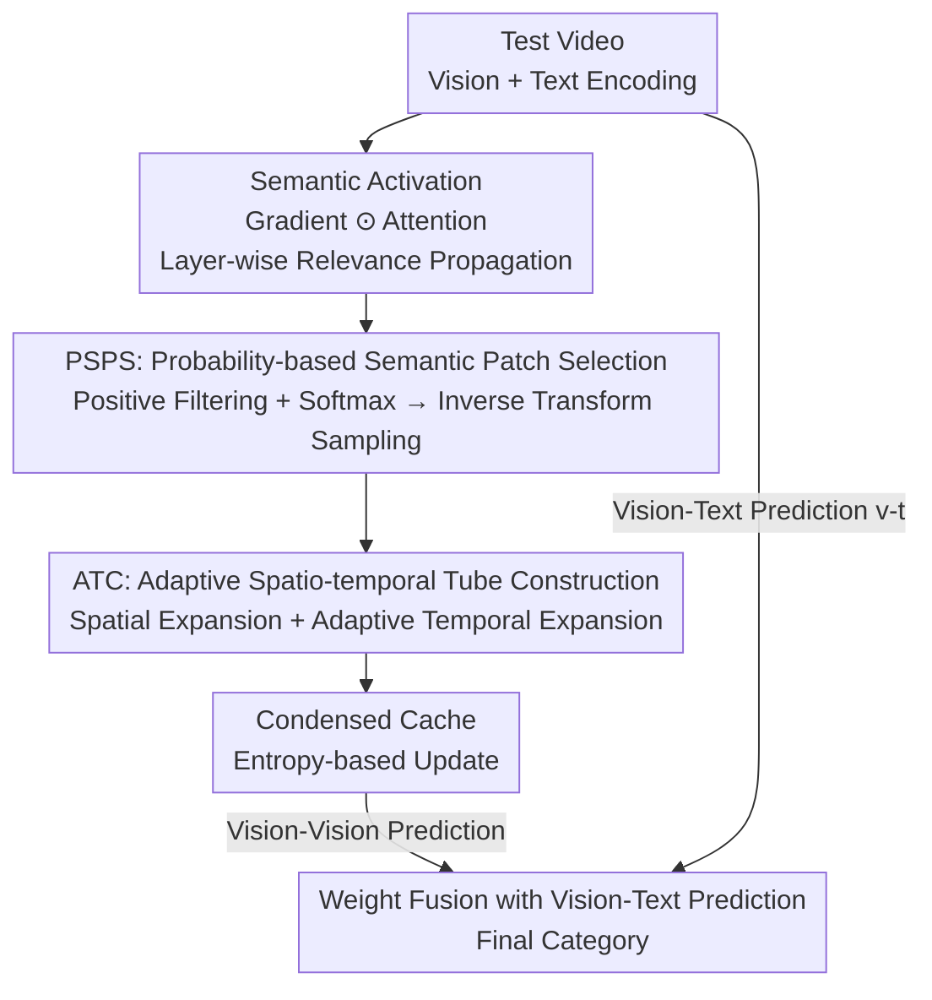

# Condensed Test-Time Adaptation of VLMs for Action Recognition

**Conference**: CVPR 2026  
**Paper**: [CVF Open Access](https://openaccess.thecvf.com/content/CVPR2026/html/Ge_Condensed_Test-Time_Adaptation_of_VLMs_for_Action_Recognition_CVPR_2026_paper.html)  
**Code**: None (No public repository; training-free method)  
**Area**: Multi-modal VLM  
**Keywords**: Test-time adaptation, zero-shot action recognition, video feature condensation, training-free, cache adapter

## TL;DR
Addressing the non-transitivity of the mapping chain in training-free cache-based Test-Time Adaptation (TDA) — where "vision-vision alignment is dominated by appearance while vision-text alignment is dominated by semantics" — CONDA uses text semantics to guide the construction of visual caches. It condenses only patches positively correlated with action semantics (PSPS) into spatio-temporal tubes (ATC), consistently outperforming TDA by 1~3.5% across 7 action recognition benchmarks and enabling plug-and-play integration with any VLM.

## Background & Motivation

**Background**: Zero-shot action recognition using Vision-Language Models (VLMs) like CLIP or ViCLIP has become mainstream. To adapt frozen VLMs to downstream distributions, Test-Time Adaptation (TTA) follows two paths: one is test-time prompt tuning (TPT, DTS-TPT), which optimizes prompts during inference; the other focuses on training-free cache adapters, exemplified by TDA, which constructs an online "category → visual feature" cache from high-confidence test samples and follows a two-step modality mapping chain during inference.

**Limitations of Prior Work**: TPT-based methods still require backpropagation during inference, incurring high computational costs that contradict the "lightweight" intent of TTA. While TDA is training-free, it possesses an overlooked structural flaw: its two-step mapping chain is **asymmetric**. Specifically, the alignment between cached video features and action text labels ($\bm{v}_c\text{-}\bm{t}$) is **semantics-driven**, but the alignment between test video and cached video features ($\bm{v}\text{-}\bm{v}_c$) is **appearance-driven**, as it directly compares global visual features for similarity.

**Key Challenge**: The different nature of these two alignments leads to **non-transitivity** in the mapping chain: $\bm{v}\text{-}\bm{t}$ and $\bm{v}\text{-}\bm{v}_c \circ \bm{v}_c\text{-}\bm{t}$ do not match. Consequently, if two videos from different categories look similar due to **semantically irrelevant factors** (background, scene), they are likely to be incorrectly categorized. A straightforward example provided is playing golf on grass versus cycling on grass; despite different semantics, similar backgrounds lead to confusion. This issue is exacerbated in video due to temporal redundancy and motion complexity, which amplify appearance noise.

**Goal**: Restore the transitivity of the "test video ↔ cached video ↔ text label" mapping chain by correcting the alignments without introducing any training.

**Key Insight**: Since the $\bm{v}\text{-}\bm{t}$ semantic alignment is inherently reliable, it should be used to **guide** the $\bm{v}\text{-}\bm{v}_c$ appearance alignment. Signals in video features that are irrelevant to the pseudo-label semantics should be filtered, preserving only semantically relevant components in the cache.

**Core Idea**: "Condense" video features by sampling semantic patches based on semantic activation probabilities derived from vision-text alignment, and then expand these into spatio-temporal tubes to build a **condensed cache**. This condensed cache is used for vision-vision alignment, thereby eliminating appearance bias.

## Method

### Overall Architecture

CONDA (Condensed Dynamic Adapter) is a training-free cache adapter compatible with any frozen VLM. Given a test video stream, it follows TDA's two-step mapping backbone (vision-text prediction + vision-vision cache prediction, fused into final logits) but redefines the cache construction: instead of storing global visual features, it stores **condensed semantic tube features**. Condensation involves two steps: first, PSPS (Probability-based Semantic Patch Selection) identifies patches from local features that exhibit high response to action semantics and maintain spatial diversity; second, ATC (Adaptive Tube Construction) expands these patches spatially and temporally into tubes to recover structural and motion cues. These condensed features update the historical cache based on entropy. The final prediction remains $\bm{p}_{\text{final}} = \bm{f}\bm{W}^\mathrm{T} + \alpha\,\mathcal{A}(\bm{f}\bm{F}^\mathrm{T})\bm{L}_p$, but using the condensed tube cache $\bm{F}$.

### Key Designs

**1. Condensed Cache: Correcting appearance alignment with semantic guidance to restore transitivity**

This is the governing principle of CONDA, directly targeting the root cause of "non-transitivity." TDA compares global features ($\bm{v}\text{-}\bm{v}_c$), which are dominated by semantically irrelevant factors like background. CONDA's solution uses the semantic information (pseudo-labels) from the vision-text alignment $\bm{v}_c\text{-}\bm{t}$ to **filter video features**, caching only factors positively correlated with the pseudo-label and filtering out negative interference. This shifts the cache from "appearance global features" to "semantic condensed features," pulling the $\bm{v}\text{-}\bm{v}_c$ edge into semantic space and ensuring consistency for the chain $\bm{v}\text{-}\bm{v}_c \circ \bm{v}_c\text{-}\bm{t}$. PSPS and ATC serve as specific execution modules for this principle.

**2. PSPS: Action-specific semantic activation via gradient modulation and diverse probability sampling**

Selecting patches based solely on top-k MHSA attention maps has two flaws: attention only measures correlation with **global** visual semantics rather than **action-specific** semantics, and top-k selection often clusters patches in a few high-response areas, losing diversity. **Semantic patch activation** addresses this by drawing from Grad-CAM and Transformer interpretability (Beyond Attention Visualization), using **gradients** relative to the pseudo-label to measure the correlation strength of each patch. This scales the relevance (attention) of each layer, followed by layer-wise relevance propagation:

$$\bm{A} = \prod_{l=L_0}^{L}\big(\mathrm{Avg_h}(\bm{G}[l]\odot\bm{R}[l]) + \bm{I}\big)$$

where $\bm{G}[l]$ and $\bm{R}[l]$ are the gradient and relevance of the $l$-th MHSA layer, $\mathrm{Avg_h}$ averages across heads, $\odot$ is the Hadamard product, and the identity matrix $\bm{I}$ compensates for residual connections. **Probabilistic selection** then filters out negative values $(\cdot)_+$ (patches negatively correlated with action semantics) and applies softmax to get activation probabilities $\bm{P}=\mathrm{softmax}(\bm{A}_+)\in\mathbb{R}^{T\times H\times W}$. Finally, **inverse transform sampling** is used to select $k$ semantic patches $\bm{f}_p\in\mathbb{R}^{k\times d}$ from local features $\bm{f}_v$, ensuring both high response and spatial distribution.

**3. ATC: Building spatio-temporal tubes around semantic patch anchors to recover structure and motion**

Individual patches selected by PSPS are spatially fragmented and temporally discontinuous, lacking structural information and motion. ATC builds a spatio-temporal tube for each selected patch. **Spatial expansion**: For a patch at $(h,w)$, a scaling factor $s_h,s_w\sim U(\alpha,\beta)$ is sampled to crop a rectangular region $\bm{f}_{\text{region}}$ of size $s_h\cdot H \times s_w\cdot W$, upgrading the isolated patch to a structured "semantic region." **Temporal expansion**: The region feature is mean-pooled into an anchor feature $\bm{f}_{\text{anchor}}$, which serves as a query to **retrieve the most similar patch** in every other frame via cosine similarity. Spatial expansion is only applied if similarity exceeds a threshold $\tau$, and region features across all frames are aggregated into a tube feature. This "adaptive" tracking accounts for object displacement over time, outperforming fixed-position cropping.

### Loss & Training
CONDA is entirely training-free. Encoders are not fine-tuned on additional video data, and no parameters are updated during inference. The cache is updated online based on entropy. Default configuration: ViCLIP-ViT-B/16 as encoders, $T=32$ frames per test video, batch size = 1, $k=10$ patches for PSPS, relevance propagation starting from layer $L-1$. ATC uses spatial scaling $\alpha=0.3, \beta=0.7$ and temporal threshold $\tau=0.5$. Hyperparameters were tuned on the Kinetics-400 validation set.

## Key Experimental Results

Evaluation was conducted on 7 benchmarks: standard action recognition (HMDB-51, UCF-101, Kinetics-600), long-duration action recognition (ActivityNet-200, COIN), and first-person action recognition (EPIC-KITCHENS-100, EGTEA).

### Main Results

Zero-shot action recognition performance (top-1 %, top-1/top-5 for K600). CONDA consistently outperforms other TTA methods as a plug-and-play adapter:

| Backbone + Method | HMDB-51 | UCF-101 | K600 (Top-1) | K600 (Top-5) |
|------|------|------|------|------|
| Vanilla CLIP | 43.7 | 70.9 | 64.3 | 86.8 |
| + TDA (CVPR'24) | 44.9 | 73.2 | 64.9 | 86.9 |
| + DPE (NeurIPS'24, Trainable) | 45.7 | 73.3 | 66.2 | 87.6 |
| + Point-Cache (CVPR'25) | 45.0 | 73.5 | 65.3 | 86.3 |
| **+ CONDA (Ours)** | **46.1** | **74.7** | **67.5** | **87.7** |
| ViCLIP | 46.4 | 75.9 | 69.8 | 90.1 |
| + TDA | 47.4 | 76.7 | 70.9 | 90.5 |
| + DPE (Trainable) | 47.6 | 77.1 | 70.8 | 90.6 |
| **+ CONDA (Ours)** | **48.4** | **77.6** | **72.1** | **91.8** |
| OST (CVPR'24) | 54.6 | 78.2 | 74.6 | 92.0 |
| **+ CONDA (Ours)** | **55.2** | **81.5** | **75.1** | **92.2** |

Compared to the training-free pioneer TDA, CONDA improves by ~1.3% on average. Even against DPE, which performs unsupervised fine-tuning during inference, CONDA achieves higher top-1 accuracy on ViCLIP (HMDB-51 +0.8%, UCF-101 +0.5%, K600 +1.3%).

Generalization in complex scenarios (top-1 %):

| Method | COIN | ActivityNet-200 | EK-100 | EGTEA |
|------|------|------|------|------|
| Backbone (ViCLIP / EgoVLP) | 64.9 | 72.7 | 10.8 | 18.9 |
| + TDA | 65.6 | 73.2 | 11.0 | 19.2 |
| + DPE (Trainable) | 66.5 | 73.6 | 11.3 | 19.7 |
| **+ CONDA** | **67.4** | **75.2** | **12.3** | **22.7** |

On long-term scenarios, CONDA exceeds TDA by 1.9% on average. In first-person scenarios, it outperforms TDA by 1.3% on EK-100 and 3.5% on EGTEA, indicating that condensed caches offer the greatest gains in ego videos with complex actions and high camera motion.

### Ablation Study

Based on ViCLIP / ViT-B/16, reporting K600 / COIN top-1 (%):

| Configuration | K600 | COIN | Description |
|------|------|------|------|
| Full (PSPS + ATC) | 72.1 | 67.4 | Full model |
| w/o PSPS, w/o ATC | 70.9 | 65.6 | Degrades to TDA-style global cache |
| PSPS only | 71.2 | 66.0 | Selects semantic patches only |
| ATC only | 71.5 | 66.4 | Completes spatio-temporal tubes |
| top-k selection (vs. sampling) | 71.6 | 66.7 | ~1.2% lower than prob. sampling |
| w/o Gradient G | 71.3 | 66.7 | Uses Attention R only |
| w/o Attention R | 71.5 | 66.6 | Uses Gradient G only |
| w/o Spatial Expansion | 71.3 | 66.3 | 1.1% drop on COIN |
| Time Expansion = None / Random / Fixed | 71.6/71.5/71.7 | 66.4/66.5/66.9 | All inferior to Adaptive |

### Key Findings
- **Complementary Modules**: PSPS and ATC individually contribute +0.3%/+0.6% on K600, while combined they offer +1.2%, proving that the "select semantics, then complete spatio-temporal" pipeline is a coupled chain rather than a simple addition.
- **Both Gradient and Attention are Vital**: Removing either drops K600 performance. Gradients isolate "action-specific semantics," while attention captures "global correlation."
- **Probability Sampling > top-k**: Top-k clusters patches, whereas inverse transform sampling maintains spatial diversity, providing a +1.2% gain.
- **"Adaptive" Temporal Expansion is Necessary**: Random expansion can even hurt performance by including semantically irrelevant regions. Query-based adaptive tracking manages moving objects effectively, adding +0.5%/+1.0% on K600/COIN.
- **Robustness to $k$**: Performance is stable across $k=5/10/15/20$, with $k=10$ being optimal.
- **Cross-backbone Universality**: CONDA consistently outperforms TDA across Vanilla CLIP, ViCLIP, ViT-B/16, and ViT-L/14 combinations.

## Highlights & Insights
- **Formalizing "Non-transitivity" as a Structural Problem**: The authors pinpoint that the asymmetry between $\bm{v}\text{-}\bm{v}_c$ (appearance-led) and $\bm{v}_c\text{-}\bm{t}$ (semantic-led) breaks the mapping chain, providing a mathematically grounded motivation.
- **Training-free Gradients**: Utilizing backpropagation to generate Grad-CAM style activation weights for patch selection — without updating any parameters — is a clever way to leverage discriminative signals under "no training" constraints.
- **Inverse Transform Sampling for Diversity**: Replacing deterministic top-k with probability-based sampling is a useful trick for any token selection/pruning task to prevent collapse into high-response clusters.
- **Query-based Temporal Tracking**: Converting tube construction from geometric cropping to semantic matching (tracking through matching anchor features across frames) significantly benefits motion-heavy ego videos (EGTEA +3.5%).

## Limitations & Future Work
- **Dependency on Pseudo-label Quality**: PSPS relies on gradients from pseudo-labels. If the zero-shot performance of the VLM is poor for a specific class, resulting in incorrect labels, the condensation direction will follow the error.
- **Gradient Computation Cost**: Although training-free, computing layer-wise gradients for relevance propagation increases inference latency compared to simple forward-only TDA. The full trade-off was not detailed in the main text.
- **Empirical Hyperparameters**: Scaling ranges $(\alpha, \beta)$ and thresholds $\tau$ were empirically determined on K400; their robustness across extremely long videos or different domains may require further validation.
- **Future Directions**: Exploring pseudo-label confidence to modulate activation or replacing random spatial scaling with learnable region proposals could further reduce variance.

## Related Work & Insights
- **vs. TDA**: TDA stores global features and performs appearance-based $v-v_c$ matching; CONDA fixes this at the root by storing "purified" semantic tubes guided by text.
- **vs. DPE**: DPE fine-tunes multi-modal features during inference. CONDA outperforms it without any training, suggesting structural alignment fixes are more efficient than feature fine-tuning.
- **vs. TPT / DTS-TPT**: TPT optimizes prompts at test-time with high overhead. CONDA uses gradients without updates, fitting into the lightweight memory-based TTA branch.
- **vs. Point-Cache / BoostAdapter**: While those focus on expanding cache capacity (point clouds, boosting), CONDA focuses on "purifying" the content of the cache specifically for video appearance bias.

## Rating
- Novelty: ⭐⭐⭐⭐ Clear formalization of the "non-transitivity" in cache-based TTA and a semantic-guided solution.
- Experimental Thoroughness: ⭐⭐⭐⭐⭐ 7 benchmarks, 4 backbones, comprehensive ablation and generalization studies.
- Writing Quality: ⭐⭐⭐⭐ Good motivation examples; clear logical flow; lacks some latency/failure mode analysis.
- Value: ⭐⭐⭐⭐ Plug-and-play, single-GPU friendly, training-free; highly practical for resource-constrained video TTA.

<!-- RELATED:START -->

## Related Papers

- [\[CVPR 2026\] Test-Time Distillation for Continual Model Adaptation](test-time_distillation_for_continual_model_adaptation.md)
- [\[CVPR 2026\] Dynamic Logits Adjustment and Exploration for Test-Time Adaptation in Vision Language Models](dynamic_logits_adjustment_and_exploration_for_test-time_adaptation_in_vision_lan.md)
- [\[CVPR 2026\] STAR: Test-Time Adaptation Can Enhance Universal Prompt Learning for Vision-Language Models](star_test-time_adaptation_can_enhance_universal_prompt_learning_for_vision-langu.md)
- [\[CVPR 2026\] Decoupling Stability and Plasticity for Multi-Modal Test-Time Adaptation](decoupling_stability_and_plasticity_for_multi-modal_test-time_adaptation.md)
- [\[CVPR 2026\] Multi-modal Test-time Adaptation via Adaptive Probabilistic Gaussian Calibration](multi-modal_test-time_adaptation_via_adaptive_probabilistic_gaussian_calibration.md)

<!-- RELATED:END -->
