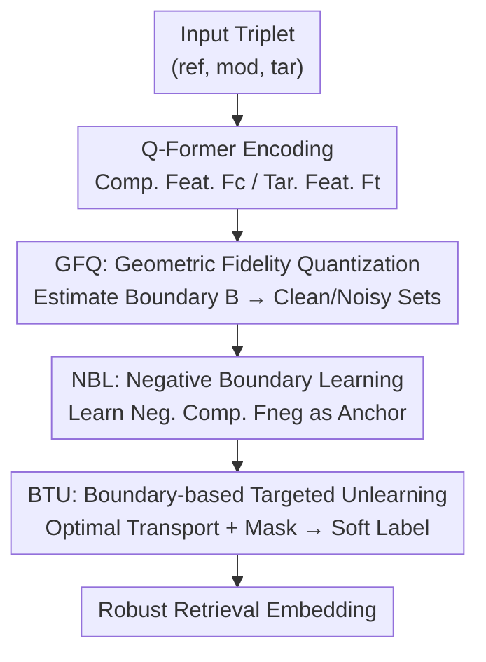

# ConeSep: Cone-based Robust Noise-Unlearning Compositional Network for Composed Image Retrieval

**Conference**: CVPR 2026  
**arXiv**: [2604.20358](https://arxiv.org/abs/2604.20358)  
**Code**: https://github.com/Lee-zixu/Lee-zixu/ConeSep/ (Available)  
**Area**: Multimodal VLM / Image-Text Retrieval / Noisy Correspondence Learning  
**Keywords**: Composed Image Retrieval, Noisy Triplet Correspondence, Machine Unlearning, Optimal Transport, Negative Anchor

## TL;DR
Aiming at the "hard noise" in Noisy Triplet Correspondence (NTC) for Composed Image Retrieval (CIR)—where the reference and target images are highly similar but the modification text is incorrect—this paper proposes ConeSep. It first quantifies the matching fidelity of each sample using geometric boundaries in a cone space for noise separation, then learns a "diagonal negative composition" for each query as an explicit semantic negative anchor. Finally, noise correction is modeled as an optimal transport problem for directional unlearning. ConeSep outperforms SOTAs like TME, HABIT, and INTENT across various noise rates on FashionIQ and CIRR.

## Background & Motivation

**Background**: Composed Image Retrieval (CIR) allows users to retrieve a "target image (tar)" using a "reference image (ref) + modification text (mod)". It is a flexible multimodal retrieval paradigm. The mainstream approach uses the Q-Former of BLIP-2 to fuse (ref, mod) into a combined feature and aligns it with the target image feature via contrastive learning.

**Limitations of Prior Work**: CIR relies heavily on high-quality (ref, mod, tar) triplet annotations. However, subjective bias in manual annotation and hallucinations in LVLM-generated labels lead to semantic inconsistencies between the mod and (ref, tar), resulting in "Noisy Triplet Correspondence" (NTC). NTC is more complex than traditional "Noisy Dual Correspondence" (NDC): it possesses a composite noise structure, including both "partial matching" (mod matches only ref or tar) and "hard noise" (ref/tar are visually extremely similar while mod is wrong).

**Key Challenge**: Existing NCL methods (including the NTC pioneer TME and mature NDC methods) mostly follow the "identify-correct/suppress" paradigm, relying on **coarse-grained scalar metrics** like mixture losses or structural similarity to partition clean/noisy samples. However, due to the extreme visual similarity between ref and tar in hard noise, composition features often yield small loss values, causing them to be misidentified as clean samples. This directly **breaks the "small loss hypothesis"**, rendering traditional methods ineffective.

**Goal**: The authors decompose the problems exposed by NTC under this paradigm into three overlooked challenges—**C1 Modality Suppression** (dense visual features of the ref in hard noise overwhelm the sparse semantic signals of the mod, making the mismatch undetectable via mixed loss); **C2 Missing Negative Anchors** (even if hard noise is identified, existing frameworks only perform positive alignment without structured negative semantic anchors to "push away" from); **C3 Unlearning Backlash** (forcibly pushing away noisy samples causes local crowding in the metric space, which, like a ripple, inadvertently harms neighboring clean samples).

**Key Insight / Core Idea**: The authors identified the need for a feature space capable of "fine-grained perception (solving C1) + structured repulsion (solving C2) + backlash avoidance (solving C3)". Leveraging **cone space geometry** (where the similarity distributions of clean and NTC samples are cone-separable on a 2D histogram), they constructed a closed-loop system consisting of three logically progressive modules: geometric fidelity quantization → negative boundary learning → boundary-based directional unlearning.

## Method

### Overall Architecture
ConeSep integrates "proactive noise perception → structured negative semantic modeling → precise noise unlearning" into a closed-loop system. Given a batch of potentially noisy triplets (ref, mod, tar), composition features $\mathbf{F}_c$ and target features $\mathbf{F}_t$ are extracted using the BLIP-2 Q-Former. Three modules then operate sequentially: **GFQ** estimates a noise boundary $\mathbb{B}$ to partition the batch into a high-fidelity clean set $\mathcal{T}_{clean}$ and a low-fidelity noisy set $\mathcal{T}_{noisy}$; **NBL** learns a semantically opposite "diagonal negative composition" $\mathbf{F}_{neg}$ as a negative anchor for each query; **BTU** models "pulling clean samples toward tar and pushing noisy samples toward $\mathbf{F}_{neg}$" as a masked optimal transport problem to obtain smooth soft labels for directional unlearning. These targets are optimized alongside robust contrastive losses to output robust retrieval embeddings.

### Key Designs

**1. Geometric Fidelity Quantization (GFQ): Penetrating modality suppression via cone limits to locate hard noise**

This step addresses C1: hard noise is inseparable via scalar metrics due to small losses. GFQ does not rely on a single loss but first **estimates a noise boundary** $\mathbb{B}$. It performs $K$ Gaussian samplings $x^G \sim \mathcal{N}(0,1)$ for ref and tar, and selects random mods within the batch. These "synthetic random triplets" are encoded by the Q-Former. The mean cosine similarity between their composition and target features is taken as the boundary $\mathbb{B}$ (Eq. 2). The intuition is that randomly combined triplets are "natural noise", and their mean similarity characterizes "where noise should reside." A **fidelity function** then quantifies the distance of each real sample from this boundary:

$$\mathcal{F}(\mathbf{F}_c,\mathbf{F}_t)=(\text{ReLU}(s_{ct}-\mathbb{B}))^2\cdot(\text{ReLU}(s_{ct}-\mathbb{B})-1)$$

where $s_{ct}=\cos(\mathbf{F}_c,\mathbf{F}_t)$. Larger $\mathcal{F}$ indicates a cleaner sample. A threshold $\omega$ partitions the batch into $\mathcal{T}_{clean}$ and $\mathcal{T}_{noisy}$. Unlike TME's GMM-fitting based on mixed loss, GFQ bases discrimination on "relative geometric boundaries" rather than "absolute loss magnitude." Even with small losses, hard noise is identified as low-fidelity if it falls near the boundary.

**2. Negative Boundary Learning (NBL): Explicitly learning a diagonal negative composition as a semantic negative anchor**

This step addresses C2: "directional unlearning" requires a known direction to "push" toward, but existing CIR focused only on positive alignment. NBL uses **dual-path learning**. The positive path uses a robust contrastive loss $\mathcal{L}_{robust}$ (Eq. 4) inspired by RCL to ensure the model learns the standard CIR paradigm. The negative path introduces a set of **learnable negative prompts** $\mathbf{P}_{neg}\in\mathbb{R}^{Q\times D}$, which pass through the Q-Former to generate a "diagonal negative composition" $\mathbf{F}_{neg}$ (Eq. 5), representing the semantic opposite of the query. $\mathbf{F}_{neg}$ is constrained by two objectives: **Objective-oriented** learning uses a Sigmoid-style reverse matching (where the diagonal of the binary target matrix is 1 and off-diagonals are -1, then negated as $-\mathbf{T}_{ij}$), pushing $\mathbf{F}_{neg}$ away from its own tar and toward non-matching tars (Eq. 6); **Query-oriented** learning uses a slack boundary to constrain $s(\mathbf{F}_c,\mathbf{F}_{neg})$ within the interval $[\alpha_1,\alpha_2]$ ($\alpha_1$/$\alpha_2$ are mean negative/positive similarities in the batch), ensuring the similarity hovers near 0 to achieve "orthogonal distance" (Eq. 7).

**3. Boundary-based Targeted Unlearning (BTU): Modeling noise correction as masked optimal transport to avoid backlash**

This step addresses C3: directly pushing away noise via gradient ascent causes ripples in a crowded space, harming clean samples. BTU models the mapping of samples to targets as a $B\times 2B$ **Optimal Transport** problem. It constructs a joint cost matrix $\mathbf{C}=[\mathbf{C}^+|\mathbf{C}^-]$, where $\mathbf{C}^+_{ij}=1-s(\mathbf{F}_c^i,\mathbf{F}_t^j)$ is the cost of moving toward a positive target and $\mathbf{C}^-_{ij}=1-s(\mathbf{F}_c^i,\mathbf{F}_{neg}^j)$ is the cost of moving toward a negative boundary (Eq. 9). A **mask $\mathbf{M}$ accurately severs paths**: low-fidelity noisy samples are forbidden from flowing to their positive targets ($j=i$), and high-fidelity clean samples are forbidden from flowing to their negative boundaries ($j=i+B$). Severed paths are assigned an infinite cost $\infty$ to obtain $\mathbf{C}_{masked}$. Entropy-regularized OT (Eq. 10, solved via Sinkhorn-Knopp) yields the global transport plan $\mathbf{P}^*$. This is fused with hard labels $\mathbf{L}$ to form **smooth soft labels** $\mathbf{Y}=\gamma\mathbf{P}+(1-\gamma)\mathbf{L}$ (Eq. 11). Directional unlearning loss $\mathcal{L}_{ul}$ (Eq. 12) is then formulated using KL divergence. Since OT finds a "globally smooth optimal path" rather than a local blind push, it avoids severe disturbance to neighboring clean samples.

### Loss & Training
Training proceeds in two stages: a warm-up phase of $N$ epochs uses the NBL objectives $\mathcal{L}_{rank}+\zeta\mathcal{L}_{intra}+\nu\mathcal{L}_{inter}$ (Eq. 8) to establish the negative compositions $\mathbf{F}_{neg}$. Subsequently, the final objective of ConeSep:
$$\Psi^*=\arg\min_{\Psi}(\mathcal{L}_{robust}+\kappa\mathcal{L}_{ul}+\zeta\mathcal{L}_{intra})$$
is used for joint optimization (Eq. 13). The backbone is BLIP-2 with the AdamW optimizer. Learning rates are $1e\text{-}5$ for CIRR and $2e\text{-}5$ for FashionIQ. Batch size is 128, $K=4$, temperature $\tau=0.07$, fidelity threshold $\omega=0.5$, fusion coefficient $\gamma=0.7$, and $\{\zeta, \nu, \kappa\}=0.5$. Training lasts for 20 epochs on a single A40 GPU.

## Key Experimental Results

### Main Results

Comparison of FashionIQ validation set (R@K %, AVG is the mean of six metrics) under different noise rates:

| Noise Rate | Method | Dress R@10 | Shirt R@10 | Toptee R@10 | Avg R@10 | Avg R@50 | AVG. |
| :--- | :--- | :--- | :--- | :--- | :--- | :--- | :--- |
| 0% | TME (CVPR'25) | 49.73 | 56.43 | 59.31 | 55.15 | 75.02 | 65.09 |
| 0% | HABIT (AAAI'26) | 49.99 | 56.62 | 59.51 | 55.38 | 75.20 | 65.29 |
| 0% | **Ours** | 50.96 | 56.98 | 58.80 | **55.58** | **75.88** | **65.73** |
| 20% | TME | 49.03 | 55.84 | 57.22 | 54.03 | 73.91 | 63.97 |
| 20% | HABIT | 49.63 | 55.67 | 58.14 | 54.48 | 74.28 | 64.38 |
| 20% | **Ours** | — | — | — | **54.93** | **75.01** | — |

Comparison on CIRR test set (Avg(R@5, Rsub@1) %) with increasing noise rates:

| Noise Rate | TME | HABIT | INTENT | **Ours** |
| :--- | :--- | :--- | :--- | :--- |
| 0% | 82.01 | 81.82 | 81.70 | **82.34** |
| 20% | 79.74 | 79.61 | 79.66 | **80.43** |
| 50% | 77.71 | 78.87 | 78.41 | 78.75 |
| 80% | 74.58 | 75.86 | 75.97 | **76.38** |

Key Trend: **As the noise rate increases, the advantage of ConeSep grows.** On FashionIQ, the AVG gain over HABIT expands from +0.92% at 20% noise to +1.54% at 50% noise. On CIRR, it maintains leadership even at 80% extreme noise. (Note: At 50% noise on CIRR, the Avg of 78.75 is slightly lower than HABIT's 78.87. The author supports the conclusion with a majority of settings.)

### Ablation Study

Ablation by module on FashionIQ / CIRR at $\sigma=0.2$:

| Group | Variant | FashionIQ R@10 | CIRR R@K | Description |
| :--- | :--- | :--- | :--- | :--- |
| — | ConeSep (Full) | 54.93 | 80.66 | Full model |
| GFQ | w/o Fidelity | 53.42 | 79.90 | Removed fidelity function $\mathcal{F}$ |
| GFQ | w/o boundary | 53.69 | 80.14 | Removed boundary $\mathbb{B}$ from fidelity calc. |
| NBL | w/o neg-prompt | 54.77 | 78.94 | Removed neg-prompt $\mathbf{P}_{neg}$ |
| NBL | w/o neg-tar | 53.62 | 79.74 | Removed objective-guided learning |
| BTU | w/o Unlearn | 53.13 | 79.72 | Removed directional unlearning loss $\mathcal{L}_{ul}$ |
| BTU | w/o rank | 52.31 | 79.00 | Removed robust contrastive loss |

### Key Findings
- **Robust contrastive loss $\mathcal{L}_{robust}$ (w/o rank) shows the largest drop** (54.93 $\rightarrow$ 52.31 on FashionIQ), indicating it is the foundation for noise suppression and retrieval accuracy. However, removing other specialized correction components (OT, $\mathcal{L}_{ul}$, $\mathbf{F}_{neg}$ guidance) also significantly reduces performance.
- **Negative prompt $\mathbf{P}_{neg}$ (w/o neg-prompt) causes the most significant drop on CIRR** (80.66 $\rightarrow$ 78.94), confirming that learning an explicit negative anchor is core to stabilizing the robust semantic space.
- **Hyperparameters $\omega$ and $\kappa$ peak at 0.5**: Too low an $\omega$ allows noise into the clean set to interfere with alignment; too high an $\omega$ misidentifies clean samples as noise for excessive unlearning. Similarly, $\kappa$ reflects the trade-off between insufficient correction and unlearning backlash.

## Highlights & Insights
- **Geometric grounding of the "small loss hypothesis failure"**: By using random Gaussian sampling to estimate a noise boundary $\mathbb{B}$, the discrimination shift from "absolute loss" to "relative geometric position" ensures hard noise cannot hide. This approach of "defining noise benchmarks via synthetic random samples" is transferable to other noisy learning scenarios.
- **Directional unlearning requires a target direction, provided here by explicit negative anchors**: The $\mathbf{F}_{neg}$ learned via negative prompts and reverse matching makes "where to unlearn" explicit, which is more elegant than blind gradient ascent.
- **"Surgical unlearning" via Optimal Transport + Masking**: Using OT to find globally smooth paths and masks to block specific transitions treats "unlearning backlash" as a constrained global optimization problem. This is an ingenious application of machine unlearning in multimodal retrieval.
- **Closed-loop Three-module Logic**: Perception (GFQ) $\rightarrow$ Negative Semantic Modeling (NBL) $\rightarrow$ Directional Unlearning (BTU). The output of each module serves as the input for the next (e.g., noisy sets feed into BTU, $\mathbf{F}_{neg}$ serves as an OT anchor), creating a self-consistent structure.

## Limitations & Future Work
- **Dependence on random sampling for boundary estimation**: The boundary $\mathbb{B}$ is estimated with $K=4$ samples. Stability under batch distribution shifts is untested, and no variance analysis was provided.
- **High hyperparameter sensitivity**: $\omega, \kappa, \gamma, \zeta, \nu$ and the warm-up epoch $N$ all require tuning. The sharp peaks for $\omega/\kappa$ at 0.5 suggest high tuning costs when changing datasets or noise distributions.
- **Limited leadership at certain noise rates**: On CIRR 50% noise, performance is not significantly ahead of HABIT, suggesting geometric boundaries may not always be optimal for moderate noise rates.
- **Backbone and Domain constraints**: Only validated on FashionIQ/CIRR with BLIP-2. Performance on lightweight backbones or open-domain large-scale retrieval is unknown.
- **Future Directions**: Replacing random sampling with learnable/adaptive boundary kernels; extending OT masking strategies to handle non-hard "partial matching" noise.

## Related Work & Insights
- **vs TME (CVPR'25)**: TME uses GMM fitting on mixed loss, which remains a coarse scalar metric failing on hard noise due to the small loss hypothesis. ConeSep uses fine-grained geometric fidelity and adds negative anchors with unlearning, widening the gap as noise increases.
- **vs HABIT / INTENT (AAAI'26)**: While these are robust NTC methods, they still focus on the "identify-suppress" paradigm and lack active unlearning mechanisms for noise already learned by the model. ConeSep introduces machine unlearning to CIR to "forget" hard noise.
- **vs Traditional Machine Unlearning (Gradient Ascent)**: GA relies on local, directionless "pushing," which causes the unlearning backlash. ConeSep uses OT for global paths and masks to shift distributions toward negative boundaries, avoiding severe disturbances to clean samples.

## Rating
- Novelty: ⭐⭐⭐⭐⭐ Systematically decomposes the three overlooked challenges of NTC and provides an original closed-loop solution using geometric boundaries and OT.
- Experimental Thoroughness: ⭐⭐⭐⭐ Extensive noise rates across two benchmarks and 14 ablation studies. However, limited to two datasets and one backbone, with some local performance gaps on CIRR.
- Writing Quality: ⭐⭐⭐⭐ Clear mapping between challenges and modules; complete formulas. Some notation (e.g., OT inner product in Eq. 10) is slightly ambiguous.
- Value: ⭐⭐⭐⭐ Effectively introduces machine unlearning to robust multimodal retrieval. The modularized approach is highly transferable and valuable for noisy real-world data.

<!-- RELATED:START -->

## Related Papers

- [\[CVPR 2026\] Air-Know: Arbiter-Calibrated Knowledge-Internalizing Robust Network for Composed Image Retrieval](air-know_arbiter-calibrated_knowledge-internalizing_robust_network_for_composed_.md)
- [\[CVPR 2026\] ReCALL: Recalibrating Capability Degradation for MLLM-based Composed Image Retrieval](recall_recalibrating_capability_degradation_for_mllm-based_composed_image_retrie.md)
- [\[CVPR 2026\] Self-guided Semantic Inspection for Zero-Shot Composed Image Retrieval](self-guided_semantic_inspection_for_zero-shot_composed_image_retrieval.md)
- [\[CVPR 2026\] STiTch: Semantic Transition and Transportation in Collaboration for Training-Free Zero-Shot Composed Image Retrieval](stitch_semantic_transition_and_transportation_in_collaboration_for_training-free.md)
- [\[ACL 2026\] TEMA: Anchor the Image, Follow the Text for Multi-Modification Composed Image Retrieval](../../ACL2026/multimodal_vlm/tema_anchor_the_image_follow_the_text_for_multi-modification_composed_image_retr.md)

<!-- RELATED:END -->
