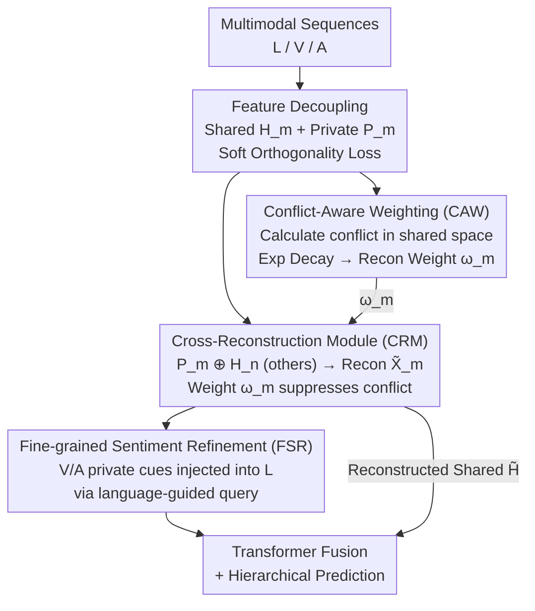

# Conflict-Aware Adaptive Cross-Reconstruction for Multimodal Sentiment Analysis

**Conference**: CVPR 2026  
**Paper**: [CVF Open Access](https://openaccess.thecvf.com/content/CVPR2026/html/Wang_Conflict-Aware_Adaptive_Cross-Reconstruction_for_Multimodal_Sentiment_Analysis_CVPR_2026_paper.html)  
**Code**: None (Repository not disclosed)  
**Area**: Multimodal VLM  
**Keywords**: Multimodal sentiment analysis, Decoupled representation, Sentiment conflict, Cross-reconstruction, Adaptive weighting  

## TL;DR
Addressing the overlooked pain point where "linguistic, visual, and acoustic sentiment polarities contradict each other within the same sample," CACR first quantifies sentiment conflict scores in a shared subspace, then employs a **conflict-weighted cross-reconstruction module** to implicitly align shared semantics and suppress conflicting modalities. By supplementing textual semantics with fine-grained sentiment refinement, it outperforms existing SOTA on three standard datasets.

## Background & Motivation
**Background**: Multimodal Sentiment Analysis (MSA) predicts sentiment intensity from heterogeneous sequences of language (L), vision (V), and audio (A). A mainstream branch is "decoupled representation learning," which splits each modal feature into a **shared subspace** (cross-modal consistent semantics) and a **private subspace** (modality-specific information) to reduce redundancy. Representative methods include MISA, FDMER, DMD, and DLF.

**Limitations of Prior Work**: These decoupling methods implicitly assume that "different modalities of the same sample share consistent sentiment polarity." Consequently, they perform two operations: (1) Each modality reconstructs itself using **only its own** shared and private features (intra-modal reconstruction); (2) They use **similarity losses** to forcibly pull shared features of all modalities together. However, sentiment conflict often occurs in real-world videos—for instance, positive spoken words (language) vs. disappointed facial expressions and tones (vision/audio). Similarity alignment forces these contradictory features closer, distorting the shared semantics and leading to incorrect predictions.

**Key Challenge**: The model must learn **consistent** semantic representations in the shared subspace while **suppressing** contradictory information within a sample—consistency alignment and conflict suppression are naturally at odds. Pulling all modalities together indiscriminately allows the noisiest conflicting modality to contaminate the shared representation.

**Goal**: (1) Formally define "sentiment conflict" and quantify it per-sample; (2) Implicitly align shared representations without relying on similarity constraints; (3) Adaptively down-weight conflicting modalities during the alignment process.

**Key Insight**: The authors observe that since "self-reconstruction + similarity alignment" is susceptible to conflict contamination, it should be replaced with **cross-reconstruction**: using shared features from other modalities to reconstruct the current modality. If shared semantics are truly consistent, cross-reconstruction should be feasible. Greater conflict makes cross-reconstruction harder, allowing a weight to suppress it, thereby turning "alignment" into a soft constraint adaptively adjusted by conflict scores.

**Core Idea**: Use "conflict-aware weighted cross-reconstruction" instead of "self-reconstruction + similarity loss," allowing shared representations to align implicitly while automatically down-weighting conflicting modalities.

## Method

### Overall Architecture
The input to CACR consists of three modal sequences (L, V, A) for a sample, and the output is the predicted sentiment intensity. The pipeline comprises five steps: first, decoupling each modality into shared/private features; second, calculating **sentiment conflict scores** in the shared subspace to map them to cross-reconstruction weights; third, using the **Cross-Reconstruction Module** to rebuild each modality from "its own private features + others' shared features," implicitly aligning shared semantics and suppressing conflicting modalities under weighting; fourth, using **Fine-grained Sentiment Refinement** to inject sentiment cues from V/A private features into the language branch; finally, fusing the (reconstructed) shared representations with refined private representations for hierarchical prediction.

### Key Designs

**1. Conflict-Aware Weighting (CAW): Quantifying "Sentiment Conflict" into Optimizable Weights**

This is the core of the paper, addressing the pain point that "existing methods treat modal heterogeneity as consistency and ignore intra-sample conflict." The authors first provide a formal definition: conflict occurs only when different modalities of the same sample express **contradictory sentiment semantics** within the shared subspace—choosing the shared space rather than the raw/private space avoids misidentifying natural modal heterogeneity as conflict. Specifically, for target modality $m$, the shared features $H_m^{(i)}$ are temporally pooled into a global vector $h_m^{(i)}$. Its cosine distance $d_{m,n}^{(i)} = 1 - \cos(h_m^{(i)}, h_n^{(i)})$ is calculated with each modality $n$ in the complementary set $S_m = M \setminus \{m\}$. The sample-level conflict score is the average $C_m^{(i)} = \frac{1}{|S_m|}\sum_n d_{m,n}^{(i)}$.

Exponential decay then maps the conflict score to a cross-reconstruction loss weight:

$$\hat{\omega}_m^{(i)} = \exp\!\left(\frac{-C_m^{(i)}}{\tau}\right), \qquad \omega_m^{(i)} = \max\{\hat{\omega}_m^{(i)},\, \omega_{min}\}$$

where $\tau>0$ controls the decay rate and $\omega_{min}$ is a lower bound (preventing conflicting modalities from being entirely erased). The intuition is clear: when conflict is low ($C_m \to 0$), $\omega_m \to 1$, preserving the full reconstruction constraint to encourage alignment; when conflict is high, $\omega_m$ decays exponentially, reducing the contribution of the conflicting modality to the loss and explicitly suppressing its negative impact.

**2. Adaptive Weighted Cross-Reconstruction Module (CRM): Implicit Alignment without Similarity Loss**

Addressing the pain point that "self-reconstruction + similarity alignment distorts shared semantics of conflicting samples." For each target modality $m$, CRM concatenates its private feature $P_m$ with the **shared features** $H_n$ of other modalities. A 1D convolutional decoder $D_{nm}$ generates cross-modal interaction features $\tilde{X}_{nm} = D_{nm}([H_n \oplus P_m])$, which are linearly fused into the target reconstruction $\tilde{X}_m = F(\tilde{X}_{nm})$. The key lies in the loss: per-sample reconstruction error $\ell_m^{(i)} = \lVert \tilde{X}_m^{(i)} - X_m^{(i)} \rVert_2$, weighted by the normalized weights from Design 1:

$$\mathcal{L}_m = \frac{\sum_{i=1}^N \omega_m^{(i)}\,\ell_m^{(i)}}{\sum_{i=1}^N \omega_m^{(i)}}, \qquad \mathcal{L}_{recon} = \sum_m \mathcal{L}_m$$

Since the target modality is reconstructed using "shared features from others," reconstruction succeeds only when shared semantics are truly consistent across modalities. This converts "shared alignment" from an external similarity constraint into an inherent implicit constraint of the reconstruction goal; $\omega_m$ automatically relaxes this constraint for high-conflict samples. After reconstruction, $\tilde{X}_m$ undergoes decoupling again to obtain $\tilde{H}_m, \tilde{P}_m$. These are concatenated as $\tilde{H} = [\tilde{H}_L; \tilde{H}_V; \tilde{H}_A]$ for downstream use. A private preservation loss $\mathcal{L}_p = \sum_m \lVert \tilde{P}_m - P_m \rVert^2$ is added to prevent private features from shifting.

**3. Fine-grained Sentiment Refinement (FSR): Language-Driven Injection of Cues**

Addressing the issue that "language dominates sentiment semantics, but vision/audio contain fleeting fine-grained cues (e.g., a momentary frown) that are easily lost." Unlike the mutual cross-attention in DLF, FSR treats language as a **unidirectional query**: fine-grained features $P'_V, P'_A$ are extracted from $P_V, P_A$, and then linguistic private features $P_L$ serve as the query to selectively aggregate relevant cues from vision/audio via a text-guided enhancement layer, fusing them back into $P_L$ to obtain $P'_L$. This maintains the dominance of language while supplementing it with subtle modal cues.

**4. Hierarchical Fusion and Prediction: Joint Optimization of Shared and Private Branches**

Refined $P'_L, P'_V, P'_A$ pass through a multimodal Transformer to model dependencies, yielding enhanced private features $TP'_m$. Reconstructed shared features $\tilde{H}_m$ pass through a self-attention Transformer to yield $T\tilde{H}$. These are concatenated as $M = \mathrm{Cat}(TP'_L, TP'_V, TP'_A, T\tilde{H})$. Following DLF's hierarchical prediction, auxiliary classifiers are added to both branches, with the distinction being that CACR's shared features originate from **cross-reconstruction estimates**, ensuring stronger cross-modal consistency. The prediction loss uses L1: $\mathcal{L}_f = \frac{1}{N}\sum_i |\hat{y}_i - y_i|$.

### Loss & Training
The main MSA loss is a weighted sum of the fusion prediction, shared branch, and private branch losses:

$$\mathcal{L}_{MSA} = \alpha \mathcal{L}_f + \beta \mathcal{L}_{T\tilde{H}} + \sum_{m \in \mathcal{M}} \mathcal{L}_{TP'_m}$$

The total objective adds cross-reconstruction, soft orthogonality, and private preservation losses:

$$\mathcal{L}_{total} = \mathcal{L}_{MSA} + \mathcal{L}_{recon} + \mathcal{L}_o + \mathcal{L}_p$$

where the soft orthogonality loss $\mathcal{L}_o = \sum_m |\cos(H_m, P_m)|$ ensures shared and private subspaces are orthogonal to reduce redundancy.

## Key Experimental Results

### Main Results
Evaluated on CMU-MOSI, CMU-MOSEI, and CH-SIMS standard datasets (average of 5 runs). CACR consistently leads across all reported metrics.

| Dataset | Metric | CACR | Prev. SOTA | Gain |
|---------|--------|------|------------|------|
| MOSI    | ACC7 ↑ | **48.69** | 47.80 (EMOE) | +0.89 |
| MOSI    | ACC2 ↑ | **87.04** | 85.67 (DLF)  | +1.37 |
| MOSI    | MAE ↓  | **0.710** | 0.710 (EMOE) | +0.00 |
| MOSEI   | ACC7 ↑ | **54.41** | 54.10 (EMOE) | +0.31 |
| MOSEI   | ACC2 ↑ | **85.37** | 85.30 (EMOE) | +0.07 |
| CH-SIMS | ACC2 ↑ | **81.62** | 78.56 (MulT/DLF) | +3.06 |
| CH-SIMS | F1 ↑   | **80.99** | 79.66 (MulT) | +1.33 |

The gain on CH-SIMS is most significant (+3 points in ACC2). Compared to other decoupling paradigms like MISA, FDMER, DMD, and DLF, CACR alleviates semantic ambiguity caused by similarity constraints through CRM implicit alignment and CAW conflict suppression.

### Ablation Study
Ablation of core components on MOSI:

| Configuration | ACC7 ↑ | ACC2 ↑ | MAE ↓ | Description |
|---------------|--------|--------|-------|-------------|
| **CACR (Full)** | **48.69** | **87.04** | **0.710** | — |
| w/o CRM       | 40.23 | 84.15 | 0.791 | Removing cross-reconstruction drops ACC7 by 8.5 pts |
| w/o CAW       | 44.31 | 83.84 | 0.752 | Fixing weight to 1 drops 4.4 pts |
| gating        | 44.98 | 84.91 | 0.747 | Replacing with generic gating still drops 3.7 pts |
| w/o FSR       | 46.79 | 86.43 | 0.751 | Removing refinement drops 1.9 pts |
| w/o $\mathcal{L}_o$ | 40.96 | 85.06 | 0.779 | Decoupling fails without orthogonality loss |
| w/o $\mathcal{L}_p$ | 42.53 | 84.76 | 0.788 | Private features drift, dropping 6.2 pts |

### Key Findings
- **CRM is the Foundation**: Removing the CRM module causes ACC7 to plummet from 48.69 to 40.23, proving cross-modal semantic alignment is the bedrock of the model.
- **CAW's Gain Stems from "Explicit Conflict Modeling"**: Replacing CAW with generic gating (44.98) is significantly worse than the full model (48.69), suggesting that per-sample conflict quantification and down-weighting are crucial.
- **Orthogonality Loss is Unexpectedly Critical**: Removing $\mathcal{L}_o$ drops ACC7 by 7.7 points—if shared/private subspaces are not orthogonal, decoupling collapses, affecting all downstream components.
- **Strong Compatibility**: Upgrading to stronger encoders (DeBERTa-large, MA-Net, wav2vec-large, denoted as CACR-S) further boosts performance, showing the method works at the feature level independently of specific backbones.

## Highlights & Insights
- **Turning "Alignment" into "Reconstruction" is a stroke of genius**: Traditional methods use similarity losses as an external alignment constraint. This paper forces the target modality to be rebuilt from others' shared features—successful reconstruction inherently implies consistent shared semantics.
- **Conflict Score → Exponential Decay Weighting is a clean, transferable design**: Defining sample-level conflict via the average cosine distance in the shared space and mapping it using $\exp(-C/\tau)$ with an $\omega_{min}$ lower bound is a paradigm that can migrate to any multi-source learning scenario involving conflicting sub-signals.
- **FSR's Unidirectional Query is Judicious**: Rather than using bidirectional cross-attention, it asserts language dominance and lets text "pull" fine-grained cues from other modalities, saving computation while aligning with real-world sentiment expression roles.

## Limitations & Future Work
- **Conflict Definition Depends on Shared Space Geometry**: The conflict score relies entirely on cosine similarity in the shared space. If the initial decoupling is poor, the conflict metric becomes unreliable, creating a "chicken-and-egg" coupling.
- **Language-Led is a Strong Prior**: FSR fixes language as the query. For samples where language is missing or sarcastic (text is opposite to actual sentiment), this prior may be harmful. ⚠️ The paper did not evaluate sarcasm scenarios specifically.
- **Validated Only on Short Video Benchmarks**: Results are based on short clips; performance on long-form videos or real-time streams remains unknown.

## Related Work & Insights
- **vs. DLF**: DLF also uses decoupling and hierarchical prediction but relies on similarity losses for alignment. CACR argues similarity alignment distorts conflicting samples and replaces it with weighted cross-reconstruction, yielding stronger consistency.
- **vs. MISA / FDMER / DMD**: These methods assume sentiment consistency and perform intra-modal reconstruction. CACR's fundamental difference is **explicitly acknowledging and quantifying intra-sample sentiment conflict**.
- **vs. Fusion-based (Self-MM, TFN)**: Fusion methods focus on how to integrate multimodal information but are less sensitive to internal modal contradictions. CACR is orthogonal to these and can be combined with improved fusion mechanisms.

## Rating
- Novelty: ⭐⭐⭐⭐ Explicitly formalizing "intra-sample sentiment conflict" and replacing similarity alignment with weighted cross-reconstruction is a novel and self-consistent perspective.
- Experimental Thoroughness: ⭐⭐⭐⭐ Three datasets + detailed ablation + compatibility/confusion matrix/case studies; however, limited to classic benchmarks.
- Writing Quality: ⭐⭐⭐⭐ Motivation, definition, and mechanism progress logically; formulas and figures are clear.
- Value: ⭐⭐⭐⭐ The "quantify contradiction then soft down-weight" paradigm is highly transferable to other multi-source/multimodal learning tasks.

<!-- RELATED:START -->

## Related Papers

- [\[CVPR 2026\] CICA: Coupling Confidence-Aware Pretraining with Confidence-Informed Attention for Robust Multimodal Sentiment Analysis](cica_coupling_confidence-aware_pretraining_with_confidence-informed_attention_fo.md)
- [\[CVPR 2026\] Factorize, Reconstruct, Enhance: A Unified Framework for Multimodal Sentiment Analysis](factorize_reconstruct_enhance_a_unified_framework_for_multimodal_sentiment_analy.md)
- [\[CVPR 2026\] Prototype-as-Prompt: Multimodal Sentiment Prototypes Endowing Large Language Models the Capability to Perform Multimodal Sentiment Analysis](prototype-as-prompt_multimodal_sentiment_prototypes_endowing_large_language_mode.md)
- [\[CVPR 2026\] Enhance-then-Balance Modality Collaboration for Robust Multimodal Sentiment Analysis](enhance-then-balance_modality_collaboration_for_robust_multimodal_sentiment_anal.md)
- [\[CVPR 2026\] Multi-Metric Representation Learning Strategy Based on Clustering for Fine-Grained Multimodal Sentiment Analysis](multi-metric_representation_learning_strategy_based_on_clustering_for_fine-grain.md)

<!-- RELATED:END -->
