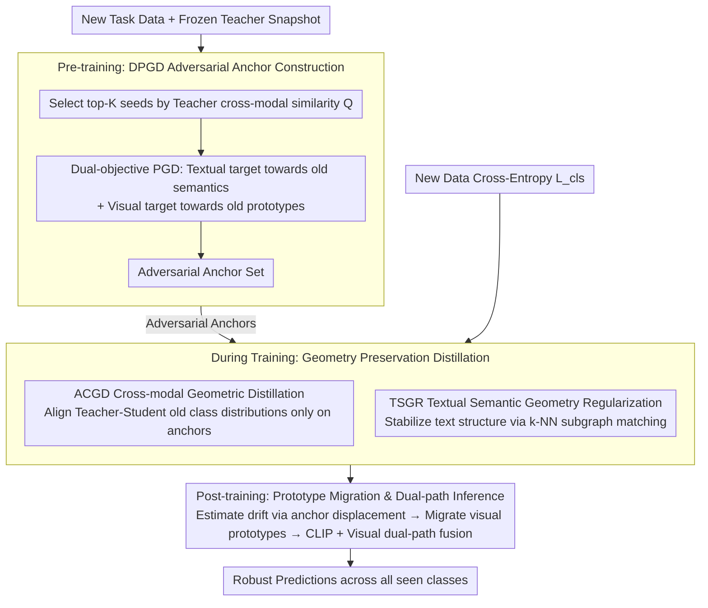

# Continual Learning with Vision-Language Models via Semantic-Geometry Preservation

**Conference**: CVPR2026  
**arXiv**: [2603.12055](https://arxiv.org/abs/2603.12055)  
**Code**: TBD  
**Area**: Multimodal VLM  
**Keywords**: Continual Learning, Vision-Language Models, Semantic-Geometry Preservation, Adversarial Anchors, Cross-modal Distillation, CLIP, Exemplar-free

## TL;DR

SeGP-CL is proposed to probe fragile regions at old-new semantic boundaries using adversarial anchors. By combining Anchor-guided Cross-modal Geometric Distillation (ACGD) and Textual Semantic Geometry Regularization (TSGR), it effectively preserves the cross-modal semantic-geometric structure of VLMs under exemplar-free conditions, significantly mitigating catastrophic forgetting.

## Background & Motivation

**Key Challenge of VLM Continual Learning**: Pre-trained vision-language models (e.g., CLIP) suffer from catastrophic forgetting during continual learning. Existing methods fail to explicitly preserve the cross-modal semantic-geometric structure when adapting to new tasks, leading to geometric distortion induced by new task supervision signals.

**Vulnerability at Semantic Boundaries**: The authors' key observation is that harmful representation drift is not uniformly distributed in the embedding space but is concentrated at the intersections of old and new semantics. In these regions, new samples share visual patterns with old classes and are easily "reinterpreted" by new textual semantics, thereby destroying established vision-text alignment.

**Limitations of Prior Work**: Conservative strategies using frozen backbones and task-specific components (L2P, DualPrompt, PROOF, etc.) excessively isolate knowledge and limit forward transfer. Parameter-efficient fine-tuning (PEFT) methods like LoRA/Adapter lack targeted modeling for cross-modal stability. Methods leveraging textual priors (DesCLIP, CLG-CBM) still pay insufficient attention to cross-modal geometric preservation under exemplar-free conditions.

**Limitations of Reference Data Schemes**: Some methods (ZSCL, DualTeacher) use additional reference datasets to stabilize geometric structures, but they introduce non-trivial data overhead and the constraints are not precise enough—they cannot concentrate constraints on the boundary regions most prone to distortion.

**Key Challenge (Modality Gap)**: The vision and text embedding spaces in VLMs do not correspond perfectly (modality gap). Relying solely on textual semantics cannot fully represent the visual space; complementary reasoning combined with original visual cues is required.

**Key Insight (Constructive Use of Adversarial Attacks)**: VLMs are sensitive to small perturbations, which can be utilized constructively. Adversarial perturbations can expose and cover the most fragile neighborhoods in the old geometric structure, providing an efficient probing mechanism for geometric preservation without exemplars.

## Method

### Overall Architecture

SeGP-CL aims to solve the problem where new task supervision distorts established cross-modal semantic geometry in VLMs like CLIP, causing catastrophic forgetting. The authors found that this distortion is concentrated at old-new semantic boundaries. Thus, a three-stage exemplar-free framework is designed: **Pre-training**, freeze the teacher snapshot $(F^T, G^T)$ and generate a set of adversarial anchors $\mathcal{A}_t$ from new task data using Dual-objective Projected Gradient Descent (DPGD) to precisely locate fragile boundaries; **During training**, optimize cross-entropy on new data while performing ACGD distillation on anchors to protect cross-modal structures and employing TSGR to stabilize the textual semantic reference frame; **Post-training**, estimate visual space drift using anchors to migrate old class prototypes and fuse cross-modal and visual cues via dual-path inference.

### Key Designs

**1. DPGD for Adversarial Anchors: Turning Vulnerability into Boundary Probes**

The hardest part of exemplar-free learning is knowing where forgetting is most likely to occur without storing old data. DPGD exploits VLM sensitivity to perturbations to actively push new task samples into old class semantic regions to expose fragile neighborhoods. First, for each old class $c$, new samples are ranked by teacher cross-modal similarity $Q(x, c) = \bar{v}^T(x)^\top u_c^T$, and the top-$K_{\text{seed}}$ samples are selected as seeds. Then, dual-objective optimization is performed: the textual objective pushes perturbed samples toward old class text embeddings ($\mathcal{L}_{\text{adv}}$), and the visual objective pulls them toward original old class visual prototypes ($\mathcal{L}_{\text{v-adv}}$); the latter specifically corrects instabilities caused by the modality gap. Finally, $K_{\text{adv}}=10$ iterations of signed gradient descent are run under $\ell_\infty$ constraints with step size $\gamma = 1.5 \times 10^{-3}$:

$$\delta^{(k+1)} = \Pi_{\|\delta\|_\infty \leq \epsilon}\big(\delta^{(k)} - \gamma \cdot \text{sign}(\nabla_\delta \mathcal{L}'_{\text{adv}})\big)$$

**2. ACGD: Aligning Distributions Only on Fragile Anchors**

Once fragile boundaries are located, the student's old class probability distribution is aligned with the teacher's at these adversarial anchors to prevent forgetting regions from being rewritten by new semantics:

$$\mathcal{L}_{\text{ACGD}} = \tau_A^2 \cdot \mathbb{E}_{x^{adv} \sim \mathcal{A}_t}\left[\text{KL}(\pi_T^{\tau_A}(\cdot | x^{adv}) \| \pi_S^{\tau_A}(\cdot | x^{adv}))\right]$$

The distillation temperature $\tau_A = 20$, and both teacher and student distributions are computed over the old class set $\mathcal{C}_{<t}$. Compared to distilling on reference or new task data, constraining only the anchor neighborhoods most prone to distortion is much more precise.

**3. TSGR: Maintaining Relative Structure Between Textual Concepts**

If the relative geometry between textual concepts drifts across tasks, it implicitly re-parameterizes old class semantics. TSGR uses $k$-NN subgraph matching to lock this structure. A reference subgraph is built using the pre-trained text encoder $G^0$ reset by LoRA. For each new class $c \in \mathcal{C}_t$, its $k=10$ nearest neighbors are found, and the teacher-student subgraphs are matched. Only the subgraphs of new class roots are constrained, resulting in a complexity of $\mathcal{O}(|\mathcal{C}_t| \cdot k)$, which is much lower than global constraints.

**4. Anchor-driven Prototype Migration & Dual-path Inference: Compensating Visual Drift**

Textual semantics alone cannot fully represent the visual space (modality gap), so the visual side must be calibrated after training. Prototype migration utilizes the visual feature displacement $d_t(x^{adv})$ of anchors before and after training to estimate the weighted drift direction $\Delta_{t,c}$ for each old class, modulating the magnitude based on anchor-prototype proximity. During inference, dual-path fusion combines CLIP cross-modal scores with visual prototype scores $\ell_t(x, c) = s_t^{\text{clip}}(x, c) + \beta \cdot s_t^v(x, c)$, with $\beta=0.5$, allowing the two paths to complement each other.

### Loss & Training

$$\mathcal{L}_{\text{CL}}^t = \mathcal{L}_{\text{cls}} + \lambda_{\text{ACGD}} \cdot \mathcal{L}_{\text{ACGD}} + \lambda_{\text{GR}} \cdot \mathcal{L}_{\text{GR}}$$

Where $\lambda_{\text{ACGD}}=5$, $\lambda_{\text{GR}}=1$, and only the LoRA up-projection matrix B is updated.

## Key Experimental Results

### Main Results: SOTA Comparison on Five Benchmarks (CLIP ViT-B/16)

| Method | CIFAR100 Avg/Last | ImageNet-R Avg/Last | ImageNet-Sub Avg/Last | CUB-200 Avg/Last | UCF Avg/Last |
|---|---|---|---|---|---|
| MG-CLIP (ICCV'25) | 87.0/80.6 | 87.6/82.7 | 87.3/78.4 | 80.6/72.0 | – |
| RAPF (ECCV'24) | 86.2/79.0 | 85.6/80.3 | 87.5/80.2 | 82.7/76.2 | 92.5/87.5 |
| ENGINE (ICCV'25) | 82.1/73.1 | 84.4/77.0 | – | 83.9/76.2 | 95.0/90.1 |
| **SeGP-CL (Ours)** | **89.8/84.6** | **88.9/84.8** | **89.9/80.5** | **85.4/80.1** | **95.9/92.8** |

SeGP-CL achieves SOTA on all five benchmarks, with CIFAR100 Last improving by +4.0 over MG-CLIP and CUB-200 Last improving by +3.9 over RAPF.

### Transfer & Forgetting Metrics (CLIP branch only, CIFAR100)

| Method | FWT ↑ | BWT ↑ | Forgetting ↓ |
|---|---|---|---|
| MG-CLIP | 70.2 | -3.9 | 4.9 |
| DesCLIP | 68.7 | -2.1 | 6.5 |
| **SeGP-CL** | **72.3** | **-0.43** | **0.9** |

SeGP-CL's Forgetting is only 0.9, much lower than MG-CLIP's 4.9. BWT is near zero (-0.43), indicating almost no backward forgetting.

### Ablation Study

| ACGD | TSGR | Proto-Migration | Visual Path | CIFAR100 Last | Forgetting ↓ |
|---|---|---|---|---|---|
| ✗ | ✗ | ✗ | ✗ | 77.0 | 10.9 |
| ✓ | ✗ | ✗ | ✗ | 81.7 | 5.8 |
| ✓ | ✓ | ✗ | ✗ | 82.8 | 4.7 |
| ✓ | ✓ | ✓ | ✗ | 83.2 | 4.3 |
| ✓ | ✓ | ✓ | ✓ | 84.6 | 4.5 |

ACGD contributes the most (Last +4.7, Forgetting -5.1), with TSGR, prototype migration, and the visual branch providing incremental improvements.

### Key Findings

- **Adversarial Anchors vs Other Distillation Sources**: Anchor distillation (+5.8 Last) far outperforms reference data (ZSCL +1.9), synthetic data (GIFT +2.7), and new task data (-0.5).
- **Cross-scenario Generalization**: After training on CIFAR100, the model maintains near zero-shot generalization on Food101/Oxford-Pets/ImageNet-1K (thanks to TSGR).
- **Parameter Efficiency**: With LoRA rank=32, there are only 3.44M trainable parameters (vs 13.35M for MoE-Adapter), with an overhead of only ~79ms per iteration.
- **DPGD Iterations**: 10 iterations are sufficient for stable convergence. The textual objective converges slower than the visual objective (confirming the modality gap).

## Highlights & Insights

- **Precise Problem Localization**: Systematically reveals for the first time that cross-modal geometric distortion in VLM continual learning is concentrated at old-new semantic boundaries, provided with empirical JSD measurements.
- **Constructive Use of Adversarial Attacks**: Ingeniously transforms the adversarial vulnerability of VLMs into a tool for locating fragile regions, probing boundary neighborhoods without storing old data.
- **Dual-objective Design for Modality Gap**: The visual anchoring term in DPGD compensates for the modality gap, preventing unstable anchors from being generated by pure textual objectives.
- **Lightweight and Efficient**: TSGR only constrains $k$-NN subgraphs of new classes, resulting in low parameter overhead and controllable additional computation time per iteration.
- **Unified Theory and Experiment**: Complete logical demonstration ranging from first-order optimality of adversarial optimization to comprehensive SOTA across five benchmarks.

## Limitations & Future Work

- The quality of adversarial anchors depends on hyperparameters like $\ell_\infty$ budget and iteration count, which may require tuning for different datasets.
- TSGR only constrains the textual neighborhood subgraphs of new classes; it cannot detect if textual relationships between old classes drift.
- Prototype migration assumes that the feature drift of anchors serves as a reliable proxy for old class drift, an assumption that might fail if the semantic gap between new and old classes is too large.
- Validated only on CLIP ViT-B/16; larger backbones (e.g., ViT-L) or other VLMs (e.g., SigLIP, EVA-CLIP) have not been tested.
- The fusion coefficient $\beta$ for dual-path inference is fixed; adaptive fusion strategies were not explored.

## Related Work & Insights

- **VLM Continual Learning**: Contrasts with MG-CLIP (maintaining modality gap), ZSCL/DualTeacher (reference data distillation), and ENGINE/RAPF (task-specific components). SeGP-CL requires no extra data and precisely constrains fragile regions.
- **Cross-modal Distillation**: SGCL distills semantic pseudo-label reference distributions on new task data but is less precise than adversarial anchors.
- **Synthetic Data**: GIFT uses Stable Diffusion to synthesize old class images for distillation, but domain gaps limit its effectiveness.
- **Adversarial Robustness**: Utilizes the PGD attack framework, but the goal is shifted from "attacking" to "probing fragile neighborhoods."

## Rating

- Novelty: ⭐⭐⭐⭐⭐ — The idea of using adversarial anchors to probe semantic boundaries is very novel, turning an attack into a defensive tool.
- Experimental Thoroughness: ⭐⭐⭐⭐⭐ — Comprehensive SOTA across five benchmarks, including detailed distillation comparisons, ablations, and generalization analysis.
- Writing Quality: ⭐⭐⭐⭐ — Rigorous formula derivations, but many symbols make the reading threshold somewhat high.
- Value: ⭐⭐⭐⭐⭐ — Provides a new geometric preservation paradigm for VLM continual learning, significantly outperforming predecessors under exemplar-free conditions.

<!-- RELATED:START -->

## Related Papers

- [\[CVPR 2026\] Enhancing Continual Learning of Vision-Language Models via Dynamic Prefix Weighting](enhancing_continual_learning_of_vision-language_models_via_dynamic_prefix_weight.md)
- [\[ICLR 2026\] Enhanced Continual Learning of Vision-Language Models with Model Fusion](../../ICLR2026/multimodal_vlm/enhanced_continual_learning_of_vision-language_models_with_model_fusion.md)
- [\[AAAI 2026\] Branch, or Layer? Zeroth-Order Optimization for Continual Learning of Vision-Language Models](../../AAAI2026/multimodal_vlm/branch_or_layer_zeroth-order_optimization_for_continual_lear.md)
- [\[AAAI 2026\] Harnessing Textual Semantic Priors for Knowledge Transfer and Refinement in CLIP-Driven Continual Learning](../../AAAI2026/multimodal_vlm/harnessing_textual_semantic_priors_for_knowledge_transfer_and_refinement_in_clip.md)
- [\[CVPR 2026\] PACT: Phase-Like Transition Constraints in Adapter-Based Continual Learning of Vision-Language Models](pact_phase-like_transition_constraints_in_adapter-based_continual_learning_of_vi.md)

<!-- RELATED:END -->
