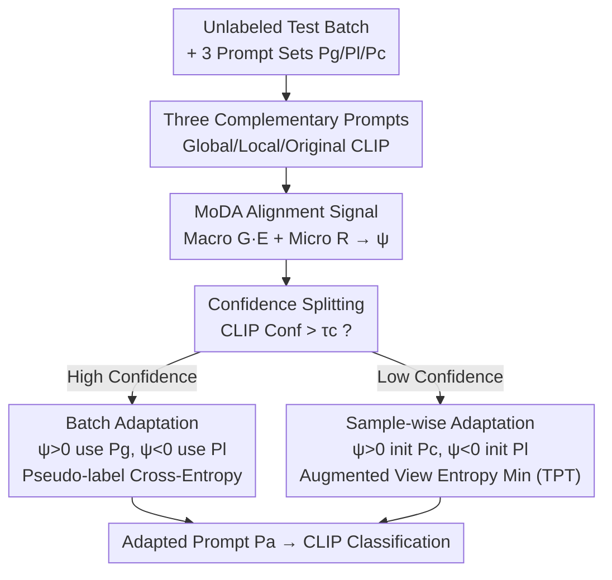

# Controllable Federated Prompt Learning at Test Time

**Conference**: CVPR 2026  
**Paper**: [CVF Open Access](https://openaccess.thecvf.com/content/CVPR2026/html/Zhu_Controllable_Federated_Prompt_Learning_at_Test_Time_CVPR_2026_paper.html)  
**Code**: None (Not yet released)  
**Area**: Multimodal VLM  
**Keywords**: Federated Prompt Learning, Test-Time Adaptation, CLIP, Distribution Shift, Model-Data Alignment  

## TL;DR
Addressing the performance collapse of Federated Prompt Learning models when encountering new domain distribution shifts after deployment, this paper introduces the Test-Time Federated Prompt Learning (TTFPL) setting. It proposes the COTE framework, which utilizes a custom unsupervised Model-Data Alignment (MoDA) score to dynamically select the optimal prompt among "Global, Local, and Original CLIP" prompts, improving average accuracy by over 6% across cross-domain settings on five benchmarks.

## Background & Motivation
**Background**: Federated Prompt Learning (FPL) integrates large vision-language models like CLIP into federated learning. Clients collaborate to optimize a small set of learnable prompt tokens without exchanging model weights, ensuring communication efficiency and privacy. Personalized Federated Prompt Learning (PFPL) further adapts prompts to local distributions using local training data before deployment.

**Limitations of Prior Work**: Personalized prompts in PFPL are tuned on "historical training data." Once deployed in real-world scenarios, shifts in distribution—caused by variations in lighting, background, or perspective—cause these prompts to degrade significantly. Experimental results reveal a stark drop: `PromptFL + FT` achieves 95.68% on the original local test set but collapses to 22.07% when facing OoC data from other clients—higher personalization leads to higher fragility.

**Key Challenge**: Adaptation after deployment faces a dilemma: prompts must align with the local shifted distribution (local alignment) without discarding the global knowledge encoded during federated learning (global retention). Existing Test-Time Adaptation (TTA) methods (e.g., TENT, TPT) assume access to full data, a single shared model, and often require modifying the backbone or relying on classification heads—assumptions that conflict with the constraints of federated environments and frozen CLIP backbones.

**Goal**: Enable each client to dynamically adjust prompts during the inference stage under stringent conditions—only unlabeled test data available, no access to historical samples, and no cross-client communication—while balancing local specialization and global generalization.

**Key Insight**: The authors observe that clients actually possess three complementary prompt sets: Original CLIP prompts (domain-agnostic, most generalized), Global prompts (shared cross-client semantics), and Local prompts (personalized, sensitive to local visual patterns). Instead of a static combination, the choice should depend on the "characteristics" of the current test data in real-time.

**Core Idea**: Use an unsupervised metric that measures "alignment between model prediction distribution and data distribution" (MoDA) to perform controllable, data-aware online selection and fine-tuning among the three prompt sets. Global/Original prompts are used for better generalization when alignment is high, while local prompts are used for specialization when alignment is low.

## Method

### Overall Architecture
The input to COTE (COntrollable TEst-time federated prompt learning) is a batch of unlabeled test samples received by a client post-deployment, along with three sets of prompts $\{P_g, P_l^i, P_c\}$ from the federated phase. The output is an adapted prompt $P_a^i$ for CLIP similarity-based classification. The pipeline consists of three stages: first, obtaining a pseudo-label distribution via frozen CLIP and quantifying it into an alignment signal $\psi$ using the **MoDA metric**; second, splitting the test batch into high and low confidence groups based on sample confidence; and third, performing batch-wise and sample-wise prompt tuning for the two groups respectively, where the selection of the prompt set is determined by the sign of $\psi$. Only the prompts are learnable; the backbone remains frozen with zero external labels.

Predictions follow standard CLIP matching: the text input $t_k(P_a^i)$ for class $k$ is formed by concatenating the adapted prompt with the class name. The logit is $\text{logit}(k)=\mathrm{sim}(f(x), g(t_k(P_a^i)))$, and softmax yields $p(\hat y=k\mid x;P_a^i)=\frac{\exp(\text{logit}(k)/\tau)}{\sum_j \exp(\text{logit}(j)/\tau)}$.

### Key Designs

**1. Three Complementary Prompts + TTFPL Setting: Turning Choice into a Controllable Knob**

Prior FPL/PFPL work stops at the training or pre-deployment stage, failing to handle "unseen domain shifts after deployment." The authors formalize Test-Time FPL (TTFPL): given prompt sets $\Pi_i=\{P_g, P_l^i, P_c\}$ and unlabeled test set $D^{test}_i$, find a local adaptive operator $P_a^i=A_i(\Pi_i, D^{test}_i)$ optimized without labels, history, or communication. Each set manages a layer of knowledge: $P_c$ (Original CLIP, e.g., "a photo of a") provides domain-agnostic priors; $P_g$ (Global prompt) provides cross-client shared semantics; $P_l^i$ (Local personalized prompt, initialized by $P_g$ and tuned on local data) provides fine-grained sensitivity to local visual patterns. This design converts the "local vs. global" dilemma into a controllable problem of dynamic weighting between existing assets.

**2. MoDA (Model-Data Alignment) Score: Unsupervised Fitness Assessment**

MoDA addresses how to determine whether to favor global or local prompts without labels. Starting from pseudo-label distributions (class frequency vector $p_k=n_k/\sum_j n_j$), MoDA characterizes both macro and micro levels. The macro level measures prediction balance across the entire label space $S$ (including unpredicted classes): Normalized Gini $G=\frac{1-\sum_k p_k^2}{1-1/|S|}$ highlights concentration on dominant classes, and Normalized Entropy $E=-\frac{1}{\log|S|}\sum_k p_k\log p_k$ rewards dispersion toward long-tail classes. Micro-level analysis focuses only on the subset of truly activated classes $S_{obs}$, calculating local regularity $R=1-D/D_{max}$ where $D=\sum_{k\in S_{obs}}(p_k-1/|S_{obs}|)^2$. Low $R$ indicates an unstable concentration on few active classes.

These merge into a unified score $M=G^{1-\phi}E^{1-\phi}R^{\phi}$, where weight $\phi=\frac{|S_{obs}|}{|S_{obs}|+|S|}$ adapts to the number of activated classes. The final alignment signal is $\psi=M-\lambda M_{csi}=M_{csi}(\frac{M}{M_{csi}}-\lambda)$, where $M_{csi}$ is a "constant-set-ideal" reference and $\lambda\in(0,1)$ is a stability coefficient. $\psi>0$ implies the distribution matches a model trained on diverse data (favoring global), while $\psi<0$ suggests data bias toward specific features (requiring local adaptation).

**3. Confidence Splitting + Dual-Branch Adaptation**

Applying pseudo-labels to all samples risks being misled by low-confidence predictions. Samples are split into $D_{high}$ and $D_{low}$ using a threshold $\tau_c$ on the maximum class probability $c(x)=\max_y p(y\mid x)$. **The high-confidence branch** performs batch adaptation: $P^\star$ is selected as $P_g\ (\psi>0)$ or $P_l^i\ (\psi<0)$, and refined via cross-entropy $L_{high}=-\frac{1}{|D_{high}|}\sum_{x}\log p(\hat y(x)\mid x)$. **The low-confidence branch** uses Sample-wise Test-time Prompt Tuning (TPT): initialization is chosen as $P_c\ (\psi>0)$ or $P_l^i\ (\psi<0)$. For each uncertain sample, $K_a$ augmented views are generated, and the average entropy $L_{low}=-\frac{1}{|V_\beta(x)|}\sum_{x_k\in V_\beta(x)}H(x_k)$ is minimized for the top-$\beta$ highest entropy views to encourage consistent, low-entropy predictions. This dual-branch strategy allows reliable samples to drive refinement while uncertain samples are updated cautiously.

## Key Experimental Results

### Main Results
Testing on five benchmarks (CIFAR100, ImageNet and variants, Caltech101, Flowers102, Food101) with Dirichlet $\alpha=0.01$ to simulate extreme non-IID federated environments. Four types of test shifts were constructed: Ori (Original), Corr (Corrupted), OoC (Out-of-Client data), and Mix. The backbone used was frozen CLIP ViT-B/16 with 16 learnable prompt tokens.

| Dataset | Metric (Avg) | COTE | Strongest Baseline (TPT) | OoC Single Gain |
|--------|-----------|------|---------------|---------------|
| CIFAR100 | 71.08 | 64.17 | 19.2 → 42.17 |
| ImageNet | 81.44 | 75.21 | 6.9 → 36.6 |
| Caltech101 | 95.14 | 92.94 | +2.7 |
| Flowers102 | 86.49 | 81.56 | +5.7 |
| Food101 | 81.74 | 73.84 | +23.4 |

The most significant gains occurred in the OoC (Out-of-Client) setting: accuracy rose from 19.2% to 42.17% on CIFAR100 and from 6.9% to 36.6% on ImageNet compared to TPT. Personalized baselines (FedOTP, pFedMoAP) failed on OoC data (only 2~4% on ImageNet OoC), confirming that stronger personalization leads to higher cross-domain fragility.

### Ablation Study

| Configuration | CIFAR100 Avg | ImageNet Avg | Note |
|------|--------------|--------------|------|
| Gini only | 67.14 | — | Biased toward dominant classes |
| Entropy only | 70.89 | — | Second best, pure uncertainty cue |
| Regularity only | 67.15 | — | Biased toward active classes |
| MoDA (Full) | 71.08 | — | Most stable macro+micro fusion |
| High-conf branch only | 65.04 | 74.23 | OoC performance collapses without splitting |
| Low-conf branch only | 64.17 | 75.21 | Similar collapse as above |
| COTE (Full) | 71.08 | 81.44 | Dual-branch synergy |

### Key Findings
- **Confidence splitting is the key to OoC gains**: Using only a single branch for all samples causes CIFAR100 OoC to drop from 42.34% back to ~20%, and ImageNet OoC to ~6%, indicating that the separation strategy provides nearly all cross-domain robustness.
- **MoDA vs. Single-factor Metrics**: While pure entropy is strong in large-scale label spaces, MoDA's fusion of macro (G, E) and micro (R) perspectives is more reliable across varying or imbalanced client distributions.
- **Hyperparameter Sensitivity**: The stability coefficient $\lambda=0.9$ was found to be optimal. An adaptive $\phi$ (auto-weighting based on activated class count) performed as well as or better than fixed values, validating the adaptive weighting mechanism.

## Highlights & Insights
- **Quantifying "Trust" as an Unsupervised Switch**: The $\psi$ signal from MoDA effectively uses the shape of the prediction distribution to infer model-data fitness without labels or backbone modification. This logic is transferable to any scenario involving online selection between multiple candidate weights.
- **Dual Perspective (Macro+Micro) Alignment**: By combining macro-level Gini/Entropy with micro-level Regularity via an adaptive index $\phi$, the method prevents any single factor from failing under specific label distributions.
- **Zero-Cost Asset Reuse**: Global, Local, and CLIP prompts are natural products of the federated phase. COTE requires no new parameters or retraining, making it ideal for IoT edge deployment.
- **The Pitfalls of Personalization**: The catastrophic failure of PFPL methods on OoC data serves as a compelling warning against "blind personalization."

## Limitations & Future Work
- **Dependency on Statistical Reliability**: MoDA relies on the frequency of pseudo-labels in a test batch. When the number of test samples is extremely small or classes are highly concentrated, estimates of $G/E/R$ may become unstable.
- **Hard Selection of $\psi$**: The binary choice ($\psi>0$ vs. $\psi<0$) for prompt selection is somewhat coarse; soft weighting fusion might offer smoother transitions for boundary samples.
- **Hyperparameter Sensitivity**: Parameters like $\tau_c$, $\lambda$, and $\beta$ require tuning. Gains are highly concentrated in heavy shift scenarios, with minimal difference on the original (Ori) distribution.
- **Lack of Open Source**: The code and certain details are currently unavailable, and some optimization directions (e.g., negative entropy in formula vs. text) require verification against the original manuscript.

## Related Work & Insights
- **Comparison with FPL (PromptFL / FedOTP)**: These methods stop before deployment and fail to handle unknown shifts; COTE’s dynamic selection at inference time leads to massive gains on OoC data.
- **Comparison with PFPL (pFedPrompt)**: Personalized prompts are tied to historical data; COTE treats the local prompt as one of three candidates, using MoDA to decide when to trust it or revert to global/CLIP prompts.
- **Comparison with Centralized TTA (TENT / TPT)**: These often require modifying backbones or classification heads; COTE provides a head-free, prompt-level adaptation suitable for frozen CLIP models.

## Rating
- Novelty: ⭐⭐⭐⭐⭐ First to propose the TTFPL setting and unsupervised MoDA-driven selection.
- Experimental Thoroughness: ⭐⭐⭐⭐ Complete analysis across benchmarks/shifts/ablations, though small-batch robustness is missing.
- Writing Quality: ⭐⭐⭐⭐ Clear motivation and complete formulas.
- Value: ⭐⭐⭐⭐ Addresses critical domain shift issues in federated VLM deployment with a deployable, zero-retraining method.

<!-- RELATED:START -->

## Related Papers

- [\[CVPR 2026\] STAR: Test-Time Adaptation Can Enhance Universal Prompt Learning for Vision-Language Models](star_test-time_adaptation_can_enhance_universal_prompt_learning_for_vision-langu.md)
- [\[CVPR 2026\] TTL: Test-time Textual Learning for OOD Detection with Pretrained Vision-Language Models](ttl_test-time_textual_learning_for_ood_detection_with_pretrained_vision-language.md)
- [\[CVPR 2026\] Improving Calibration in Test-Time Prompt Tuning for Vision-Language Models via Data-Free Flatness-Aware Prompt Pretraining](improving_calibration_in_test-time_prompt_tuning_for_vision-language_models_via_.md)
- [\[CVPR 2026\] SoC: Semantic Orthogonal Calibration for Test-Time Prompt Tuning](soc_semantic_orthogonal_calibration_for_test-time_prompt_tuning.md)
- [\[CVPR 2026\] Dynamic Logits Adjustment and Exploration for Test-Time Adaptation in Vision Language Models](dynamic_logits_adjustment_and_exploration_for_test-time_adaptation_in_vision_lan.md)

<!-- RELATED:END -->
