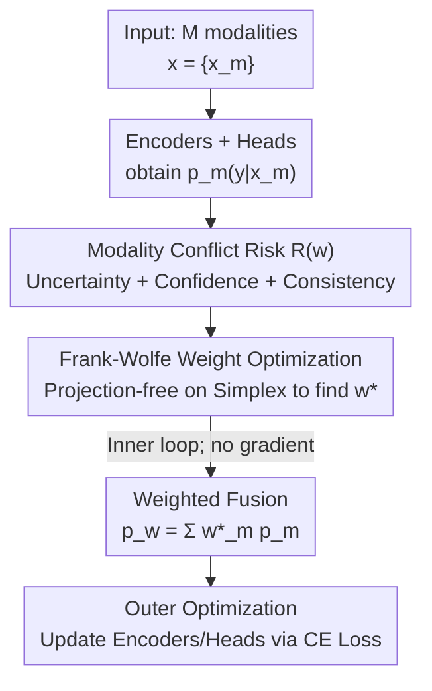

# CoRiM: Conflict-driven Risk Minimization for Dynamic Multimodal Fusion

**Conference**: CVPR 2026  
**Paper**: [CVF Open Access](https://openaccess.thecvf.com/content/CVPR2026/html/Zou_CoRiM_Conflict-driven_Risk_Minimization_for_Dynamic_Multimodal_Fusion_CVPR_2026_paper.html)  
**Code**: None  
**Area**: Multimodal Fusion / Dynamic Multimodal Fusion  
**Keywords**: Dynamic multimodal fusion, modality conflict, risk minimization, Frank-Wolfe, probability simplex  

## TL;DR
This paper redefines dynamic multimodal fusion as a "per-sample optimization problem that directly minimizes conflict risk." It designs a differentiable modality conflict risk function $R(w)$ (comprising fusion uncertainty, modality confidence priors, and JS consistency) and employs the projection-free Frank-Wolfe algorithm to find optimal modality weights on the probability simplex. This approach significantly outperforms state-of-the-art methods like QMF and PDF in high-conflict and noisy scenarios.

## Background & Motivation
**Background**: Multimodal decision-making (e.g., autonomous driving, multimodal sentiment analysis, clinical diagnosis) relies on the integration of information from multiple modalities. Traditional fusion methods use fixed weights or global attention, assuming constant modality contributions. In recent years, the mainstream has shifted toward **Dynamic Multimodal Fusion (DMF)**, which adaptively adjusts modality weights per sample. Representative theoretically-grounded methods include QMF (based on generalization theory, correlating fusion weights negatively with single-modality loss) and PDF (further suggesting weights should correlate positively with the "loss of other modalities").

**Limitations of Prior Work**: The core paradigm of these methods involves **fitting scalar proxies**—such as estimated uncertainty, loss, or confidence in the true class—to indirectly satisfy correlations derived from generalization upper bounds. However, when **conflicts in prediction distributions** occur between modalities (where two modalities provide vastly different posterior distributions for the same input), a single scalar cannot capture the full risk brought by such distributional inconsistency. Fixed or heuristic weighting in these cases **amplifies prediction bias**, potentially making the fusion result inferior to single-modality performance.

**Key Challenge**: The authors conducted a fine-grained analysis on NYUD v2, quantifying "conflict intensity" using the symmetric KL divergence between single-modality prediction distributions. The results revealed that while absolute accuracy decreases on high-conflict samples, the **relative gain $\Delta\mathrm{Acc}$ of fusion over single modalities monotonically increases with conflict intensity**. In other words, modality conflict is not merely noise to be suppressed but a valuable signal indicating when dynamic fusion is most beneficial—provided the fusion strategy is properly designed. Existing scalar paradigms discard this distribution-level signal.

**Goal**: Shift dynamic fusion from "empirical weighting/confidence calibration" to "directly minimizing a conflict-driven risk term in the probability space" to tighten the generalization upper bound of the fused result.

**Key Insight**: Drawing from classic generalization bounds in domain adaptation—where target risk is controlled by source risk plus a divergence term (Div)—analogy is made to multimodality: fusion risk $R \lesssim R_{\text{avg}} + \mathrm{Div}(p_1,\dots,p_M) + \lambda$, where $\mathrm{Div}$ measures the inconsistency of modality prediction distributions. When modalities are consistent, $\mathrm{Div}\approx 0$; as conflict increases, the bound loosens. Thus, **optimal fusion equals finding a set of weights that minimizes modality inconsistency within the prediction distribution space**.

**Core Idea**: Replace scalar loss proxies with a **differentiable modality conflict risk $R(w)$**, transforming dynamic fusion into a constrained optimization problem of "directly minimizing $R(w)$ per-sample on the probability simplex," solved efficiently using the Frank-Wolfe algorithm.

## Method

### Overall Architecture
Given a sample $x=\{x_m\}_{m=1}^M$ with $M$ modalities, each modality passes through its own encoder $f_m(\cdot)$ and classification head to obtain a prediction distribution $p_m(y|x_m)$. Instead of predicting a scalar weight, CoRiM treats the modality weights $w$ as **optimization variables** for each sample, directly minimizing the conflict risk $R(w)$ on the probability simplex $\Delta^{M-1}$. After obtaining $w^\*$, the weighted fusion $p_w=\sum_m w_m p_m$ is performed, and the entire model is trained using cross-entropy.

The training involves **two levels**: the inner loop is a per-sample Frank-Wolfe (FW) weight optimization (finding $w^\*$, **without backpropagating gradients**—it only selects the optimal weights for the current sample); the outer loop is standard model parameter optimization (CE loss, backpropagating gradients to update encoders and classification heads). This decoupling of "inner weight optimization and outer representation learning" prevents weight optimization iterations from polluting the main network's gradients.

### Key Designs

**1. Modality Conflict Risk (MCR): Defining "Distribution-level Conflict" as a Differentiable Objective**

The pain point is that scalar proxies (loss/confidence) cannot capture conflicts between prediction distributions. This paper directly defines per-sample risk in the probability space. First, the fused prediction is written as a weighted average $p_w=\sum_{m=1}^M w_m p_m$, then:

$$R(w) = \underbrace{\alpha H(p_w)}_{\text{Fusion Uncertainty}} + \underbrace{\beta H_m(w)}_{\text{Modality Confidence}} + \underbrace{\gamma \mathrm{JS}_m(w)}_{\text{JS Consistency}}$$

The three terms serve distinct roles: $H(p_w)=-\sum_c p_w(c)\log p_w(c)$ is the **entropy of the fused distribution**, driving the model to find an unambiguous (least blurry) fusion solution; $H_m(w)=\sum_{m}w_m H(p_m)$ is the weighted average of individual modality entropies, serving as a **prior confidence term** (tie-breaker) that favors modalities which are inherently more certain (lower entropy); $\mathrm{JS}_m(w)=\frac{1}{M}\sum_m \mathrm{JS}(p_m\Vert p_w)$ is the average Jensen-Shannon divergence of each modality relative to the fused consensus $p_w$, **punishing outlier modalities** that deviate from the consensus. $\alpha,\beta,\gamma\ge 0$ are hyperparameters.

Why this works: Following the generalization bound in Eq.(3), the authors instantiate the conflict term into these three differentiable components, yielding a decomposed upper bound $R(f_w)\lesssim R_{\text{avg}}+C_1H(p_w)+C_2H_m(w)+C_3\mathrm{JS}_m(w)+\lambda$ ($C_1,C_2,C_3>0$). This indicates that **minimizing $R(w)$ at the sample level is equivalent to tightening the overall risk bound**. Thus, $R(w)$ is a proxy for the generalization error, and its optimal solution $w^\*=\arg\min_{w\in\Delta^{M-1}}R(w)$ corresponds to the most robust fusion weights. This is more direct than "fitting a scalar" and turns conflict from "noise" into an "optimizable signal."

**2. Frank-Wolfe Solver: Projection-free Minimization of Non-convex $R(w)$ on the Simplex**

The weights $w$ must lie on the probability simplex $\Delta^{M-1}$ (non-negative, sum to 1). Projected Gradient Descent (PGD) requires a costly simplex projection at every step, and since $R(w)$ is **non-convex** due to the $H(p_w)$ term, classic FW convergence guarantees do not apply directly. This paper selects FW precisely because it **avoids projection entirely** by linearizing the objective and updating in the direction of the simplex vertices.

Specifically, each step calculates the gradient $g_t=\nabla_w R(w_t)$ (measuring the contribution of each modality to total risk), then solves the linear subproblem $s_t=\arg\min_{s\in\Delta^{M-1}}\langle s,g_t\rangle$. Since the minimum of a linear objective on a simplex occurs at a vertex, $s_t=e_{m^\star}$ where $m^\star=\arg\min_m [g_t]_m$—identifying the **most reliable modality that reduces risk the fastest** for the current sample. A convex combination update $w_{t+1}=(1-\eta_t)w_t+\eta_t s_t$ is then performed, which is effectively linear interpolation toward the steepest descent vertex, naturally ensuring the result stays within the simplex. This process iteratively increases the weight of low-risk modalities and suppresses high-conflict ones.

Convergence guarantees: The authors prove that $R(w)$ is not just any non-convex function but is **L-smooth** (Lipschitz continuous gradient), satisfying the premises of modern non-convex optimization theory and ensuring FW converges to a stationary point. $R(w)$ also possesses a Difference-of-Convex (DC) structure, for which FW is theoretically robust. With $\eta_t=\eta\le 1/\sqrt{T}$, the FW stationary gap $\min_{t}G_t(w_t)=O(1/\sqrt{T})$ converges sublinearly; since per-sample modality confidence distributions are typically unimodal, convergence is achieved in a few steps in practice. ⚠️ Check the original paper for rigorous formula details.

**3. Gradient Component Analysis: Explaining "Weight Adjustment" for Each Term**

Since every FW step follows the direction of $\nabla R(w)$, this gradient determines whether a modality is weighted up or down. The gradient for modality $m$ is split into three parts:

$$\nabla_{w_m}R(w) = \alpha\nabla_{w_m}H(p_w) + \beta\nabla_{w_m}H_m(w) + \gamma\nabla_{w_m}\mathrm{JS}_m(w)$$

The **fusion uncertainty gradient** $\nabla_{w_m}H(p_w)=-\sum_c p_m(c)[1+\log p_w(c)]$ drives the model toward modalities aligned with high-confidence parts of the fusion prediction, reducing overall ambiguity. The **modality confidence gradient** $\nabla_{w_m}H_m(w)=H(p_m)$ is a constant serving as a static prior, consistently favoring modalities that are more certain a priori. The **consistency gradient** $\nabla_{w_m}\mathrm{JS}_m(w)$ punishes modalities deviating from the consensus. Together, they determine the instantaneous descent rate of each modality, based on which FW selects the vertex (modality) minimizing $\langle s_t,g_t\rangle$, directly tightening the risk bound. This decomposition translates "why a modality is suppressed/weighted" into three interpretable forces rather than a black-box weight.

### Loss & Training
The outer training objective is standard cross-entropy $L=\mathbb{E}_{(x,y)}[-\log p_{\text{fused}}(y|x)]$, where $p_{\text{fused}}=\sum_m w^\*_m p_m$ uses the optimal weights obtained from the inner FW loop. The inner FW iteration uses **stop-gradient**, meaning weight optimization only selects weights for the current sample and does not participate in the main network's backpropagation. FW is initialized with uniform weights $w^{(0)}=\frac{1}{M}\mathbf{1}$, step size $\eta_t\in(0,1]$, and stops when risk improvement $|R(w_{t+1})-R(w_t)|<\delta$.

## Key Experimental Results

### Main Results
Comparison across 4 standard multimodal classification benchmarks, with Gaussian noise added to 50% of modalities; $\epsilon$ denotes noise intensity. CoRiM outperforms SOTAs like QMF/PDF in both clean and various noise levels, with the advantage being more pronounced under high noise.

| Dataset | Noise $\epsilon$ | Metric | PDF (Prev. SOTA) | Ours |
|--------|------|------|------|------|
| MVSA | 0.0 | AVG / WORST | 79.94 / 78.42 | **81.12 / 80.35** |
| MVSA | 10.0 | AVG / WORST | 63.09 / 60.31 | **65.34 / 63.78** |
| FOOD101 | 0.0 | AVG / WORST | 93.32 / 92.84 | **93.62 / 93.19** |
| FOOD101 | 5.0 | AVG / WORST | 76.47 / 76.09 | **78.09 / 77.87** |
| NYUD v2 | 0.0 | AVG / WORST | 71.37 / 70.18 | **72.36 / 72.02** |
| NYUD v2 | 10.0 | AVG / WORST | 62.56 / 60.25 | **63.04 / 61.75** |
| SUN RGB-D | 5.0 | AVG / WORST | 51.45 / 50.53 | **55.61 / 54.00** |

Performance on trimodal sentiment analysis (Audio/Visual/Text) is also effective:

| Dataset | ReconBoost | Ours |
|--------|-----------|------|
| MOSEI | 68.61 | **69.21** |
| MOSI | 77.96 | **78.46** |
| CH-SIMS | **73.88** | 73.68 |

### Ablation Study
Ablation of the three risk components (FU: Fusion Uncertainty / MC: Modality Confidence / JSC: JS Consistency) on MVSA:

| Configuration | $\epsilon=0$ AVG | $\epsilon=5$ AVG | $\epsilon=10$ AVG | Note |
|------|------|------|------|------|
| FU Only | 79.13 | 71.87 | 62.17 | Seek unambiguous solution |
| MC Only | 79.19 | 73.15 | 62.88 | Use confidence prior |
| JSC Only | 79.13 | 72.25 | 60.50 | Punish consensus deviation |
| FU+JSC | 80.53 | 73.83 | 62.94 | Combination |
| **Full Model** | **81.12** | **75.65** | **65.34** | All three terms |

Ablation of solver and weight granularity (MVSA):

| Category | Method | $\epsilon=0$ | $\epsilon=5$ | $\epsilon=10$ |
|------|------|------|------|------|
| Weight Granularity | Global | 75.85 | 68.54 | 62.36 |
| Weight Granularity | Class | 77.84 | 73.28 | 64.05 |
| Solver | PGD | 78.55 | 71.74 | 59.99 |
| Solver | EMD | 78.16 | 72.58 | 61.40 |
| — | **Ours (Per-sample + FW)** | **81.12** | **75.65** | **65.34** |

### Key Findings
- **Tri-component synergy is indispensable**: Each individual component performs okay, but only their combination maximizes robustness (MVSA $\epsilon=10$ improves from ~60–63 for single terms to 65.34). FU finds unambiguous solutions, MC provides confidence priors, and JSC suppresses outliers.
- **JS Divergence is superior to other consistency measures**: Comparing symmetric KL, Hellinger, and TV divergence, JS leads to more stable training under high noise due to its symmetric, bounded, and convex properties (MVSA $\epsilon=10$: JS 65.34 vs sKL 63.01 / TV 63.00).
- **Per-sample granularity is critical**: Global or Class-shared weights cannot adapt to sample-level conflict variations, causing significant performance drops under noise (Global $\epsilon=10$ at 62.36 vs. Ours at 65.34).
- **FW outperforms PGD/EMD**: PGD's gradient projection easily introduces oscillations; EMD is sensitive to hyperparameters and degrades under high noise. FW, with projection-free analytic vertex updates, is more stable (MVSA $\epsilon=10$: FW 65.34 vs PGD 59.99 / EMD 61.40).

## Highlights & Insights
- **Empirical evidence for "Conflict as a signal, not noise"**: By demonstrating that $\Delta\mathrm{Acc}$ monotonically increases with conflict intensity (symmetric KL), the paper establishes that high-conflict samples are precisely where dynamic fusion should be most effective. This grounds the motivation in empirical data rather than just abstract robustness claims.
- **Shifting from "fitting scalars" to "optimizing in probability space"**: MCR defines differentiable risk directly on prediction distributions, which is closer to the essence of generalization bounds than the scalar proxy paradigms of QMF/PDF. This idea is transferable to any multimodal task requiring per-sample modality selection.
- **Perfect match between FW and the simplex**: Since weights naturally lie on the probability simplex, FW's projection-free vertex update is intrinsically suited for this task. It also provides non-convex convergence guarantees for L-smooth/DC structures, grounding an engineering choice in solid theory.
- **Two-level decoupled training with stop-gradient**: The inner weight optimization does not backpropagate gradients, preventing the iterative weight selection from interfering with the main network's representation learning—a clean and reusable engineering trick.

## Limitations & Future Work
- Experiments primarily focus on 2–3 modality classification tasks. The overhead and convergence of inner FW iterations under larger $M$ or more complex tasks (detection, segmentation, generation) still need verification.
- The three coefficients $\alpha,\beta,\gamma$ require tuning. The paper does not provide extensive sensitivity analysis, making cross-dataset transferability questionable.
- The inner FW stop-gradient means weight optimization and representation learning are "semi-decoupled." Whether joint differentiable optimization would yield better results is worth exploring.
- ⚠️ Convergence proofs (L-smooth, DC structure, $O(1/\sqrt T)$) are in the appendix; the main text provides only the conclusions. Verify appendix derivations during replication.

## Related Work & Insights
- **vs QMF**: QMF negatively correlates fusion weights with single-modality loss based on generalization theory, effectively fitting a scalar loss proxy. Ours directly defines and minimizes conflict risk in the probability distribution space, capturing distributional inconsistencies that scalars miss, proving more robust under noise (MVSA $\epsilon=10$: 65.34 vs QMF 61.28).
- **vs PDF**: PDF further correlates weights positively with other modalities' losses but remains a scalar fitting paradigm. Ours' MCR uses a combination of fusion entropy, confidence priors, and consistency, solved via FW, outperforming PDF in both clean and noisy settings.
- **vs ReconBoost**: ReconBoost treats modality conflict as competition between learners, using alternating optimization to reconcile branches. Ours avoids alternating training, solving for optimal weights on the simplex in a single per-sample pass, slightly outperforming ReconBoost on trimodal sentiment tasks like MOSEI/MOSI (69.21/78.46 vs 68.61/77.96).

## Rating
- Novelty: ⭐⭐⭐⭐⭐ Redefining dynamic fusion from "scalar fitting" to "direct minimization of differentiable conflict risk in probability space" using FW is a paradigm shift.
- Experimental Thoroughness: ⭐⭐⭐⭐ 4 classification benchmarks + trimodal sentiment tasks, multiple noise levels, and multidimensional ablations (components/metrics/granularity/solvers) make it solid, though task types are mostly classification.
- Writing Quality: ⭐⭐⭐⭐⭐ Motivation is grounded in empirical evidence; the logic flow from generalization bounds to differentiable objectives and then to the solver is clear and closed-loop.
- Value: ⭐⭐⭐⭐ Provides stable improvements in high-conflict/noisy multimodal fusion. The FW-on-simplex framework and general logic are highly transferable and theoretically grounded.

<!-- RELATED:START -->

## Related Papers

- [\[CVPR 2026\] Unbiased Dynamic Multimodal Fusion](unbiased_dynamic_multimodal_fusion.md)
- [\[CVPR 2026\] DeepAlign: Mitigating Modality Conflict through Modality-Specific Alignment](deepalign_mitigating_modality_conflict_through_modality-specific_alignment.md)
- [\[CVPR 2026\] Conflict-Aware Adaptive Cross-Reconstruction for Multimodal Sentiment Analysis](conflict-aware_adaptive_cross-reconstruction_for_multimodal_sentiment_analysis.md)
- [\[CVPR 2026\] Beyond Sequential Tools: A Unified VLM Agent System for Photographic Post-Processing via Dynamic Multi-Expert Fusion](beyond_sequential_tools_a_unified_vlm_agent_system_for_photographic_post-process.md)
- [\[CVPR 2026\] Breaking Multimodal LLM Safety via Video-Driven Prompting](breaking_multimodal_llm_safety_via_video-driven_prompting.md)

<!-- RELATED:END -->
