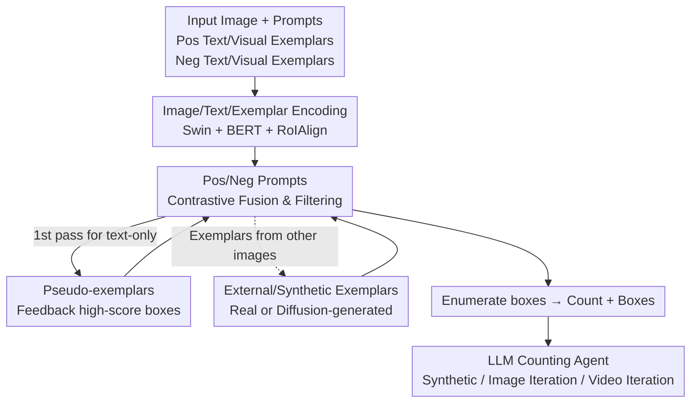

# CountGD++: Generalized Prompting for Open-World Counting

**Conference**: CVPR 2026  
**arXiv**: [2512.23351](https://arxiv.org/abs/2512.23351)  
**Code**: https://github.com/niki-amini-naieni/CountGDPlusPlus/ (Yes)  
**Area**: Multimodal VLM / Open-world Counting  
**Keywords**: Open-world Counting, Positive and Negative Prompts, Pseudo-exemplars, External/Synthetic Exemplars, LLM Visual Expert Agent

## TL;DR
CountGD++ generalizes the "prompting" mechanism for open-world object counting: it allows users to specify "what to count" and "what NOT to count" using both text and visual exemplars. It enables the model to self-generate visual exemplars (pseudo-exemplars), borrow exemplars from external or synthetic images, and operate as an LLM-invoked counting expert agent. It achieves significant improvements in counting and detection accuracy across 8 datasets without fine-tuning (e.g., blood cell MAE dropped from ~11.5 to 1.52).

## Background & Motivation
**Background**: Open-world counting allows users to specify "what to count" using text, visual exemplars (bounding boxes of target instances), or both. The current SOTA CountGD series (CountGD / CountGD-Box, based on Grounding DINO) can process both text and visual exemplars and output bounding boxes to enumerate counts.

**Limitations of Prior Work**: Prompting methods are bottlenecked in three ways. ① **Inability to specify "what NOT to count"**: When facing visually similar categories like "red blood cells vs. white blood cells" or "ripe vs. raw apples," models can only describe targets and cannot exclude distractors, leading to high false positives. ② **Exemplars require manual annotation and are restricted to the current image**: Drawing boxes for every image in a dataset is labor-intensive. ③ **Insufficient information in text-only scenarios**: For uncommon objects (e.g., exotic fruits), text alone is insufficient for accurate identification, and visual exemplars may not be available.

**Key Challenge**: Visual exemplars are informative but expensive to annotate and cannot be reused across images; text requires no annotation but lacks discriminative power for fine-grained or unfamiliar categories. Neither mechanism currently supports an "exclusion" mechanism.

**Goal**: Extend prompting from "only what to count" to "both what to count and what not to count," while automating exemplar acquisition and making it cross-image and synthetic-compatible.

**Key Insight**: Since the model already outputs numerous candidate boxes, high-confidence boxes can be fed back as "ready-made visual exemplars" (similar to query expansion). Simultaneously, negative samples can act as "filters" to push candidates away from negative classes and pull them toward positive classes in the embedding space.

**Core Idea**: Utilize contrastive positive/negative prompting, self-generated "pseudo-exemplars," and external/synthetic exemplars to generalize the counting model's prompting capabilities, enabling it to function as a visual expert tool for LLMs.

## Method

### Overall Architecture
Built upon CountGD-Box, CountGD++ expands the input from "one positive text + positive visual exemplars" to "one positive text $t^+$ + multiple positive visual exemplars $B^+$ + arbitrary negative prompt pairs $\{(B^-_i, t^-_i)\}$." The data flow for a single forward pass is: input and exemplar images pass through a shared image encoder (Swin Transformer); visual exemplars are cropped via RoIAlign into tokens. Positive and negative texts pass through a BERT encoder. In the Feature Enhancer, **only visual exemplars and text corresponding to the same category undergo self-attention**, followed by cross-attention with image tokens. The Cross-Modality Interaction decoder selects the top-900 image tokens most similar to the prompts as object queries, mapping them to candidate boxes. Finally, the Object Filtering Module uses two similarity conditions to remove "low-confidence" and "more negative-like" candidates, enumerating the remainder.

Three automated/generalized prompting capabilities are added: Pseudo-exemplars, External/Synthetic Exemplars, and an LLM-invocable Counting Expert Agent.

### Key Designs

**1. Positive/Negative Prompting: Similarity Space Filters**

To address distractors, CountGD++ allows arbitrary negative prompt pairs $(B^-_i, t^-_i)$. Negative samples act as filters: in the Feature Enhancer, **self-attention occurs only between corresponding visual exemplars and text; prompts of different categories do not interact** to prevent cross-contamination. For each object query $q$, counting is determined by two conditions:

$$\max(\mathrm{Sig}(q^\top P^+)) > \sigma \quad \text{and} \quad \max(q^\top P^+) > \max(q^\top P^-)$$

Where $P^+, P^-$ are matrices of positive/negative prompt features. The first condition excludes boxes that resemble neither class; the second excludes those more similar to the negative class. This reduces false positives in scenarios like blood cell counting.

**2. Contrastive Classification Loss: Embedding Space Separation**

To satisfy the above conditions, the objective ensures $q^\top p^+ > q^\top p^-$. Using Sigmoid probabilities $\hat{y}^+$ and $\hat{y}^-$, the inequality holds if $\hat{y}^+\!\to\!1$ and $\hat{y}^-\!\to\!0$. Binary Focal loss is applied with label 1 for $\hat{y}^+$ and label 0 for $\hat{y}^-$. The loss is $L_{cls}=\mathrm{FocalLoss}(\hat{Y}, Y)$. Unlike CountGD-Box, **different queries in the same image can match different categories/prompts**, pulling queries toward their correct prompts and pushing them away from others.

**3. Pseudo-exemplars: Self-Generated Feedback**

In text-only scenarios, CountGD++ performs an initial forward pass to obtain candidate boxes. The top-$N$ high-scoring boxes are treated as "pseudo-exemplars" and fed back with the text for a second pass. This captures visual information without manual annotation. When both positive and negative texts are provided, the model can generate both **positive pseudo-exemplars** and **negative pseudo-exemplars** for feedback.

**4. External/Synthetic Exemplars + LLM Counting Expert Agent**

By decoupling the input image and exemplar image into **two independent encoding streams**, exemplars can originate from any external image. This allows one-time annotation for an entire dataset. The LLM Agent can utilize this in three ways: ① **Synthetic Exemplars**: LLM invokes a generator (e.g., Diffusion) to create a single-instance image, then CountGD++ extracts the exemplar. ② **Image Iterative Agent**: LLM iteratively feeds back top-$N$ boxes as pseudo-exemplars until the count converges. ③ **Video Iterative Agent**: Propagates high-score boxes from the current frame as pseudo-exemplars for the next, allowing exemplars to "evolve" with objects (e.g., growing crystals).

### Loss & Training
The total loss includes $L_{cls}$ and three localization losses from CountGD-Box:
$$L = \lambda_{loc}(L^e_{h,w} + L_{center}) + \lambda_{GIoU} L^e_{GIoU} + \lambda_{cls} L_{cls}$$
Where $L_{center}$ is the absolute difference of centers, $L^e_{h,w}$ is the width/height error, and $L^e_{GIoU}$ is the generalized IoU (superscript $e$ denotes exemplar-only). Hyperparameters: $\lambda_{loc}=5, \lambda_{GIoU}=2, \lambda_{cls}=2, \sigma=0.23$. Training uses FSC-147 and **1000 synthetic mosaic images** to teach multiclass discrimination.

## Key Experimental Results

Training is performed only on FSC-147 (+1000 mosaic images); 8 benchmarks are tested zero-shot.

### Main Results

**FSCD-147 (Text-only, Counting + Detection)**:

| Method | MAE ↓ | RMSE ↓ | AP ↑ | AP50 ↑ |
|------|-------|--------|------|--------|
| CountGD-Box | 15.01 | 118.16 | 30.44 | 61.56 |
| CountSE (No boxes) | 7.84 | 82.99 | — | — |
| Ours (Text $t$ only) | 16.55 | 129.76 | 33.01 | 61.75 |
| Ours (+Pseudo $t{+}p$) | 10.29 | 33.52 | 37.78 | 68.90 |
| **Ours (+Pseudo+Synth $t{+}p{+}s$)** | **8.39** | **27.03** | **38.93** | **71.35** |

Pseudo-exemplars dropped RMSE from 129.76 to 33.52. Detection AP50 reached 71.35, the highest in the field.

**ShanghaiTech Crowd (Positive Text "human" + Pseudo, zero-shot)**:

| Method | Part A MAE/RMSE | Part B MAE/RMSE |
|------|------|------|
| CountGD-Box | 132.2 / 253.9 | 32.2 / 57.9 |
| CountSE | 129.7 / 258.3 | — |
| **Ours** | **116.0 / 234.0** | **28.0 / 50.0** |

MAE in Part A dropped >10% compared to CountSE.

**VideoCount Crystals (Deforming crystals in X-ray)**:

| Method | Prompt | MAE ↓ | RMSE ↓ |
|------|------|-------|--------|
| CountVid | Text + Manual Visual | 12 | 13.5 |
| CountVid | Text only | 69.1 | 86 |
| **Ours** | Text only (Evolving pseudo) | **10** | **12.3** |

Under text-only conditions, MAE/RMSE dropped ~7x, even outperforming CountVid with manual exemplars.

### Ablation Study

**Power of Pos/Neg Prompts (Blood Cell / OmniCount Fruits)**:

| Config (Blood Cell) | MAE ↓ | RMSE ↓ | AP50 ↑ | Description |
|------|------|------|------|------|
| CountGD-Box (Pos only) | 11.34 | 15.42 | 0.45 | Prev. SOTA |
| Ours (Pos Text + Internal) | 11.56 | 15.69 | 0.47 | No neg samples |
| Ours (Pos + Neg, Internal) | **1.73** | **3.06** | 0.71 | ~10x decrease with Neg |
| Ours (Pos + Neg, External) | **1.52** | **2.42** | **0.80** | Better generalization |

### Key Findings
- **Negative samples provide the greatest contribution**: In similar category scenarios (blood cells), MAE dropped from 11.5 to 1.5.
- **Pseudo-exemplars significantly improve RMSE**: Large errors on outlier images in FSCD-147 were corrected by visual feedback.
- **External exemplars often outperform internal ones**: Clearer representative images from external sources generalize better (Blood Cell AP50 0.71 $\to$ 0.80).
- **Self-evolving pseudo-exemplars in video > Manual first-frame exemplars**: Updated pseudo-exemplars adapt to object deformation over time.

## Highlights & Insights
- **Self-generating exemplars creates a closed-loop system**: Using high-confidence output boxes as pseudo-exemplars (query expansion) upgrades "text-only" to "text+visual" with zero annotation cost.
- **Formalizing "Negative Prompts" as filtering conditions** is a clean, transferable idea applicable to any similarity-based open-vocabulary detector.
- **Synthetic exemplars** allow the model to leverage LLMs/Diffusion to "imagine" visual examples for classes never seen during training.
- **Video evolution** transforms "frame-by-frame detection" into "frame-to-frame propagation with memory," effectively handling object deformation.

## Limitations & Future Work
- **Dependency on first-pass quality**: If the first pass misidentifies objects (assigning high scores to distractors), errors are amplified in the feedback loop.
- **Negative prompting requires prior knowledge**: Benefits are limited if the distractor classes are difficult to characterize via text or exemplars.
- **Agent reliance on external LLMs**: Synthetic and iterative workflows introduce inference overhead and are constrained by the LLM's orchestration quality.
- **Inference overhead**: Multi-pass inference and large exemplar sets (up to 10) reduce throughput.

## Related Work & Insights
- **vs CountGD / CountGD-Box**: Adds negative prompting, pseudo-exemplars, and external/synthetic support. The core gain is "excluding what not to count."
- **vs CountSE**: CountSE uses implicit "soft" exemplars and does not output boxes. CountGD++ uses explicit boxes and outperforms it in RMSE/AP.
- **vs Patch-Selection (PseCo)**: Replaces the need for a separate error-prediction model with a unified self-generating architecture.
- **vs ViperGPT / HuggingGPT**: Provides a precise counting primitive for LLM planners, which still struggle with native counting.

## Rating
- Novelty: ⭐⭐⭐⭐ "Pos/Neg + Pseudo + Synthetic + Agent" suite is a natural yet powerful extension, consolidating exclusion and automation.
- Experimental Thoroughness: ⭐⭐⭐⭐⭐ Zero-shot testing across 8 diverse datasets.
- Writing Quality: ⭐⭐⭐⭐ Logic for filtering conditions and loss derivation is clear.
- Value: ⭐⭐⭐⭐⭐ Significantly reduces annotation costs and improves fine-grained counting for real-world applications.

<!-- RELATED:START -->

## Related Papers

- [\[CVPR 2026\] UNICBench: UNIfied Counting Benchmark for MLLM](unicbench_unified_counting_benchmark_for_mllm.md)
- [\[CVPR 2026\] Understanding Counting Mechanisms in Large Language and Vision-Language Models](understanding_counting_mechanisms_in_large_language_and_vision-language_models.md)
- [\[CVPR 2026\] P-Flow: Prompting Visual Effects Generation](p-flow_prompting_visual_effects_generation.md)
- [\[ICCV 2025\] On Large Multimodal Models as Open-World Image Classifiers](../../ICCV2025/multimodal_vlm/on_large_multimodal_models_as_open-world_image_classifiers.md)
- [\[CVPR 2026\] ViKey: Enhancing Temporal Understanding in Videos via Visual Prompting](vikey_enhancing_temporal_understanding_in_videos_via_visual_prompting.md)

<!-- RELATED:END -->
## Related Papers

- [\[CVPR 2026\] From Indoor to Open World: Revealing the Spatial Reasoning Gap in MLLMs](from_indoor_to_open_world_revealing_the_spatial_reasoning_gap_in_mllms.md)
- [\[CVPR 2026\] UNICBench: UNIfied Counting Benchmark for MLLM](unicbench_unified_counting_benchmark_for_mllm.md)
- [\[CVPR 2026\] AV-Reasoner: Improving and Benchmarking Clue-Grounded Audio-Visual Counting for MLLMs](av-reasoner_improving_and_benchmarking_clue-grounded_audio-visual_counting_for_m.md)
- [\[ACL 2026\] GeoArena: Evaluating Open-World Geographic Reasoning in Large Vision-Language Models](../../ACL2026/multimodal_vlm/geoarena_evaluating_open-world_geographic_reasoning_in_large_vision-language_mod.md)
- [\[ICCV 2025\] On Large Multimodal Models as Open-World Image Classifiers](../../ICCV2025/multimodal_vlm/on_large_multimodal_models_as_open-world_image_classifiers.md)

<!-- RELATED:END -->
