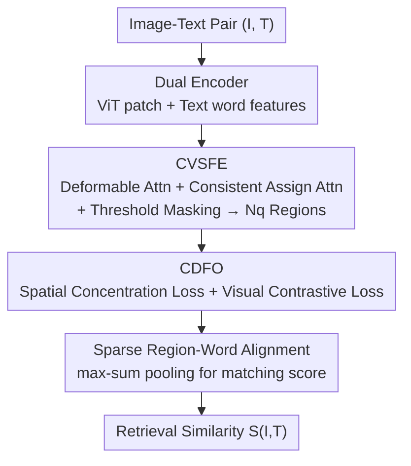

# CoV-Align: Efficient Fine-grained Cross-Modal Alignment with Cohesive Visual Semantics Priority

**Conference**: CVPR 2026  
**Paper**: [CVF Open Access](https://openaccess.thecvf.com/content/CVPR2026/html/Liu_CoV-Align_Efficient_Fine-grained_Cross-Modal_Alignment_with_Cohesive_Visual_Semantics_Priority_CVPR_2026_paper.html)  
**Code**: Undisclosed  
**Area**: Multimodal VLM  
**Keywords**: Cross-modal alignment, fine-grained image-text retrieval, text-free aggregation, visual semantic regions, deformable attention  

## TL;DR
CoV-Align proposes a fine-grained image-text retrieval framework that aggregates image patches into semantic regions **without text involvement** before performing region-word alignment. It uses deformable attention and consistent assign attention to generate regions, refined by spatial concentration and visual contrastive losses. On Flickr30K and MS-COCO, it achieves new SOTA results while being 3–5 times faster than text-guided methods.

## Background & Motivation
**Background**: Image-text alignment is categorized into coarse-grained and fine-grained approaches. Coarse-grained alignment (VSE++, CLIP) compresses images and sentences into global vectors, which is simple but fails to capture "which region corresponds to which word." Fine-grained alignment establishes correspondences between local visual regions and specific words. In this line, early SCAN used Faster-RCNN for region proposals, limited by fixed detector categories. Later detector-free methods like FILIP directly calculated patch-token similarity, but individual patch semantics are incomplete and ambiguous. Current SOTA (LAPS, SPARC) uses **text-guided cross-attention**, where text queries aggregate visual patches for alignment.

**Limitations of Prior Work**: The text-guided aggregation paradigm requires every text query to calculate alignment weights with all image patches, leading to two issues. First, **redundant patch-word alignment**: semantically irrelevant patches are involved, where noise dilutes key semantics and reduces retrieval accuracy. Second, **high computational overhead**: in large-scale retrieval, recalculating the aggregation for every query causes significant latency and memory consumption.

**Key Challenge**: The root cause of both issues is the **participation of text information in patch aggregation**. As long as aggregation is bound to text, it introduces cross-modal noise and traps heavy computation within the retrieval inner loop.

**Goal**: To aggregate semantically coherent regions (e.g., "hand", "push", "cart") in images without text guidance, ensuring irrelevant regions do not enter the cross-attention phase while maintaining region precision and discriminability.

**Key Insight / Core Idea**: The authors advocate for **Cohesive Visual Semantics Priority**—region aggregation should be an intrinsic property of the image itself, independent of the query text. By replacing text-guided aggregation with "text-free aggregation," regions are computed only once per image and can be cached. One-sentence summary: **Using text-independent visual region aggregation instead of text-guided aggregation removes noise and shifts heavy computation out of the retrieval inner loop.**

## Method

### Overall Architecture
Given an image-text pair $(I, T)$, dual-encoders extract features: ViT encodes image patches $F_v \in \mathbb{R}^{(N+1)\times d_v}$ and a Transformer encodes words $F_t \in \mathbb{R}^{L\times d_t}$. The pipeline consists of three steps: the **Coarse Visual Semantic Feature Extractor (CVSFE)** aggregates patches into $N_q$ semantic regions using learnable region queries without looking at the text; **Cohesive-Discriminative Feature Optimization (CDFO)** tightens these regions using two losses (spatial concentration and inter-region discriminability); finally, **Sparse Region-Word Alignment** introduces word features to calculate similarities via max-sum pooling. Crucially, the first two steps are decoupled from the text—regions are computed once per image and reused during retrieval.

### Key Designs

**1. Coarse Visual Semantic Feature Extractor (CVSFE): Aggregating patches without text**

This is the core of removing text guidance. To aggregate without text, learnable region queries must find semantically coherent parts. CVSFE utilizes **Deformable Attention (DAT)**, where each region query $z_q$ focuses on sparse sampling locations near a reference point $p_q$:

$$z^{l+1}_q = \mathrm{MSDeformAttn}(z^l_q, p_q, F_v) = \sum_{m=1}^{M} W^l_m \Big[\sum_{k=1}^{K} A^l_{mk}\cdot F_v(p_q + \Delta p^l_{mk})\Big]$$

where $\Delta p_{mk}$ is the sampling offset and $A_{mk}$ is the attention weight. To ensure "semantic consistency," the authors add **Consistent Assign Attention**, using a **shared projection matrix $W$** to constrain attention distributions across queries:

$$\mathrm{Attn} = \mathrm{Softmax}\Big(\frac{z_q W W^\top F_v^\top}{\tau}\Big)$$

where $\tau$ is the temperature. Finally, **threshold masking** clips patches with normalized attention lower than $\varepsilon$ before weighted aggregation:

$$\bar{\mathrm{Attn}}_{qk} = \begin{cases}\hat{\mathrm{Attn}}_{qk}, & \hat{\mathrm{Attn}}_{qk}\ge \varepsilon\\ 0, & \text{otherwise}\end{cases}, \qquad \hat{r}_q = \bar{\mathrm{Attn}}_q V^\top F_v$$

In experiments, $N_q=8$ regions and $\varepsilon=0.7$ are used. This step completely moves region generation outside the retrieval loop.

**2. Cohesive-Discriminative Feature Optimization (CDFO): Tightening and Distinguishing Regions**

Aggregation alone is insufficient; CVSFE attention often suffers from **spatial drift** and **spatial overlap** in projected views. CDFO employs two losses. The **Spatial Concentration Loss** penalizes attention deviation from the region center $c_q$:

$$\mathcal{L}_{conc} = \sum_{i=1}^{H}\sum_{j=1}^{W}(a_q)_{i,j}\,\lVert p_{i,j} - c_q\rVert_2$$

This leverages the spatial continuity prior to compress each region's attention. The **Visual Contrastive Loss** treats each region feature $r_i$ as a positive and other regions $r_j (j\ne i)$ in the same image as negatives:

$$\mathcal{L}_{v2v} = -\frac{1}{N_q}\sum_{i=1}^{N_q}\log\frac{\exp(r_i^\top r_i/\tau_1)}{\sum_{j=1}^{N_q}\exp(r_i^\top r_j/\tau_1)}$$

This reduces information redundancy between regions. These losses ensure region features are both **cohesive** (intra-semantic) and **discriminative** (inter-semantic).

**3. Sparse Region-Word Alignment**

Region-word similarity $s_{ij}$ is calculated using cosine similarity. Since regions are pre-aggregated, this step only involves a sparse matching of $N_q$ regions (usually 8) against words using **max-sum pooling**:

$$S(I, T) = \frac{1}{N_q}\sum_{i=1}^{N_q}\max_j (s)_{ij} + \frac{1}{L}\sum_{j=1}^{L}\max_i (s)_{ij}$$

This sparse alignment is significantly more efficient than dense patch-word alignment, accounting for the 3–5x speedup.

### Loss & Training
The total loss is a weighted sum: global contrastive loss (InfoNCE based on $S(I,T)$), visual contrastive loss $\mathcal{L}_{v2v}$, and spatial concentration loss $\mathcal{L}_{conc}$:

$$\mathcal{L}_{total} = \frac{\lambda_g}{2}(\mathcal{L}_{t2v} + \mathcal{L}_{v2t}) + \lambda_v \mathcal{L}_{v2v} + \lambda_c \mathcal{L}_{conc}$$

Training: 30 epochs, Adam (lr=1e-4, weight decay=1e-4, cosine annealing), features projected to 512D. Hyperparameters $\lambda_g, \lambda_v, \lambda_c, \varepsilon, N_q$ are set to $1, 1, 0.5, 0.7, 8$.

## Key Experimental Results

### Main Results
Retrieval results (RSum) on Flickr30K and MS-COCO comparing CoV-Align against the strongest fine-grained competitor, LAPS:

| Backbone | Dataset | LAPS | CoV-Align | Gain |
|------|--------|------|-----------|------|
| ViT-224 | Flickr30K 1K | 507.3 | **516.0** | +8.7 |
| ViT-384 | Flickr30K 1K | 525.4 | **538.2** | +12.8 |
| Swin-224 | Flickr30K 1K | 536.3 | **541.3** | +5.0 |
| Swin-384 | Flickr30K 1K | 545.3 | **557.0** | +11.7 |
| CLIP-ViT-L/14 | MS-COCO 5K | 465.3 (LG-MGC) | **491.9** | +26.6 |

After CLIP fine-tuning, CoV-Align reaches RSum 491.9 on MS-COCO 5K, significantly outperforming LG-MGC (465.3). Notably, **higher input resolutions (384 vs 224) yield larger gains over LAPS**, suggesting text-free aggregation better utilizes high-resolution attention maps.

### Ablation Study (Flickr30K, ViT-Base-224)

| Configuration | TR R@1 | IR R@1 | Note |
|------|--------|--------|------|
| Baseline (Object-query cross-attn) | 70.4 | 59.4 | Starting point |
| + CVSFE | 73.9 | 62.1 | Coarse visual semantic regions (+3.5/+2.7) |
| + Visual Contrastive Loss | 75.4 | 62.6 | Improved region discriminability |
| + Spatial Conc. Loss (Full) | **78.5** | **63.3** | Tightening spatial distribution |

Sensitivity analysis shows $\varepsilon=0.7$ and $N_q=8$ are optimal. Setting $\varepsilon=0$ (all patches) drops TR R@1 to 74.5 due to noise.

### Performance Efficiency (Flickr30K, ViT-Base-224 + BERT-Base, batch 128)

| Model | FLOPs | Training Memory | Note |
|------|-------|----------|------|
| CLIP | 2393.64G | 27G | Coarse-grained reference |
| SCAN | 2451.90G | 36G | Fine-grained |
| LAPS | 2577.61G | 49G | SOTA fine-grained competitor |
| **Ours** | **2289.22G** | **25G** | Lowest FLOPs, 49% less memory than LAPS |

On MS-COCO retrieval, CoV-Align takes 114.0s, compared to 442.2s for LAPS—roughly **3x acceleration** with higher accuracy.

### Key Findings
- **CVSFE is the foundation**: It immediately improves TR/IR R@1 by +3.5/+2.7 by generating cohesive region-level features.
- **Spatial Concentration Loss is vital for TR** (+3.1): Compressing attention into tight clusters is crucial for text-to-image retrieval, as text descriptions usually map to compact objects.
- **Simultaneous Efficiency and Accuracy**: Moving aggregation out of the text loop and reducing region count to 8 removes noise while saving computation.

## Highlights & Insights
- **Moving "heavy lifting" out of the retrieval loop**: Regions are computed once per image and cached. Text only interacts with 8 regions. This is the source of the 3–5x speedup.
- **Shared Projection Matrix $W$**: Enforcing attention consistency across region queries is a lightweight but effective trick for semantic consistency.
- **Spatial Concentration Loss as a Visual Prior**: Penalizing deviation from the region center anchors the model to the spatial continuity of pixels.
- **High-Resolution Potential**: The observation that higher resolutions lead to larger gains suggests this approach is highly compatible with high-res Vision Foundation Models and LMMs.

## Limitations & Future Work
- The fixed number of regions ($N_q=8$) might be insufficient for very complex scenes. Adaptive region counts are a natural extension.
- Code is currently undisclosed; implementation details of DAT and the shared projection $W$ rely on the Appendix.
- Evaluations are focused on retrieval; the utility of reusable regions in VQA or captioning hasn't been explored.
- In scenarios where fine-grained matching is highly dependent on text-based disambiguation, text-free aggregation might be less flexible than text-guided methods.

## Related Work & Insights
- **vs LAPS / SPARC**: These methods use text to query patches, which is accurate but slow (recomputing for every query). Ours is text-independent, removing noise and accelerating retrieval.
- **vs SCAN**: SCAN relies on Faster-RCNN, limited by fixed classes and slow detection. Ours uses learnable region queries directly from patches.
- **vs FILIP**: FILIP uses dense patch-token similarity, which is sensitive to noise. Ours matches 8 clean regions, enhancing both robustness and speed.

## Rating
- Novelty: ⭐⭐⭐⭐ Text-free aggregation is a clean reversal of the common text-guided paradigm.
- Experimental Thoroughness: ⭐⭐⭐⭐ Extensive backbones, datasets, and efficiency analysis.
- Writing Quality: ⭐⭐⭐⭐ Clear logic and complete formulas.
- Value: ⭐⭐⭐⭐ Significant practical gains in both efficiency and accuracy for large-scale retrieval.

<!-- RELATED:START -->

## Related Papers

- [\[AAAI 2026\] Aligning the True Semantics: Constrained Decoupling and Distribution Sampling for Cross-Modal Alignment](../../AAAI2026/multimodal_vlm/aligning_the_true_semantics_constrained_decoupling_and_distr.md)
- [\[CVPR 2026\] FAVE: A Structured Benchmark for Fine-Grained Audio-Visual Temporal Evaluation in Multimodal LLMs](fave_a_structured_benchmark_for_fine-grained_audio-visual_temporal_evaluation_in.md)
- [\[CVPR 2026\] Decoupled and Reusable Adaptation for Efficient Cross-Modal Transfer](decoupled_and_reusable_adaptation_for_efficient_cross-modal_transfer.md)
- [\[CVPR 2026\] Rethinking Cross-Modal Anchor Alignment for Mitigating Error Accumulation](rethinking_cross-modal_anchor_alignment_for_mitigating_error_accumulation.md)
- [\[CVPR 2026\] IsoCLIP: Decomposing CLIP Projectors for Efficient Intra-modal Alignment](isoclip_decomposing_clip_projectors_for_efficient_intramodal_alignment.md)

<!-- RELATED:END -->
