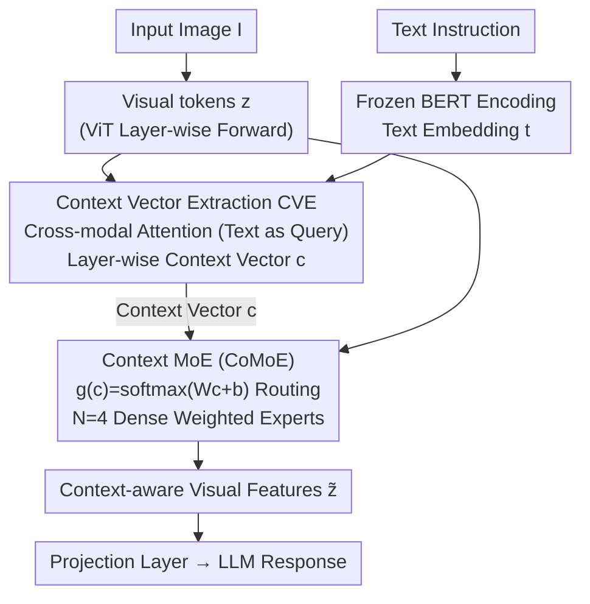

# CoVFT: Context-aware Visual Fine-tuning for Multimodal Large Language Models

**Conference**: CVPR 2026  
**arXiv**: [2603.21077](https://arxiv.org/abs/2603.21077)  
**Code**: [https://github.com/weeknan/CoVFT](https://github.com/weeknan/CoVFT)  
**Area**: Multimodal VLM  
**Keywords**: Multimodal Large Language Models, Visual Fine-tuning, Mixture-of-Experts, Context-aware, Visual Preference Conflict

## TL;DR

This paper identifies the "Visual Preference Conflict" issue during visual encoder fine-tuning in MLLMs and proposes the CoVFT framework. By implementing Context Vector Extraction (CVE) and Context Mixture-of-Experts (CoMoE), it achieves context-aware visual fine-tuning, reaching SOTA performance on 12 multimodal benchmarks with significantly higher stability than existing methods.

## Background & Motivation

Multimodal Large Language Models (MLLMs) generally consist of a visual encoder, a projection layer, and an LLM. During the instruction fine-tuning stage, a long-standing question remains: **Should the visual encoder be frozen or fine-tuned?**

Contradictions in existing practices:
- InstructBLIP and LLaVA-1.5 choose to freeze the visual encoder.
- InternVL and Qwen-VL choose joint fine-tuning.
- There is no consensus in the community.

The authors discovered a critical phenomenon through controlled experiments—**Visual Preference Conflicts**:

1. Existing VFT methods (Full fine-tuning, LoRA, BitFit, etc.) **fail to consistently outperform the frozen baseline**—while the average score might be higher, performance fluctuates significantly across specific tasks.
2. Root cause: Visual encoders are **context-free**—they only process the image without considering the text instruction. However, the same image requires entirely different visual features under different tasks (e.g., grounding vs. captioning).
3. Gradient directions from different tasks conflict with each other, leading to unstable parameter updates.

Evidence: Constructing grounding and captioning tasks on the same dataset by only changing the text query. After training, the L2 distance between the two visual encoders **grows continuously**, with larger differences in deeper layers—proving that different cognitive demands indeed "pull" the parameters in different directions.

The core problem can be formalized as: traditional VFT models $p_{\theta_v}(\mathbf{z} | \mathbf{I})$, whereas MLLMs require $p_{\theta_v}(\mathbf{z} | \mathbf{I}, \mathbf{c})$—visual features should depend on the multimodal context.

## Method

### Overall Architecture

CoVFT addresses the fundamental bottleneck where standard visual encoders only process images, modeling $p(\mathbf{z}|\mathbf{I})$. In reality, a grounding task requires object localization while a captioning task requires global semantics for the same image. When these conflicting gradients are forced into the same set of parameters, fine-tuning becomes less stable than freezing. CoVFT introduces a latent context variable $\mathbf{c}$ to extend the visual posterior from $p(\mathbf{z}|\mathbf{I})$ to $p(\mathbf{z}|\mathbf{I}, \mathbf{c})$. The process involves two steps: first, the CVE module extracts the context vector $\mathbf{c}$ layer-by-layer from image-text information; then, the CoMoE module uses $\mathbf{c}$ to regulate the feed-forward computation, routing conflicting optimization signals to different experts based on context.

### Key Designs

**1. Context Vector Extraction (CVE): Making visual encoding "aware" of the current task type**

Visual preference conflicts stem from the visual encoder being context-free. CVE extracts the "task signal" for downstream modules. Specifically, a frozen BERT encodes the text instruction to obtain embedding $\mathbf{t}$. Within specific layers of the visual encoder, the current visual tokens $\mathbf{z}$ and text embeddings $\mathbf{t}$ pass through lightweight residual blocks $f_{res}$ (using a bottle-neck structure with GELU activation). Then, cross-modal attention is performed with text as the query and the concatenated multimodal features as key/value:

$$\mathbf{c}_i = \text{CrossAttn}(\hat{\mathbf{t}}_q, [\hat{\mathbf{z}}, \hat{\mathbf{t}}]_{k,v})$$

Two design choices are critical: first, context vectors are updated layer-by-layer alongside the visual encoder to avoid extra inference stages; second, the attention is text-dominant (text as query) to ensure that $\mathbf{c}$ reflects task requirements rather than being dominated by visual features. Ablations confirm that text-only context (60.55) significantly outperforms image-only context (59.77).

**2. Context Mixture-of-Experts (CoMoE): Shunting conflicting gradients by context**

CoMoE replaces the single FFN in the latter half of the ViT layers with $N=4$ parallel experts $\mathcal{E}^n$ (initialized by copying the original FFN). The context vector calculates routing weights $\mathbf{g}(\mathbf{c}) = \text{softmax}(\mathbf{W}\mathbf{c}+\mathbf{b})$ for dense weighted aggregation:

$$\tilde{\mathbf{z}} = \sum_{n=1}^N g^n(\mathbf{c})\,\mathcal{E}^n(\mathbf{z})$$

The key to resolving conflicts lies in backpropagation: the gradient received by the $n$-th expert is scaled by its own routing weight, $\nabla_{\theta_e^n}\mathcal{L} = g^n(\mathbf{c})\cdot\frac{\partial\mathcal{L}}{\partial\tilde{\mathbf{z}}}\frac{\partial\mathcal{E}^n(\mathbf{z})}{\partial\theta_e^n}$. Consequently, samples with similar contexts (e.g., a batch of grounding tasks) fall into similar routes and provide consistent updates to the same experts; samples with different contexts (e.g., grounding vs. captioning) are distributed to different experts. Dense routing (activating all experts) is used rather than sparse top-k because the limited volume of instruction data might leave sparse experts undertrained. Ablations show Dense (61.08) outperforms Sparse@2 (60.10).

### Loss & Training

The training objective follows the standard next-token prediction:

$$\mathcal{L}_{inst} = -\sum_{t=1}^T \log p_\theta(a_t | a_{<t}, \mathbf{Q}, \mathbf{I})$$

Only a small fraction of parameters are unfrozen—the CVE module, CoMoE module, and LayerNorm statistics, keeping over 95% of visual encoder weights frozen. In the two-stage setup: Pre-training uses 558K image-text pairs to train only the projection layer (lr=1e-3, batch=256); Instruction fine-tuning uses 665K pairs to jointly train the LLM, projection layer, and CoVFT modules (lr=2e-5, batch=128).

## Key Experimental Results

### Main Results

LLaVA-1.5-7B performance across 12 multimodal benchmarks:

| Method | General ↑ | Know.&OCR ↑ | Vision ↑ | Avg ↑ | Tasks exceeding Freeze |
|------|----------|------------|---------|------|-----------------|
| Freeze | 66.23 | 61.20 | 51.71 | 58.93 | — |
| Full fine-tuning | 66.69 | 61.29 | 52.17 | 59.29 | 6/12 |
| LoRA | 65.93 | 60.86 | 52.45 | 59.04 | 6/12 |
| BitFit | 66.14 | 61.58 | 53.10 | 59.57 | 9/12 |
| **CoVFT** | **67.04** | **61.93** | **55.81** | **61.08** | **12/12** |

Key figures:
- CoVFT 7B (61.08%) outperforms the Freeze 13B (61.43%) average while optimizing less than 5% of parameters.
- Gains on MMVP are most significant: from 28.00 (Freeze) to 36.67 (+8.67).
- Effective on 13B models: CoVFT reaches 62.90%, surpassing Full ft. (61.30%) and BitFit (61.43%).

### Ablation Study

| Config | General | Know.&OCR | Vision | Avg | Description |
|------|---------|----------|--------|-----|------|
| No context (Full ft.) | 66.69 | 61.29 | 52.17 | 59.29 | Baseline |
| Image-only context | 66.60 | 61.69 | 53.17 | 59.77 | Missing text signal |
| Text-only context | 66.84 | 61.86 | 54.73 | 60.55 | Text is more critical |
| Concat[I,T] | 66.78 | 61.79 | 54.56 | 60.44 | Limited effect of simple concat |
| **CVE** | **67.04** | **61.93** | **55.81** | **61.08** | Cross-attn is optimal |
| Random@2 route | 66.01 | 61.24 | 52.05 | 59.00 | Extra params ineffective |
| Uniform route | 66.18 | 61.75 | 53.05 | 59.60 | Requires context condition |
| Sparse@2 route | 66.63 | 61.78 | 53.60 | 60.10 | Feasible but inferior to Dense |
| **Dense route** | **67.04** | **61.93** | **55.81** | **61.08** | All-expert activation optimal |

### Key Findings

1. **Text signal is key**: Text-only context (60.55%) is far superior to Image-only (59.77%), indicating visual preference conflicts are primarily driven by linguistic context.
2. **Dense routing outperforms sparse**: Dense > Sparse@2 > Uniform > Random@2, showing that context-conditioned routing, rather than simple parameter increase, is effective.
3. **High data efficiency**: CoVFT with 75% of data outperforms the Full Data + Freeze baseline.
4. **Cross-architecture generalization**: Effective when replacing CLIP with SigLiP, DINOv3, and on InternVL 2.0 architectures.
5. **Context vector space clustering**: PCA visualization shows distinct task types form clear clusters, with the correlation coefficient between routing weight similarity and context similarity reaching $r=0.76$.

## Highlights & Insights

1. **Precise problem definition**: Accurately attributes VFT instability in MLLMs to "Visual Preference Conflicts" with strong empirical evidence.
2. **Elegant solution**: The CVE + CoMoE combination fundamentally transforms context-free visual encoding into context-aware encoding.
3. **High practical value**: 7B + CoVFT $\approx$ 13B + Freeze suggests that better visual fine-tuning can reduce dependence on large model parameter scales.
4. **Comprehensive experimental validation**: Covers 12 benchmarks, 7B/13B scales, multiple visual encoders, and data efficiency analysis.

## Limitations & Future Work

1. CVE depends on an additional frozen BERT encoder—increasing inference overhead. Could the LLM's own text encoding capabilities be leveraged?
2. CoMoE only replaces FFNs in the latter half of ViT layers; the selection criteria for the deep vs. shallow boundary are not fully explored.
3. The use of 4 experts is a fixed configuration; the impact of expert count on task complexity was not investigated.
4. The visual encoder remains frozen during the pre-training stage—could context-awareness during pre-training yield further gains?
5. Experiments were primarily validated on LLaVA-style architectures; applicability to Q-Former architectures (e.g., InstructBLIP) remains unverified.

## Related Work & Insights

- **LLaVA / LLaVA-1.5**: Established the core MLLM paradigm and VFT benchmarks.
- **Cambrian-1**: Also observed the beneficial but unstable nature of VFT without analyzing the root cause.
- **MoE in NLP**: Sparse MoE is widely used for LLM scaling; this work introduces it to visual encoders and finds dense routing more effective.
- **SVPT**: A SOTA PEFT method in image classification that underperforms the Freeze baseline in MLLMs—confirming the visual preference conflict issue.
- Insight: Visual encoders account for less than 5% of parameters in MLLMs but have a massive impact—making them high-value targets for optimization.

## Rating

- Novelty: ⭐⭐⭐⭐⭐ — Discovery of visual preference conflict and proposal of context-aware VFT are significant contributions.
- Experimental Thoroughness: ⭐⭐⭐⭐⭐ — 12 benchmarks, complete ablations, multi-architecture validation.
- Writing Quality: ⭐⭐⭐⭐⭐ — Clear problem orientation from observation to analysis to method.
- Value: ⭐⭐⭐⭐⭐ — Directly instructs the MLLM community, with open-source code.

<!-- RELATED:START -->

## Related Papers

- [\[CVPR 2026\] LLaDA-V: Large Language Diffusion Models with Visual Instruction Tuning](llada-v_large_language_diffusion_models_with_visual_instruction_tuning.md)
- [\[CVPR 2026\] OddGridBench: Exposing the Lack of Fine-Grained Visual Discrepancy Sensitivity in Multimodal Large Language Models](oddgridbench_exposing_the_lack_of_fine-grained_visual_discrepancy_sensitivity_in.md)
- [\[CVPR 2026\] Fine-Grained Post-Training Quantization for Large Vision Language Models with Quantization-Aware Integrated Gradients](fine-grained_post-training_quantization_for_large_vision_language_models_with_qu.md)
- [\[CVPR 2026\] Phrase-Grounding-Aware Supervised Fine-Tuning for Chart Recognition via Side-Masked Attention](phrase-grounding-aware_supervised_fine-tuning_for_chart_recognition_via_side-mas.md)
- [\[CVPR 2026\] Taxonomy-Aware Representation Alignment for Hierarchical Visual Recognition with Large Multimodal Models](taxonomy-aware_representation_alignment_for_hierarchical_visual_recognition_with.md)

<!-- RELATED:END -->
