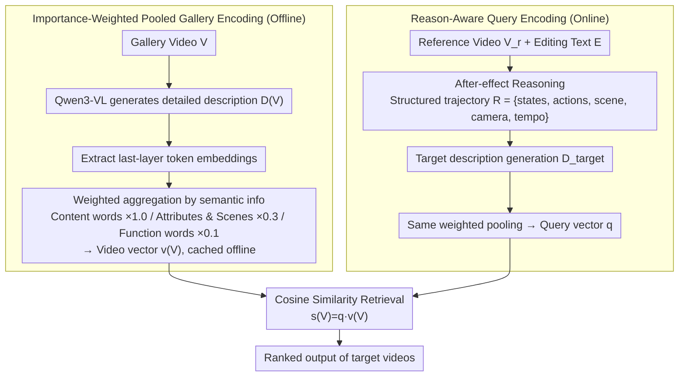

# CoVR-R: Reason-Aware Composed Video Retrieval

**Conference**: CVPR 2026 Findings  
**arXiv**: [2603.20190](https://arxiv.org/abs/2603.20190)  
**Code**: [github.com/mbzuai-oryx/CoVR-R](https://github.com/mbzuai-oryx/CoVR-R)  
**Area**: Multimodal / Video-Language Models  
**Keywords**: Composed Video Retrieval, Reason-Aware Retrieval, After-effect Reasoning, Zero-shot Retrieval, Large Multimodal Models

## TL;DR

CoVR-R proposes a reasoning-first zero-shot composed video retrieval framework that utilizes Large Multimodal Models (Qwen3-VL) to explicitly reason about the implicit "after-effects" (state transitions, temporal stages, camera changes, etc.) of editing operations. It constructs the CoVR-R benchmark, featuring structured reasoning trajectories and hard distractors, to evaluate reasoning capabilities, significantly outperforming existing methods in retrieval accuracy.

## Background & Motivation

Composed Video Retrieval (CoVR) aims to find a target video that reflects requested changes given a reference video and a modifying text. Existing methods face several critical limitations:

**Limitations of Prior Work**: Most methods rely on triplet-driven training, primarily rewarding keyword overlap while ignoring the after-effects implied by the editing text. For example, "change to a close-up" implies tighter framing and shorter duration; "frying" implies smoke and faster hand movements.

**Key Challenge**: There is a gap between what the editing text explicitly says and what the target video must demonstrate. Bridging this gap requires reasoning—predicting the causal chain connecting the edit to potential visual evidence.

**Background**: Previous CoVR benchmarks emphasize literal edits or description alignment and do not evaluate causal plausibility or temporal consistency.

**Goal**: To explicitly introduce reasoning into the retrieval loop, driving target retrieval by predicting the consequences of edits, shifting from "matching keywords" to "reasoning consequences."

## Method

### Overall Architecture

The core problem CoVR-R addresses is that in composed video retrieval, a layer of causal reasoning exists between what the editing text "says" and what the target video "must present." Keywords alone cannot bridge this gap. The proposed approach is a two-stage "reason-then-retrieve" mechanism: In the first stage, a frozen Qwen3-VL-8B generates a structured after-effect reasoning trajectory $R$ based on the reference video $V_r$ and editing text $E$. In the second stage, $(V_r, E, R)$ is converted into an effect-aware query embedding and matched against pre-computed gallery embeddings using cosine similarity. The pipeline follows a "dual-path convergence" structure where gallery side (offline) and query side (online) compress video/edits into single vectors for ranking. Training is not required as the LMM remains frozen, making the framework zero-shot.

### Key Designs

**1. Importance-Weighted Pooled Gallery Encoding: Dominating Video Vectors with Semantic Content Words**

When compressing a video into a single vector, function words often dilute discriminative action and state information. CoVR-R first uses Qwen3-VL to generate a detailed description $D(V)$ for each video $V$, extracts the last-layer token embeddings, and performs weighted aggregation across three tiers of semantic importance: actions/objects/states ($\alpha_{\text{high}}=1.0$), attributes/scenes ($\alpha_{\text{mid}}=0.3$), and function words ($\alpha_{\text{low}}=0.1$). After aggregation, L2 normalization is applied for offline caching. This parameter-free strategy effectively amplifies key semantics while suppressing noise.

**2. Reason-Aware Query Encoding: Explicitly Reasoning "After-effects" Before Retrieval**

The query side focuses on clarifying the implicit consequences of an edit through three steps: First, **after-effect reasoning** prompts Qwen3-VL to generate a structured trajectory $R = \{\text{states}, \text{actions}, \text{scene}, \text{camera}, \text{tempo}\}$ from $(V_r, E)$, with up to 4 atomic assertions per slot. Next, **target description generation** produces a comprehensive description $D_{\text{target}}$ of the hypothesized edited video conditioned on $(V_r, E, R)$. Finally, embeddings are extracted using the same importance-weighted pooling as the gallery side. Converting reasoning into structured slots and then encoding them ensures the query vector captures "what must happen."

**3. CoVR-R Benchmark: An Evaluation Set for Reasoning over Literal Edits**

To address the lack of reasoning evaluation in previous datasets, the authors constructed 2,800 high-quality triplets from Dense-WebVid-CoVR and Something-Something V2. Each triplet includes schema-constrained reasoning trajectories and hard distractors. Selection criteria required hits on at least two categories: temporal dependency, state transitions, camera techniques, implicit causality, or low lexical sufficiency. Reasoning trajectories were generated in a fixed slot order and manually verified to ensure they are verifiable and comparable.

### Loss & Training

- **Zero-shot**: The entire method is zero-shot and requires no task-specific fine-tuning.
- Retrieval ranking is based on cosine similarity: $s(V) = \mathbf{q}(V_r, E)^\top \mathbf{v}(V)$.
- Reasoning evaluation introduces LLM-as-a-judge (GPT-4o), scoring across 10 dimensions (1-10) and using the arithmetic mean as the global reasoning score.

## Key Experimental Results

### Main Results

**Zero-shot Comparison on CoVR-R Benchmark**

| Method | Backbone | R@1 | R@5 | R@10 | R@50 | Reasoning Score |
|------|----------|-----|-----|------|------|--------|
| CoVR-BLIP | BLIP | 30.30 | 51.07 | 57.05 | 73.82 | 4.85 |
| BSE-CoVR (CA) | BLIP | 37.90 | 57.67 | 64.48 | 79.47 | 6.42 |
| MVFT-JI† | BLIP | 34.40 | 54.15 | 62.30 | 77.40 | 6.28 |
| **Ours** | Qwen-VL | 44.32 | 61.91 | 67.33 | 79.90 | 7.46 |
| **Ours+R** | Qwen-VL | **49.88** | **66.99** | **72.97** | **85.14** | **8.31** |

R@1 shows a **+11.98** percentage point Gain over the strongest baseline (31.6% relative improvement).

**Dense-WebVid-CoVR Test Set**

| Method | R@1 | R@5 | R@10 | R@50 |
|------|-----|-----|------|------|
| BSE-CoVR (CA) | 48.08 | 73.36 | 81.06 | 93.78 |
| **Ours** | 58.19 | 80.50 | 86.92 | 97.14 |
| **Ours+R** | **61.21** | **83.40** | **89.39** | **97.61** |

R@1 increased by **+13.13** percentage points, surpassing all baselines.

### Ablation Study

**Token Pooling Strategy**

| Strategy | R@1 | R@5 | R@50 |
|------|-----|-----|------|
| Last token | 1.51 | 3.57 | 10.14 |
| Mean pooling | 44.87 | 63.67 | 82.44 |
| Max pooling | 35.95 | 52.02 | 93.98 |
| **Weighted (Ours)** | **49.88** | **66.99** | **85.14** |

Importance-weighted pooling provides a +5.01 R@1 Gain over mean pooling.

**Model Scale Impact**

| Model | R@1 | Reasoning Score |
|------|-----|--------|
| Qwen3-VL-4B | 43.98 | 7.95 |
| Qwen3-VL-8B | 49.88 | 8.31 |
| Qwen3-VL-72B | 55.48 | 9.05 |

Performance improves consistently with model scale; 8B is the optimal choice for cost-efficiency.

### Key Findings

- The reasoning-enhanced variant (+R) improves R@1 by +5.56 percentage points over the non-reasoning version, validating the value of explicit after-effect prediction.
- Previous methods perform worse on CoVR-R than on standard benchmarks (avg R@1 32.05% vs 40.66%), indicating that reasoning-dependent edits pose unique challenges.
- Iterative refinement of reasoning (5 rounds) yields only marginal gains (R@1: 49.88% → 50.56%) while increasing reasoning costs fivefold; single-pass reasoning is the final choice.
- The Qwen3 series consistently outperforms the Qwen2.5 series at similar parameter scales.

## Highlights & Insights

- **Reasoning-First Paradigm**: Promotes reasoning from a byproduct of retrieval to a first-class citizen. Explicitly predicting "after-effects" before retrieval is more interpretable than end-to-end feature fusion.
- **No Task-Specific Training**: Leverages the general reasoning capabilities of LMMs to achieve zero-shot CoVR, reducing dependency on labeled data.
- **Importance-Weighted Pooling**: A simple yet effective parameter-free strategy that prioritizes semantically rich words over function words, outperforming complex concatenation schemes.
- **Structured Reasoning Records**: A five-dimensional schema constraint (states/actions/scene/camera/tempo) makes reasoning verifiable and comparable, facilitating follow-up research.

## Limitations & Future Work

- Performance depends on Qwen3-VL's video understanding capabilities and may degrade for low-quality or extremely long videos.
- Gallery encoding requires generating descriptions and extracting embeddings for every video, entailing high pre-processing costs.
- The quality of reasoning trajectories is limited by the LMM's reasoning capacity; subtle causal chains might be missed.
- The benchmark scale (2,800 triplets) is relatively small with limited domain coverage.
- Whether zero-shot reasoning methods can maintain their advantage over end-to-end fine-tuned methods at larger scales remains to be verified.

## Related Work & Insights

- Generalizing from CIR (Composed Image Retrieval) to CoVR introduces temporal and causal dimensions, which are central to video understanding.
- This approach complements training-based methods like MVFT-JI and CoVR-BLIP; reasoning-based and training-based strategies could be combined.
- The importance-weighted pooling concept can be generalized to other tasks requiring semantic embedding extraction from LMM-generated text.
- The zero-shot reasoning-retrieval paradigm could potentially extend to composed retrieval in other modalities (3D, audio, etc.).

## Rating

- **Novelty**: ⭐⭐⭐⭐ — The reasoning-first zero-shot CoVR framework is novel, and the benchmark design is valuable.
- **Experimental Thoroughness**: ⭐⭐⭐⭐ — Comprehensive across two benchmarks with multi-dimensional ablations and model scale analysis.
- **Writing Quality**: ⭐⭐⭐⭐ — Clear motivation and formal definition of reasoning records.
- **Value**: ⭐⭐⭐⭐ — Drives CoVR from keyword matching toward a reasoning-driven approach.

<!-- RELATED:START -->

## Related Papers

- [\[CVPR 2026\] ReCALL: Recalibrating Capability Degradation for MLLM-based Composed Image Retrieval](recall_recalibrating_capability_degradation_for_mllm-based_composed_image_retrie.md)
- [\[CVPR 2026\] EagleNet: Energy-Aware Fine-Grained Relationship Learning Network for Text-Video Retrieval](eaglenet_energy-aware_fine-grained_relationship_learning_network_for_text-video_.md)
- [\[CVPR 2026\] Self-guided Semantic Inspection for Zero-Shot Composed Image Retrieval](self-guided_semantic_inspection_for_zero-shot_composed_image_retrieval.md)
- [\[CVPR 2026\] ConeSep: Cone-based Robust Noise-Unlearning Compositional Network for Composed Image Retrieval](conesep_cone-based_robust_noise-unlearning_compositional_network_for_composed_im.md)
- [\[CVPR 2025\] CoLLM: A Large Language Model for Composed Image Retrieval](../../CVPR2025/multimodal_vlm/collm_a_large_language_model_for_composed_image_retrieval.md)

<!-- RELATED:END -->
