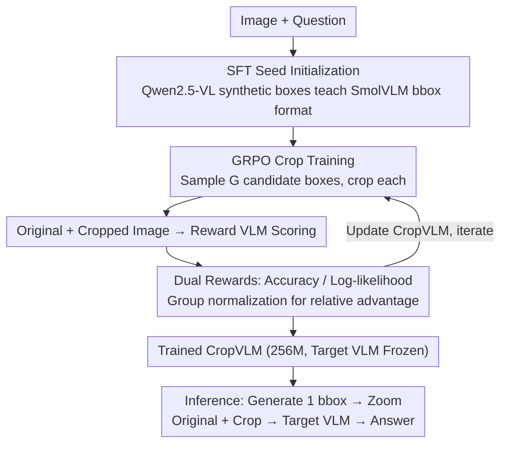

# CropVLM: Learning to Zoom for Fine-Grained Vision-Language Perception

**Conference**: CVPR 2026  
**arXiv**: [2511.19820](https://arxiv.org/abs/2511.19820)  
**Code**: [GitHub](https://github.com/miguelscarv/cropvlm)  
**Area**: Multimodal VLM  
**Keywords**: Visual Cropping, Reinforcement Learning, GRPO, Fine-grained Perception, Plug-and-play

## TL;DR

Ours proposes CropVLM—a lightweight 256M-parameter cropping network trained via GRPO reinforcement learning (without manual bounding box annotations). It dynamically selects the most informative image regions for the VLM to focus on, providing a plug-and-play performance boost for fine-grained visual understanding in both open-source and commercial VLMs.

## Background & Motivation

VLMs are limited by input resolution in tasks requiring fine-grained visual perception (e.g., document analysis, scene text recognition)—LLaVA-1.5's 336×336 resolution cannot resolve small text. Uniformly increasing resolution is computationally expensive and often unnecessary, as research indicates most queries require only a few image tokens for an answer.

**Limitations of Prior Work**:
- Architectural modifications (e.g., Matryoshka, S2) require extensive retraining and risk catastrophic forgetting.
- Inapplicable to commercial models where weights are inaccessible.
- Training-free methods like ViCrop rely on attention maps or gradients, exhibiting poor out-of-distribution generalization.
- UV-CoT utilizes DPO training, requiring synthetic preference pairs and suffering from low data efficiency.

**Key Insight**: CropVLM is positioned as a lightweight external module trained via GRPO without manual bboxes, remaining compatible with both open-source and commercial VLMs.

## Method

### Overall Architecture

CropVLM addresses the simple yet difficult problem: VLMs struggles with small objects, but feeding the entire high-resolution image is too costly. The Core Idea is to attach a lightweight "focus" module—a 256M SmolVLM—ahead of the target VLM. Given an image and a question, this module first outputs a bounding box; the corresponding region is cropped and enlarged. Both the original and cropped images are then sent to the target VLM for the final answer. The target VLM remains frozen, with CropVLM acting as a "refocusing" lens, making it compatible with both open-source models and closed-source APIs.

**Key Challenge**: How to train the cropping module to know "where to zoom" without manual boxes, where the optimal box is only defined by the correctness of the downstream VLM? The Mechanism involves three stages: SFT for format alignment, GRPO for box optimization using downstream performance as a reward, and a dual-reward design to ensure dense training signals.

### Key Designs

**1. SFT Seed Initialization: Learning the Output Format**

Since SmolVLM does not natively output bounding boxes, starting directly with GRPO leads to cold-start issues. SFT is used for initialization, employing Qwen 2.5-VL 7B to generate synthetic boxes to teach the model valid bbox coordinates (with small boxes expanded to prevent over-fragmentation). This ensures the model learns the format before RL refines the quality.

**2. GRPO-based Crop Training: Performance as Reward**

Manual annotations are expensive and may not be the most useful for the model. Ours bypasses Ground Truth (GT) boxes by using RL to treat downstream performance as the supervisory signal. For each pair, $G=6$ candidate boxes are sampled; each is cropped and processed by a Reward VLM. Scores are normalized within the group to calculate relative advantage $A_i=(r_i-\mathrm{mean}(r))/\mathrm{std}(r)$ to update the module. The "best box" is thus defined as the one maximizing VLM accuracy, aligning the training objective with the final task.

**3. Dual Reward Design: Enhancing Gradient Contributions**

Direct accuracy rewards (correct = 1, incorrect = 0) are too sparse, as a group of 6 candidates might all be correct or all wrong, resulting in zero variance. Therefore, ours introduces a log-likelihood reward, using the VLM's log-likelihood of the correct answer. This provides a continuous signal ensuring non-zero advantages for more samples and is computationally efficient as it only requires a single forward pass without full generation.

### Loss & Training

- Two stages: SFT (Format learning) → GRPO (Quality optimization).
- Training completed on a single A100 GPU (SFT ~3h, GRPO ~24h for 2048px version).
- SmolVLM finetuned using LoRA (rank 128, alpha 256).

## Key Experimental Results

### Main Results (With Different VLMs)

| Target VLM | Without CropVLM | + CropVLM(2048) | Gain |
|-----------|-----------------|-----------------|------|
| LLaVA 1.5 (336px) | 36.69 | 42.71 | +6.02 |
| Qwen 2.5 VL (448px) | 56.42 | 67.14 | +10.72 |
| GPT 4.1 nano (512px) | 41.27 | 47.41 | +6.14 |

### Ablation Study

| Configuration | 1024px Avg | Description |
|---------------|------------|-------------|
| Baseline SmolVLM | 44.55 | No cropping |
| + SFT | 46.55 | Synthetic bbox training |
| + GRPO (Accuracy) | 49.75 | RL Optimization |
| + GRPO (Likelihood) | 50.89 | Superior reward signal |

### Key Findings

- CropVLM (1024px) paired with SmolVLM outperforms the baseline SmolVLM (2048px), proving that intelligent cropping at lower resolution is superior to brute-force high resolution.
- Significant gains on OOD benchmarks (V*, HR-Bench) demonstrate robust cropping strategies.
- For GPT 4.1 nano, rejected questions decreased from 31/191 to 2/191.
- Log-likelihood rewards consistently outperform accuracy rewards.

## Highlights & Insights

- **Novelty**: Plug-and-play design requires no modification to target weights, working even for commercial APIs.
- **Value**: Extremely low overhead with a 256M network and single-GPU training delivering substantial gains.
- **Mechanism Elegance**: The GRPO approach removes the need for GT bboxes or separate evaluator models by using task performance as a direct reward.

## Limitations & Future Work

- Currently supports only a single crop; multi-region or multi-step reasoning remains unexplored.
- SmolVLM's numeric output vocabulary is limited (0-9 digits), making bbox generation relatively slow.
- Training resources were conservative (single GPU, small group size), potentially representing a lower bound of performance.
- Fixed input resolution for the cropping network; adaptive resolution strategies are not yet explored.

## Related Work & Insights

- **vs ViCrop**: Training-free methods rely on gradients/attention and fail in OOD; CropVLM's learned strategy is more robust.
- **vs UV-CoT**: DPO requires 249k pairs and a 7B model; CropVLM uses only 62k data and 256M parameters, proving more efficient.
- **vs DeepEyes/Mini-o3**: These require multi-turn reasoning overhead; CropVLM achieves results in a single zoom step.

## Rating

- **Novelty**: ⭐⭐⭐⭐ GRPO for cropping and plug-and-play design are innovative in this niche.
- **Experimental Thoroughness**: ⭐⭐⭐⭐⭐ Comprehensive evaluation across VLMs, benchmarks, and cost analysis.
- **Writing Quality**: ⭐⭐⭐⭐ Method is clear and experiments are well-presented.
- **Value**: ⭐⭐⭐⭐ Highly practical plug-and-play solution with high ROI.

<!-- RELATED:START -->

## Related Papers

- [\[CVPR 2026\] DiG: Differential Grounding for Enhancing Fine-Grained Perception in Multimodal Large Language Models](dig_differential_grounding_for_enhancing_fine-grained_perception_in_multimodal_l.md)
- [\[CVPR 2026\] OddGridBench: Exposing the Lack of Fine-Grained Visual Discrepancy Sensitivity in Multimodal Large Language Models](oddgridbench_exposing_the_lack_of_fine-grained_visual_discrepancy_sensitivity_in.md)
- [\[CVPR 2026\] Chart-FR1: Visual Focus-Driven Fine-Grained Reasoning on Dense Charts](chart-fr1_visual_focus-driven_fine-grained_reasoning_on_dense_charts.md)
- [\[CVPR 2026\] TRivia: Self-supervised Fine-tuning of Vision-Language Models for Table Recognition](trivia_self-supervised_fine-tuning_of_vision-language_models_for_table_recogniti.md)
- [\[CVPR 2026\] SketchVL: Policy Optimization via Fine-Grained Credit Assignment for Chart Understanding and More](sketchvl_policy_optimization_via_fine-grained_credit_assignment_for_chart_unders.md)

<!-- RELATED:END -->
