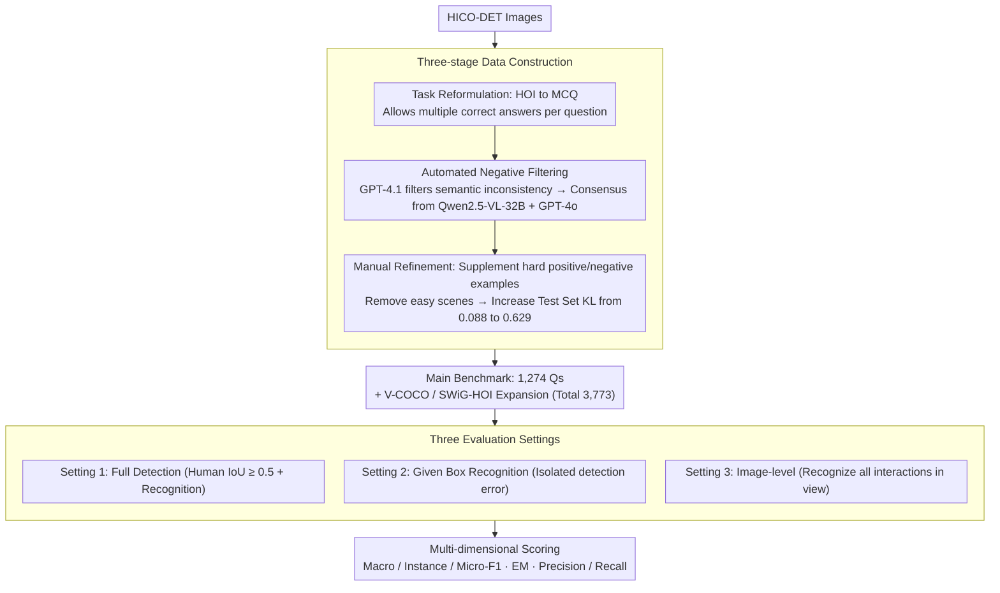

# CrossHOI-Bench: A Unified Benchmark for HOI Evaluation across Vision-Language Models and HOI-Specific Methods

**Conference**: CVPR 2026  
**arXiv**: [2508.18753](https://arxiv.org/abs/2508.18753)  
**Code**: [github.com/ChelsieLei/CrossHOI-Bench](https://github.com/ChelsieLei/CrossHOI-Bench)  
**Area**: Multimodal VLM / Human-Object Interaction Detection  
**Keywords**: HOI Detection, VLM Evaluation, Multiple Choice Benchmark, Cross-Paradigm Comparison

## TL;DR

Ours proposes CrossHOI-Bench, the first HOI benchmark for unified evaluation of VLMs and HOI-specific models via multiple-choice questions. By avoiding erroneous penalties from incomplete annotations through curated positive and negative examples, it reveals that large VLMs outperform SOTA HOI methods by $+5.18\%$ in Instance-F1 zero-shot, while identifying systematic weaknesses in multi-action recognition and cross-human attribution.

## Background & Motivation

**Background**: HOI detection has long been dominated by task-specific models (ADA-CM, CMMP, HOLa, etc.). However, large generative VLMs (Qwen2.5-VL, InternVL3) have demonstrated strong open-scene understanding, raising the core question: "Can VLMs directly perform HOI detection?"

**Limitations of Prior Work**: (1) Existing HOI benchmarks (e.g., HICO-DET) rely on exact label matching and suffer from incomplete annotations—any correct but unlabelled prediction is penalized. (2) Ambiguity cannot be resolved by exhaustive annotation: single images often lack visual evidence to distinguish specific actions (e.g., "boarding" vs "exiting"). (3) The distribution of HICO-DET training and test sets is highly similar ($KL=0.088$), making it difficult to assess true model capability in complex tail-class scenarios.

**Key Challenge**: A unified protocol is needed for fair comparison across both paradigms. Existing evaluation methodologies fundamentally underestimate true capabilities: HOI-specific methods report $<50\%$ mAP, while VLMs achieve only approximately $15\%$ on HICO-DET.

**Goal**: Design an unbiased, cross-paradigm HOI evaluation benchmark to reveal the performance gaps and complementary strengths of VLMs and HOI-specific methods.

**Key Insight**: Reformulate HOI detection as a multi-answer multiple-choice task, utilizing curated positive and negative examples to eliminate the issue of incomplete annotation.

**Core Idea**: An MCQ format combined with curated negative examples and three evaluation settings enables the first fair and direct comparison between VLMs and HOI-specific models.

## Method

### Overall Architecture

CrossHOI-Bench aims to address whether large VLMs can perform HOI detection directly and how to compare them fairly with HOI-specific models. It reformulates HOI detection into a "Multi-Answer Multiple Choice" task—each image is paired with a four-option question. Positive examples are derived from ground truth plus manual supplements, while negative examples are curated "plausible-but-incorrect" actions. This ensures that models identifying unlabelled but correct actions are not penalized, bypassing systemic underestimation. The pipeline consists of two stages: "Three-stage Data Construction" (Task Reformulation $\rightarrow$ Automated Negative Filtering $\rightarrow$ Manual Refinement) and "Three Evaluation Settings" for unified scoring.

### Key Designs

**1. Three-stage Data Construction: Decoupling "Incorrect Answers" from "Missing Labels"**

Exact-matching benchmarks penalize models that predict correct but unlabelled actions, leading to artificially low scores (approx. $15\%$) for VLMs. CrossHOI-Bench uses a three-stage construction to eliminate this penalty. **Stage 1** reformulates the task into four-option questions, allowing multiple correct answers (e.g., both "hold knife" and "cut with knife"). **Stage 2** automates negative filtering: GPT-4.1 separates semantically consistent/inconsistent candidates, followed by consensus verification from Qwen2.5-VL-32B and GPT-4o. Only actions identified as incorrect by both models are retained as negative examples. **Stage 3** involves manual refinement: removing simple scenarios (single person, plain background) and adding hard positives (ambiguous actions like "boarding" vs "exiting" are both categorized as correct) and hard negatives (actions of nearby people, fine-grained similarities like "holding" vs "hugging"). The test set was redistributed to increase its KL divergence from the training set from $0.088$ to $0.629$.

**2. Three Complementary Evaluation Settings: Diagnostic Error Isolation**

To determine whether VLM failures stem from localization or recognition, the benchmark employs three settings. **Setting 1** (Full HOI Detection) tests end-to-end capability (IoU $\ge 0.5$ + Recognition). **Setting 2** (Given Box Recognition) isolates recognition ability by providing human bounding boxes. **Setting 3** (Image-level) evaluates global scene understanding by identifying all human interactions in the image. This tiered approach reveals that small VLMs match HOI methods in pure recognition but fail during self-detection. Scoring includes Macro-F1 (class balance), Instance-F1 (per-question), Micro-F1 (global), Exact Match (EM), and Average Precision/Recall.

## Key Experimental Results

### Main Results: Setting 1 (Full HOI Detection)

| Method | Type | Macro-F1 | Instance-F1 | EM | Avg.Prec | Avg.Rec |
|------|------|----------|-------------|-----|----------|---------|
| ADA-CM | HOI | 43.02 | 47.76 | 19.15 | 76.25 | 51.80 |
| HOLa | HOI | 43.61 | 47.12 | 19.78 | 74.31 | 52.15 |
| CMD-SE | HOI | 47.49 | 44.66 | 20.33 | 78.33 | 46.96 |
| InternVL3-38B | VLM | 38.04 | 38.68 | 20.33 | 84.72 | 33.56 |
| **Qwen2.5-VL-32B** | **VLM** | **50.71** | **52.94** | **26.06** | 75.03 | 51.97 |
| Qwen2.5-VL-7B | VLM | 29.73 | 30.53 | 14.29 | 75.92 | 24.89 |

### Main Results: Setting 2 (Given Human Box, Pure Recognition)

| Method | Type | Macro-F1 | Instance-F1 | EM | Avg.Prec | Avg.Rec |
|------|------|----------|-------------|-----|----------|---------|
| InternVL3-38B | VLM | 58.94 | 67.41 | 35.64 | 81.90 | 57.85 |
| Qwen2.5-VL-32B | VLM | 62.90 | 69.52 | 35.01 | 75.30 | 66.61 |
| Qwen2.5-VL-7B | VLM | 48.93 | 57.25 | 25.98 | 74.49 | 46.87 |

### Ablation Study

| Dimension | VLM Strengths | HOI-Specific Strengths |
|------|---------|-------------|
| Overall F1 | Large models outperform SOTA zero-shot | Small models match specialized methods |
| Multi-action Recognition | Tends to predict only one action | Better at identifying co-occurring actions |
| Cross-human Attribution | Often attributes neighbors' actions to target | More accurate human-action binding |
| Precision | Often higher (84.72%) | Stable (~76%) |
| Recall | High volatility (33%-52%) | More balanced (~52%) |

### Key Findings

- Qwen2.5-VL-32B zero-shot outperforms all HOI methods by $+5.18\%$ in Instance-F1 (52.94 vs 47.76).
- Small VLMs (7-8B) match HOI methods in pure recognition settings but suffer significant performance drops when detection is required.
- Systematic VLM weaknesses: Under-prediction of multiple actions and misattribution of actions between different human subjects.
- Qwen3-VL-30B exhibited extreme behavior: Avg.Prec $= 100\%$ but Recall $\approx 0\%$, indicating a near-total failure to make predictions.

## Highlights & Insights

- First comparison of VLMs and HOI-specific methods under a unified protocol, providing convincing and exemplary conclusions.
- Reveals that existing HOI benchmarks systematically underestimate model performance due to design flaws.
- The MCQ format and curated negative methodology can be transferred to other tasks with incomplete annotations.
- The three complementary settings and sub-benchmarks provide a rigorous, multi-dimensional analysis of model capabilities.

## Limitations & Future Work

- The benchmark scale is relatively small (1,274 main images), potentially insufficient to cover all HOI scenarios.
- The MCQ format may simplify the true complexity of open-world HOI understanding.
- Negative example curation relies on VLM consensus, which may introduce model-specific biases.
- The impact of VLM fine-tuning on benchmark performance was not deeply analyzed.

## Related Work & Insights

- **vs HICO-DET/V-COCO**: The fundamental difference lies in using multi-answer MCQ vs exact matching, eliminating systematic penalties for incomplete annotation.
- **vs SWiG-HOI**: While SWiG-HOI expands the label space (5,500+ classes), CrossHOI-Bench focuses on fair cross-paradigm comparison.
- **Evaluation Methodology**: VLM capabilities across many tasks may be systematically underestimated due to benchmark design; restructuring evaluation may lead to new discoveries.
- **VLM Potential**: The HOI understanding of large VLMs has been significantly underrated. Future work should prioritize multi-action recognition and cross-human attribution.

## Rating

⭐⭐⭐⭐⭐ (4.5/5)

- **Novelty** ⭐⭐⭐⭐: Benchmark design for unified cross-paradigm evaluation fills a critical gap.
- **Experimental Thoroughness** ⭐⭐⭐⭐⭐: Comprehensive multi-model, multi-setting, and multi-dimensional analysis.
- **Writing Quality** ⭐⭐⭐⭐⭐: Clear problem statement, rigorous design, and compelling conclusions.
- **Value** ⭐⭐⭐⭐⭐: Uncovers significant evaluation biases and paradigm complementarities for the community.

<!-- RELATED:START -->

## Related Papers

- [\[ICLR 2026\] Zero-shot HOI Detection with MLLM-based Detector-agnostic Interaction Recognition](../../ICLR2026/multimodal_vlm/zero-shot_hoi_detection_with_mllm-based_detector-agnostic_interaction_recognitio.md)
- [\[CVPR 2026\] SO-Bench: A Structural Output Evaluation of Multimodal LLM](so-bench_a_structural_output_evaluation_of_multimodal_llm.md)
- [\[CVPR 2026\] LVLM-Aided Alignment of Task-Specific Vision Models](lvlm-aided_alignment_of_task-specific_vision_models.md)
- [\[CVPR 2026\] HAVE-Bench: Hierarchical Audio-Visual Evaluation from Perception to Interaction](have-bench_hierarchical_audio-visual_evaluation_from_perception_to_interaction.md)
- [\[CVPR 2026\] UNICBench: UNIfied Counting Benchmark for MLLM](unicbench_unified_counting_benchmark_for_mllm.md)

<!-- RELATED:END -->
