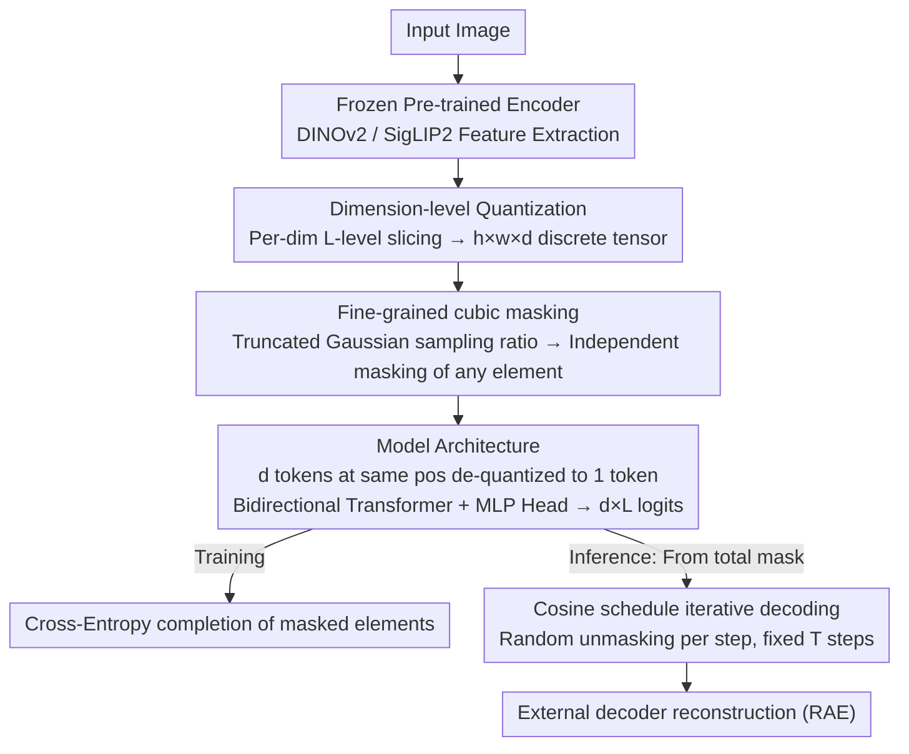

# Cubic Discrete Diffusion: Discrete Visual Generation on High-Dimensional Representation Tokens

**Conference**: CVPR 2026  
**arXiv**: [2603.19232](https://arxiv.org/abs/2603.19232)  
**Code**: [GitHub](https://github.com/YuqingWang1029/CubiD)  
**Area**: Multimodal VLM  
**Keywords**: Discrete diffusion models, high-dimensional representation tokens, visual generation, dimension-level quantization, unified multimodality

## TL;DR

Ours proposes CubiD, the first model to perform discrete diffusion generation on high-dimensional representation tokens (768 dimensions). It achieves high-quality image generation through fine-grained mask prediction on an $h \times w \times d$ three-dimensional tensor while preserving understanding capabilities.

## Background & Motivation

**Need for Unified Multimodal Modeling**: Language models naturally use semantic tokens for both understanding and generation. However, a cleavage exists in visual models—using high-dimensional semantic features for understanding and low-dimensional compressed tokens (8-32 dimensions) for generation—which hinders a unified architecture.

**Advantages of High-Dimensional Representation Reconstruction**: Recent research (e.g., RAE) shows that pre-trained representation features of 768-1024 dimensions can achieve high-quality reconstruction, but their discrete generation faces fundamental challenges.

**Failure of Vector Quantization in High-Dimensional Space**: Traditional VQ suffers from the curse of dimensionality in high-dimensional spaces. Data sparsity leads to ineffective clustering, requiring exponentially increasing codebook sizes, and quantization feature shifts severely damage semantic information.

**Feasibility of Dimension-Level Quantization**: Independent quantization per dimension avoids the difficulties of joint quantization and can be directly applied to frozen pre-trained features as a training-free method. However, generative modeling remains the bottleneck.

**Limitations of Prior Work**: Autoregression is infeasible due to $O(hwd)$ steps, and standard discrete diffusion cannot model intra-position dimensional dependencies.

**Key Insight**: An $h \times w \times d$ tensor possesses a natural multi-dimensional structure, allowing for flexible operations across the entire 3D space by breaking the atomicity constraint of spatial positions.

## Method

### Overall Architecture

Ours aims to address the long-standing discrepancy where different visual representations are used for understanding and generation: understanding relies on 768-dimensional high-dimensional semantic features, while generation reverts to 8–32 dimensional compressed tokens. The mechanism allows generation to occur directly on high-dimensional representations via two steps. First, continuous features extracted from a frozen pre-trained encoder (DINOv2 or SigLIP2) are discretized to obtain an $h \times w \times d$ discrete integer tensor—consisting of $h \times w$ spatial positions, each containing $d$ independent dimensions. Second, discrete diffusion is performed on this 3D tensor: during training, elements are randomly masked for the model to complete, and during inference, the model iteratively decodes the full image from a total mask in several steps. The pivotal shift is that CubiD no longer treats "a spatial position" as an indivisible atom, but instead pushes the granularity of masking and prediction down to **individual elements** within the 3D tensor.

### Key Designs

**1. Dimension-level Quantization: Bypassing the Curse of Dimensionality**

The first obstacle for high-dimensional discrete generation is quantization. Traditional Vector Quantization (VQ) maps the entire $d$-dimensional vector to a single codebook entry, but in a 768-dimensional space, data is extremely sparse, clustering fails, and the codebook must expand exponentially to cover the space. CubiD adopts independent dimension-level quantization: each continuous value is separately sliced into $L$ discrete levels:

$$q_{x,y,i} = \text{Quantize}(z_{x,y,i};\, L)$$

Setting $L=8$ for DINOv2 and $L=16$ for SigLIP2 approximates the reconstruction quality of continuous features. This training-free approach can be applied directly to frozen pre-trained features. It preserves semantics almost perfectly: on LLaVA understanding tasks, the GQA score for dimension-level quantization (DQ) is 63.1, nearly par with 63.2 for continuous features, whereas VQ drops significantly to 54.9.

**2. Fine-grained cubic masking: Lowering masking granularity to individual elements**

Performing diffusion on the discrete tensor is the core contribution. Methods like MaskGIT use entire spatial positions as masking units—once a position is masked, all information there is lost. However, dependencies in high-dimensional tokens exist both between positions and between dimensions within a single position. Masking entire blocks erases the signal for "intra-position dimensional prediction." Ours therefore performs independent masking for **any single element** in the $h \times w \times d$ tensor. During training, a masking ratio $r$ is sampled from a truncated Gaussian distribution:

$$r \sim \text{TruncNorm}(\mu=1.0,\ \sigma=0.10,\ [0,1])$$

Elements are randomly replaced by a learnable [MASK] token according to this ratio. The model then predicts the masked elements from the unmasked context using cross-entropy:

$$\mathcal{L} = -\mathbb{E}\Big[\sum_{i \in \mathbf{M}} \log p(q_i \mid \mathbf{q}_{\bar{\mathbf{M}}})\Big]$$

Specifically, if a spatial position originally has 768 dimensional tokens, cubic masking might only mask 300 of them. The remaining 468, alongside elements from other positions, serve as context for the model to recover the 300—representing an "intra-position" dependency. Under spatial-only masking, these 768 are either all present or all gone, preventing the learning of internal relationships. Ablations show that per-dim (masking whole dimensions) gFID is 120 and per-spatial is 22, while per-element achieves 5.33, quantifying the value of this granularity.

**3. Model Architecture: Decoupling sequence length from feature dimensions**

Treating all $h \times w \times d$ elements as a sequence would cause the sequence length to explode with $d$. Ours handles this by de-quantizing the $d$ discrete tokens within each spatial position back into a $d$-dimensional vector, treated as **one** token. Consequently, the sequence length remains fixed at $h \times w$, independent of $d$. The backbone is a standard bidirectional attention Transformer. The output uses an MLP head to generate $d \times L$ logits per position, corresponding to $L$ candidate levels for each of the $d$ dimensions. This approach maintains the fine-grained nature of element-level masking while keeping computational complexity proportional to resolution rather than dimension.

### Loss & Training

The training objective is the cross-entropy over masked elements. During inference, starting from a total mask, the model unmasks elements iteratively following a cosine schedule. At each step, it predicts all masked elements in parallel and **randomly** reveals a subset (the quantity determined by the schedule, rather than picking by confidence). After fixed $T$ steps, the complete discrete tensor is passed to an external decoder for image reconstruction. This compresses the $O(hwd)$ steps required for autoregressive generation into a fixed $T$-step parallel iteration independent of $d$.

## Key Experimental Results

### Main Results: ImageNet 256×256 Generation

| Method | Dimension | Params | gFID↓ (w/o cfg) | IS↑ | gFID↓ (w/ cfg) |
|------|------|--------|-----------------|-----|----------------|
| MaskGIT | 16 | 227M | 6.18 | 182.1 | 4.02 |
| CubiD-L (Ours) | 768 | 946M | 5.25 | - | - |
| CubiD-XXL (Ours) | 768 | 3.7B | 4.68 | - | 1.88 |

### Ablation Study

| Ablation Item | Setting | gFID↓ |
|--------|------|-------|
| Masking Strategy | Per-dim / Per-spatial / **Per-element** | 120.03 / 22.22 / **5.33** |
| Mask token | Fixed / Random / **Learned** | 5.56 / 56.38 / **5.33** |
| Model Scale | 946M / 1.4B / **3.7B** | 5.25 / 4.91 / **4.68** |
| Inference Steps | 64 / 256 / 512 | 9.14 / 5.33 / 5.25 |

### Key Findings

- Element-level masking is critical: Per-dim masking fails completely (gFID=120), and Per-spatial results in blurriness (gFID=22), proving that intra- and inter-position dependencies in high-dimensional tokens are inseparable.
- Dimension-level quantization preserves understanding: DQ performance on four LLaVA benchmarks is nearly identical to continuous features.
- The model exhibits strong scaling behavior from 900M to 3.7B parameters.
- Cross-encoder generalization: Effective with both DINOv2 (gFID=5.25) and SigLIP2 (gFID=5.87).

## Highlights & Insights

- **First** implementation of discrete generation for high-dimensional representation tokens, bridging the gap for unified understanding and generation representations.
- The fine-grained cubic masking design is elegant, transforming an infeasible $O(hwd)$ problem into a fixed $T$-step parallel iteration.
- Experiments verify that discretized high-dimensional tokens can simultaneously serve both understanding and generation tasks.
- Ablation studies thoroughly demonstrate the necessity of the design choices.

## Limitations & Future Work

- Currently only validated on ImageNet conditional generation; text-to-image generation has not been tested.
- Dependency on an external decoder (from RAE) to reconstruct images from representations.
- Inference still requires hundreds of steps; there is room for efficiency improvements.
- Lack of in-depth FID comparison with the latest continuous diffusion models (e.g., DiT).

## Related Work & Insights

- Key difference from MaskGIT lies in masking granularity: CubiD operates at the dimension level rather than the spatial position level.
- Complementary to RAE: RAE uses continuous diffusion for high-dimensional representations, whereas CubiD uses discrete diffusion.
- Essential difference from low-dimensional discrete methods like TiTok: CubiD operates on the original dimensions of pre-trained features, preserving semantic integrity.
- Lays the foundation for unified multimodal architectures where the same discrete tokens are used for both understanding and generation.
- The success of dimension-level quantization provides important insights for the VQ-VAE field—joint quantization is not mandatory in high-dimensional spaces.

## Rating
- Novelty: ⭐⭐⭐⭐⭐
- Experimental Thoroughness: ⭐⭐⭐⭐
- Writing Quality: ⭐⭐⭐⭐⭐
- Value: ⭐⭐⭐⭐⭐

<!-- RELATED:START -->

## Related Papers

- [\[CVPR 2026\] Sparse-LaViDa: Sparse Multimodal Discrete Diffusion Language Models](sparse-lavida_sparse_multimodal_discrete_diffusion_language_models.md)
- [\[CVPR 2026\] Guiding Diffusion-based Reconstruction with Contrastive Signals for Balanced Visual Representation](guiding_diffusion-based_reconstruction_with_contrastive_signals_for_balanced_vis.md)
- [\[CVPR 2026\] WeMMU: Enhanced Bridging of Vision-Language Models and Diffusion Models via Noisy Query Tokens](wemmu_enhanced_bridging_of_vision-language_models_and_diffusion_models_via_noisy.md)
- [\[CVPR 2026\] GroundingME: Exposing the Visual Grounding Gap in MLLMs through Multi-Dimensional Evaluation](groundingme_exposing_the_visual_grounding_gap_in_mllms_through_multi-dimensional.md)
- [\[CVPR 2026\] VQ-VA World: Towards High-Quality Visual Question-Visual Answering](vq-va_world_towards_high-quality_visual_question-visual_answering.md)

<!-- RELATED:END -->
