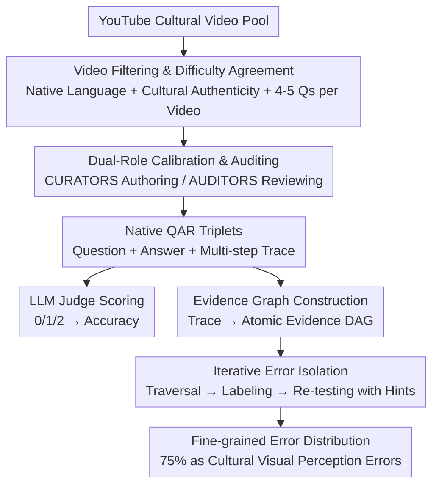

# CURVE: A Benchmark for Cultural and Multilingual Long Video Reasoning

**Conference**: CVPR 2026  
**Paper**: [CVF Open Access](https://openaccess.thecvf.com/content/CVPR2026/html/Singh_CURVE_A_Benchmark_for_Cultural_and_Multilingual_Long_Video_Reasoning_CVPR_2026_paper.html)  
**Code**: To be confirmed (Authors committed to public release)  
**Area**: Multimodal VLM  
**Keywords**: Video understanding, multicultural benchmark, multilingual, long video reasoning, evidence graph diagnosis

## TL;DR
CURVE is a multicultural and multilingual long video reasoning benchmark (18 regions/languages, 540 videos, 2400 questions) fully annotated by local experts. It features a fine-grained error diagnosis method based on "Evidence Graphs + Iterative Error Isolation." Evaluations show that Gemini-2.5-Pro, the strongest model, achieves an aggregate accuracy of only 45%, far below the human performance of 95%, with 75% of failures originating from perceptual errors regarding cultural visual elements.

## Background & Motivation
**Background**: Long video understanding has progressed rapidly with benchmarks like Video-MME, MLVU, LongVideoBench, and EgoSchema. These benchmarks typically collect videos and pair them with multiple-choice or open-ended questions to test a model's perception and temporal reasoning.

**Limitations of Prior Work**: Existing benchmarks are predominantly "Western-centric and English-focused." A few efforts to expand language coverage (e.g., xGQA, MaRVL, ViMUL-Bench) take the shortcut of **machine-translating English annotations**. While the language changes, the visual content and cultural context remain rooted in Western concepts, introducing translation noise and failing to test genuine cultural understanding. Furthermore, most benchmarks only evaluate the **final answer**, making it impossible to pinpoint exactly where the model failed.

**Key Challenge**: To truly measure "cultural understanding," annotations must be natively authored by **local experts proficient in both the native language and culture**, rather than translated. To diagnose "what went wrong," a single accuracy score is too coarse; the multi-step human reasoning process must be structured and compared node-by-node. However, once one step fails, subsequent steps collapse—creating a dilemma where "penalizing the whole chain double-counts errors, but only looking at the first error loses diagnostic information."

**Goal**: (i) Create a **non-translated, natively cultural** multilingual long video reasoning benchmark; (ii) Provide a diagnostic protocol to pinpoint errors step-by-step; (iii) Quantify the gap between state-of-the-art models and humans and identify root causes of failure.

**Key Insight**: Each question is paired not only with an answer but also with a **human-written native multi-step reasoning trace**. This trace serves as the basis for "why this answer was given" and a benchmark for deconstructing and comparing model reasoning step-by-step.

**Core Idea**: Replace "translated annotations + final answer only" with "natively annotated cultural videos + reasoning traces converted to evidence graphs + iterative error isolation" to fairly and explainably expose VLM weaknesses in multicultural video reasoning.

## Method
CURVE is essentially a **benchmark and a diagnostic protocol**, rather than a new model. It comprises two relatively independent pipelines: a **human annotation pipeline** (ensuring cultural authenticity and difficulty) and an **evidence graph diagnosis pipeline** (pinpointing model errors during evaluation).

### Overall Architecture
Data side: Approximately 5 local experts were recruited for each of the 18 regions, divided into CURATORS (question designers) and AUDITORS (reviewers). Following a four-stage process—cultural video filtering, 10% sample calibration, final annotation with continuous auditing, and human evaluation—they produced 2,400 native questions. Each question includes a video, a complex native language question, an objective answer, and a human multi-step reasoning trace. Evaluation side: An LLM Judge (Gemini-2.5-Flash) scores open-ended responses on a 0/1/2 scale. Human traces are converted into **Evidence Graphs (DAGs)**, and an **Iterative Error Isolation** algorithm compares model reasoning node-by-node, assigning fine-grained labels to each failure point.

### Key Designs

**1. Dual-role Human Annotation Pipeline: Adversarial Collaboration for Authenticity and Difficulty**
The main pain point is that "translated annotations fail to measure cultural understanding, and automated questions are too easy." CURVE uses no synthetic data. Instead, it pairs CURATORS and AUDITORS for each region. The process includes: AUDITORS refining six domains (Sports, Food, Festivals, Travel, Rituals, Education) into local subcategories; manual filtering of YouTube content (requiring native audio, meaningful audiovisual content, authentic scenes, duration >1 minute); and **calibration** using 10% of samples. Calibration involves Hardness Calibration (ensuring questions cannot be solved via single frames, audio only, or general common sense) and Correctness Calibration (independent AUDITOR answering without seeing the key). Any disagreements trigger iterative revisions until consensus is reached.

**2. Native Multi-step Reasoning Traces: Providing a Benchmark for "Why"**
Existing cultural benchmarks (e.g., ViMUL-Bench) only provide final answers, precluding fine-grained diagnosis. CURVE mandates a **native multi-step reasoning trace**—a detailed process (hundreds of words) explaining what human experts see, retrieve, and infer. Each question requires at least two reasoning skills (e.g., temporal ordering, spatial perception, causal reasoning) plus a **mandatory "Visual Cultural Understanding" skill**.

**3. Evidence Graph: Formalizing Human Reasoning into a DAG**
To automate diagnosis, CURVE uses a prompted LLM to convert unstructured human traces into Directed Acyclic Graphs (DAGs). **Nodes are atomic evidence** (single pieces of information needed for the answer, categorized as: visual observations with timestamps, retrieved external facts, or logical inferences). On average, each question requires ~5.0 atomic evidence nodes, with over 63% grounded in specific timestamps. The graph depth is $\mu=2.5, \sigma=1.3$.

**4. Iterative Error Isolation: Solving Error Propagation via Counterfactual Hints**
A single error often leads to a chain reaction of failures. CURVE employs a three-stage cycle (Algorithm 1): **① Traversal**—An LLM performs BFS on the evidence graph, comparing model reasoning to each node; **② Error Isolation & Labeling**—When a node fails, it is marked as Divergence (model takes an alternative valid path, 2% of cases) or Error (failed to produce required evidence). Errors are categorized by a taxonomy (Perception, Knowledge, Reasoning); **③ Hint Generation & Re-testing**—Corrective hints containing the missing evidence are generated for the failed node. The graph is pruned, and the model is re-queried with "previously collected evidence + new hint." This continues until the chain is complete, uncovering errors masked by previous failures (uncovering ~22% more errors).

### Loss & Training
This work presents a benchmark and protocol, not a new model. Key evaluation points: Open-ended answers are scored 0/1/2 by Gemini-2.5-Flash. The diagnostic pipeline (graph construction, labeling, hints) uses Gemini-2.5-Pro. The human baseline was established by local evaluators who could use web searches for entities but were **strictly forbidden from using any LLMs**.

## Key Experimental Results

### Main Results: Models vs. Humans across 18 Regions
Aggregate scores are weighted by region.

| Model | Agg. Accuracy | Lowest Region (ta-IN) | Highest Region |
|-------|---------------|-----------------------|----------------|
| Human Baseline | **95.22** | 95.20 | 98.24 (it-IT) |
| Gemini-2.5-Pro | 45.07 | 31.60 | 64.29 (ko-KR) |
| GPT-5 | 42.20 | 26.40 | 56.34 (id-ID) |
| GPT-5-mini | 36.64 | 16.40 | 51.90 (ko-KR) |
| Gemini-2.5-Flash | 35.84 | 20.00 | 51.90 (de-DE) |
| Claude-Sonnet-4 | 23.36 | 15.60 | 30.97 (id-ID) |
| Qwen-3-VL | 21.50 | 12.40 (te-IN) | 34.58 (en-GB) |
| Qwen-2.5-VL | 12.75 | 3.60 | 25.70 (en-GB) |

The gap between the strongest model and humans is approximately **50 percentage points**. The gap is particularly stark in South Indian languages (te-IN, ta-IN), exposing Western/English bias in pre-training data.

### Ablation Study (Gemini-2.5-Pro on a 6-region subset)

| Dimension | Setting | Key Results |
|-----------|---------|-------------|
| Audio Importance | AV vs. Video-only | Audio adds **+4.32%** on average (zh-TW +8.15%) |
| Thought Budget | 128→32k tokens | Accuracy rises from 35.9% to a peak of **45.9% (2k)** before saturating |
| Temporal Complexity | 1→512 frames | Monotonic increase with diminishing returns; huge gap remains |

### Key Findings
- **The bottleneck is cultural contextual reasoning, not visual information volume**: Even at 512 frames, models lag behind humans, suggesting the issue is "understanding cultural context" rather than "seeing."
- **Audio is a non-redundant modality**: Native dialogue and cultural sound effects provide stability, proving CURVE requires "audiovisual integration."
- **Test-time compute ROI saturates quickly**: Accuracy stops improving after 2k tokens, meaning reasoning budget cannot compensate for perceptual flaws in cultural elements.
- **Iterative error isolation is indispensable**: Looking only at the first error would miss ~22% of failures, particularly reasoning errors masked by perceptual failures.

## Highlights & Insights
- **Replaced "translated multilingualism" with "native annotation"**: All 18 languages are natively authored by experts. This is the fundamental difference from translation-based benchmarks like ViMUL-Bench.
- **Evidence Graph + Iterative Error Isolation as a transferable paradigm**: Upgrading evaluation from "final answer" to "atomic evidence comparison + counterfactual re-entry" can be applied to other multi-step tasks like math or Agent planning.
- **Divergence vs. Error distinction**: Identifying reasonable alternative paths (2%) prevents penalizing valid but non-standard reasoning.
- **75% of failures attributed to cultural visual perception**: This quantitative conclusion provides a clear target for VLM improvement—focusing on cultural object/event perception rather than just increasing reasoning capacity.

## Limitations & Future Work
- The diagnostic pipeline relies on Gemini-2.5-Pro, creating an **LLM-judging-LLM** scenario that may introduce bias.
- **Difficulty in decoupling perceptual and cultural errors**: While CURVE focuses on cultural context, some errors may stem from general visual limitations.
- Coverage of 18 regions is not exhaustive.
- Future work involves using heterogeneous ensembles of judges and expanding evidence graphs to include fine-grained audio evidence nodes.

## Related Work & Insights
- **vs. ViMUL-Bench**: ViMUL contains generic videos and relies partially on translation; CURVE is fully native/human-annotated with multi-step traces and evidence-based diagnosis.
- **vs. MINERVA**: MINERVA uses traces for error classification, but CURVE formalizes them into DAGs and uses **Iterative Error Isolation** to capture temporal/causal dependencies.
- **vs. Video-MME / LongVideoBench**: These are Western/English-centric. CURVE adds an orthogonal "native cultural context" dimension to expose biases these benchmarks miss.

## Rating
- Novelty: ⭐⭐⭐⭐⭐ Native multicultural benchmark + Evidence Graph diagnosis.
- Experimental Thoroughness: ⭐⭐⭐⭐⭐ 7 models across 18 regions with multi-modal and budget analysis.
- Writing Quality: ⭐⭐⭐⭐ Clear motivation and methodology.
- Value: ⭐⭐⭐⭐⭐ Provides a quantifiable, diagnostic scale for VLM cultural bias.

<!-- RELATED:START -->

<!-- RELATED:END -->

## Related Papers

- [\[CVPR 2026\] Thinking With Videos: Multimodal Tool-Augmented Reinforcement Learning for Long Video Reasoning](thinking_with_videos_multimodal_tool-augmented_reinforcement_learning_for_long_v.md)
- [\[CVPR 2026\] REVISOR: Beyond Textual Reflection, Towards Multimodal Introspective Reasoning in Long-Form Video Understanding](revisor_beyond_textual_reflection_towards_multimodal_introspective_reasoning_in_.md)
- [\[CVPR 2026\] Select Less, Reason More: Prioritizing Evidence Purity for Video Reasoning](select_less_reason_more_prioritizing_evidence_purity_for_video_reasoning.md)
- [\[CVPR 2026\] MSJoE: Jointly Evolving MLLM and Sampler for Efficient Long-Form Video Understanding](msjoe_jointly_evolving_mllm_and_sampler_for_efficient_long-form_video_understand.md)
- [\[CVPR 2026\] QUANTIPHY: A Quantitative Benchmark Evaluating Physical Reasoning Abilities of Vision-Language Models](quantiphy_a_quantitative_benchmark_evaluating_physical_reasoning_abilities_of_vi.md)

<!-- RELATED:END -->
