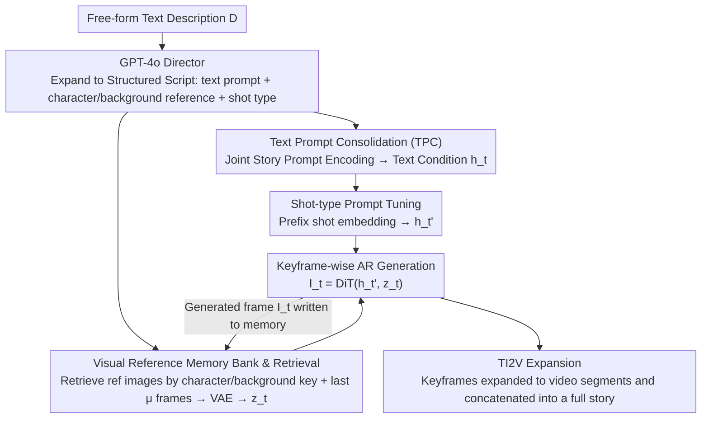

# Customized Visual Storytelling with Unified Multimodal LLMs

**Conference**: CVPR 2026  
**arXiv**: [2603.27690](https://arxiv.org/abs/2603.27690)  
**Code**: None (Project page not explicitly provided)  
**Area**: Multimodal VLM / Visual Storytelling Generation  
**Keywords**: Visual Story Generation, Multimodal Customization, Unified Multimodal LLM, Shot Type Control, Keyframe Generation

## TL;DR
The authors propose the VstoryGen framework and its core component, CustFilmer, which utilizes a Unified Multimodal Large Language Model (UMLLM) for customized multimodal story generation. It supports joint conditional control of text descriptions, character/scene reference images, and shot types, while establishing two new benchmarks: MSB and M2SB.

## Background & Motivation

**Background**: Significant progress has been made in text-to-video generation, but generating long-sequence coherent narrative videos remains a challenge. Existing visual story generation methods (ConsiStory, StoryDiffusion, CharaConsist) primarily rely on text-only input, with few supporting character ID maintenance.

**Limitations of Prior Work**: (1) Existing methods only use text input, failing to utilize reference images for customizing characters and scenes; (2) Background consistency is often neglected, focusing only on foreground characters; (3) Generated perspectives are monotonous, lacking cinematic shot language (long shot/medium shot/close-up, etc.); (4) Capability for generating multi-character interaction scenes is insufficient.

**Key Challenge**: How to maintain character and scene consistency while achieving flexible multimodal conditional control (text + reference images + shot types)?

**Goal**: Construct a visual narrative pipeline that supports rich multimodal conditions by leveraging the multimodal understanding and generation capabilities of UMLLMs.

**Key Insight**: Extend the image editing capabilities of UMLLMs into keywise autoregressive story generation, enhancing consistency and cinematic quality through structured retrieval and shot-type prompt tuning.

**Core Idea**: UMLLM + Structured Multimodal Script + Visual Reference Memory Bank + Shot-type Prompt Tuning = Customizable Visual Storytelling.

## Method

### Overall Architecture
VstoryGen aims to solve the problem of "generating a complete visual story with coherent shots, consistent characters/scenes, and cinematic shot language from a single free-form description." The process is divided into three sequential stages: first, GPT-4o expands the user's free text into a structured script (each shot includes a text prompt, designated character/background reference images, and shot type); next, the core component CustFilmer generates consistent keyframes frame-by-frame; finally, an off-the-shelf TI2V (text-and-image-to-video) model expands each keyframe into video segments to assemble the full story. The primary technical contribution lies in CustFilmer, which transforms a UMLLM (originally capable of only "single-instance image editing") into a story generator capable of sequential generation with memory. Inside CustFilmer, each frame follows two parallel conditional branches: the text side uses TPC for joint encoding to produce $h_t$, which is then prefixed with shot-type embeddings to form $h_t'$; the visual side retrieves $z_t$ from a memory bank. These two paths merge as conditions for the DiT decoder in keyframe-wise autoregressive generation. The output image $I_t$ is written back to the memory bank for subsequent retrieval, forming a frame-by-frame loop.

### Key Designs

**1. Text Prompt Consolidation (TPC): Sharing Context Across All Story Shots**

If each shot's prompt is encoded individually by the LLM, the character and scene embeddings across different frames may diverge, potentially causing identity shifts. TPC places all prompts $P=\{p_1,\dots,p_n\}$ for a single story within the same batch and a single context window for joint autoregressive encoding, resulting in hidden states $H=\{h_1,\dots,h_n\}$. Since these descriptions share the same context, the inherent context consistency of the LLM naturally aligns their hidden states in terms of semantics and identity. When each frame uses its respective $h_t$ for decoding, the character and scene settings remain locked to a consistent baseline.

**2. Visual Reference Memory Bank & Retrieval: Using Structured Retrieval for Reference Images**

Textual consistency alone is insufficient; low-level visual information like facial features and background details requires image references. A key-value memory bank is maintained where keys are identifiers (e.g., character names, background labels) and values are initial reference images and previously generated keyframes. When generating frame $t$, the system performs precise retrieval based on the character/background mentioned in the script, which is then encoded as visual conditions along with the $\mu$ most recent frames via a VAE:

$$z_t = \text{VAE}\big[\mathcal{R}_t,\ \{\text{Scale}_\alpha(I_{t-i})\}_{i=1}^{\mu}\big]$$

The authors deliberately avoid embedding-similarity-based retrieval to prevent retrieving similar but incorrect images. Using hard keys from the script ensures precise selection. Including the $\mu$ recent frames ensures temporal continuity, while the scaling factor $\alpha$ controls the influence of historical frames: higher values prioritize consistency, while lower values allow for more diversity.

**3. Shot-type Prompt Tuning: Injecting Composition Priors into UMLLMs**

General UMLLMs do not inherently understand cinematic compositions like "long shot" or "close-up." To avoid fine-tuning the massive base model, the authors learn a set of shot-type embeddings $E_{\text{shot}}(k_t)\in\mathbb{R}^{d\times N}$ on the Condensed Movie Dataset (CMD), which are prefixed to the hidden states:

$$h_t' = [\,E_{\text{shot}}(k_t);\ h_t\,]$$

This prompt tuning approach freezes the base model and only updates the shot embeddings, completing training in approximately 4,000 iterations. This minimal cost provides controllability over shot types, allowing the same story to be rendered with varied cinematic perspectives.

**4. Keyframe-wise Autoregressive Generation: Transforming Image Editing into Sequential Generation**

Standard UMLLM image editing is a "one-off" operation. Generating a continuous story through multiple dialogue turns is slow and accumulates error. Ours converts this into keyframe-wise autoregression: each frame feeds the text condition $h_t'$ and visual condition $z_t$ into the DiT decoder for direct output:

$$I_t = \text{DiT}(h_t',\ z_t)$$

The generated $I_t$ is written back to the memory bank as a reference for subsequent frames. Encoding reference images directly into the DiT via VAE ensures that low-level visual information is preserved rather than being diluted by the language layers over multiple turns.

### Loss & Training
The only component requiring training is the shot-type prompt tuning: it is trained for 4,000 iterations on CMD movie data, updating only the shot embeddings while the base model remains frozen. Inference uses OmniGen2 as the backbone UMLLM with hyperparameters $\alpha=0.75$, $d=2048$, and $N=30$.

## Key Experimental Results

### Main Results — MSB Benchmark (Consistency Metrics)

| Method | Base Model | CLIP-I-fg (Inter)↑ | CLIP-I-bg (Inter)↑ | Avg Consistency↑ |
|------|---------|-------------------|-------------------|------------------|
| IP-Adapter | SDXL | 0.901 | 0.936 | 0.846 |
| ConsiStory | SDXL | 0.868 | 0.884 | 0.812 |
| StoryDiffusion | SDXL | 0.857 | 0.900 | 0.831 |
| CharaConsist | Flux.1 | 0.904 | 0.945 | 0.852 |
| **CustFilmer** | **OmniGen2** | **0.905** | **0.961** | **0.858** |

Text Alignment and Quality Metrics:

| Method | CLIP-T↑ | IAS↑ | IQS↑ | STA (Shot)↑ |
|------|--------|------|------|-----------|
| ConsiStory | **0.303** | 0.431 | 0.385 | 0.406 |
| CharaConsist | 0.265 | 0.448 | 0.415 | 0.247 |
| **CustFilmer** | 0.285 | **0.450** | **0.423** | **0.418** |

### Ablation Study

| Configuration | Avg-Consistency↑ | Description |
|------|-----------------|------|
| Without TPC + Without Retrieval | 0.854 | Baseline |
| + TPC | 0.855 | Marginal Gain |
| + Retrieval | 0.856 | Marginal Gain |
| + TPC + Retrieval | **0.858** | Complementary |

$\alpha$ Parameter Ablation:

| $\alpha$ | CLIP-T↑ | Avg-Consistency↑ | Description |
|---------|--------|-----------------|------|
| 0.125 | **0.289** | 0.850 | High diversity, low consistency |
| 0.75 | 0.285 | 0.858 | Optimal balance |
| 1.00 | 0.284 | **0.860** | Most consistent, limited diversity |

### Key Findings
- CustFilmer achieves the best overall consistency, particularly in background consistency (CLIP-I-bg), significantly outperforming all other methods.
- Shot-type control accuracy (STA=0.418) far exceeds non-customized methods.
- CLIP-T is slightly lower than ConsiStory, attributed to different backbone models (SDXL's use of CLIP encoder during training provides a natural advantage).
- $\alpha=0.75$ provides the best balance between consistency and diversity.

## Highlights & Insights
- **Full Multimodal Story Pipeline**: Provides an end-to-end solution from free-form text description to structured script, keyframes, and finally video.
- **Shot Type Control**: For the first time, cinematic shot language is introduced into visual story generation, significantly enhancing narrative expression.
- **Benchmark Contribution**: MSB and M2SB fill the evaluation gap for customized multimodal storytelling.
- **UMLLM-based**: Utilizing the joint understanding and generation capabilities of Unified Multimodal LLMs represents a new paradigm for story generation.

## Limitations & Future Work
- Dependency on GPT-4o for script generation (costs and latency).
- The consistency gains from TPC and Retrieval are relatively small (0.854→0.858), suggesting limited marginal utility of these designs.
- Advantages in multi-character scenarios (M2SB) are less pronounced than in single-character scenarios.
- Direct comparison with the latest specialized video generation models (e.g., Veo3) is missing.

## Related Work & Insights
- Comparisons with CharaConsist indicate that text-only input limits customization flexibility.
- Using UMLLMs (specifically OmniGen2) as a backbone for story generation is a promising direction.
- The concept of shot-type prompt tuning can be generalized to other generation tasks requiring compositional control.

## Rating
- Novelty: ⭐⭐⭐⭐ The combination of multimodal customization and shot control is innovative, though components are somewhat incremental.
- Experimental Thoroughness: ⭐⭐⭐⭐ New benchmarks, multiple baselines, and ablations are included, though deeper video-level evaluation is lacking.
- Writing Quality: ⭐⭐⭐⭐ Clear structure with detailed methodology.
- Value: ⭐⭐⭐⭐ Effectively advances the field of visual narrative generation; the framework and benchmarks are likely to be adopted by future work.

<!-- RELATED:START -->

## Related Papers

- [\[CVPR 2026\] TUNA: Taming Unified Visual Representations for Native Unified Multimodal Models](tuna_taming_unified_visual_representations_for_native_unified_multimodal_models.md)
- [\[CVPR 2026\] Widget2Code: From Visual Widgets to UI Code via Multimodal LLMs](widget2code_from_visual_widgets_to_ui_code_via_multimodal_llms.md)
- [\[CVPR 2026\] DuetSVG: Unified Multimodal SVG Generation with Internal Visual Guidance](duetsvg_unified_multimodal_svg_generation_with_internal_visual_guidance.md)
- [\[ICCV 2025\] Multimodal LLMs as Customized Reward Models for Text-to-Image Generation](../../ICCV2025/multimodal_vlm/multimodal_llms_as_customized_reward_models_for_text-to-image_generation.md)
- [\[CVPR 2026\] Visual-Aware CoT: Achieving High-Fidelity Visual Consistency in Unified Models](visual-aware_cot_achieving_high-fidelity_visual_consistency_in_unified_models.md)

<!-- RELATED:END -->
