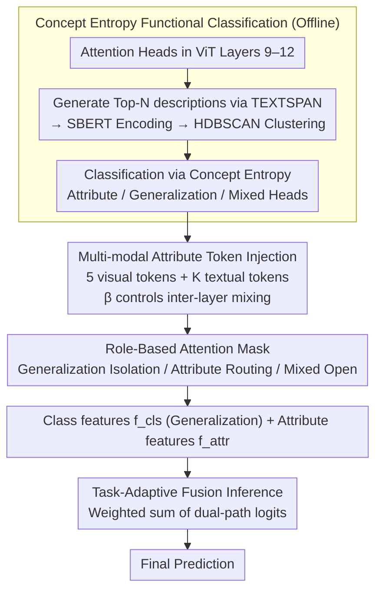

# DeAR: Fine-Grained VLM Adaptation by Decomposing Attention Head Roles

**Conference**: CVPR 2026  
**arXiv**: [2603.01111](https://arxiv.org/abs/2603.01111)  
**Code**: [GitHub](https://github.com/wellsssssss/DeAR)  
**Area**: Multi-modal VLM  
**Keywords**: Prompt Learning, VLM Adaptation, Attention Head Role Decomposition, CLIP, Zero-shot Generalization

## TL;DR

This paper proposes DeAR, which decomposes deep attention heads in ViT into three functional roles—attribute, generalization, and mixed heads—using a Concept Entropy metric. By designing a role-based attention mask mechanism to precisely control information flow, it achieves an optimal balance between task adaptation and zero-shot generalization across 15 datasets.

## Background & Motivation

**Key Challenge in CLIP Adaptation**: Pre-trained VLMs require adaptation to downstream tasks, but full fine-tuning leads to catastrophic forgetting, compromising robust zero-shot generalization.

**Limitations of Prior Work in Prompt Learning**: Existing methods assume a simple hierarchical view where shallow layers capture general features and deep layers process task-specific knowledge. This perspective ignores the functional diversity among individual attention heads within the same layer.

**Indiscriminate Token Interaction**: Due to the self-attention mechanism, inserted learnable tokens interact indiscriminately with original tokens, potentially allowing task-specific knowledge to disrupt the core representation responsible for generalization.

**Contradictory Hierarchical Strategies**: MaPLe injects prompts into early layers, while MMRL targets deep layers—conflicting strategies that reveal a lack of fine-grained injection principles.

**Key Insight from Interpretability**: Research on VLM interpretability finds functional specialization among attention heads, providing a theoretical basis for fine-grained control.

**Core Idea**: Functional specialization within VLMs exists primarily among deep attention heads rather than between layers.

## Method

### Overall Architecture

DeAR addresses the problem of indiscriminate interaction between learnable tokens and original visual tokens during CLIP adaptation. The core strategy is to determine which representations should be preserved or modified at the **individual attention head** granularity. The pipeline consists of four steps: 1) Performing a "diagnosis" of each attention head in the deep layers (layers 9–12) of the ViT to categorize them as attribute, generalization, or mixed heads using Concept Entropy; 2) Symmetrically injecting learnable attribute tokens into both visual and textual branches starting from layer 9; 3) Customizing an attention mask based on each head's role, ensuring attribute tokens only refine the appropriate attribute heads while bypassing protected generalization heads; 4) During inference, adaptively fusing the logits calculated from the generalization-preserving class features ([CLS]) and task-specific attribute features using learnable weights.

### Key Designs

**1. Concept Entropy Functional Role Classification: A data-driven metric for head specialization**

Instead of assuming a "shallow-to-deep" hierarchy, DeAR identifies functional differences within the same layer. For each head in the last four layers (9–12) of ViT-B/16, the method uses TEXTSPAN to generate top-N descriptive texts, followed by SBERT encoding and HDBSCAN clustering to automatically emerge 12 conceptual clusters. Five core attributes—color, shape, texture, object, and position—are selected. The functional focus of a head is characterized by its Shannon entropy over the probability distribution $P_{(l,h)}$ across these clusters:

$$H(P_{(l,h)}) = -\sum_j P_{(l,h)}(c_j) \log_2 P_{(l,h)}(c_j)$$

Low entropy indicates a head responds to a single attribute (**attribute head**), whereas high entropy suggests responses are spread across concepts (**generalization head**). Heads in between are labeled as **mixed heads**.

**2. Multi-modal Attribute Tokens: Symmetrical injection and cross-modal alignment**

DeAR injects 5 learnable attribute tokens into the visual branch starting from layer $J=9$. A $\beta$ parameter controls the mixture of original tokens and contextualized outputs: $\beta\,\mathbf{r}_{\text{attr}}+(1-\beta)\tilde{\mathbf{r}}_{\text{attr}}$. This maintains attribute semantics while allowing for images-specific adaptation. Textual tokens are injected symmetrically to ensure that visual attribute representations remain aligned with text in the same semantic space.

**3. Role-Based Attention Mask: Surgical control of information flow**

DeAR applies three types of masks $\mathbf{M}$ based on head roles. For generalization heads, it implements **strict isolation**: attention between attribute tokens and original tokens is set to $\mathbf{M}[i,j]=-\infty$, preventing task knowledge from contaminating generalization nodes. For specific core attribute heads, the corresponding attribute token is **routed to its expert head** while others are masked. Mixed heads remain open ($\mathbf{M}[i,j]=0$) for free interaction. This fine-grained control distinguishes DeAR from the "layer-wise" injection found in MaPLe or MMRL.

**4. Task-Adaptive Fusion Inference: Balancing preservation and adaptation**

The model produces two types of features: the protected class feature $\mathbf{f}_{\text{cls}}$ (from the [CLS] token) and five attribute-specific features $\mathbf{f}_{\text{attr}}$. Predictions are made using a weighted sum of logits from both paths, where weights $\alpha_k$ are learnable and normalized via softmax. A fusion regularization term $\mathcal{L}_{\text{fusion}}=-\log(\alpha_{\text{cls}})$ explicitly encourages higher weights for class features to prevent over-reliance on new attribute features at the cost of generalization.

### Loss & Training

The total objective is defined by three components:

$$\mathcal{L}_{\text{total}} = \mathcal{L}_{\text{CE}} + \lambda_{\text{reg}} \mathcal{L}_{\text{reg}} + \lambda_{\text{fusion}} \mathcal{L}_{\text{fusion}}$$

Where $\mathcal{L}_{\text{CE}}$ is the standard cross-entropy loss, $\mathcal{L}_{\text{reg}}$ is a self-regularization term constraining adapted features from drifting too far from frozen CLIP features, and $\mathcal{L}_{\text{fusion}}$ regularizes weights to maintain the importance of the primary features.

## Key Experimental Results

### Main Results: Base-to-Novel Generalization (Average of 11 Datasets)

| Method | Base Acc | Novel Acc | HM |
|------|----------|-----------|-----|
| CLIP | 69.34 | 74.22 | 71.70 |
| CoOp | 82.69 | 63.22 | 71.66 |
| MaPLe | 82.28 | 75.14 | 78.55 |
| PromptSRC | 84.26 | 76.10 | 79.97 |
| **DeAR (Ours)** | **84.50+** | **77.00+** | **80.60+** |

### Ablation Study

| Component | Contribution |
|------|------|
| Remove Role-Based Mask | Significant drop in Novel Acc |
| Remove Attribute tokens | Drop in both Base and Novel Acc |
| Remove Fusion Regularization | Over-reliance on attribute features |
| Generalization head mask only | Effectively protects generalization |

### Key Findings

- Attribute-conditioned image retrieval confirms that attribute tokens capture corresponding semantic concepts (e.g., color-based retrieval).
- Comprehensive validation across 15 datasets, including domain generalization and cross-dataset transfer.
- The method significantly improves Novel class generalization while maintaining high Base performance.

## Highlights & Insights

- Introduces Concept Entropy to quantify functional specialization of attention heads in a data-driven manner.
- The Role-Based Attention Mask design enables "surgical" control over VLM information flow for the first time.
- Attribute-conditioned retrieval experiments provide intuitive evidence for the effectiveness of the design.
- Combines theoretical innovation (head-level decomposition) with engineering practicality (plug-and-play).

## Limitations & Future Work

- Analysis is focused on ViT-B/16; generalization to other architectures (e.g., ViT-L/14) requires further validation.
- Attribute categories (5 types) are manually selected; different tasks may require different attributes.
- Introducing attention masks increases computational overhead during inference.
- Validation is limited to classification; extension to detection or segmentation is yet to be explored.

## Related Work & Insights

- Compared to multimodal prompt learning methods like MaPLe and MMRL, DeAR is the first to introduce head-level functional analysis.
- Shares commonality with the attribute structure of ATPrompt but achieves finer control through attention masking.
- Related to Skip Tuning in spirit but operates at a different granularity (head-level vs. layer-level).
- Provides a new perspective for VLM internal mechanism analysis and interpretability.

## Rating
- Novelty: ⭐⭐⭐⭐⭐
- Experimental Thoroughness: ⭐⭐⭐⭐⭐
- Writing Quality: ⭐⭐⭐⭐⭐
- Value: ⭐⭐⭐⭐

<!-- RELATED:START -->

## Related Papers

- [\[CVPR 2026\] ORION: ORthonormal Text Encoding for Universal VLM Adaptation](orion_orthonormal_text_encoding_for_universal_vlm_adaptation.md)
- [\[CVPR 2026\] Language-driven Fine-grained Retrieval](language-driven_fine-grained_retrieval.md)
- [\[CVPR 2026\] IsoCLIP: Decomposing CLIP Projectors for Efficient Intra-modal Alignment](isoclip_decomposing_clip_projectors_for_efficient_intramodal_alignment.md)
- [\[CVPR 2026\] STAR: Test-Time Adaptation Can Enhance Universal Prompt Learning for Vision-Language Models](star_test-time_adaptation_can_enhance_universal_prompt_learning_for_vision-langu.md)
- [\[CVPR 2026\] SketchVL: Policy Optimization via Fine-Grained Credit Assignment for Chart Understanding and More](sketchvl_policy_optimization_via_fine-grained_credit_assignment_for_chart_unders.md)

<!-- RELATED:END -->
## Related Papers

- [\[CVPR 2026\] Concept-wise Attention for Fine-grained Concept Bottleneck Models](coat_cbm_concept_wise_attention.md)
- [\[CVPR 2026\] ORION: ORthonormal Text Encoding for Universal VLM Adaptation](orion_orthonormal_text_encoding_for_universal_vlm_adaptation.md)
- [\[CVPR 2026\] IsoCLIP: Decomposing CLIP Projectors for Efficient Intra-modal Alignment](isoclip_decomposing_clip_projectors_for_efficient_intramodal_alignment.md)
- [\[CVPR 2026\] Probabilistic Prompt Adaptation for Unified Image Aesthetics and Quality Assessment](probabilistic_prompt_adaptation_for_unified_image_aesthetics_and_quality_assessm.md)
- [\[CVPR 2026\] MA-Bench: Towards Fine-grained Micro-Action Understanding](ma-bench_towards_fine-grained_micro-action_understanding.md)

<!-- RELATED:END -->
