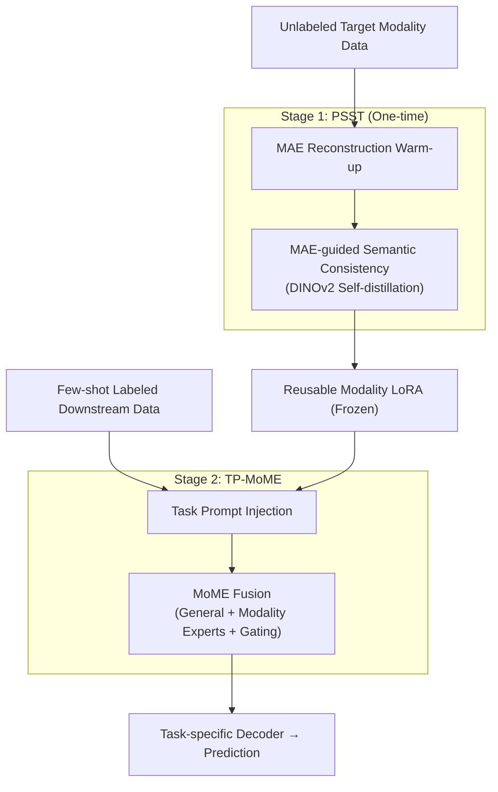

# Decoupled and Reusable Adaptation for Efficient Cross-Modal Transfer

**Conference**: CVPR 2026  
**Paper**: [CVF Open Access](https://openaccess.thecvf.com/content/CVPR2026/html/Liu_Decoupled_and_Reusable_Adaptation_for_Efficient_Cross-Modal_Transfer_CVPR_2026_paper.html)  
**Code**: None  
**Area**: Multimodal VLM  
**Keywords**: Cross-modal transfer, Parameter-efficient transfer, LoRA, Self-supervised learning, Mixture of Modality Experts (MoE)  

## TL;DR
The process of "transferring RGB foundation models to non-RGB modalities such as infrared, depth, and events" is decoupled into two stages: "one-time modality knowledge learning (self-supervised training of reusable modality LoRA)" + "lightweight task knowledge learning (task prompts + Mixture of Modality Experts)". This eliminates the need for retraining from scratch when switching tasks, achieving triple efficiency gains in data, computation, and storage across six cross-modal scenarios.

## Background & Motivation

**Background**: Non-RGB modalities like infrared, depth, events, and LiDAR provide complementary information beyond RGB, but these modalities suffer from scarce annotations and a lack of large-scale foundation models. The mainstream approach leverages visual priors from RGB foundation models (SAM/SAM 2, DINOv2, CLIP) and adapts them to specific target modality tasks using parameter-efficient transfer methods (LoRA, adapter, prompt tuning). For instance, SHIFNet adapts SAM 2 for RGB-T segmentation, and DSAM adapts SAM for depth-based camouflaged object detection.

**Limitations of Prior Work**: Existing methods are **task-oriented**, performing supervised training directly on specific task labels to bridge both the "modality gap" and the "task gap" simultaneously. Consequently, switching to a new downstream task requires recollecting annotations, retraining from scratch, and storing a separate model instance. This leads to substantial redundancy in labeling, computation, and storage. Furthermore, when task-specific samples are scarce, task supervision alone is insufficient to bridge both gaps effectively.

**Key Challenge**: The authors point out that existing paradigms **couple** the learning of "modality knowledge" and "task knowledge" into a single adaptation process, ignoring the crucial fact that the **modality gap** dominates cross-modal differences and is **largely shared** across different tasks. Although data from different tasks within the same target modality have heterogeneous annotations, collectively they characterize the intrinsic distribution of that modality. Since modality knowledge is reusable, it is unnecessary to relearn it for every task.

**Goal**: To achieve efficient cross-modal transfer by making modality knowledge "learned once, reused across tasks" and task knowledge "lightweight, fast, and replaceable." This is decomposed into two sub-problems: (1) How to learn universal modality knowledge **without relying on task labels**? (2) How to inject task knowledge and perform multimodal fusion at **minimal cost** while reusing modality knowledge?

**Core Idea**: **Decoupling**—splitting cross-modal transfer into Stage 1, "One-time Universal Modality Knowledge Transfer" (self-supervised training to produce reusable modality LoRA), and Stage 2, "Flexible Task Knowledge Transfer" (task prompts + Mixture of Modality Experts). Massive, easily obtainable unlabeled modality data is used to bridge the modality gap, while small amounts of labeled data bridge the task gap.

## Method

### Overall Architecture

The input consists of a batch of **unlabeled** data $\{X_m\}$ for a target modality. The backbone is a Hiera-B+/L encoder initialized from SAM 2 (conceptually frozen, adapted via LoRA). The pipeline consists of two stages:

- **Stage 1 (One-time, Unsupervised)**: Progressive Self-Supervised Tuning (PSST) trains LoRAs injected into the encoder using unlabeled data. It begins with an MAE-based reconstruction "warm-up," then transitions to "MAE-guided semantic consistency learning" (DINOv2-style self-distillation) joint training, allowing the LoRA to progressively learn from low-level texture/structure to high-level semantics. The result is a **frozen, reusable** modality LoRA.
- **Stage 2 (Task-specific, Lightweight)**: The frozen modality LoRA is utilized. Learnable task prompts are inserted into each Transformer block to absorb task knowledge. TP-MoME (Task-Prompted Mixture-of-Modality Experts) is deployed at specific layers for multimodal fusion. The fused hierarchical features are fed into a task-specific decoder for prediction. Switching tasks only requires retraining this lightweight set of prompts, MoME, and the decoder.

### Key Designs

**1. Decoupled Two-stage Transfer Paradigm: Separating shared modality knowledge from variable task knowledge**

This serves as the overarching framework addressing the flaw where task-oriented paradigms couple modality and task gaps. The authors observe that the modality gap is shared across tasks and can be characterized by unlabeled data. By splitting the process, Stage 1 performs a **one-time** modality transfer (producing a 1.3M LoRA), and Stage 2 performs **replaceable** task transfer. This reduces costs from "one full model per task" to "one LoRA per modality + few parameters per task."

**2. PSST (Progressive Self-Supervised Tuning): Injecting modality knowledge into LoRA from structure to semantics**

To learn modality knowledge without labels, the authors avoid standard contrastive learning (which assumes RGB-style invariance) and instead combine MAE reconstruction (structure) and DINOv2 self-distillation (semantics) in a **progressive, mutually guided** manner.

**Warm-up**: For unlabeled image $x_m$, a mask generator $G(\cdot)$ selects visible patches. Masked input $\tilde{x}_m = x_m \odot G(x_m)$ passes through the backbone+LoRA to get $z_m = E_{\theta_0+\Delta\theta}(\tilde{x}_m)$. The MAE head reconstructs the original image with loss:

$$L_{MAE} = \frac{1}{|G|}\sum_{i\in G}\bigl\|D_{MAE}(z_m)_i - x_{m,i}\bigr\|_1,$$

**Joint Stage**: A subset $D_{high,m}$ with high structural complexity (measured by MAE reconstruction variance) is used for joint training. The student and teacher (EMA) share the frozen backbone and LoRA. The semantic loss includes image-level consistency $L_{i\text{-}con}$ and **MAE-guided patch-level consistency**:

$$L_{p\text{-}con} = -\sum_i w_i\, p_{t,i}\log p_{s,i},\qquad w_i = \frac{\exp(\alpha e_i)}{\sum_j \exp(\alpha e_j)},$$

where $e_i$ is the MAE reconstruction error. Patches that are harder to reconstruct (deviating more from RGB priors) receive higher weights in semantic learning, forcing the model to focus on modality-specific cues.

**3. TP-MoME (Task-Prompted Mixture-of-Modality Experts): Balancing knowledge via prompts and MoE**

**Task Prompts**: Learnable prompts $P_i^m$ are prepended to patch tokens to inject task-specific priors with minimal parameters. **MoME Fusion**: At fused layers, features are projected and fed to a set of experts—one general expert $E_0$ and $N$ modality experts (trained with masked modality inputs to force complementary representation learning). A gating network computes weights $\beta^{(i)}$:

$$R^{(i)}_{MoME} = \hat{R}^{(i)}_{cat} + \beta^{(i)}_0 E_0(\hat{R}^{(i)}_{cat}) + \sum_{n=1}^{N}\beta^{(i)}_n Z^{(i)}_n,$$

where $\hat{R}^{(i)}_{cat}$ acts as a stable anchor. This explicitly balances modality commonality and specificity during fusion.

### Loss & Training
- Stage 1: $L_{PSST} = \lambda L_{MAE} + L_{DINO}$. MAE warm-up followed by joint training on the selected subset; teacher updated via EMA.
- Stage 2: Only downstream task loss $L_{task}$ is used to train prompts, MoME, and the decoder; modality LoRA remains frozen.
- Implementation: Hiera-B+/L backbone, LoRA rank=32 in self-attention layers; AdamW optimizer, lr 3e-4.

## Key Experimental Results

Evaluated across six cross-modal scenarios (RGB-T, RGB-D, RGB-Polarization, RGB-Event, RGB-D-E). Metrics are mIoU (%).

### Main Results

| Dataset | Modality | Ours (Backbone) | Prev. SOTA | Gain |
| :--- | :--- | :--- | :--- | :--- |
| SUN-RGBD | RGB-D | 56.3 (Hiera-L) | GeminiFusion 54.6 / SPEFT 55.0 | +1.7 / +1.3 |
| NYU Depth v2 | RGB-D | 61.4 (Hiera-L) | GeminiFusion 60.2 / SPEFT 59.9 | +1.2 / +1.5 |
| MFNet | RGB-T | 60.5 (Hiera-B+) | SPEFT 59.9 | +0.6 |
| PST900 | RGB-T | 88.7 (Hiera-B+) | SPEFT 87.6 / DPLNet 86.7 | +1.1 / +2.0 |
| MCubeS | RGB-A-D | 54.4 (Hiera-B+) | MemorySAM 52.9 | +1.5 |
| DELIVER | RGB-D-E | 65.1 (Hiera-B+) | MLE-SAM 62.7 / CMNeXt 64.4 | +2.4 / +0.7 |

### Ablation Study

Ablation on MCubeS and DELIVER (mIoU%):

| Configuration | R-A | R-A-D | R-D | R-D-E | Avg |
| :--- | :--- | :--- | :--- | :--- | :--- |
| Stage 2 only (TP-MoME) | 49.6 | 50.1 | 60.3 | 59.6 | 54.9 |
| + MAE | 50.8 | 51.0 | 61.4 | 61.5 | 56.2 |
| + DINO | 51.4 | 51.9 | 62.4 | 62.5 | 57.1 |
| Full (W-G + MoME) | 52.8 | 54.4 | 64.9 | 65.1 | **59.3** |

### Key Findings
- **PSST is critical**: Removing Stage 1 drops performance by 4.4 mIoU, proving the modality gap must be bridged via self-supervision first.
- **Mutually guided learning is superior**: Using MAE reconstruction error to weight semantic learning (W-G) provides a +1.1 gain over independent training.
- **Triple Efficiency**: Outperforms several methods using only 20% of annotations; cumulative parameters for 5 tasks are 121.4M (40.6M trainable), more efficient than MemorySAM (153.7M) and CMNeXt (525.1M).

## Highlights & Insights
- **Modality Knowledge as Storable LoRA**: Converting the observation that "modality gaps are shared" into a tangible engineering artifact (1.3M LoRA) is a clean and effective contribution.
- **Guiding Semantics with Reconstruction Failure**: The design where $w_i \propto \exp(\alpha e_i)$ uses the "failure" signal of one SSL task (MAE) to guide another (DINOv2), focusing the model on modality-specific features.
- **Optimal SSL Paradigm Choice**: By rejecting contrastive learning (which assumes brightness/texture invariance), the authors correctly identify that structure + self-distillation is better suited for non-RGB modalities.

## Limitations & Future Work
- The backbone scale significantly impacts results; Hiera-B+ is only "promising" in some tasks compared to FFT, requiring Hiera-L for a definitive lead.
- Stage 1 requires "sufficiently large and diverse" unlabeled data, which might not be available for extremely niche modalities.
- The evaluation focuses on dense prediction (segmentation). Its effectiveness on broader tasks like detection or classification remains to be fully verified.

## Related Work & Insights
- **vs. Task-oriented PEFT**: Unlike methods that couple gaps into one adaptation, this work extracts reusable modality LoRAs, reducing storage and trainable parameters significantly.
- **vs. MLE-SAM**: While MLE-SAM uses modality LoRAs as experts, the authors argue it lacks true MoE properties. TP-MoME introduces specialized experts and masking to explicitly balance modality-specific and common knowledge.

## Rating
- Novelty: ⭐⭐⭐⭐ 
- Experimental Thoroughness: ⭐⭐⭐⭐ 
- Writing Quality: ⭐⭐⭐⭐ 
- Value: ⭐⭐⭐⭐

<!-- RELATED:START -->

## Related Papers

- [\[CVPR 2026\] Parameter-Efficient Adaptation for MLLMs via Implicit Modality Decomposition](parameter-efficient_adaptation_for_mllms_via_implicit_modality_decomposition.md)
- [\[CVPR 2026\] Wan-Weaver: Interleaved Multi-modal Generation via Decoupled Training](wan-weaver_interleaved_multi-modal_generation_via_decoupled_training.md)
- [\[CVPR 2026\] CoV-Align: Efficient Fine-grained Cross-Modal Alignment with Cohesive Visual Semantics Priority](cov-align_efficient_fine-grained_cross-modal_alignment_with_cohesive_visual_sema.md)
- [\[ICLR 2026\] DecAlign: Hierarchical Cross-Modal Alignment for Decoupled Multimodal Representation Learning](../../ICLR2026/multimodal_vlm/decalign_hierarchical_cross-modal_alignment_for_decoupled_multimodal_representat.md)
- [\[CVPR 2026\] Decoupling Stability and Plasticity for Multi-Modal Test-Time Adaptation](decoupling_stability_and_plasticity_for_multi-modal_test-time_adaptation.md)

<!-- RELATED:END -->
