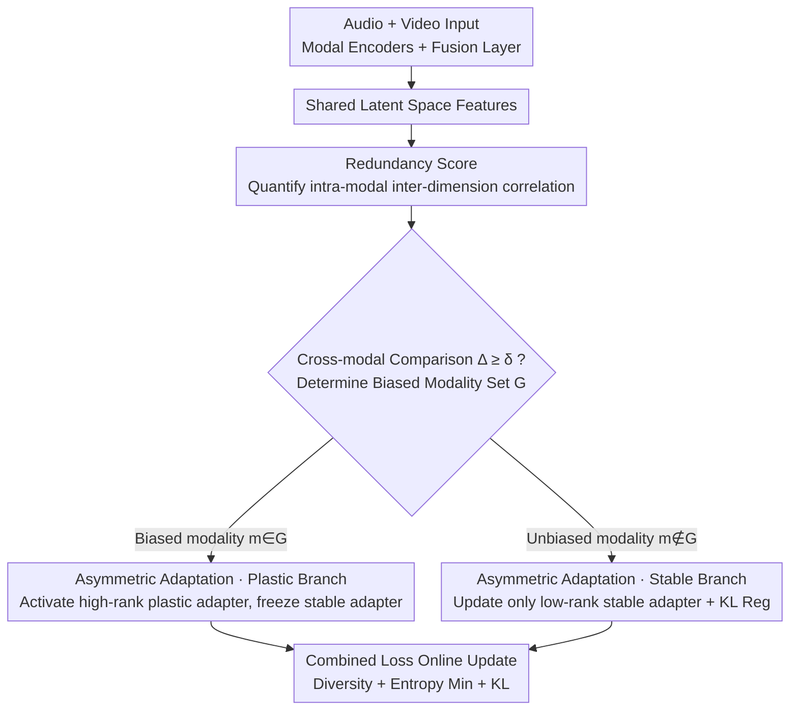

# Decoupling Stability and Plasticity for Multi-Modal Test-Time Adaptation

**Conference**: CVPR 2026  
**arXiv**: [2603.00574](https://arxiv.org/abs/2603.00574)  
**Code**: [GitHub](https://github.com/he4cs/DASP)  
**Area**: Multi-modal VLM  
**Keywords**: Multi-modal Test-Time Adaptation, Stability-Plasticity Decoupling, Redundancy Score, Asymmetric Adaptation, Catastrophic Forgetting

## TL;DR

DASP is proposed to diagnose biased modalities via redundancy scores and resolve negative transfer and catastrophic forgetting in multi-modal TTA through an asymmetric adaptation strategy that decouples stability and plasticity.

## Background & Motivation

**Distribution Shift Vulnerability of Multi-modal Models**: Audio-visual models face distribution shifts in non-stationary environments, such as weather changes or sensor degradation, leading to significant performance degradation of static pre-trained models.

**Rise of Test-Time Adaptation (TTA)**: TTA adapts to distribution shifts by updating parameters online without access to source data, but existing methods are mostly designed for uni-modal scenarios.

**Negative Transfer Problem**: Modality-agnostic adaptation strategies indiscriminately adapt all modalities, which may cause negative transfer to well-aligned, unbiased modalities.

**Catastrophic Forgetting**: Continuous parameter updates erase source domain knowledge, which is particularly severe in biased modalities.

**Stability-Plasticity Dilemma**: Existing methods struggle to balance the two: biased modalities require plasticity to adapt to the target distribution, while unbiased modalities require stability to preserve source knowledge.

**Unreliability of Traditional Diagnostic Metrics**: Entropy and confidence are unreliable in multi-modal contexts; a dominant modality may maintain low entropy and high confidence even when shifted, making cross-modal comparisons impossible.

## Method

### Overall Architecture

The **Key Challenge** DASP addresses is that during test-time distribution shifts, only certain modalities are truly "corrupted," yet existing methods update all modalities indiscriminately. This results in insufficient compensation for biased modalities and corruption of unbiased ones. The **Mechanism** follows a "diagnose, then divide and conquer" approach: it first identifies which modality is shifted, then applies different adaptation strengths. The process is: after multi-modal features enter the shared latent space of the fusion layer, a redundancy score is used to diagnose biased modalities; subsequently, adapters for each modality follow different branches based on their status—biased modalities activate plasticity to fit the target distribution, while unbiased modalities lock in stability to retain source knowledge. Finally, parameters are updated via a combined loss.

### Key Designs

**1. Redundancy Score: Substituting Entropy and Confidence with Source-free Metrics**

The difficulty in diagnosing biased modalities lies in the unreliability of entropy and confidence in multi-modal settings. A dominant modality may output low-entropy, high-confidence predictions despite being shifted. DASP adopts a **Key Insight**: observing the intra-dimension correlation of features in the shared latent space. Distribution shifts cause feature manifolds to degenerate, where previously independent dimensions begin to respond consistently to domain-specific noise, leading to spurious correlations and significantly higher redundancy. A redundancy score $R(\mathbf{Z})$ is defined to measure relative redundancy, followed by cross-modal comparison:

$$\Delta^m = r^m - \min_{n \in \mathcal{M}} r^n$$

When $\Delta^m \geq \delta$, modality $m$ is assigned to the biased set $\mathcal{G}$. This diagnosis is source-free, computable online, and supports cross-modal ranking.

**2. Asymmetric Adaptation: Structurally Decoupling Stability and Plasticity**

Upon diagnosis, DASP processes modalities to bridge bias without harming unbiased components. Each adapter $\Phi^m$ is split into two sub-modules: a low-rank stable adapter $\phi_s^m$ for domain-agnostic generalized representations and a high-rank plastic adapter $\phi_p^m$ for domain-specific information. The two types of modalities follow distinct branches: biased modalities $m \in \mathcal{G}$ activate the plastic adapter and freeze the stable adapter to fit the target distribution $\tilde{z}^m = \phi_p^m(\phi_s^m(z^m))$; unbiased modalities $m \notin \mathcal{G}$ bypass the plastic adapter, updating only the stable adapter with KL regularization $\tilde{z}^m = \phi_s^m(z^m)$. This **Design Motivation** externalizes "plasticity" and "stability" into independent paths, preventing mutual overrides and simultaneously suppressing catastrophic forgetting and negative transfer.

### Loss & Training

$$\mathcal{L}_{\text{total}} = \mathcal{L}_{\text{div}} + \lambda_{\text{ent}} \mathcal{L}_{\text{ent}} + \lambda_{\text{kl}} \mathcal{L}_{\text{kl}}$$

The three terms serve specific functions: diversity regularization $\mathcal{L}_{\text{div}}$ prevents prediction collapse, entropy minimization $\mathcal{L}_{\text{ent}}$ encourages certainty, and KL divergence $\mathcal{L}_{\text{kl}}$ constrains stable adapters of unbiased modalities to stay near the source model.

## Key Experimental Results

### Main Results: Kinetics50-C Video Corruption (Episodic Adaptation)

| Method | Avg. Accuracy ↑ |
|------|------------|
| Source (No Adaptation) | 59.9 |
| Tent | 59.4 |
| EATA | 60.1 |
| SAR | 59.8 |
| READ | 62.5 |
| TSA | 63.8 |
| **DASP (Ours)** | **65.2** |

### Ablation Study

| Component | Impact |
|------|------|
| Redundancy vs. Entropy/Confidence | Redundancy strongly correlates with accuracy; entropy is unreliable |
| Asymmetric vs. Symmetric | Asymmetric significantly reduces negative transfer and forgetting |
| KL Regularization | Effectively constrains unbiased modality stability |
| Low-rank/High-rank Design | Matches the functional requirements of each role |

### Key Findings

- Redundancy scores show strong correlation with accuracy on both Kinetics50-C and VGGSound-C.
- Biased modalities exhibit significantly higher redundancy than unbiased ones.
- DASP mitigates both negative transfer (unbiased) and catastrophic forgetting (biased).
- Exceptional performance in audio-corruption scenarios (leading significantly on VGGSound-C).

## Highlights & Insights

- The redundancy score is an elegant non-parametric diagnostic metric usable online without source statistics.
- The "diagnose-alleviate" framework is logically clear, targeting problems specifically.
- Decoupling stable/plastic adapters is intuitive—externalizing domain-specific parameters while internalizing domain-agnostic ones.
- The low-rank vs. high-rank structural design naturally matches the requirements of stability and plasticity.

## Limitations & Future Work

- The redundancy threshold $\delta$ requires pre-setting and may need adjustment across scenarios.
- Validation is limited to audio-visual bi-modal setups; expansion to more modalities (e.g., text+image+audio) is needed.
- Biased modality switching is a hard decision, which may not handle scenarios where all modalities shift simultaneously.
- Calculating redundancy requires batch statistics, making it unsuitable for cases where batch size = 1.

## Related Work & Insights

- Closest to TSA's selective adaptation, but TSA's soft routing is less stable in unsupervised settings.
- Similar focus to MDAA on catastrophic forgetting, but DASP uses architectural decoupling rather than analytical methods.
- The stability-plasticity dilemma perspective can be generalized to Continual Learning and Federated Learning.
- Redundancy scores can serve as a general-purpose tool for distribution shift detection.

## Rating
- Novelty: ⭐⭐⭐⭐
- Experimental Thoroughness: ⭐⭐⭐⭐
- Writing Quality: ⭐⭐⭐⭐
- Value: ⭐⭐⭐⭐

<!-- RELATED:START -->

## Related Papers

- [\[CVPR 2026\] Multi-modal Test-time Adaptation via Adaptive Probabilistic Gaussian Calibration](multi-modal_test-time_adaptation_via_adaptive_probabilistic_gaussian_calibration.md)
- [\[CVPR 2026\] Test-Time Distillation for Continual Model Adaptation](test-time_distillation_for_continual_model_adaptation.md)
- [\[CVPR 2026\] Condensed Test-Time Adaptation of VLMs for Action Recognition](condensed_test-time_adaptation_of_vlms_for_action_recognition.md)
- [\[CVPR 2026\] Dynamic Logits Adjustment and Exploration for Test-Time Adaptation in Vision Language Models](dynamic_logits_adjustment_and_exploration_for_test-time_adaptation_in_vision_lan.md)
- [\[CVPR 2026\] Ramen: Robust Test-Time Adaptation of Vision-Language Models with Active Sample Selection](ramen_robust_test-time_adaptation_of_vision-language_models_with_active_sample_s.md)

<!-- RELATED:END -->
