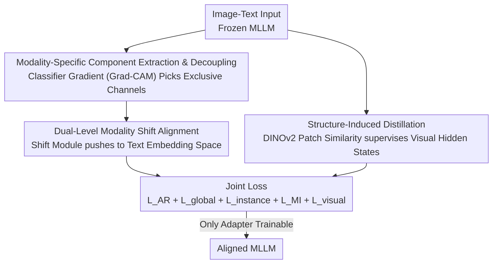

# DeepAlign: Mitigating Modality Conflict through Modality-Specific Alignment

**Conference**: CVPR 2026  
**Paper**: [CVF Open Access](https://openaccess.thecvf.com/content/CVPR2026/html/Li_DeepAlign_Mitigating_Modality_Conflict_through_Modality-Specific_Alignment_CVPR_2026_paper.html)  
**Code**: None  
**Area**: Multimodal VLM  
**Keywords**: Modality Conflict / Representation Intervention / Structure-Induced Distillation / MLLM Post-training / DINOv2  

## TL;DR
Addressing the "modality conflict" in MLLMs—where visual integration degrades linguistic performance and fails to capture fine-grained details—DeepAlign introduces a plug-and-play post-training framework. It uses classifier gradients to identify and push "modality-specific components" of visual representations toward the LLM's text embedding space, while distilling patch structural relationships from DINOv2 into the MLLM's visual hidden states. By training only an inserted adapter (200M parameters), DeepAlign achieves consistent gains across three major MLLMs on over ten benchmarks and activates emergent capabilities like multimodal in-context learning.

## Background & Motivation
**Background**: Mainstream MLLMs (such as LLaVA, Qwen2.5-VL, and InternVL) follow a "bridging" paradigm—utilizing a pre-trained visual encoder and a pre-trained LLM, connected by a lightweight module (e.g., an MLP projector) to align visual features with the text modality, allowing the LLM to handle multimodal tasks.

**Limitations of Prior Work**: The authors conducted probe experiments revealing two overlooked side effects of this paradigm. First, LLaVA-v1.5-7B's pure linguistic ability significantly degrades compared to its base Vicuna-7B (dropping an average of 10 points on MMLU), and its perplexity on Wikipedia text increases, suggesting visual modality interferes with text processing. Second, on vision-aided tasks (MNER/MMT/MRE), MLLMs perform worse with images than with text-only inputs. On fine-grained VQA (BLINK), replacing images with dense captions (making the model "blind") results in almost no performance drop, indicating that MLLMs only capture "modality-shared" semantics and miss nuanced visual details.

**Key Challenge**: The paper attributes the root cause to "modality conflict"—existing vision-language pre-training focuses solely on **modality-shared information** (e.g., high-level semantics in captions) while systematically ignoring **modality-specific knowledge**. This leads to two conflicts: (1) **Misalignment of modality-specific representations**: While high-level concepts like "teddy bear" are aligned, attributes like "gray" or "blue" are not, causing the visual modality to hinder linguistic reasoning. (2) **Loss of modality-specific details**: Autoregressive training supervised only by the text side treats vision as a subordinate, losing details present in images but absent in text (e.g., rock textures, sky lighting).

**Goal**: To restore modality-specific information at both the "representation" and "detail" levels via a plug-and-play post-training scheme without retraining the base model.

**Core Idea**: Use **representation intervention** to directionally "push" modality-specific components in visual representations toward the text embedding space to eliminate misalignment. Simultaneously, use **structure-induced distillation** with a pure self-supervised visual model (DINOv2) as a teacher to inject patch-level structural relationships into MLLM visual hidden states to recover details.

## Method

### Overall Architecture
DeepAlign is a model-agnostic post-training framework. Given image-text pairs, the base MLLM remains frozen. Only the added adapters (modality shift modules, ~200M parameters) inserted into intermediate Transformer layers are trained. It simultaneously corrects biases via two complementary branches:

- **Representation Intervention Branch** (Fixes "Misalignment"): Uses a modality classifier and Grad-CAM to identify "modality-exclusive" channels in each representation to quantify the visual-to-text "modality shift direction." The module learns to push visual representations along this direction.
- **Structure-Induced Distillation Branch** (Fixes "Information Loss"): Feeds the same image to DINOv2 and uses the resulting patch-to-patch similarity matrix to supervise the similarity matrix of MLLM visual hidden states, injecting "structural semantics."

The joint loss combines these signals with the standard text autoregressive loss.

### Key Designs

**1. Extraction and Decoupling of Modality-Specific Components: Using Classifier Gradients**

To fix misalignment, one must identify which dimensions of a visual representation are "modality-shared" (already aligned) and which are "modality-specific" (misaligned). DeepAlign pools the hidden states of the last token $(h_t, h_v) \in \mathbb{R}^D$ and trains a modality classifier $f$ to output $y=f(h)$. Borrowing from Grad-CAM, the gradient of the classification score with respect to the representation $w_{cls}=\nabla_h y_k$ (where $k$ is the ground-truth modality) serves as channel attention weights. Channels most important for modality discrimination are the modality-specific ones:

$$h_{mod} = s\,w_{cls} \odot h$$

where $\odot$ is the Hadamard product and $s$ is an adaptive scalar to normalize energy ($\epsilon(h_{mod}) = \epsilon(h)$), specifically $s=\sqrt{\sum_d h_d^2 / \sum_d (w_{cls,d} h_d)^2}$. This allows the model to "point out" specific components for correction without manual attribute labeling.

**2. Dual-Level Modality Shift Alignment: Directional Pushing to Text Embedding Space**

The framework estimates shift directions at two granularities: **Instance-level** $d_{instance}=h_{mod_t}-h_{mod_v}$ and **Global-level** $d_{global}=\mathrm{Mean}(\{d_{instance}^i\}_{i=1}^m)$. The modality shift module $\mathrm{SHF}(\cdot)$ transforms visual representations to $h'_v=\mathrm{SHF}(h_v)$, supervised by:

$$L_{global}=\alpha(1-\cos(h'_v[-1]-h_v[-1],\, d_{global})),\quad L_{instance}=\beta(1-\cos(h'_v[-1]-h_v[-1],\, d_{instance}))$$

This ensures the "displacement vector" aligns with the target shift direction. A mutual information (MI) regularizer $L_{MI}=-\gamma(\mathrm{MI}(h'_v,h_t)-\mathrm{MI}(h_v,h_t))$ is added to ensure critical visual information is preserved while aligning domains.

**3. Structure-Induced Distillation: Recovering Details via DINOv2**

Since autoregressive training lacks visual-side supervision, MLLM visual hidden states lose semantic richness as they go deeper. DeepAlign uses DINOv2 as a "pure visual teacher." Given image $I$, DINOv2 output $g \in \mathbb{R}^{n\times D}$ and MLLM hidden states $\tilde h \in \mathbb{R}^{n\times D'}$, DeepAlign aligns their patch similarity matrices via MSE:

$$L_{visual}=\mu\cdot\frac{1}{n^2}\sum_{i=1}^{n}\sum_{j=1}^{n}\big\|\,\mathrm{Sim}(\tilde h_i,\tilde h_j)-\mathrm{Sim}(g_i,g_j)\,\big\|^2$$

This injects spatial/semantic structure into the MLLM by supervising "which patches are similar to each other," preserving details that are hard to describe in text.

### Loss & Training
The final joint loss is:

$$L = L_{AR}+L_{global}+L_{instance}+L_{MI}+L_{visual}$$

Post-training uses high-quality subsets of CC3M and COCO Caption. Only the 200M parameter adapter is trainable. The peak learning rate is $3\times10^{-5}$ with a frozen base MLLM.

## Key Experimental Results

DeepAlign was applied to LLaVA-v1.5-7B, Qwen2.5-VL-7B, and InternVL3-8B, comparing against post-training methods like RLHF, HADPO, DataTailor, POVID, SIMA, and VISTA.

### Main Results (Zero-Shot Vision-Language Understanding)
Comparison on LLaVA-v1.5-7B (selected benchmarks):

| Method | MMBench | MMStar | MMMU | HallusionBench | OCRBench | MMVet | TextVQA |
|------|---------|--------|------|----------------|----------|-------|---------|
| LLaVA-v1.5-7B (Base) | 62.1 | 34.6 | 33.7 | 25.2 | 385 | 32.2 | 49.7 |
| +VISTA (Runner-up) | 65.4 | 35.9 | 37.5 | 28.9 | 410 | 34.1 | 52.6 |
| **+DeepAlign** | **68.2** | **40.1** | **39.4** | **31.0** | **427** | **38.5** | **55.7** |

Consistent improvements were found on stronger bases: Qwen2.5-VL-7B gained +1.0 on MMBench and +1.7 on TextVQA; InternVL3-8B improved ScienceQA from 97.9 to 99.2.

### Ablation Study (LLaVA-v1.5-7B)

| Configuration | MMBench | MMStar | ScienceQA | TextVQA | Note |
|------|---------|--------|-----------|---------|------|
| LLaVA-v1.5-7B | 62.1 | 34.6 | 69.2 | 49.7 | Base |
| **+DeepAlign (Full)** | **68.2** | **40.1** | **75.3** | **55.7** | All components |
| w/o intervention | 63.5 | 36.2 | 70.8 | 51.3 | Largest drop |
| w/o distillation | 65.4 | 37.6 | 72.5 | 52.8 | Second largest drop |
| w/o global | 66.8 | 38.8 | 73.9 | 54.1 | w/o global shift |
| w/o mutual | 67.5 | 39.5 | 74.6 | 54.9 | w/o MI regularizer |

### Key Findings
- **Representation Intervention is Crucial**: Removing it dropped MMBench from 68.2 to 63.5, indicating misalignment is the primary bottleneck.
- **Conflict Mitigation**: On BLINK (fine-grained VQA), Qwen2.5-VL-7B improved across all sub-tasks, narrowing the gap with GPT-4o. The "adding images hurts" phenomenon was reversed, and text perplexity decreased.
- **Emergent Abilities**: (1) Mitigates hallucinations. (2) Multimodal In-Context Learning: Performance on VQAv2 grew from 66.4 to 68.0 as shots increased (4 to 16-shot), whereas the base model's performance decreased.
- **Reduced Semantic Gap**: Linear Probing on ImageNet showed that MLLM visual states no longer degrade sharply in deep layers, nearly matching DINOv2's peak accuracy.

## Highlights & Insights
- **Grad-CAM for Identification**: Using a visualization tool to identify channels for correction is a highly creative application, decoupling shared/specific components without attribute labels.
- **Distilling Structure vs. Features**: Since DINOv2 and MLLMs have different dimensions and spaces, aligning similarity matrices bypassed these gaps, transferring structural inductive bias.
- **Plug-and-play**: Training only a 200M adapter avoids weight corruption and enables easy deployment while activating suppressed emergent capabilities.
- Quantifying the "language degradation" of MLLMs (e.g., -10 MMLU) provides a compelling motivation for the "modality conflict" thesis.

## Limitations & Future Work
- **Reliance on DINOv2**: The distillation ceiling is determined by DINOv2's performance; its efficacy in domains where DINOv2 is weaker (e.g., medical, remote sensing) is unconfirmed ⚠️.
- **Hyperparameter Tuning**: Multiple coefficients ($\alpha,\beta,\gamma,\mu,s$) and adapter positions require tuning; the cost of migration to new bases is unclear.
- **Diminishing Returns on Stronger Bases**: Absolute gains are smaller on advanced models like Qwen2.5-VL.
- Technical details for MI estimation ($L_{MI}$) are primarily in the appendix ⚠️.

## Related Work & Insights
- **vs RLHF/VISTA**: While others optimize outputs or preferences, DeepAlign intervenes at the **internal representation** level, leading to more significant gains in perception tasks.
- **vs Bridging Paradigms (LLaVA)**: Traditional modules align only coarse modality-shared semantics. DeepAlign explicitly protects "modality-specific" information, addressing the "bridge sufficiency" critique.
- **vs Visual Self-Supervised Distillation**: Unlike prior works distilling features or logits for classification, DeepAlign distills structural relationships to provide auxiliary supervision for the MLLM visual side.

## Rating
- Novelty: ⭐⭐⭐⭐⭐ 
- Experimental Thoroughness: ⭐⭐⭐⭐ 
- Writing Quality: ⭐⭐⭐⭐⭐ 
- Value: ⭐⭐⭐⭐ 

<!-- RELATED:START -->

## Related Papers

- [\[CVPR 2026\] Towards Dynamic Modality Alignment in Multimodal Continual Learning](towards_dynamic_modality_alignment_in_multimodal_continual_learning.md)
- [\[CVPR 2026\] Bridging the Modality Gap in Compositional Zero-Shot Learning via Sparse Alignment and Unimodal Memory Bank](bridging_the_modality_gap_in_compositional_zero-shot_learning_via_sparse_alignme.md)
- [\[CVPR 2026\] LVLM-Aided Alignment of Task-Specific Vision Models](lvlm-aided_alignment_of_task-specific_vision_models.md)
- [\[CVPR 2026\] Is the Modality Gap a Bug or a Feature? A Robustness Perspective](is_the_modality_gap_a_bug_or_a_feature_a_robustness_perspective.md)
- [\[CVPR 2026\] Efficient and High-Fidelity Omni Modality Retrieval](efficient_and_high-fidelity_omni_modality_retrieval.md)

<!-- RELATED:END -->
