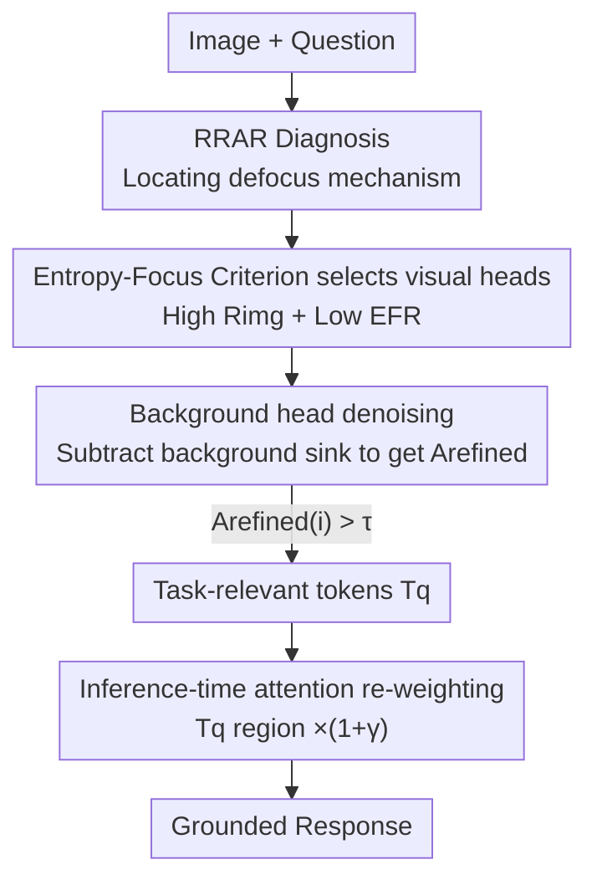

# Deeper Thought, Weaker Aim: Understanding and Mitigating Perceptual Impairment during Reasoning in Multimodal Large Language Models

**Conference**: CVPR 2026  
**Paper**: [CVF Open Access](https://openaccess.thecvf.com/content/CVPR2026/html/Peng_Deeper_Thought_Weaker_Aim_Understanding_and_Mitigating_Perceptual_Impairment_during_CVPR_2026_paper.html)  
**Code**: https://github.com/Ivine11/VRGA  
**Area**: Multimodal VLM  
**Keywords**: MLLM reasoning, attention dispersion, visual grounding, attention head selection, training-free  

## TL;DR
This paper discovers that Multimodal Large Language Models (MLLMs) experience **spatial dispersion** of visual attention in "Chain-of-Thought" (CoT) reasoning modes, drifting away from task-relevant regions (the longer they think, the more they miss). Consequently, the authors propose the training-free VRGA framework: it uses an "Entropy-Focus" criterion to automatically identify attention heads that actually process visual information, locates task-relevant regions, and re-weights these regions during the generation phase. This restores visual grounding and reduces off-topic responses without retraining, improving VQA scores by 1–6 points across different model scales.

## Background & Motivation
**Background**: To enable MLLMs to perform "deep reasoning" like text-based LLMs, researchers have increasingly applied Chain-of-Thought (CoT, e.g., "think step by step") and Reinforcement Learning rewards to Visual Question Answering (VQA), expecting longer reasoning chains to yield stronger visual reasoning capabilities.

**Limitations of Prior Work**: A counter-intuitive paradox has emerged—prompting models to generate long CoT responses actually **decreases** VQA accuracy, especially in tasks requiring perceptual details. Prior works (e.g., ICoT, DeepEyes) attributed this degradation to "perceptual decline during reasoning" and attempted to remedy it by using tools to crop image regions or injecting image tokens into reasoning steps. However, an analysis of TextVQA failures in this paper reveals that **most incorrect samples actually describe the scene correctly** (perception is not "broken"), yet still provide wrong answers. This suggests the issue is not "what the model sees," but "how it processes what it sees."

**Key Challenge**: Correct perception $\neq$ correct reasoning. The model must not only see the image clearly but also **consistently focus on task-relevant regions and filter out distractions** among vast visual information. Existing research (Liu et al.) only found that "longer reasoning chains lead to lower global attention on images and more hallucinations," remaining at the level of correlation without explaining the mechanism or providing a way to dynamically control reasoning length in practice.

**Key Insight**: The authors lower the granularity of analysis from "layer-wise average attention" to "individual attention heads" and distinguish the **spatial distribution** of attention (focus vs. dispersion) rather than just looking at the total attention volume. A key observation is that heads truly performing visual processing exhibit both high attention to image tokens ($R_{img}$ is large) and high spatial concentration within the image (entropy $H_{img}$ is small). There is a strong linear correlation between these two metrics, which can be used to **separately identify visual heads in an unsupervised manner**.

**Core Idea**: Redefine CoT degradation as "defocusing caused by attention dispersion," then employ a **training-free, inference-time, head-and-region-wise** approach to pull dispersed attention back to relevant areas. Without changing inputs or retraining, the method performs attention re-weighting on the correct regions within the correct heads.

## Method

### Overall Architecture
The paper consists of two parts: **the mechanism analysis** (Section 3, identifying why CoT fails) and the **VRGA method** (Section 4, providing the solution based on analysis).

The mechanism analysis answers two questions: (1) Does CoT systematically push attention away from task-relevant regions, and is this divergence correlated with errors? (2) At the head level, are heads with strong visual grounding also more spatially concentrated? These are verified using the RRAR metric and the $R_{img}$–$H_{img}$ linear relationship.

VRGA is a training-free framework that takes "Image + Question" as input and produces well-grounded answers via a two-stage pipeline: **① Locate task-relevant regions** (Select visual heads → Denoise background → Identify relevant tokens $T_q$) → **② Attention re-weighting of $T_q$ regions during generation**. The following flowchart illustrates the pipeline:

### Key Designs

**1. RRAR Diagnosis: Quantifying the CoT defocus mechanism with "Relevant Region Attention Ratio"**

This step answers "why we say CoT causes the model to lose focus." The authors define the **Relevant Region Attention Ratio (RRAR)**: Let $V$ be all visual tokens, $B\subseteq V$ be the task-relevant region defined by ground-truth bounding boxes, and $A_{qt}$ be the attention tensor from the question's end token to visual tokens. The RRAR for a single head $(l,h)$ is defined as:

$$\Gamma^{(l,h)}=\frac{\frac{1}{|B|}\sum_{i\in B} a_i^{(l,h)}}{\frac{1}{|V|}\sum_{j\in V} a_j^{(l,h)}}$$

Intuitively, $\Gamma>1$ indicates the head focuses more on the relevant region than the image average, while $\Gamma<1$ indicates dispersion/defocusing. Across 7 models and 1450 TextVQA samples under three prompts (Direct / Reason / Region-guided), three clear conclusions emerged: **Correct samples have significantly higher RRAR**; **CoT systematically lowers RRAR** ($\Gamma_{\text{reason}}<\Gamma_{\text{direct}}<\Gamma_{\text{region-guided}}$); **Dispersion degree is synchronized with accuracy drops**. These findings establish the causal chain "CoT → Attention Dispersion → Defocusing → Error."

**2. Entropy-Focus Criterion: Unsupervised identification of visual processing heads**

As ground-truth boxes are unavailable during inference, "visual heads" must be found automatically. The authors introduce two complementary metrics: **Image Attention Ratio** $R_{img}^{(l,h)}=\frac{\frac{1}{|V|}\sum_{i\in V}a_i}{\frac{1}{M}\sum_{j=1}^{M}a_j}$ (measuring how much attention a head gives to visual tokens relative to all $M$ tokens), and **Image Attention Entropy** $H_{img}^{(l,h)}=-\sum_{i\in V}\tilde a_i\log(\tilde a_i+\epsilon)$ (measuring spatial concentration within the image). A key discovery is the strong linear relationship $R_{img}=k\cdot H_{img}+b$ (Pearson $r>0.9$ across 5 models). Truly high-RRAR heads reside in the "High $R_{img}$, Low $H_{img}$" region. Accordingly, the **Entropy-Focus Ratio** is defined as $\text{EFR}=\frac{H_{img}}{R_{img}}$; lower EFR signifies higher grounding. This identifies a **visual head set $H_v$** that prefers images over text, covers global vision, and is spatially concentrated.

**3. Background Head Denoising: Subtracting attention sinks for a clean relevance map**

Aggregating attention maps from $H_v$ is insufficient—many heads "sink" to uninformative tokens (attention traps like the top-left corner), polluting the map. The authors observe that in early layers, the model processes instructions before "looking" at the image. These heads, which have **low image attention and high spatial dispersion**, are designated as the **background head set $H_b$**. The refined map is constructed by subtracting the average background map from the visual head map:

$$A_{\text{refined}}=\text{Norm}\!\left(\frac{1}{|H_v|}\sum_{h\in H_v}A_h-\lambda\cdot\frac{1}{|H_b|}\sum_{h\in H_b}A_h\right)$$

Where $\lambda$ controls background suppression. Tokens exceeding a threshold $\tau$ are selected as relevant: $T_q=\{i\mid A_{\text{refined}}(i)>\tau\}$.

**4. Attention Re-weighting: Selective amplification to maintain reasoning fluency**

During generation, attention is amplified **only for visual heads $H_v$** on task-relevant tokens $T_q$:

$$\tilde A_h(i)=\begin{cases}(1+\gamma)A_h(i), & i\in T_q\\ A_h(i), & \text{otherwise}\end{cases}$$

Where $\gamma$ controls enhancement. By only modifying visual heads and leaving language/cross-modal heads untouched, the method restores visual grounding while preserving the model's natural reasoning fluency. Masking experiments confirm that selected heads carry visual evidence (accuracy collapses when their visual attention is zeroed), justifying the selective re-weighting.

### Loss & Training
Ours is training-free. VRGA operates entirely during inference without any learnable parameters or fine-tuning. All operations (head selection, denoising, token selection, re-weighting) are based on feed-forward attention statistics.

## Key Experimental Results

### Main Results
On HaloQuest, HallusionBench, and MMStar—benchmarks emphasizing faithful visual reasoning—VRGA was applied to four Qwen-series bases. The metrics reported include overall score $S=A\times(1-\alpha I)$, accuracy ACC, and off-topic index $I$ (lower is better).

| Model / Dataset | HaloQuest ACC% | HaloQuest S↑ | HaloQuest I↓ | MMStar S↑ |
|--------------|----------------|--------------|--------------|-----------|
| Qwen2.5-VL-3B | 58.87 | 0.445 | 0.601 | 0.436 |
| Qwen2.5-VL-3B + VRGA | 59.03 | **0.488** | **0.405** | **0.441** |
| Qwen2.5-VL-7B | 66.67 | 0.502 | 0.595 | 0.389 |
| Qwen2.5-VL-7B + VRGA | **73.96** | **0.549** | **0.578** | 0.388 |
| Qwen2-VL-7B | 53.81 | 0.406 | 0.622 | 0.419 |
| Qwen2-VL-7B + VRGA | 54.47 | 0.404 | 0.608 | 0.405 |

The improvements from VRGA primarily stem from a **significant reduction in off-topic index $I$** (e.g., Qwen2.5-VL-3B on HaloQuest drops from 0.601 to 0.405) while maintaining or improving accuracy. In contrast, training-based methods like ICoT often decrease accuracy in these settings.

### Ablation Study
A head masking experiment validates that chosen heads are truly visual: $k$ heads per layer are zeroed out to see the accuracy drop.

| Masking Strategy | Qwen2.5-VL-3B | Qwen2.5-VL-7B | Qwen3-VL-30B |
|---------|---------------|---------------|--------------|
| Baseline (No mask) | 87.64 | 86.88 | 90.44 |
| Random mask | 83.38 | 86.95 | 88.80 |
| Low-Visual (Lowest $R_{img}$) | 87.02 | 87.50 | 90.31 |
| **EFR-Guided (Ours)** | **24.31** | **40.52** | **42.27** |

The accuracy collapse under EFR-guided masking (87.64 to 24.31 on 3B) is far more severe than random or low-visual masking, proving the Entropy-Focus Criterion accurately targets crucial visual heads.

### Key Findings
- **Perception is not broken, focus is**: Most failure cases describe the scene correctly but fail at reasoning due to attention dispersion, correcting the common view that CoT degradation is due to perceptual loss.
- **High total attention $\neq$ good visual processing**: Only heads with high $R_{img}$ and low $H_{img}$ are truly grounded; high attention spread uniformly across the image is ineffective.
- **Robust $R_{img}$–$H_{img}$ linear relationship**: This occurs across architectures ($r>0.9$), enabling unsupervised visual head selection as a foundation for the method.

## Highlights & Insights
- **Quantifying "Deeper Thought, Weaker Aim"**: The paper moves from documenting "CoT drops accuracy" to identifying "attention dispersion" as a measurable, actionable cause.
- **Replacing supervision with linear correlation**: Discovering $R_{img}=k H_{img}+b$ turns a supervised problem (finding visual heads) into a statistical one, which is highly transferable.
- **"Negative Sample" Denoising**: Using early-layer background heads as a template to subtract "sinks" is a clever way to self-correct bias without hard-coding masks.
- **Selective Weighting**: By only touching visual heads, the method preserves reasoning fluency, explaining why it reduces hallucinations without breaking language logic.

## Limitations & Future Work
- This is a **post-hoc intervention** (treating symptoms). Future work might use RL to train "visually grounded reasoning" to prevent dispersion at the source.
- Experiments focus heavily on the Qwen family; multi-family cross-architecture analysis is present but benefits on the method side could be more extensive.
- Introduces multiple hyperparameters ($\lambda, \tau, \gamma, k$); sensitivity analysis is somewhat limited.
- Absolute gains in accuracy on some benchmarks are modest; the primary value lies in reducing the off-topic index and improving grounding.

## Related Work & Insights
- **vs. ICoT / DeepEyes**: They focus on "what visual information to include" via retraining; VRGA focuses on "where to look" via training-free inference intervention.
- **vs. Zhang et al. / Liu et al.**: They stay at the layer level or provide diagnosis; VRGA moves to the head level and provides an intervention.
- **vs. Li et al. (Attention Sink Recognition)**: Instead of just excluding sinks, VRGA uses background heads to **cancel out** sink biases, allowing for more fine-grained relevance detection.

## Rating
- Novelty: ⭐⭐⭐⭐⭐ Redefining CoT degradation as attention dispersion and using the $R_{img}$-$H_{img}$ relationship for unsupervised selection is highly innovative.
- Experimental Thoroughness: ⭐⭐⭐⭐ Strong multi-model validation and masking experiments, though hyperparameter sensitivity is not fully detailed.
- Writing Quality: ⭐⭐⭐⭐ Clear logic from diagnosis to solution; metrics are well-defined.
- Value: ⭐⭐⭐⭐⭐ Training-free, plug-and-play, and interpretable—highly valuable for any MLLM running CoT.

<!-- RELATED:START -->

## Related Papers

- [\[CVPR 2026\] Perceptual-Evidence Anchored Reinforced Learning for Multimodal Reasoning](perceptual-evidence_anchored_reinforced_learning_for_multimodal_reasoning.md)
- [\[ICML 2026\] Mitigating Perceptual Judgment Bias in Multimodal LLM-as-a-Judge via Perceptual Perturbation and Reward Modeling](../../ICML2026/multimodal_vlm/mitigating_perceptual_judgment_bias_in_multimodal_llm-as-a-judge_via_perceptual_.md)
- [\[CVPR 2026\] Fuel Gauge: Estimating Chain-of-Thought Length Ahead of Time in Large Multimodal Models](fuel_gauge_estimating_chain-of-thought_length_ahead_of_time_in_large_multimodal_.md)
- [\[CVPR 2026\] ReaGEN: Adaptive Generation of Structured Chains-of-Thought for Efficient Multimodal Reasoning](reagen_adaptive_generation_of_structured_chains-of-thought_for_efficient_multimo.md)
- [\[CVPR 2026\] See Less, See Right: Bi-directional Perceptual Shaping For Multimodal Reasoning](see_less_see_right_bi-directional_perceptual_shaping_for_multimodal_reasoning.md)

<!-- RELATED:END -->
