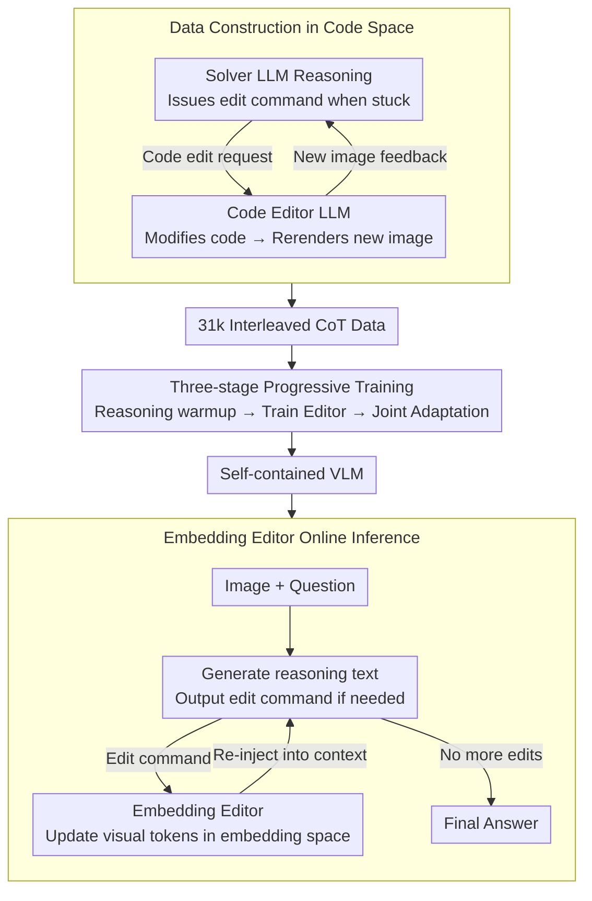

# DeepSketcher: Internalizing Visual Manipulation for Multimodal Reasoning

**Conference**: CVPR 2026  
**arXiv**: [2509.25866](https://arxiv.org/abs/2509.25866)  
**Code**: [GitHub](https://github.com/MiliLab/DeepSketcher)  
**Area**: Robotics  
**Keywords**: Visual Reasoning, Interleaved Multi-modal Reasoning, Visual Thinking, Embedding Editor, Code Rendering

## TL;DR

The DeepSketcher suite is proposed, consisting of a 31k high-quality code-rendered interleaved CoT dataset and a self-contained Embedding Editor model. This allows VLMs to perform multimodal reasoning by directly generating "visual thoughts" in the visual embedding space without requiring external tools.

## Background & Motivation

"Thinking with images" is a new paradigm for VLM reasoning, where models manipulate visual inputs (cropping, scaling, drawing auxiliary lines, etc.) during the reasoning process to achieve deeper visual understanding. However, existing methods face three **Key Challenges**:

1.  **Limited Action Space**: Methods like VILASR only support predefined operation sets (zoom, crop), limiting flexibility.
2.  **Difficult Spatial Localization**: Approaches like DeepEyes use RL for operations but rely on precise coordinate regression, leading to high noise in training data.
3.  **Extremely High Training Difficulty**: Models like Bagel attempt to unify generation and reasoning, but the "imagination" space is too large, and effectiveness remains unverified.

DeepSketcher starts from code-rendered VQA data and proposes a complementary Key Insight: all images are generated via code rendering, and visual operations are implemented by modifying code—resulting in precision, reproducibility, and zero spatial localization noise.

## Method

### Overall Architecture

DeepSketcher aims to enable VLMs to "manually modify images" during reasoning without relying on external tool calls or precise coordinates. It follows two tracks: offline, a dual-agent system records the "reasoning while modifying" process in code space to create 31k interleaved CoT data points; online, a self-contained model is trained so that during inference, it no longer renders actual images but instead uses an Embedding Editor to perform "image modifications" directly in the visual embedding space.

In an online inference session: the model receives the code-rendered image and the question, generates reasoning text, and outputs an editing command when needed; the Embedding Editor takes this command and updates visual tokens in the visual embedding space; the updated embeddings are re-injected into the context, and the model continues reasoning until it reaches the final answer. The entire "see-think-modify-think" loop is completed internally without code execution or repeated image encoding.

### Key Designs

**1. Data Construction in Code Space: Modifying Code Instead of Pixels to Avoid Localization Noise**

The hardest part of "thinking with images" is obtaining high-quality "reasoning while modifying" trajectories. Pixel-level operations are either limited to predefined sets or dependent on noisy coordinate regression. DeepSketcher’s Key Insight is that since all images are code-rendered, "modifying the image" is equivalent to "modifying the code." It builds a dual-agent closed loop: the Solver LLM handles reasoning and issues a request (e.g., "draw this auxiliary line") when stuck; the Code Editor LLM modifies the rendering code and reruns it to produce a new image, which is fed back to the Solver. This "Reasoning → Command → Code Edit → Rendering → Reasoning" cycle ensures images are precisely generated, reproducible, and verifiable, naturally avoiding pixel-level noise or uncontrollable hallucinations. The final 31k trajectories cover mathematics, physics, and chemistry.

**2. Embedding Editor: Internalizing Image Modification into the Embedding Space**

While data is built using code rendering, executing code and re-encoding images during online inference is too slow and heavy. The Embedding Editor compresses the "image modification" into a single forward pass. It uses a Q-Former-style cross-attention structure: current visual tokens act as the Query; the hidden state of the editing command (after adaptive pooling) acts as the Key/Value. The updated visual embeddings are calculated directly via cross-attention and an FFN. Essentially, the model does not generate a new pixel image but calculates the embedding corresponding to "the image after drawing the auxiliary line" at the representation level. This eliminates dependence on code execution, external tools, and repeated encoding.

**3. Three-stage Progressive Training: Ground Truth Feeding to Decoupling**

To prevent the Editor from outputting noisy embeddings early on and polluting the reasoning chain, training is split into three phases:
- **Phase 1: Reasoning Warmup**: Feed GT edited image features into the context so the LLM learns to reason using "modified images."
- **Phase 2: Editor Training**: Freeze other modules and use $L_1$ loss to align the Editor's predicted embeddings with GT edited image embeddings.
- **Phase 3: Joint Adaptation**: Unfreeze the LLM backbone so the reasoning core adapts to the Editor's actual outputs rather than GT.

### A Complete Example

Example: Geometry problem "Find an angle in a triangle":
- **Start**: Code renders a triangle. Solver LLM reasons: "An auxiliary line from the vertex to the opposite side is needed for similar triangles," and issues command "Add auxiliary line AD."
- **First Edit**: Code Editor LLM adds the "draw AD" statement to the rendering code, rerenders, and sends the image back.
- **Continued Reasoning**: Solver sees the new image: "Now two similar triangles exist," but needs labels, so it requests "Label ∠ADB."
- **Second Edit**: Code Editor modifies code again, rerenders, and returns the image.
- **Conclusion**: Solver completes calculations and provides the answer.
The resulting interleaved record is a visual CoT trajectory. During online inference, the "code edit + rerender" steps are replaced by two forward passes of the Embedding Editor.

### Loss & Training

- **Phase 1**: Standard auto-regressive language modeling loss (supervising text tokens only).
- **Phase 2**: $L_1$ embedding reconstruction loss (aligning Editor predictions with GT image embeddings) + conditional language modeling loss.
- **Phase 3**: Same objectives as Phase 2, but unfreezing the LLM backbone for adaptation.

## Key Experimental Results

### Main Results (Multimodal Reasoning Benchmarks)

| Model | MathVerse | MathVision | MathVista | LogicVista | WeMath | Average |
| :--- | :--- | :--- | :--- | :--- | :--- | :--- |
| Qwen2.5-VL-7B | 41.1 | 27.0 | 68.2 | 39.8 | 34.3 | 42.1 |
| DeepEyes-7B | 42.2 | 26.6 | 70.1 | 47.7 | 38.9 | 45.1 |
| Mirage-7B (Inner Visual) | 27.3 | 28.6 | 63.7 | 40.7 | 16.7 | 35.4 |
| **DeepSketcher-7B** | **43.2** | **32.3** | **69.1** | **48.1** | **37.1** | **46.0** |

### Ablation Study

| Phase | Setting | MathVerse | WeMath | Indicator-500 |
| :--- | :--- | :--- | :--- | :--- |
| Phase 2 | Text-only Baseline | 37.2 | 28.3 | 38.3 |
| Phase 2 | +Editor | 41.6 | 37.5 | 33.8 |
| Phase 3 | Text-only Baseline | 38.1 | 31.2 | 37.5 |
| Phase 3 | +Editor | 43.2 | 37.1 | 40.5 |

### Key Findings

- Improvements are most significant in geometry and counting (MathVision +5.3); symbolic manipulation tasks show smaller gains.
- Dual-agent collaboration (Solver+Code Editor) significantly outperforms solo reasoning (GPT-4.1 pass@8: 0.72 → 0.80).
- Difference map visualizations for the Embedding Editor show edited regions highly consistent with commands.

## Highlights & Insights

- Data construction in code space is an elegant solution: precise, reproducible, and verifiable, avoiding the noise of coordinate regression and image generation.
- The Embedding Editor's design—operating in the embedding space rather than generating pixels—is unique.
- As the strongest method among "Inner Visual Thought VLMs," it proves the feasibility of internalizing visual manipulation.
- The 31k dataset covers multiple disciplines (Math, Physics, Chemistry, etc.) and is high-quality and scalable.

## Limitations & Future Work

- Code-rendered data limits the application scope (mostly structured graphics); natural image scenarios are not covered.
- The quality of the Embedding Editor's output is still inferior to GT code-rendered images (gap observed on Indicator-500).
- Slower than simple text-generation due to additional Editor forward passes.
- Phase 3 adaptation is sometimes incomplete, as seen in the slight performance drop on Indicator-500 after unfreezing the LLM.

## Related Work & Insights

- **vs VILASR/DeepEyes**: These use predefined action sets and coordinate regression; DeepSketcher has an open action space and requires no coordinates.
- **vs Mirage/Bagel**: These edit in compressed latent spaces; DeepSketcher operates in visual token space, retaining more semantic information.
- **vs Visual Sketchpad**: Relies on external tool execution; DeepSketcher internalizes the entire manipulation chain.

## Rating

- Novelty: ⭐⭐⭐⭐⭐ (Dual innovation in code-space data and embedding-space editing)
- Experimental Thoroughness: ⭐⭐⭐⭐ (Extensive benchmarks and ablations, though natural image evaluation is absent)
- Writing Quality: ⭐⭐⭐⭐ (Clear methodology and logical three-stage design)
- Value: ⭐⭐⭐⭐ (Provides new data and model paths for the "thinking with images" paradigm)

<!-- RELATED:START -->

## Related Papers

- [\[ICML 2026\] iVGR: Internalizing Visually Grounded Reasoning for MLLMs with Reinforcement Learning](../../ICML2026/multimodal_vlm/ivgr_internalizing_visually_grounded_reasoning_for_mllms_with_reinforcement_lear.md)
- [\[CVPR 2026\] Air-Know: Arbiter-Calibrated Knowledge-Internalizing Robust Network for Composed Image Retrieval](air-know_arbiter-calibrated_knowledge-internalizing_robust_network_for_composed_.md)
- [\[CVPR 2026\] VisRes Bench: On Evaluating the Visual Reasoning Capabilities of VLMs](visres_bench_on_evaluating_the_visual_reasoning_capabilities_of_vlms.md)
- [\[CVPR 2026\] ARM-Thinker: Reinforcing Multimodal Generative Reward Models with Agentic Tool Use and Visual Reasoning](arm-thinker_reinforcing_multimodal_generative_reward_models_with_agentic_tool_us.md)
- [\[CVPR 2026\] Act2See: Emergent Active Visual Perception for Video Reasoning](act2see_emergent_active_visual_perception_for_video_reasoning.md)

<!-- RELATED:END -->
