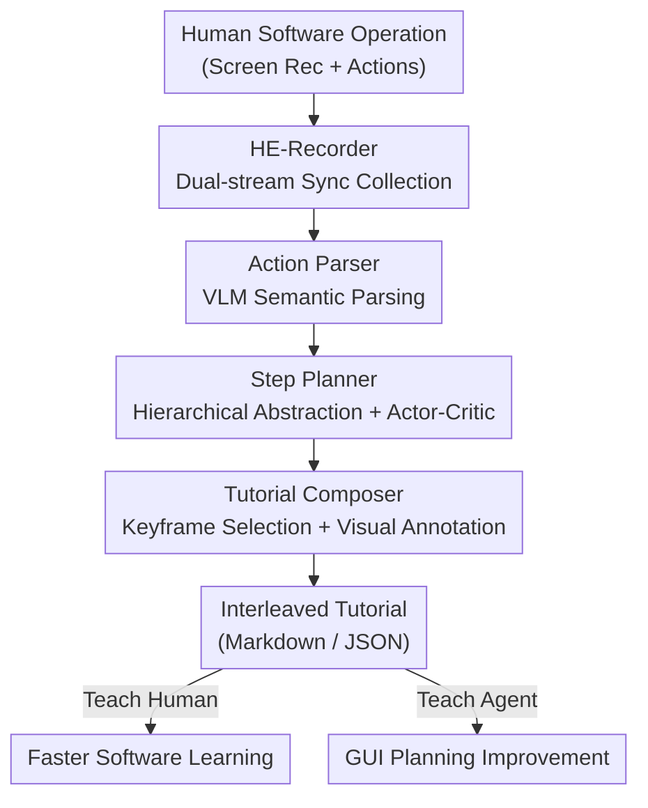

# Demo2Tutorial: From Human Experience to Multimodal Software Tutorials

**Conference**: CVPR 2026  
**arXiv**: [2606.03951](https://arxiv.org/abs/2606.03951)  
**Code**: https://github.com/showlab/Demo2Tutorial (To be released)  
**Area**: Multimodal VLM / GUI Agent / Computer Use  
**Keywords**: Software Tutorial Generation, Screen Recording, GUI Agent, Multimodal Document, Actor-Critic

## TL;DR
Demo2Tutorial is an agentic framework that automatically distills raw screen recordings and low-level operation logs of human software usage into structured, interleaved image-text tutorials. The generated tutorials outperform official human-authored tutorials in quality (86.2 vs. 79.1) on a self-built benchmark. They significantly improve the planning success rate of GUI Agents on OSWorld (GPT-5 on Chrome: 52.9% $\rightarrow$ 70.6%), speed up human software learning by 10.5%, and are preferred by 80% of users.

## Background & Motivation

**Background**: Human operational behaviors in digital environments (clicking, typing, dragging) represent a vast gold mine of procedural knowledge. While existing work has studied the understanding of real-world instructional videos, extending this to "interactive digital environments" (desktop software operations) remains largely unexplored. Human computer use experience primarily exists in two forms: raw screen recordings (demonstration) and carefully crafted step-by-step guides (tutorial).

**Limitations of Prior Work**: The authors identify a critical gap between demonstrations and tutorials. The purpose of a demonstration is to "show what it does," where the audience is a passive observer and recording is zero-cost. The purpose of a tutorial is to "teach how to do it," turning the audience into active participants through step-by-step instructions, linguistic explanations, and visual highlights. Converting long, unedited screen recordings into high-quality tutorials requires significant human labor.

**Key Challenge**: Automated tutorial production must address two major difficulties: **long-context compression**, where redundant and irrelevant actions in a raw demonstration must be filtered and summarized into key steps; and **multimodal guidance**, where each step in a qualified tutorial requires clear text narration and visual highlights (e.g., zooms, click markers) to guide attention. These aspects are missing in raw recordings and are too expensive to produce manually.

**Goal**: To build an end-to-end framework that automatically collects human "computer use experience" and transforms it into structured, reusable multimodal tutorial documents. This distilled knowledge serves two types of learners: humans (learning new software) and computer-use agents (improving desktop task planning).

**Key Insight**: Unlike "training agents directly on raw demonstrations" (implicit behavior cloning), distilling demonstrations into interpretable tutorials allows agents to follow an "instruction following" path, making knowledge more readable and transferable.

**Core Idea**: A four-stage agentic pipeline—"Recording $\rightarrow$ Parsing $\rightarrow$ Planning $\rightarrow$ Composition"—abstracts low-level action streams bottom-up into hierarchical task graphs, which are then rendered into interleaved image-text tutorials with intelligent visual annotations.

## Method

### Overall Architecture
The input to Demo2Tutorial is a recording of human software operation (screen video + synchronized low-level logs), and the output is a structured tutorial document (Markdown and JSON). The pipeline consists of four core components: HE-Recorder for dual-stream synchronized collection; Action Parser for translating low-level actions into natural language semantics; Step Planner for bottom-up hierarchical abstraction and quality refinement via an actor-critic loop; and Tutorial Composer for selecting optimal keyframes and overlaying adaptive visual annotations.

### Key Designs

**1. HE-Recorder: Upgrading "Video Only" to "Video + Action" Synchronized Collection**

Existing screen recorders capture only the visual stream, losing low-level semantics of where the user clicked or what keys were pressed. HE-Recorder captures two streams simultaneously: using FFmpeg and the ddagrab filter for native 30 FPS high-fidelity recording, and a modified KeyCastOW (C++ key visualization tool) for real-time operation logs capturing mouse movements and keyboard inputs with high-precision timestamps. To handle inevitable latency between video and action streams across different machines, an **interactive time calibration** mechanism is designed: a timer pops up at the start of recording, prompting the user to press a hotkey as a common time anchor. This alignment is crucial for capturing dense, fast action sequences by expert users.

**2. Action Parser: Bottom-Up VLM Semantic Parsing**

Coordinate-level logs like "clicked at (x,y)" are insufficient for tutorials. The Parser first performs **data calibration** in three steps: aligning actions with video frames via hotkey timestamps, merging consecutive keystrokes within 1-second windows into a single "typing" action, and merging modifier keys (Shift/Ctrl/Alt) into "shortcut" actions. It then uses GPT-4o for **action-anchored visual prompting**: for each action, it extracts "before vs. after" screenshots and highlights the interaction area with a red box. To suppress hallucination, a Chain-of-Thought prompt forces the VLM to output five fields: (1) pre-action observation, (2) post-action observation, (3) state difference, (4) factual action description, and (5) inferred user intent. This structured reasoning explicitly separates low-level operations from high-level intent.

**3. Step Planner: Bottom-Up Hierarchical Abstraction + Actor-Critic Iteration**

Passing a long sequence of atomic actions directly to an LLM results in overly granular or noisy tutorials. The Planner uses **bottom-up three-level abstraction**: at the *step* level, it groups consecutive actions around a sub-goal (e.g., "adjust font size to 24pt"); at the *chapter* level, it groups related steps into logical phases; and finally, it synthesizes an overall tutorial goal. This filters out irrelevant actions and preserves real workflows. For ultra-long sequences, it segments at natural breakpoints (software switching, time gaps). Quality is guaranteed by an **actor-critic loop**: the Planner (actor) generates a structured tutorial draft, while an independent Critic agent scores it on coverage, granularity, ordering, and learnability. The Planner then refines instructions or reorganizes chapters based on actionable feedback until the Critic passes it or the iteration limit is reached.

**4. Tutorial Composer: Keyframe Scoring + Adaptive Visual Annotation**

The Tutorial Composer addresses which image to pair with each step and how to label it. **Keyframe selection** uses a multi-dimensional weighted scoring function across candidate frames in the action window based on: (1) text relevance (OCR and instruction matching), (2) image clarity (Laplacian variance), (3) motion stability (temporal consistency), and (4) temporal proximity (Gaussian weighted distance from the action timestamp). For **adaptive visual annotation**, it utilizes SAM2 for UI component segmentation and RapidOCR for text region detection. It dynamically overlays click markers, drag trajectories, shortcut badges, and detail magnifiers based on the action type, ensuring clear visual guidance for every step.

## Key Experimental Results

### Main Results: Tutorial Generation Quality (TutorialBench)
Evaluated on the self-built TutorialBench (110 samples across 7 software applications). GPT-4o is used as a VLM-as-judge to score Content (Actionability, Completeness, Conciseness) and Visuals (Annotation, Image Relevance) on a 0-100 scale. VLM ratings correlate with human ratings at $\rho=0.755$.

| Framework | Action. | Complete. | Concise. | Content Mean | Annot. | Img Rel. | Visual Mean | Total |
| :--- | :---: | :---: | :---: | :---: | :---: | :---: | :---: | :---: |
| GT (Human Tutorial) | 81.0 | **90.6** | **83.1** | 84.9 | 54.4 | 86.6 | 70.5 | 79.1 |
| Text-based E2E | 75.4 | 62.0 | 40.1 | 59.2 | – | – | – | – |
| Vision-based E2E | 78.2 | **95.1** | 65.1 | 79.4 | 9.2 | 74.0 | 41.6 | 64.3 |
| Vanilla Multi-Agent | 71.1 | 88.8 | 59.0 | 73.0 | 51.3 | 81.5 | 66.4 | 70.3 |
| **Demo2Tutorial** | **90.5** | 92.3 | 70.8 | 84.5 | **83.3** | **94.0** | **88.7** | **86.2** |

Ours achieves a total score of 86.2, outperforming human-authored tutorials (79.1) and all baselines. Notably, its visual score (88.7) is much higher than human tutorials (70.5), as humans often omit images for certain steps or lack consistent annotations.

### Ablation Study (OSWorld: Do Tutorials Help GUI Agents?)
Integrated into the Agent-S3 framework on OSWorld tasks:

| Model | Chrome Baseline | Chrome +Tutorial | VLC Baseline | VLC +Tutorial |
| :--- | :---: | :---: | :---: | :---: |
| o4-mini | 47.1 | 58.8 (+11.7) | 53.4 | 56.1 (+2.7) |
| GPT-5 | 52.9 | **70.6 (+17.6)** | 59.6 | **70.7 (+11.1)** |

Adding text alone (+Text) provides minimal gains, while full image-text tutorials (+Tutorial) consistently yield the highest success rates, proving that "vision-language coupling" is the strongest form of knowledge enhancement.

### Key Findings
- **Visual Anchoring is Essential**: Text-only generation scores only 59.2. Vision-based methods achieve high completeness (95.1) through massive sampling but fail in annotation (9.2), leading to cluttered visuals.
- **Actor-Critic + Smart Annotation provide critical gains**: The baseline multi-agent system scores 70.3; ours is 15.9 points higher, quantifying the contribution of the two core designs.
- **Human Learning Benefits**: A user study ($N=20$) shows that those using the generated tutorial completed tasks 10.5% faster (131.6s vs 147.1s for video) and 80% preferred the tutorial format.

## Highlights & Insights
- **Problem Definition**: Distinguishing between "showing functionality" and "teaching skills" is insightful. This naturally identifies long-context compression and multimodal guidance as the key challenges.
- **Hierarchical Abstraction + Actor-Critic**: This combination is transferable to any task requiring the condensation of noisy sequences into structured documents (e.g., log-to-SOP).
- **Keyframe Scoring**: The lightweight, training-free scoring function (OCR relevance + clarity + stability + proximity) is a practical engineering trick for action-image pairing.
- **Automation vs. Human**: The finding that automated tutorials surpass human ones in visual scoring is an "aha" moment—automation excels at the sheer labor-intensiveness of consistent annotation.

## Limitations & Future Work
- **Platform Limitations**: Currently covers only desktop software; needs expansion to mobile and web platforms.
- **Closed-Source Model Dependency**: Relies on GPT-4o and GPT-5, limiting reproducibility and increasing cost.
- **Evaluation Scale**: TutorialBench (110 samples) and user studies (20 users) are relatively small.
- **Logic Refinement**: Potential to incorporate failure analysis of the adaptive annotations (e.g., misalignments due to SAM2/OCR errors).

## Related Work & Insights
- **vs. Visual Design Automation**: Previous works generated posters from structured documents; this works on the harder upstream task of abstracting structure from raw human demonstrations.
- **vs. Computer Use Agents**: While others focus on E2E training via behavior cloning, this distills experience into interpretable tutorials for "instruction following," providing readable and transferable planning guidance.

## Rating
- Novelty: ⭐⭐⭐⭐⭐ 
- Experimental Thoroughness: ⭐⭐⭐⭐ 
- Writing Quality: ⭐⭐⭐⭐⭐ 
- Value: ⭐⭐⭐⭐⭐ 

<!-- RELATED:START -->

## Related Papers

- [\[CVPR 2026\] ProSoftArena: Benchmarking Hierarchical Capabilities of Multi-modal Agents in Professional Software Environments](prosoftarena_benchmarking_hierarchical_capabilities_of_multi-modal_agents_in_pro.md)
- [\[CVPR 2026\] HumanVBench: Probing Human-Centric Video Understanding in MLLMs with Automatically Synthesized Benchmarks](humanvbench_probing_human_centric_video_understanding_in_mllms_with_automatica.md)
- [\[CVPR 2026\] Mimic Human Cognition, Master Multi-Image Reasoning: A Meta-Action Framework for Enhanced Visual Understanding](mimic_human_cognition_master_multi-image_reasoning_a_meta-action_framework_for_e.md)
- [\[CVPR 2026\] VLM-Guided Group Preference Alignment for Diffusion-based Human Mesh Recovery](vlm-guided_group_preference_alignment_for_diffusion-based_human_mesh_recovery.md)
- [\[NeurIPS 2025\] Face-Human-Bench: A Comprehensive Benchmark of Face and Human Understanding for Multi-modal Assistants](../../NeurIPS2025/multimodal_vlm/face-human-bench_a_comprehensive_benchmark_of_face_and_human_understanding_for_m.md)

<!-- RELATED:END -->
