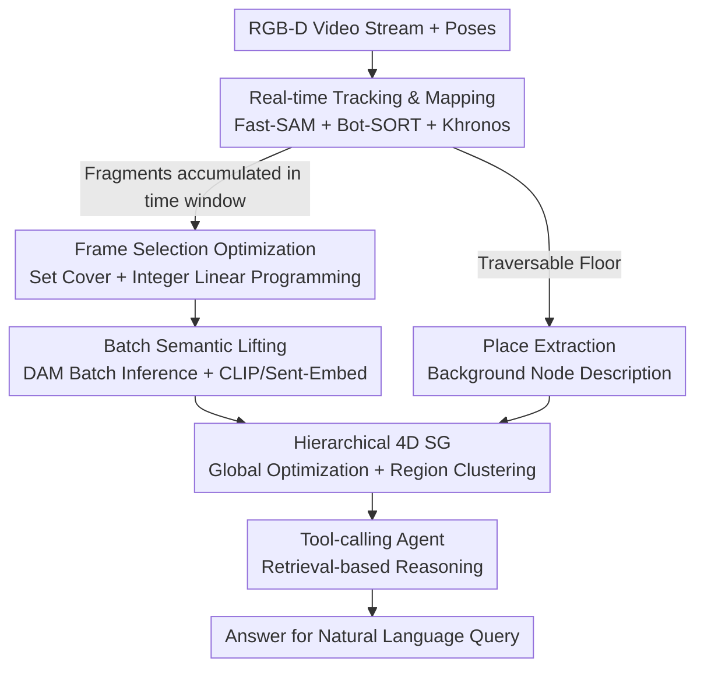

# Describe Anything Anywhere At Any Moment

**Conference**: CVPR 2026  
**Paper**: [CVF Open Access](https://openaccess.thecvf.com/content/CVPR2026/html/Gorlo_Describe_Anything_Anywhere_At_Any_Moment_CVPR_2026_paper.html)  
**Code**: The paper claims that data and implementation will be open-sourced; no link is provided in the main text.  
**Area**: Multimodal VLM  
**Keywords**: Spatio-temporal memory, 4D scene graph, local region description, embodied QA, real-time mapping  

## TL;DR
DAAAM decouples "real-time geometric-semantic mapping" from "fine-grained local descriptions generated by large models": it uses an optimization problem to select the minimum number of keyframes, which are then fed in batches to the Describe Anything Model (DAM) to generate open-vocabulary descriptions. This allows for constructing hierarchical 4D scene graphs with detailed textual annotations at 10 Hz real-time, serving as spatio-temporal memory for embodied agents and achieving SOTA in large-scale spatio-temporal QA and sequence task localization.

## Background & Motivation
**Background**: Robots and AR require "spatio-temporal memory" that can both precisely localize objects in 3D (for manipulation and navigation) and answer arbitrary natural language queries with rich open-vocabulary semantics (e.g., "Where and when did I last see the red screwdriver?"). Currently, there are two main approaches: 1) metric-semantic maps (especially 3D scene graphs), which reconstruct object geometry and then assign semantics; 2) view-based methods, which use multimodal large models to generate text annotations for each frame/video clip and store them in a database for retrieval.

**Limitations of Prior Work**: Both approaches have significant drawbacks. Metric-semantic maps either use fast but closed-vocabulary segmentation/embeddings (weak semantics) or query large models for open-vocabulary annotations on a per-object basis (accurate but extremely slow, preventing real-time use). View-based methods offer rich semantics, but annotations are stored "by frame" rather than "by object," lacking cross-frame spatial and temporal consistency. They fail to associate observations of the same object across different frames, thus struggling with queries like "count the chairs" or long-range spatial relationships.

**Key Challenge**: Expressive semantic descriptions (from larger models) are expensive and difficult to run in real-time on mobile devices. Conversely, accurate spatial reasoning requires grounding descriptions in 3D geometry. Among rich semantics, 3D grounding, and real-time computation, existing methods can typically only satisfy two at once.

**Goal**: Construct a spatio-temporal memory that satisfies all three requirements: large-scale, real-time, fine-grained open-vocabulary descriptions, and strict geometric grounding.

**Key Insight**: The authors observe that "geometric tracking" can run at sensor frame rates (10 Hz), while the truly expensive step is "calling large models to generate detailed descriptions." Instead of querying a large model for every object in every frame, the expensive semantic annotation should be **decoupled** from the fast geometric front-end and performed only on a few selected frames in batches.

**Core Idea**: Formalize "which frames and masks to annotate" as an optimization problem to find the minimum set of frames covering all object fragments with the best viewpoints. These are then processed via batch inference with DAM—speeding up the online deployment of 3B-scale models by an order of magnitude. Finally, these descriptions are backfilled into a globally consistent hierarchical 4D scene graph as memory.

## Method

### Overall Architecture
The input is an RGB-D video stream with poses, and the output is an incrementally constructed, globally consistent **hierarchical 4D scene graph (4D SG)**. Each object/place node in the graph contains detailed natural language descriptions generated by DAM and a history of timestamps. A downstream tool-calling agent answers natural language queries by retrieving information from this graph.

The pipeline splits processing into "fast" and "slow" threads. The fast thread follows the Khronos front-end for real-time geometric processing at 10 Hz (**A. Active Window**, using the framework from [Khronos]): each frame is segmented using Fast-SAM, tracked into object fragments across frames using Bot-SORT, and then lifted to 3D for shape and pose reconstruction. The slow thread performs expensive semantic annotation in parallel: it first uses **Frame Selection Optimization** to select the minimum number of frames with the best viewpoints, followed by **Batch Semantic Lifting** to apply DAM descriptions to all fragments. Simultaneously, **Place Extraction** is performed for the background. Finally, the back-end performs **Global Optimization and Region Clustering** to merge nodes, complete temporal histories, and abstract regions.

### Key Designs

**1. Frame Selection Optimization: Minimizing Large Model Calls**

To avoid the real-time bottleneck of per-frame per-object calls, the authors formulate the problem of which frames to annotate within a time window $w = [t_{start}, t_{start}+m]$ as a two-step optimization. First, they solve a set cover problem to find the minimum set of frames $\mathcal{S}$ such that every tracked fragment $o_j^w$ is seen at least once:

$$K^\star = \min_{\mathcal{S}\subseteq \mathcal{F}^w} |\mathcal{S}| \quad \text{s.t.} \quad \forall o_j^w\in \mathcal{O}:\ \exists f_i\in \mathcal{S},\ v_{ij}=1$$

where $v_{ij} \in \{0,1\}$ indicates visibility. This is solved greedily. Second, given a budget $K^\star + \epsilon$ (with relaxation $\epsilon = 1$), they solve a binary linear program to maximize the viewpoint quality of selected fragments:

$$\max_{x,y}\ \sum_{i}\sum_{j} q_{ij}\, y_{ij}\quad \text{s.t.}\quad \sum_i x_i = K^\star+\epsilon,\ \sum_i y_{ij}=1,\ y_{ij}\le x_i,\ y_{ij}\le v_{ij}$$

Here, $x_i$ denotes frame selection, and $y_{ij}$ assigns fragment $j$ to a selected frame $i$. Quality $q_{ij} = \alpha q^{pos}_{ij} + (1-\alpha) q^{size}_{ij}$ ($\alpha=0.5$) prioritizes objects that are centered and sufficiently large.

**2. Batch Semantic Lifting: Accelerating 3B Models**

Once image-fragment pairs are selected, the images and masks are packed into a single tensor for a single DAM forward pass to annotate all fragments in a frame simultaneously. This maximizes hardware utilization and parallelism. Combined with the minimum frame selection, batch inference (batch size 48–128) speeds up DAM by roughly an order of magnitude compared to per-mask inference (batch=1). Each fragment also receives a CLIP feature and a sentence embedding for retrieval and reconciliation.

**3. Hierarchical 4D Scene Graph: Grounding Descriptions in 3D**

DAAAM backfills descriptions into a 4D scene graph. In addition to object nodes, it performs **Place Extraction** by flattening local occupancy maps and tiling them with maximal inscribed rectangles to create place nodes $p_j$. Global consistency is maintained using factor graph optimization from [Khronos]. Nodes with similar geometry and semantic features are merged (reconciliation), and their descriptions are **appended as a history** with timestamps—the basis for "At Any Moment" queries. Regions $R_i$ are clustered using Hydra’s most-stable-clique algorithm, and an LLM summarizes the region based on sampled features.

**4. Tool-calling Agent: Reasoning over the 4D SG**

A tool-calling agent consumes the memory by (a) retrieving objects, (b) querying region info, or (c) querying the agent's own history. Because the memory is already grounded in 3D and reconciled over time, the agent performs compositional reasoning on structured nodes rather than guessing 3D structure from raw frames.

## Key Experimental Results

### Main Results

On the large-scale **OC-NaVQA** benchmark (up to 35.8 min, 1.64 km), DAAAM outperforms both view-based (ReMEmbR) and metric-semantic map (ConceptGraphs) methods:

| Dataset | Method | QA Acc ↑ | Pos. Error [m] ↓ | Time Error [min] ↓ |
|--------|------|------|------|------|
| OC-NaVQA | ReMEmbR (NVILA-Lite-2B) | 0.432 | 53.47 | 2.287 |
| OC-NaVQA | ReMEmbR (NVILA-Lite-8B) | 0.463 | 55.89 | 4.106 |
| OC-NaVQA | ConceptGraphs | 0.299 | 111.29 | × |
| OC-NaVQA | **DAAAM (Ours)** | **0.711** | **41.75** | **1.792** |

On the sequence task localization benchmark **SG3D**, DAAAM outperforms Hydra/HOV-SG and ASHiTA:

| Method | Sub-task Acc s-acc[%] ↑ | Task Acc t-acc[%] ↑ |
|------|------|------|
| Hydra + GPT | 8.18 | 2.44 |
| ASHiTA | 21.7 | 8.78 |
| **DAAAM (Ours) + GPT** | **22.16** | **11.22** |

### Ablation Study (OC-NaVQA)

| Configuration | QA Acc ↑ | Pos. Error [m] ↓ | Time Error [min] ↓ | Description |
|------|------|------|------|------|
| DAAAM (Full) | 0.711 | 41.75 | 1.792 | Full Model |
| w/o DAM Descriptions | 0.776 | 50.05 | 2.396 | Poor Pos/Time accuracy; binary questions improve |
| w/o Region Clustering | 0.707 | 48.93 | 3.576 | Heavily impacts temporal queries |
| w/o Quality Heuristics | 0.627 | 49.92 | 1.678 | Drop in spatial and QA accuracy |

### Key Findings
- **Explicit text descriptions benefit spatial/temporal reasoning**: Removing DAM descriptions worsens position and time errors by 16.6% and 25.4%, respectively. However, binary (yes/no) questions improve, as direct visual verification of image crops by the LLM is more reliable.
- **Region clustering is critical for temporal queries**: Without it, time error increases from 1.792 to 3.576.
- **Quality heuristics sustain spatial precision**: Removing them drops QA accuracy from 0.711 to 0.627.
- **Real-time Performance**: The overall system runs at 10 Hz. The bottleneck is segmentation/tracking, not semantics. Detailed reasoning lags by ~10s due to slow-thread latency (frame selection 1.2s, semantic lifting 9.2s).

## Highlights & Insights
- **Optimization for "Who to Annotate"**: Treating frame and mask selection as a set cover + ILP problem naturally fits batch inference—selecting the fewest frames while packing each frame with the most masks.
- **Decoupling Fast and Slow Threads**: Geometric tracking runs at 10 Hz, while semantic annotation runs in a high-latency parallel thread. This prioritizes throughput over latency for long-term memory.
- **Object-centric History**: Storing descriptions as a timestamped history per object node (rather than per frame) ensures spatial consistency while preserving the temporal dimension.

## Limitations & Future Work
- **DAM Training Corpus**: With only 1.5M samples, DAM can "hallucinate towards the mean" for out-of-distribution objects (e.g., imagining handles on elevator doors).
- **Throughput for Dynamic Platforms**: 5.2 fragments/sec is sufficient for ground robots but may be slow for fast drones or VR.
- **Tracking Assumptions**: Changes in object state (e.g., cutting) break associations, creating new trajectories without links to the source object.
- **Scalability of Description Histories**: Summarization strategies are needed to bound memory growth for dynamic nodes.

## Related Work & Insights
- **vs ReMEmbR (View-based RAG)**: ReMEmbR lacks 3D grounding, leading to poor multi-view consistency and spatial reasoning at scale. DAAAM's 4D SG is significantly more stable (OC-NaVQA 0.711 vs 0.463).
- **vs ConceptGraphs (Metric-Semantic Mapping)**: ConceptGraphs queries VLMs per object and is too slow for real-time (0.075 Hz). DAAAM's batching strategy enables 10 Hz real-time operation.
- **vs Hydra / ASHiTA (Scene Graphs/Task Analysis)**: DAAAM provides finer-grained open-vocabulary semantics compared to Hydra, outperforming even versions of Hydra provided with ground-truth word labels.

## Rating
- Novelty: ⭐⭐⭐⭐⭐ Formulating frame/mask selection as an optimization problem elegantly solves the "open-vocabulary vs real-time 3D grounding" conflict.
- Experimental Thoroughness: ⭐⭐⭐⭐⭐ Extensive coverage of SQA, task localization, retrieval, and ablations, including a new benchmark.
- Writing Quality: ⭐⭐⭐⭐ Clear system decomposition and motivation, though formulas and module numbering can be dense.
- Value: ⭐⭐⭐⭐⭐ High practical value for robotics/AR as a real-time, scalable, grounded spatio-temporal memory.

<!-- RELATED:START -->

## Related Papers

- [\[CVPR 2026\] Enhancing Part-Level Point Grounding for Any Open-Source MLLMs](enhancing_part-level_point_grounding_for_any_open-source_mllms.md)
- [\[CVPR 2025\] Multimodal OCR: Parse Anything from Documents](../../CVPR2025/multimodal_vlm/multimodal_ocr_parse_anything_from_documents.md)
- [\[ICLR 2026\] Modal Aphasia: Can Unified Multimodal Models Describe Images From Memory?](../../ICLR2026/multimodal_vlm/modal_aphasia_can_unified_multimodal_models_describe_images_from_memory.md)
- [\[NeurIPS 2025\] MDReID: Modality-Decoupled Learning for Any-to-Any Multi-Modal Object Re-Identification](../../NeurIPS2025/multimodal_vlm/mdreid_modality-decoupled_learning_for_any-to-any_multi-modal_object_re-identifi.md)
- [\[ICCV 2025\] MAVias: Mitigate Any Visual Bias](../../ICCV2025/multimodal_vlm/mavias_mitigate_any_visual_bias.md)

<!-- RELATED:END -->
