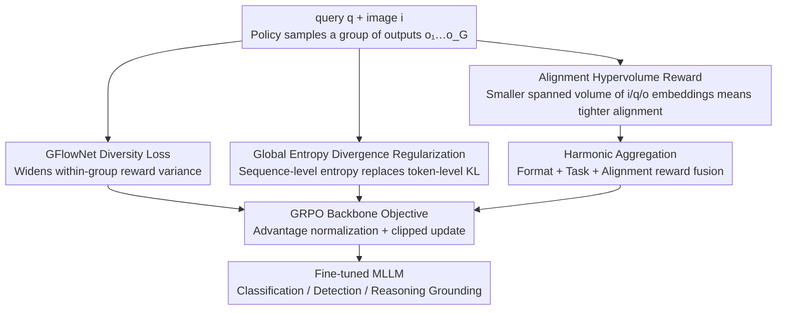

# DEVA: Fine-tuning Multimodal Large Language Models for Visual Perception Tasks

**Conference**: CVPR 2026  
**Paper**: [CVF Open Access](https://openaccess.thecvf.com/content/CVPR2026/html/Das_DEVA_Fine-tuning_Multimodal_Large_Language_Models_for_Visual_Perception_Tasks_CVPR_2026_paper.html)  
**Code**: None  
**Area**: Multimodal VLM  
**Keywords**: GRPO, Reinforcement Fine-tuning, Visual Perception, GFlowNet, Reward Aggregation

## TL;DR
To address three major bottlenecks—nearly identical within-group rewards, restricted policy exploration, and coarse reward designs—when fine-tuning multimodal large language models for visual perception tasks using GRPO, DEVA introduces four plug-and-play components on top of the GRPO loss: a GFlowNet diversity loss, global entropy regularization, alignment hypervolume reward, and harmonic aggregation. These components yield consistent gains of $+5$ to $+13$ points across classification, detection, and reasoning grounding tasks.

## Background & Motivation

**Background**: Utilizing reinforcement learning (especially critic-free GRPO) to fine-tune large language models has proven superior to supervised fine-tuning (SFT) when labels are scarce—RL encourages generalization while SFT biases toward memorization. Recently, ViRFT (Visual-RFT) adapted GRPO to visual perception tasks, using verifiable rule-based rewards such as IoU and classification accuracy to guide fine-tuning. This achieved substantial improvements over SFT and established the paradigm of "perceptual MLLM fine-tuning via RL."

**Limitations of Prior Work**: The authors conduct an in-depth analysis of GRPO training dynamics and identify three key bottlenecks overlooked by ViRFT. First, rule-based rewards exhibit **extremely poor diversity**: outputs sampled within the same group for a given query often receive nearly identical rewards, causing normalized advantages $A_i$ to approach zero, which vanishes the policy gradient and renders updates ineffective. Second, GRPO employs token-level KL divergence as regularization; however, this **local constraint restricts the policy's exploration space**, hindering general-purpose MLLMs from adequately adapting to specialized visual tasks. Third, intermediate reasoning traces lack ground-truth and cannot receive verifiable rewards, while naively using an **arithmetic sum** of multiple rewards allows stronger rewards to dominate weaker ones, leading to sub-optimal outcomes.

**Key Challenge**: Although verifiable rule-based rewards are reliable and efficient, their binary/discrete nature inherently lacks granularity. This creates a fundamental conflict with policy gradient methods, which require reward variance to facilitate learning. Additionally, a trade-off exists between local token-level stability regularization and global exploration.

**Goal**: Without altering the GRPO backbone and while preserving its plug-and-play nature, address the three shortcomings: insufficient reward diversity, restricted exploration, and coarse reward design/aggregation.

**Key Insight**: The authors observe that GFlowNet objectives, originally designed to generate diverse trajectories, are well-suited to inject variance into within-group rewards. Furthermore, sequence-level entropy divergence can replace token-level KL divergence to manage exploration control at a coarser (and thus more flexible) granularity. Lastly, the alignment between the image, query, and output can be quantified by the **hypervolume** spanned by their embeddings—where a smaller volume indicates tighter alignment.

**Core Idea**: Combine four components—Diversity loss, Exploration (entropy regularization), alignment Volume reward, and Aggregation (harmonic aggregation)—into DEVA, which can be layered on top of GRPO or any of its variants to improve visual perception performance.

## Method

### Overall Architecture
DEVA is not a new RL algorithm, but rather a **four-part enhancement layered over GRPO** (and its variants like DAPO, BNPO, and GSPO). The original GRPO process remains unchanged: for a query $q$, a group of outputs $\{o_1,\dots,o_G\}$ is sampled, individual rewards are computed using rules, normalized into advantages $A_i$, and the clipped objective with token-level KL regularization is optimized (Eq. 1). DEVA modifies three positions along this pipeline: on the **loss side**, it appends a GFlowNet diversity loss $L_{div}$ to widen the within-group reward variance, and replaces the token-level KL with a **global entropy divergence regularization** $L_{reg}$ to unleash exploration; on the **reward side**, it introduces an unverifiable alignment reward $r_v$ derived from the hypervolume spanned by the image/query/output embeddings, and then applies **harmonic aggregation** to merge format, task, and alignment rewards into the final reward $r$. The four components are independent and can be added incrementally, with each yielding a cumulative performance gain of approximately 1 point in experiments.

### Key Designs

**1. GFlowNet Diversity Loss: Injecting Variance into Converging Within-Group Rewards**

This is the core component of DEVA, directly addressing the critical issue of "identical within-group rewards $\rightarrow$ vanished advantage $\rightarrow$ zeroed gradient." The authors model the autoregressive generation of MLLMs as a token-level MDP $\langle S,A,f\rangle$: the state represents the generated token sequence, the action represents the vocabulary, and the transition is string concatenation until the EOS token ($\top$) is generated. Based on this, they introduce the GFlowNet concept of "flow" and adopt the detailed balance condition as the training objective. Since text generation is unidirectional, the backward policy is set to $\pi_B(\cdot)=1$, and they define $F(s)=r(s)/\pi(s_f\mid s)$. The balance condition is formulated in the log space as a squared loss:

$$L_{div}(\pi;r)=\sum_{t=1}^{n-1}\Big(\log\frac{r(o_t\mid o_{1:t-1})\,\pi(\top\mid o_{1:t+1})}{r(o_{t+1}\mid o_{1:t})\,\pi(\top\mid o_{1:t})}+\log\pi(o_{t+1}\mid o_t)\Big)^2$$

where the reward term is defined by the reference model as $\log r(o_t\mid o_{1:t-1})=\log\pi_{ref}(o_t\mid o_{1:t-1})+\exp\big(\tfrac{1}{\gamma}\log\pi_{ref}(\top\mid o_{1:t-1})\big)$, with $\gamma\in(0,1]$ controlling the reward signal strength, and the $\top$ terms ensuring reasonable termination. This design keeps the policy diverse without straying excessively from the reference model. The effect is immediate: when $L_{div}$ is added on LISA, the average standard deviation of within-group rewards increases from 0.234 to 0.262 for GRPO, and from 0.201 to 0.240 for DAPO—greater variance means advantage estimations no longer collapse, rendering policy gradients effective again. This single component alone outperforms the strong GSPO baseline. To the authors' knowledge, this is the first work to combine GFlowNet loss with GRPO.

**2. Global Entropy Divergence Regularization: Replacing Token-Level KL with Sequence-Level Entropy to Unleash Exploration**

While the token-level KL divergence in the original GRPO objective (Eq. 1's $\beta D_{KL}(\pi_\theta\|\pi_{ref})$) stabilizes training, its local, token-by-token constraint locks the exploration of the policy space. This is particularly disadvantageous for visual perception tasks that require substantial adaptation. DEVA replaces this **local** metric with a **global** one: it computes the entropy $H_t^\theta$ and $H_t^{ref}$ of the output distribution for each token in the policy and reference models, respectively, and then regularizes the mean squared error of the difference between their **average entropies**:

$$L_{reg}=\Big\|\tfrac{1}{m}\sum_{t=1}^{m}H_t^\theta-\tfrac{1}{n}\sum_{t=1}^{n}H_t^{ref}\Big\|_2^2$$

where $m$ and $n$ denote the sequence lengths of the policy and reference outputs, respectively. The regularization is computed individually for each group element. The critical distinction is that it only constrains the "overall exploration degree" at the sequence level rather than restricting every individual token probability. Consequently, it allows token-level distributions to vary more freely, encouraging broader policy exploration. In experiments, adding $L_{reg}$ yields faster reward curve convergence, higher saturation values, and a larger KL range (evidence of enhanced exploration), resulting in a consistent ~1 point improvement across metrics.

**3. Alignment Hypervolume Reward: Quantifying Image-Query-Answer Consistency via Embedding Spanned Volume**

Reasoning traces lack ground-truth labels and cannot receive verifiable rewards; however, consistency among the "reasoning process, input image, and query" must be maintained. DEVA elegantly geometrizes the alignment: it encodes the image $i$, query $q$, and output $o$ into a shared representation space as $f_i,f_q,f_o$ respectively. Rather than using the entire image, a mask $m$ (obtained by thresholding the self-attention scores between image and text tokens in the language decoder) is applied to extract relevant patches, i.e., $i'=i\circ m$. After normalizing the three embeddings to a unit hypersphere, the volume of the parallelotope they span is evaluated. This is mathematically equivalent to the square root of the determinant of their Gram matrix $G$:

$$V=\mathrm{Vol}(f_i,f_q,f_o)=(\det G(f_i,f_q,f_o))^{1/2}$$

Tighter alignment (smaller angles) among the three vectors results in a smaller spanned volume $V$. Thus, the optimization goal is to **minimize $V$**. The volume is then converted to a reward via an inverse relationship: $r_v=\max((aV^{-1}-b)^2,c)$, with $a,b,c$ as hyperparameters (default optimal at $a{=}1,b{=}0,c{=}2$). Compared to prior pairwise alignment and aggregation methods—which can cause different reward pairs to peak and decline asynchronously, destabilizing training dynamics—the hypervolume provides a **unified** metric that encourages co-alignment of the image, query, and output, preventing compromises.

**4. Harmonic Aggregation: Synchronized Improvement of Multi-path Rewards Rather Than "Winner-Takes-All"**

Given the unverifiable alignment reward $r_v$, verifiable format reward $r_{form}$, and task reward $r_{task}$, how to synthesize the final reward $r=f_{agg}(r_{form},r_{task},r_v)$ is crucial. The authors' analysis demonstrates that naive **arithmetic summation is sub-optimal**, as a single dominant reward path can overshadow others, dragging down overall performance. By default, DEVA adopts a **scaled harmonic mean** as $f_{agg}$. Since the harmonic mean is highly sensitive to the minimum value (the bottleneck), the total reward is only high when all reward components improve **simultaneously**, forcing the different reward paths to advance collaboratively. The paper also compares this heuristic against scaled geometric mean, arithmetic sum, and a separately pre-trained learnable aggregation network, showing that harmonic aggregation matches the performance of the learnable alternative while remaining simple and parameter-free.

## Key Experimental Results

Following the experimental setup and protocols of ViRFT (Liu et al.), the experiments use Qwen2-VL-2B / 7B as backbones. They cover few-shot fine-grained classification (Flower102/Pets37/Aircraft/Car196), few-shot COCO detection, and LISA reasoning grounding (with only 239 training images). Baselines include SFT, SFT-CoT, and various RL methods: PPO, PAPO, DAPO, Dr GRPO, BNPO, GRPO-CARE, CPPO, GMPO, and GSPO.

### Main Results

Few-shot detection (COCO, mAP) / classification (Accuracy in parentheses), Qwen2-VL-2B:

| Method | 1-shot | 4-shot | 16-shot | 4-shot(7B) |
|------|--------|--------|---------|-----------|
| Qwen2-VL baseline | 19.6 (56.0) | 19.6 (56.0) | 19.6 (56.0) | 43.0 |
| + SFT-CoT | 25.2 (59.2) | 29.7 (66.4) | 36.1 (74.2) | 48.2 |
| + GSPO (strong baseline) | 35.0 (82.6) | 42.6 (84.0) | 48.3 (88.0) | 56.0 |
| + ViRFT (vanilla GRPO) | 33.6 (80.3) | 40.6 (81.9) | 46.8 (85.3) | 54.3 |
| **+ DEVA (Ours)** | **40.0 (86.1)** | **47.3 (87.1)** | **52.8 (91.1)** | **60.0** |

DEVA (Ours) improves by around 5 to 6 points over ViRFT, and by about 3 to 4 points over the strong GSPO baseline, with gains sustained as the number of shots increases.

LISA reasoning grounding (mIoU_test):

| Method | 2B mIoU_test | 7B mIoU_test |
|------|-------------|-------------|
| GroundedSAM (specialized model) | 26.2 | 26.2 |
| + GSPO | 41.3 | 46.0 |
| + ViRFT | 37.6 | 43.9 |
| **+ DEVA (Ours)** | **48.9** | **49.5** |

General-purpose MLLMs fine-tuned via RL comprehensively outperform specialized segmentation models like OV-Seg, X-Decoder, and GroundedSAM. DEVA achieves a remarkable $+5$ to $+13$ point improvement over ViRFT.

### Ablation Study

Component-wise accumulation (Few-shot 4-shot detection, 2B):

| Configuration | mAP | Description |
|------|-----|------|
| ViRFT (GRPO) | 40.6 | Starting point |
| + Div. | 43.9 | Diversity loss alone surpasses GSPO |
| + Div. + Explor. | 45.0 | Adding entropy regularization |
| + Div. + Explor. + Align.Vol. | 46.2 | Adding alignment volume reward |
| + Full (Ours) (with Agg.) | 47.3 | Finishing with harmonic aggregation |

### Key Findings
- **Diversity loss makes the most prominent contribution**: Simply adding $L_{div}$ surpasses the highly competitive GSPO baseline, confirming that "insufficient within-group reward variance" is the primary bottleneck of GRPO in perception tasks. Each added component brings a ~1 point improvement, showing their complementarity.
- **Harmonic aggregation $\approx$ learnable aggregation**: Utilizing a neural network for learnable aggregation produces comparable results to using the default harmonic aggregation, implying that this simple heuristic is highly effective. Shifting to pairwise alignment rewards or altering hypervolume hyperparameters causes noticeable performance drops.
- **Reward dynamics do not strictly correlate with final metrics**: The progression of rewards and KL curves during training is not strictly positively correlated with the final mIoU. Cross-algorithmic comparisons of reward curves should be treated with caution.
- **Attention is more focused on targets**: Visualizations demonstrate that while SFT, ViRFT, and GSPO focus heavily on backgrounds, DEVA prioritizes the interior and edges of target objects, resulting in tighter localization.

## Highlights & Insights
- **Explicitly diagnosing and addressing "insufficient reward variance"**: While many RL fine-tuning studies focus on stability, DEVA reveals that the discrete nature of rule-based rewards is the root cause of policy gradient vanishing. Using GFlowNet—originally designed for diverse generation—to address this provides a structurally clean solution.
- **Quantifying multimodal alignment via geometric hypervolume**: Representing the alignment of the image, query, and output as the volume of the parallelotope spanned by three normalized vectors on a unit hypersphere (computed via the Gram determinant) offers a unified metric. It avoids conflicting pairwise optimization dynamics and provides an unsupervised proxy for unverifiable rewards.
- **Harmonic mean as an aggregator**: Leveraging the harmonic mean's sensitivity to bottlenecks forces all reward components to improve concurrently, presenting a simple yet powerful design for multi-reward RLHF.
- **Fully plug-and-play**: The four-part suite can be applied on top of GRPO, DAPO, BNPO, and GSPO with minimal code modifications.

## Limitations & Future Work
- **Dependency on the ViRFT/GRPO framework and verifiable rule-based rewards**: Since the method acts as a patch to existing RL fine-tuning, it does not redesign rule-based rewards themselves. Its applicability to open-ended generation tasks lacking easily verifiable rules remains to be validated.
- **Hypervolume reward introduces additional encoders and hyperparameters**: Computing embeddings requires external base encoders, and hyperparameters ($a, b, c$ and attention thresholds) require tuning, which increases computation and deployment complexity.
- **Small evaluation scale**: The training datasets are very small (e.g., only 239 images for LISA) and backbones are limited to Qwen2-VL 2B/7B. Whether the benefits scale to larger models and datasets remains unverified.
- **Future Work**: The authors plan to extend DEVA to more complex visual-agentic tasks.

## Related Work & Insights
- **vs ViRFT (Visual-RFT)**: ViRFT is the direct baseline that first brought GRPO with verifiable rule-based rewards to visual perception. Without discarding the architecture, DEVA patches the four weaknesses (diversity, exploration, alignment, and aggregation) overlooked by ViRFT, yielding $+5$ to $+13$ point gains.
- **vs GSPO / DAPO / BNPO, etc.**: While these works improve GRPO from the perspective of policy optimization and clipping strategies, DEVA focuses orthogonally on the reward and regularization sides (diversity, hypervolume alignment, and aggregation). Thus, DEVA can be stacked on top of them to achieve extra gains.
- **vs Traditional Specialized Perception Models (OV-Seg / X-Decoder / GroundedSAM)**: These models are task-specific and struggle with natural language queries. General-purpose MLLMs fine-tuned via DEVA outperform them in reasoning grounding, highlighting the potential of the "General MLLM + RL Fine-tuning" paradigm.

## Rating
- Novelty: ⭐⭐⭐⭐ Combines GFlowNet loss with GRPO and quantifies multimodal alignment using Gram determinant hypervolume. The combination is novel, though it cleverly packages existing mathematical tools.
- Experimental Thoroughness: ⭐⭐⭐⭐ Solid evaluation across three task domains, two backbones, component-wise ablation, and detailed visualizations, but constrained by small training scales and single-family backbones.
- Writing Quality: ⭐⭐⭐⭐ Clear motivation, well-dissected components, though some detailed configurations (mask thresholds, exact aggregation formulas) are relegated to the supplementary material.
- Value: ⭐⭐⭐⭐ Highly plug-and-play, compatible with various GRPO variants, and offers direct utility for researchers working on MLLM reinforcement learning fine-tuning.

<!-- RELATED:START -->

## Related Papers

- [\[CVPR 2026\] CoVFT: Context-aware Visual Fine-tuning for Multimodal Large Language Models](covft_context-aware_visual_fine-tuning_for_multimodal_large_language_models.md)
- [\[CVPR 2026\] OddGridBench: Exposing the Lack of Fine-Grained Visual Discrepancy Sensitivity in Multimodal Large Language Models](oddgridbench_exposing_the_lack_of_fine-grained_visual_discrepancy_sensitivity_in.md)
- [\[CVPR 2026\] DiG: Differential Grounding for Enhancing Fine-Grained Perception in Multimodal Large Language Models](dig_differential_grounding_for_enhancing_fine-grained_perception_in_multimodal_l.md)
- [\[CVPR 2026\] TRivia: Self-supervised Fine-tuning of Vision-Language Models for Table Recognition](trivia_self-supervised_fine-tuning_of_vision-language_models_for_table_recogniti.md)
- [\[CVPR 2026\] LLaDA-V: Large Language Diffusion Models with Visual Instruction Tuning](llada-v_large_language_diffusion_models_with_visual_instruction_tuning.md)

<!-- RELATED:END -->
