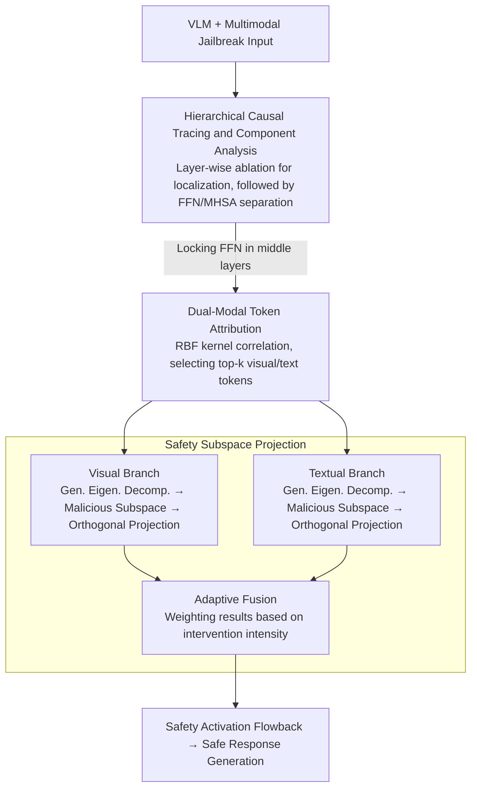

# Diagnosing and Repairing Unsafe Channels in Vision-Language Models via Causal Discovery and Dual-Modal Safety Subspace Projection

**Conference**: CVPR 2026  
**arXiv**: [2603.27240](https://arxiv.org/abs/2603.27240)  
**Code**: None  
**Area**: Multimodal / VLM  
**Keywords**: VLM Security, Causal Mediation Analysis, Safety Subspace Projection, Adversarial Attack Defense, Dual-Modal Repair

## TL;DR
The CARE framework is proposed, which first pinpoint neurons and layers causally related to unsafe behavior in VLMs using causal mediation analysis (diagnosis), and then constructs a dual-modal safety subspace via generalized eigenvalue decomposition to project activation values during inference (repair). This reduces the attack success rate to below 10% with minimal loss in general capabilities.

## Background & Motivation
**Background**: Large Vision-Language Models (LVLMs) demonstrate excellence in multimodal understanding but face jailbreak attacks, where carefully constructed multimodal prompts bypass safety alignment mechanisms.

**Limitations of Prior Work**: (1) Input preprocessing and adversarial training are computationally expensive and may degrade general performance; (2) Existing activation-level defenses (e.g., ASTRA, SPO-VLM) lack precise localization of unsafe components, utilize only a single modality, and rely on heuristic linear steering that distorts general representations.

**Key Challenge**: How to precisely locate components within the VLM related to unsafe behavior and repair them without compromising general performance?

**Goal**: Establish a causal-driven, non-linear, dual-modal framework for VLM safety diagnosis and repair.

**Key Insight**: Causal localization (identifying which layers/neurons lead to unsafe outputs) followed by subspace projection (projecting activations into a safe direction).

**Core Idea**: Diagnosis—localizing middle layers in FFNs via causal mediation analysis; Repair—identifying malicious subspaces via generalized eigenvalue decomposition and projecting into their orthogonal complements.

## Method

### Overall Architecture
CARE addresses the issue of VLMs being bypassed by jailbreak attacks through safety alignment evasion. While existing activation defenses rely on expensive preprocessing or coarse-grained linear steering across all layers—often distorting normal representations—CARE adopts a "diagnose then repair" approach. It intervenes only during inference without retraining: first, causal ablation is used to locate which layers and components (FFN vs. MHSA) dominate unsafe outputs; second, dual-modal token attribution identifies specific vision/text tokens related to the jailbreak; finally, a "malicious direction" subspace is solved via covariance contrast between benign and malicious activations, and activations are projected out of this subspace during inference. The process follows a "layer → token → subspace" refinement to isolate and eliminate unsafe signals.

### Key Designs

**1. Hierarchical Causal Tracing and Component Analysis: Identifying Safety Modules**

To determine where to intervene, CARE uses causal ablation: systematically blocking activations layer-by-layer and observing changes in Attack Success Rate (ASR). Layers showing the steepest drop in ASR are identified as safety-critical. Separate ablation of FFN and Multi-Head Self-Attention (MHSA) reveals that **FFNs impact safety significantly more than MHSA**. This is because FFNs perform per-token independent projections where activations have lower cross-sample correlation, keeping safety signals "cleanly separable," whereas MHSA mixes global context, diluting and isolating safety signals. To validate this, the Silhouette coefficient, class separation, and Mahalanobis distance are used to measure the separability of "benign vs. malicious activations," all peaking near layers 16-17 (LLaVA), confirming that middle layers concentrate safety representations.

**2. Dual-Modal Token Attribution: Selecting Targeted Tokens**

Since not all tokens in a critical layer are equally related to a jailbreak, CARE performs attribution to focus on high-relevance tokens before projection. For the visual side, an RBF kernel characterizes cross-modal correlation between visual and text tokens. The $L_2$ norm of each row in the centered cross-modal kernel matrix is taken as $s_i = \|\tilde{K}_{i,:}\|_2^2$ and normalized into an attribution score:

$$MI_i^v = \frac{s_i - s_{min}}{s_{max} - s_{min}}$$

Top-k visual tokens most related to the attack are selected. For the textual side, a self-modal RBF kernel calculates semantic independence scores to select influential text tokens. This targeted attribution ensures the constructed malicious subspace is focused, minimizing damage to normal content.

**3. Safety Subspace Projection: Eliminating Malicious Directions**

CARE replaces heuristic linear steering with a principled subspace projection. Benign and malicious activations ($A_b, A_m$) at target layers are collected to compute covariance matrices $C_b, C_m$. The generalized eigenvalue problem is solved:

$$C_m u = \lambda C_b u$$

Directions corresponding to the largest eigenvalues represent the maximum deviation of malicious activations relative to benign ones. The top-k eigenvectors $U_k$ span the "malicious subspace." A safety operator projects into the orthogonal complement, after which a benign component is added back using coefficient $\beta$ to stabilize normal representations:

$$P_{\text{safe}} = I - U_k U_k^T, \qquad h' = P_{\text{safe}}\, h + \beta\,(1 - P_{\text{safe}})\, h_{\text{benign}}$$

CARE constructs separate subspaces for visual and textual modalities and fuses them using adaptive weights:

$$w_{vis} = \frac{\|h'_{vis} - h_{txt}\|}{\|h'_{vis} - h\| + \|h'_{txt} - h\|}$$

This "covariance contrast + orthogonal projection" accurately targets malicious components while leaving attack-unrelated directions intact.

### Loss & Training
The method requires no training and intervenes only during inference. It requires a small offline collection of benign/malicious samples to extract activations for solving the generalized eigenvalue decomposition and constructing projection matrices. Inference overhead is minimal, involving only extra matrix multiplications.

## Key Experimental Results

### Main Results (Attack Success Rate ASR % ↓)

| Method | JailBreakV | MMSafety | PGD-Toxic κ=64 | PGD-Jailbreak κ=64 |
|------|-----------|---------|---------------|-------------------|
| LLaVA Original | 45.71 | 36.48 | 60.38 | 65.15 |
| SPO-VLM | 10.37 | 16.26 | 17.90 | 17.38 |
| ASTRA | 11.98 | 15.37 | 16.37 | 14.85 |
| **CARE (Ours)** | **7.03** | **9.13** | **12.78** | **8.46** |

**Trend on Qwen2.5-VL**: JailBreakV 6.55%, MMSafety 8.72%.

### Ablation Study

| Configuration | JailBreakV ASR↓ | PGD-Toxic-64 ASR↓ | Description |
|------|----------------|-------------------|------|
| CARE (full) | 7.03 / 6.55 | 12.78 / 4.60 | Full dual-modal version |
| CARE w/o text | 15.26 / 14.3 | — | Textual subspace critical for language jailbreaks |
| CARE w/o visual | — | 45.71 / 46.13 | Visual subspace critical for image-based attacks |

### Key Findings
- **FFN > MHSA**: Blocking FFNs affects ASR significantly more than blocking MHSA, confirming FFNs as primary carriers of safety mechanisms.
- **Critical Middle Layers**: Safety-related representations reach peak cluster separability at layers 16-17 (LLaVA) or 12-14 (Qwen).
- **Dual-Modality Necessity**: Removing the textual subspace doubles language jailbreak ASR; removing the visual subspace increases PGD attack ASR 10x.
- **Capability Preservation**: Minimal performance degradation (2-8%) on MMBench, MM-Vet, and SQA.
- **Defense Transferability**: Effective against unseen PGD attacks.

## Highlights & Insights
- **Causal-Driven Localization**: Avoids blind intervention across all layers by first locating safety-critical layers and components (FFN) to minimize interference with unrelated representations.
- **Theoretical Elegance of Generalized Eigenvalue Decomposition**: Identifies the direction of maximum deviation in the "benign vs. malicious" covariance space, providing a more principled approach than heuristic linear steering.
- **Training-Free**: Requires only offline extraction of a few activations; inference involves low-cost matrix multiplication.
- **FFN as "Discriminative Projector"**: The finding that safety signals are more "purely separable" within FFN activations due to low cross-sample correlation provides theoretical value for understanding internal VLM safety.

## Limitations & Future Work
- Construction of safety subspaces relies on offline malicious samples, which may not cover entirely new attack types.
- Projection operations, though lightweight, add computational overhead during every inference step.
- The benign regularization term $\beta$ requires tuning and may vary across models.
- Validation is limited to 7-8B scale models; larger models require further verification.
- Selection of the subspace dimension $k$ requires empirical tuning.
- Defense effectiveness against text-only jailbreaks (without image input) was not evaluated separately.
- The phenomenon of safety mechanisms being diluted by "feature entanglement" in deeper layers warrants further study.

## Related Work & Insights
- Comparison with ASTRA and SPO-VLM: CARE utilizes causal analysis for precise localization instead of coarse-grained intervention, and uses non-linear RBF kernels/generalized eigenvalue decomposition instead of linear steering.
- Comparison with Refusal Pairs (Fine-tuning): CARE requires no retraining and achieves superior results.
- Causal mediation analysis, while used in NLP interpretability, is applied here for the first time to VLM safety localization.
- Generalized eigenvalue decomposition, common in classical discriminant analysis (LDA), is innovatively used to separate safety and malicious directions.

## Technical Details
- **RBF Kernel Bandwidth**: $\sigma = \sqrt{0.5 \cdot \text{median}(D_{ij})}$, adaptive to data distribution.
- **Kernel Centering**: Visual one-sided $\tilde{K} = K_{cross}H_t$, textual two-sided $\tilde{K} = HKH$.
- **Safety Projection**: $h' = P_{safe}h + \beta(1-P_{safe})h_{benign}$.
- **Fusion Weight**: $w_{vis} = \frac{\|h'_{vis}-h_{txt}\|}{\|h'_{vis}-h\|+\|h'_{txt}-h\|}$.
- **Localization Verification**: Silhouette/Class Sep./Mahalanobis metrics peak at layers 16-17.
- **Attack Datasets**: JailbreakVBench + AdvBench + FigStep.
- **General Performance**: MMBench drop 2-3%, MM-Vet drop 5-8%, SQA drop 2-4%.

## Rating
- Novelty: ⭐⭐⭐⭐⭐ First to combine causal diagnosis with dual-modal safety subspace projection.
- Experimental Thoroughness: ⭐⭐⭐⭐⭐ Comprehensive evaluation across 2 VLMs, multiple benchmarks, PGD attacks, and ablations.
- Writing Quality: ⭐⭐⭐⭐ Clear framework and deep causal analysis, though mathematical notation is dense.
- Value: ⭐⭐⭐⭐⭐ Significant practical implications for VLM defense, deployable without retraining.

<!-- RELATED:START -->

## Related Papers

- [\[CVPR 2026\] BiomedCCPL: Causal Conditional Prompt Learning for Biomedical Vision-Language Models](biomedccpl_causal_conditional_prompt_learning_for_biomedical_vision-language_mod.md)
- [\[CVPR 2026\] Bias Is a Subspace, Not a Coordinate: A Geometric Rethinking of Post-hoc Debiasing in Vision-Language Models](bias_is_a_subspace_not_a_coordinate_a_geometric_rethinking_of_post-hoc_debiasing.md)
- [\[CVPR 2026\] Differences That Matter: Auditing Models for Capability Gap Discovery and Rectification](differences_that_matter_auditing_models_for_capability_gap_discovery_and_rectifi.md)
- [\[CVPR 2026\] Multi-Modal Representation Learning via Semi-Supervised Rate Reduction for Generalized Category Discovery](multi-modal_representation_learning_via_semi-supervised_rate_reduction_for_gener.md)
- [\[CVPR 2026\] Understanding Counting Mechanisms in Large Language and Vision-Language Models](understanding_counting_mechanisms_in_large_language_and_vision-language_models.md)

<!-- RELATED:END -->
