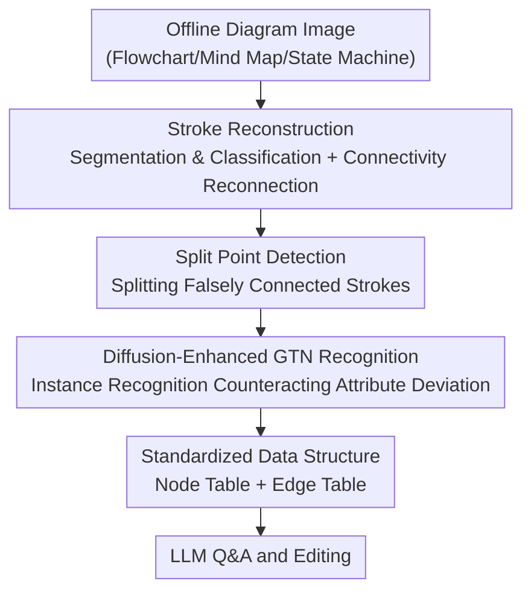

# Diagram2Structure: Unlocking LLMs' Diagram Comprehension through DiagramDiff, a Framework for Structuring Offline Diagrams

**Conference**: CVPR 2026  
**Paper**: [CVF Open Access](https://openaccess.thecvf.com/content/CVPR2026/html/Hu_Diagram2Structure_Unlocking_LLMs_Diagram_Comprehension_through_DiagramDiff_a_Framework_for_CVPR_2026_paper.html)  
**Code**: To be confirmed  
**Area**: Multimodal VLM / Document & Diagram Understanding  
**Keywords**: Offline Diagram Understanding, Stroke Reconstruction, Instance-level Recognition, Diffusion-Enhanced GTN, LLM Diagram Q&A and Editing

## TL;DR
Addressing the pain point that LLMs fail to understand "offline diagrams in image formats (flowcharts/mind maps/state machines)", this paper proposes DiagramDiff. First, a high-precision **stroke reconstruction model** restores offline images to online stroke sequences. Then, a **diffusion-enhanced Graph Transformer Network (GTN) recognition model** performs instance-level stroke recognition. Finally, diagrams are converted into a standardized "node + edge" data structure and fed to the LLM, upgrading LLMs from simple Q&A engines to intelligent assistants capable of semantic reasoning, logical validation, and diagram editing, achieving SOTA results on reconstruction and recognition tasks.

## Background & Motivation
**Background**: Diagrams are core vehicles for transferring complex structures and logic in scientific research, education, and software development. However, in practice, a large number of diagrams exist in the form of **offline images** (scanned documents, hand-drawn photos, screenshots) without structured data representations. Existing diagram interaction research mostly targets "online diagrams" (digital diagrams preserving vector/stroke trajectories) for simple Q&A, relying on pre-built knowledge bases and natural language retrieval, which do not support semantic understanding and editing of complex offline diagrams.

**Limitations of Prior Work**: The reusability and editability of offline diagrams are extremely poor—modifying a single part often requires manual redrawing, which is both laborious and error-prone. Although LLMs (such as GPT-4o) possess strong reasoning and knowledge integration capabilities, when directly fed diagram images, they **cannot accurately understand the structure and content of the diagrams**, leading to a significantly reduced accuracy on Q&A and editing tasks.

**Key Challenge**: To enable LLMs to truly "read and understand" offline diagrams, the prerequisite is to obtain **instance-level structured data with connectivity relations**; however, existing offline stroke extraction/recognition techniques cannot provide such data. On one hand, pixel searching and template matching methods are designed for character recognition and cannot handle complex intersections of diagram strokes; region segmentation and instance segmentation are hindered by stroke breaks and blurry intersections, providing only region-level clues rather than instance-level stroke recognition. On the other hand, strokes reconstructed from images **suffer from attribute deviations** (curvature, thickness, etc. are distorted due to edge aliasing), which drops performance when directly passed to recognition, and no method is specifically designed to handle these attribute deviations.

**Goal**: Translate offline diagram images into a standardized data format that LLMs can accurately comprehend, thereby supporting semantic reasoning, logical validation, and efficient editing of complex diagrams. This requires simultaneously solving two sub-problems: (1) high-precision, instance-level offline stroke reconstruction; (2) robust instance-level recognition for "reconstructed strokes with deviations".

**Key Insight**: Instead of forcing the LLM to learn diagrams end-to-end directly from pixels, it is better to first **restore offline images to online strokes**. Once reverted to stroke representations (with coordinate trajectories), the strong capability of online diagram recognition can be reused and further abstracted into "node + edge" graph structures.

**Core Idea**: Use a three-stage pipeline of "reconstruction $\rightarrow$ recognition $\rightarrow$ standardized data structure" to translate incomprehensible offline diagram images into LLM-readable structured representations; in the recognition stage, a **diffusion model is used as a feature fusion engine** to counteract the attribute deviations introduced during reconstruction.

## Method

### Overall Architecture
The input of DiagramDiff is an offline diagram image, and the output is a standardized diagram data structure of "nodes + edges", which is fed to the LLM along with the original image for Q&A and editing. Two models are concatenated in the middle: the **offline diagram reconstruction model** first restores pixel images to instance-level online strokes (thinning $\rightarrow$ segmentation $\rightarrow$ classification $\rightarrow$ reconnection $\rightarrow$ split point detection), solving the problem of "which pixels in the image belong to the same stroke, and how strokes disconnect"; the **diagram recognition model** then performs instance-level recognition on the reconstructed strokes (using a diffusion model + GTN to counteract attribute deviations), determining each stroke's node/edge category and its corresponding symbol instance. Finally, the data is organized into a node table and an edge table according to a unified schema and handed to the LLM.

### Key Designs

**1. Stroke Reconstruction: Segment first and reconnect by connectivity, restoring offline pixels to online strokes**

Addressing the pain point that "offline images lack stroke trajectories and suffer from severe intersections/disconnects," this step performs language-agnostic stroke-level reconstruction. First, the Guo-Hall thinning algorithm is used to thin strokes into skeletons, classifying pixels into background points, stroke points, and joint points. The joint points are determined based on whether the neighborhood of a stroke pixel divides the background into three or more independent regions—counted using the 8-connected components of background pixels: `$C(p)=\sum_{S\subseteq B(p)} \mathbb{1}[S\ \text{is 8-connected and maximal}]$`, where the maximality constraint prevents background regions from connecting. A pixel response value suppression is further applied to reduce noise, obtaining the joint probability `$P_j(p)=\sigma(\eta\,C(p)+(1-\eta)\,\hat R(p))$`. A pixel is labeled as a joint point when `$P_j(p)>\tau_j$`. This segments the diagram into "continuous stroke segments without branching," categorized into three types based on endpoint states: joint-joint, joint-open, and open-open (treated as complete isolated segments).

With stroke segments obtained, the reconnection stage groups segments near adjacent joint points and computes pairwise connectivity:

$$C_{i,j}=\alpha e^{-\lambda d_{\min}}+\beta\cos(\Delta\theta)+\gamma e^{-\mu|k_i-k_j|}$$

This equation fuses **endpoint spatial proximity** (`$d_{\min}$` minimum Euclidean distance), **directional consistency** (`$\Delta\theta$` orientation angle difference), and **curvature similarity** (`$k_i,k_j$` average curvatures) to quantify if two segments originally belonged to the same stroke. Since each segment has only two endpoints and each end can be used at most once, "which connections to select" is formulated as a matching problem: `$\mathcal{M}^\star=\arg\max_{\mathcal{M}\subseteq\mathcal{E}}\sum_{(i,j)\in\mathcal{M}}C_{i,j}$` subject to `$\deg_{\mathcal{M}}(i)\le 1$`, ensuring each segment participates in at most one connection. Compared to semantic segmentation/edge detection methods that only output broken lines and crash at intersections, this "segmentation + matching reconnection" scheme robustly handles inevitable intersections in hand-drawn diagrams.

**2. Split Point Detection: Splitting single strokes that falsely merged multiple elements**

Traditional stroke extraction designed for character recognition would mistake "a user drawing two circles + a connecting line in one stroke" as a single stroke, whereas in a diagram, it should be three independent strokes (two nodes + one edge). This design is specifically tailored to split such over-merges: corner detection is performed on each stroke, using a sliding window to calculate the angle between the center point and the endpoints inside the window. Instead of a fixed angle threshold, a **length-adaptive threshold** is used: `$\theta_{\text{thr}}(\ell)=\theta_0+\rho\,e^{-\ell/\ell_0}$` (the longer the window, the closer the threshold to the minimum angle `$\theta_0$`). When the observed angle `$\theta<\theta_{\text{thr}}(\ell)$`, the center point becomes a candidate split point; curvature is estimated using the three-point circle method.

To obtain globally consistent "split/no-split" decisions, candidate points are optimized within a graph cut framework: let `$e_s\in\{0,1\}$` represent whether candidate point `$s$` is split (1) or retained (0), minimizing the energy:

$$E(\mathbf{e})=\sum_{s\in\mathcal{E}}\Big(\lambda_s e_s+\sum_{t\in\mathcal{N}(s)}\phi_{s,t}|e_s-e_t|\Big)$$

where `$\lambda_s\propto\kappa_s$` penalizes redundant cuts (greater curvature warrants cutting, and vice versa), and `$\phi_{s,t}$` enforces local consistency among neighboring candidate points, solved for global optimum `$\mathbf{e}^\star$` via `$\alpha$`–`$\beta$` swap. This step elevates "local cues from corner detection" to a "globally self-consistent splitting scheme," directly dictating whether subsequent strokes can be correctly assigned to different primitive instances.

**3. Diffusion-Enhanced GTN Recognition: Using a diffusion model as a conditional fusion engine to counteract reconstruction attribute deviations**

The recognition phase builds the diagram as a graph `$G=(V,E)$`: each stroke is a node `$N_a^i=(S_a^i,C_a^i,I_a^i)$` (stroke, category label, corresponding symbol ID), and edge `$E_b^i$` represents the connection between two strokes with positive/negative labels—**positive edges** indicate the two nodes belong to the same primitive instance, and **negative edges** indicate different instances. Recognition is framed as predicting node categories and edge categories, thereby achieving instance-level classification. The major pain point is: reconstructed strokes have aliasing, causing attributes like curvature and thickness to distort. Conventional GTNs merely **concatenate** stroke image features and attribute features, failing to differentiate the importance of "reliable image features" versus "potentially inaccurate attribute features", and are thus misguided by deviated attributes.

This paper's solution is to embed a diffusion model into the GTN for feature fusion: a dual-channel architecture first extracts features—a GCN channel aggregates spatial/contextual relations to get geometric attribute features `$F^a$`, while a Depthwise Separable Convolution (DWConv) channel extracts deep image features `$F^i$`, both aligned to the diffusion model's input dimension via scaling layers. Then, the diffusion model **takes image features as the core input and attribute features as the conditional input**, deeply fusing both feature types through iterative denoising (using DDIM to accelerate sampling, and independently sampling three times per node to combat randomness). The single-step denoising outputs three intermediate representations `$\{s_{1,j},s_{2,j},s_{3,j}\}$` for each node `$j$`. These three representations act as Q/K/V in the GTN attention:

$$O_j=\text{softmax}\Big(\frac{s_{1,j}s_{2,j}^{T}}{\sqrt d}\Big)\cdot s_{3,j}\ \oplus\ \text{GCN}(F_j^a)\ \oplus\ \text{DWConv}(F_j^i)$$

In other words, the robust representations generated by diffusion perform attention aggregation, which is then concatenated with the original geometric/image features to update the nodes. This allows reliable image features to compensate for information loss caused by attribute deviations, significantly suppressing the impact of "inaccurate attributes" on recognition. This is the key module leading to the paper's superior recognition accuracy (referred to as FE, Feature Enhancement). The entire training requires only about 23,134 MB of VRAM, with an average inference time of 25.2 ms per image.

**4. Standardized Data Structure: Organizing recognition results into "node table + edge table" for LLMs**

After obtaining instance-level strokes from the first three steps, this design uniformizes diagram elements into two classes—**nodes** and **edges**, each mapped to a set of attribute schema (see table below), thereby translating the "originally incomprehensible offline diagram" into "precisely understandable standardized structured data". In practice, both the original image and this standardized data are fed to the LLM. The LLM can then perform semantic reasoning, logical validation, and precise editing based on explicit nodes, edges, and connection relations (e.g., replacing a step, finding and correcting errors in the diagram in order). This step acts as a bridge from "reconstruction/recognition (vision)" to "LLM intelligent services (language)," serving as the practical outlet of the entire framework.

| Node Attribute | Meaning | Edge Attribute | Meaning |
|----------|------|--------|------|
| ID | Unique Identifier | ID | Unique Identifier |
| Text | Node Label/Content | Text | Edge Label/Content |
| Type | Node Category | Type | Edge Category |
| Size | Node Size | Length | Edge Length |
| Incoming/Outgoing Edges | Incoming/Outgoing Edge List | Direction | Flow Direction |
| Child/Parent Nodes | Child/Parent Nodes | Weight / Start & End Points | Connection Strength / Start & End Points |

## Key Experimental Results

Datasets: Reconstruction is evaluated on CASIA-OHFC and OHSD (test images generated from online data); recognition is evaluated on FC A, FC B, CASIA-OHFC, and OHSD, and **all methods are trained/tested on "strokes reconstructed from offline diagrams"**. Q&A and editing are evaluated on the self-built **DiagramQAE** (100 images, 3,186 symbols, 20 element categories, including flowcharts, mind maps, and state machines; 5 tasks per diagram = 3 Q&A + 2 editing, totaling 500 tasks).

### Main Results

**Reconstruction task** (Table 3, higher IoU/SRR is better, lower HD is better). SRR is defined as the percentage of strokes with coverage `$c(s)\ge 50\%$`, HD is the Hausdorff distance between predicted and ground-truth images:

| Dataset | Method | IoU(%) | SRR(%) | HD↓ |
|--------|------|--------|--------|------|
| CASIA-OHFC | Mouss et al. | 50.5 | 92.3 | 3.71 |
| CASIA-OHFC | **Ours** | **55.6** | **96.5** | **3.61** |
| OHSD | Mouss et al. | 49.9 | 91.8 | 3.77 |
| OHSD | **Ours** | **53.9** | **96.2** | **3.69** |

**Recognition task** (on reconstructed strokes, SCA = Stroke Classification Accuracy, SCP = Stroke Classification Precision, Table 2 / Table 4 Reconstruction column):

| Dataset | Method | SCA(%) | SCP(%) |
|--------|------|--------|--------|
| CASIA-OHFC | InstGNN | 87.23 | 87.10 |
| CASIA-OHFC | SpaceGTN | 89.56 | 89.34 |
| CASIA-OHFC | **Ours** | **94.64** | **93.41** |
| OHSD | SpaceGTN | 93.21 | 92.18 |
| OHSD | **Ours** | **98.39** | **96.31** |

Our reconstruction outperforms the strongest baseline (Mouss et al.) by around $+5$ IoU / $+4$ SRR; for recognition on the two most challenging datasets, SCA exceeds the runner-up SpaceGTN by about $+5$ (CASIA-OHFC) / $+5$ (OHSD). ⚠️ Note that in Table 2 of the original paper, the multi-column headers were misaligned during PDF extraction. Accuracies across datasets should refer to the original paper; the verified consistent values from the reconstruction column of Table 4 are presented here.

### Ablation Study

**FE (diffusion feature enhancement) module** (Table 4, stroke recognition SCA/SCP on reconstructed strokes):

| Configuration | CASIA-OHFC SCA/SCP | OHSD SCA/SCP | Description |
|------|--------------------|--------------|------|
| Ours (w/o FE) | 90.56 / 90.42 | 94.33 / 93.20 | Removing diffusion fusion, degrading to conventional concatenation |
| Ours (with FE) | 94.64 / 93.41 | 98.39 / 96.31 | Full model |

Removing FE drops SCA by approximately 4.08 on CASIA-OHFC and 4.06 on OHSD, verifying that fusion with the image features as core and attribute features as conditions indeed counteracts reconstruction-induced attribute deviations. Table 4 also shows that all online recognition methods suffer performance degradation when applied to "reconstructed strokes" compared to "original online strokes" (e.g., SpaceGTN drops from 98.13 to 89.56), indicating that reconstruction error is a universal challenge, which our FE module successfully mitigates.

**LLM Q&A and Editing User Study** (Table 6, accuracy %, Original vs. DiagramDiff Standardized):

| LLM | Editing (Original → Ours) | Q&A (Original → Ours) |
|-----|------------------|------------------|
| GPT-4o | 71% → 90% | 77% → 92% |
| Claude 3.7 | 50.5% → 61% | 54% → 68.5% |
| DeepSeek R1 | 62% → 85% | 69% → 80% |
| GPT-4.5 | 69% → 86% | 77.5% → 93% |

The four advanced LLMs consistently show substantial improvements across both tasks (editing $+11\sim+23$, Q&A $+11.5\sim+16$), with GPT-4o editing increasing from 71 to 90 and GPT-4.5 Q&A from 77.5 to 93. This demonstrates that "standardizing diagrams into node/edge structures" is indeed the key to enabling LLMs to understand offline diagrams. Real-time Q&A latency is around 2.7 s, with the bottleneck stemming mainly from the LLMs themselves.

### Key Findings
- **FE module contributes the most**: It directly determines whether the model can maintain high accuracy on "reconstructed strokes with deviations", dropping about 4% without it.
- **Reconstruction is a universal bottleneck**: Online recognition methods collectively degrade when facing reconstructed strokes, highlighting the importance of "offline-to-online" reconstruction quality and validating the paper's emphasis on attribute deviation compensation.
- **Standardized data structures bring general gains to LLMs**: Benefits are observed across GPT models, Claude, and DeepSeek, indicating that gains stem from the "structured representation" itself rather than alignment of any specific model.

## Highlights & Insights
- **Translating "offline to online strokes" is a clever formulation**: Instead of letting LLMs/VLMs brute-force diagram pixels end-to-end, restoring offline diagrams to online strokes allows reusing mature online diagram recognition capabilities, reducing the difficulty of the problem.
- **Diffusion models serve as "conditional feature fusion engines" rather than generators**: Using image features as core inputs and attribute features as conditions, deep fusion is achieved through denoising while producing Q/K/V. This offers a transferable paradigm for "reliable primary feature + noisy auxiliary feature" multimodal fusion scenarios.
- **Split point detection with global graph cut optimization**: Elevating "local corner detection cues" to "globally consistent stroke segmentation" is a key engineering novelty for hand-drawn diagram instantiation.
- **DiagramQAE dataset fills a gap**: As the first offline diagram Q&A and editing dataset, it provides an evaluation suite with correct ground truth answers and edit results for diagram understanding, multimodal tasks, and HCI.

## Limitations & Future Work
- **Reliance on small, manually constructed datasets**: DiagramQAE contains only 100 diagrams, 500 tasks, and 10 participants across three types of diagrams, limiting its scale, diversity, and statistical strength.
- **Cascading error propagation in the pipeline**: Reconstruction errors propagate to recognition and then to LLM. Although FE compensates for attribute deviations, structural errors in the reconstruction phase (like incorrect reconnection or missed splits) are hard to fully correct downstream.
- **LLM-side remains a black-box external component**: The method is responsible for structuring diagrams, but the final Q&A/editing quality still fluctuates based on the LLM's intrinsic capabilities (e.g., Claude 3.7 only scores 61%/68.5% even after standardization).
- **Limited diagram categories**: Currently focused on flowcharts, mind maps, and state machines; generalizability to diagrams with complex free-form curves, dense nesting, or embedded tables remains to be verified.
- **Future directions**: Constructing a closed feedback loop among reconstruction, recognition, and LLM (utilizing LLM logical validation to feed back and correct reconstruction/recognition errors), and extending both the dataset scale and diagram categories.

## Related Work & Insights
- **vs. Offline stroke reconstruction (path-finding, semantic segmentation, edge detection)**: These methods either require prior assumptions on line shapes and locations (only handling standardized diagrams) or end up with broken lines at intersections. This work employs "segmentation + connectivity matching reconnection + split point detection" for language-agnostic general reconstruction, robustly handling hand-drawn intersections and achieving SOTA.
- **vs. Offline recognition (Faster R-CNN, Arrow R-CNN)**: They only perform region/bounding-box level recognition, which drops sharply in precision when nodes are dense or connections overlap, failing to achieve stroke-level instance segmentation. This work realizes instance-level stroke recognition.
- **vs. Online recognition (Inst-GNN, DyGAT, SpaceGTN)**: These methods are restricted to online diagrams and rely on simple feature concatenation, which fails in the presence of attribute deviations in reconstructed strokes. This work utilizes diffusion-enhanced GTN to achieve high-precision recognition on reconstructed strokes.
- **vs. Existing LLM diagram interactions (pre-built knowledge base + natural language retrieval)**: They only support simple Q&A and cannot directly edit complex offline diagrams. This work enables LLMs with semantic reasoning, logical validation, and precise editing via standardized data structures.

## Rating
- **Novelty**: ⭐⭐⭐⭐ Combines "offline-to-online stroke reconstruction + diffusion-enhanced recognition + feeding standardized structures to LLMs" into a complete pipeline; using diffusion as a conditional fusion engine is quite novel.
- **Experimental Thoroughness**: ⭐⭐⭐⭐ Achieves SOTA across multiple reconstruction/recognition datasets, presents clear FE ablation, and demonstrates consistent gains in 4-LLM user experiments; however, DiagramQAE's scale is relatively small.
- **Writing Quality**: ⭐⭐⭐⭐ Clear chain from motivation to method and experiments, with comprehensive formulas and algorithms; minor formatting errors in original PDF tables slightly affect readability.
- **Value**: ⭐⭐⭐⭐ Digitizing offline diagrams and enabling LLM-based editing is a high-frequency, actual demand. Both the formulation and dataset hold value for practical applications and future research.

<!-- RELATED:START -->

## Related Papers

- [\[ICML 2026\] Seeing is Understanding: Unlocking Causal Attention into Modality-Mutual Attention for Multimodal LLMs](../../ICML2026/multimodal_vlm/seeing_is_understanding_unlocking_causal_attention_into_modality-mutual_attentio.md)
- [\[CVPR 2026\] RxnCaption: Reformulating Reaction Diagram Parsing as Visual Prompt Guided Captioning](rxncaption_reformulating_reaction_diagram_parsing_as_visual_prompt_guided_captio.md)
- [\[CVPR 2026\] WEAVE: Unleashing and Benchmarking the In-context Interleaved Comprehension and Generation](weave_unleashing_and_benchmarking_the_in-context_interleaved_comprehension_and_g.md)
- [\[CVPR 2026\] DeepAlign: Mitigating Modality Conflict through Modality-Specific Alignment](deepalign_mitigating_modality_conflict_through_modality-specific_alignment.md)
- [\[AAAI 2026\] Exploring LLMs for Scientific Information Extraction using the SciEx Framework](../../AAAI2026/multimodal_vlm/exploring_llms_for_scientific_information_extraction_using_the_sciex_framework.md)

<!-- RELATED:END -->
