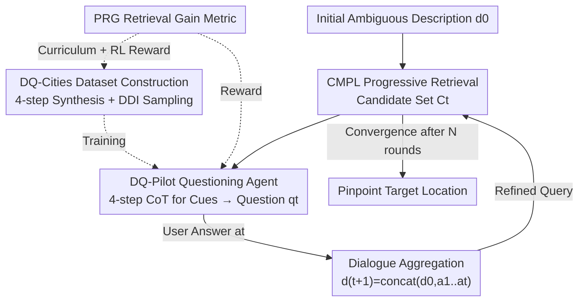

# DialogueVPR: Towards Conversational Visual Place Recognition

**Conference**: CVPR 2026  
**Paper**: [CVF Open Access](https://openaccess.thecvf.com/content/CVPR2026/html/Song_DialogueVPR_Towards_Conversational_Visual_Place_Recognition_CVPR_2026_paper.html)  
**Code**: https://github.com/Graysonggg/DlgPR  
**Area**: Multi-modal VLM  
**Keywords**: Visual Place Recognition, Conversational Retrieval, Reasoning Retrieval, Curriculum Learning, GRPO

## TL;DR
This work transforms language-guided place recognition from a static "one-time query" retrieval into a multi-round dialogue reasoning (DlgPR) framework: "retriever coarse-screening → multi-modal LLM active questioning → user feedback → refined retrieval." It introduces the first conversational place recognition benchmark, DQ-Cities, and a questioning agent, DQ-Pilot, trained via "SFT + GRPO curriculum learning." After 5 rounds of dialogue, the R@1 improves by 13.4% over a 7B base model, even outperforming a 72B model.

## Background & Motivation
**Background**: Language-guided geo-localization is gaining popularity. Real-world scenarios include passengers describing intersections to taxis, witnesses describing surroundings during emergency calls, or home robots following voice commands. Dominant approaches (e.g., Text2Loc, text-to-image retrieval) encode a text query and perform cross-modal retrieval against large-scale street-view or satellite databases to find the best match.

**Limitations of Prior Work**: This "static one-time retrieval" is inherently **passive**. In reality, initial user descriptions are often vague, incomplete, or inaccurate (termed the "user description dilemma"). For example, "I see a black phone booth next to a bank" could match hundreds of locations. Passive retrievers can only execute a single search and **cannot actively ask questions or supplement information**, making them fragile in noisy, real-world scenarios.

**Key Challenge**: Human localization is **interactive**—"Is there a street number on the bank wall?" or "Is the phone booth red or black?"—using Q&A to progressively disambiguate. Existing systems eliminate this interaction, leaving only single-round matching with no mechanism to resolve initial description ambiguities.

**Goal**: To evolve place recognition from "passive retrieval" to "reasoning retrieval." Specifically, this requires solving three sub-problems: (1) the absence of conversational localization data; (2) the need for retrievers to refine searches as dialogue history grows; and (3) a questioning agent capable of "analyzing candidates → identifying discriminative cues → asking the most informative questions."

**Key Insight**: The key to disambiguation is asking questions that **maximize retrieval gain** rather than arbitrary questions. The authors quantify "question quality" as the ranking improvement (PRG) it yields. This signal is used for both curriculum data sampling and reinforcement learning rewards.

**Core Idea**: A collaborative closed loop combining a cross-modal retriever (CMPL) for retrieval and a multi-modal LLM questioning agent (DQ-Pilot) for reasoning. This turns localization into an "Analyze-Question-Optimize" multi-round dialogue, unified by the PRG metric for data construction and training.

## Method

### Overall Architecture
DlgPR refines place recognition into a dynamic interaction loop where two core components collaborate: the **CMPL retriever** encodes the growing dialogue history to retrieve candidates, while the **DQ-Pilot questioning agent** analyzes current candidates to identify ambiguities and generate discriminative questions.

Workflow: The user provides an initial query $d_0$, and CMPL performs Round 0 retrieval to get candidate set $C_0$. In the iterative loop at round $t$, DQ-Pilot analyzes $C_t$ to generate question $q_t$. After the user responds with $a_t$, the system aggregates the history into a richer query $d_{t+1}=\text{concat}(d_0,a_1,\dots,a_t)$ for CMPL to obtain refined candidates $C_{t+1}$. This "Q&A-Retrieval" cycle continues until the target is localized. The training data is synthesized via an automated pipeline (DQ-Cities), and DQ-Pilot undergoes a two-stage "SFT → GRPO" curriculum learning process.

### Key Designs

**1. CMPL Cross-modal Progressive Learner: Aligning Fine-grained Long Descriptions**
Static retrieval must be strong enough to maintain the target in the coarse-screened candidates. Place descriptions are often long (154.6 words on average in DQ-Cities). CMPL uses **multi-level progressive alignment**: it extracts visual patches $V^{(l)}$ and text tokens $T^{(l)}$ from intermediate ViT layers $P=\{p_3,p_6,p_9,p_{12}\}$. Visual features pass through a Saliency Filtering Module (SFM), which dynamically selects "geographically relevant" discriminative tokens $V_s^{(l)}$ supervised by an auxiliary loss $L_{vpr}$. Using **learnable instance-concept queries** $Q^{(l)}$ as semantic anchors, visual and text features are distilled into a unified representation via a shared fine-grained extractor $E_f$:

$$F_v^{(l)}=E_f(Q^{(l)}, V_s^{(l)}), \quad F_t^{(l)}=E_f(Q^{(l)}, T^{(l)})$$

Alignment uses a hierarchical Similarity Distribution Matching (SDM) loss to minimize the KL divergence between predicted distribution $p$ and ground truth $q$. The prediction that an image anchor matches the $j$-th text in a batch $B$ is $p_{v\to t,i,j}=\dfrac{\exp(s_{i,j}/\tau)}{\sum_{k=1}^{B}\exp(s_{i,k}/\tau)}$. It also includes a **Hard-Negative Isolation (HI) loss** to push the most confusing negative samples $j^\*,k^\*$ away using a margin triplet. Total loss: $L_{total}=\lambda_{gs}L_{gs}+\lambda_h\sum_{l\in P}\big(L_{ls}^{(l)}+L_{hi}^{(l)}\big)+L_{vpr}$, where $L_{gs}$ is global [CLS] alignment and $L_{ls}^{(l)}$ is local token alignment.

**2. PRG Gain + DDI Difficulty Index: Unifying Data and Training**
The most difficult aspect of "active questioning" is the lack of a supervision signal. This work quantifies question quality as **Positional Retrieval Gain (PRG)**, measuring the actual ranking improvement of the positive sample. Defining gain $G$ as the sum of nDCG-style contributions $c(r)=1/\log_2(r+1)$ over the positive set $P$:

$$PRG_i=\frac{G^{(i)}-G^{(i-1)}}{G^*-G^{(i-1)}}$$

Here $G^*$ is the ideal gain. Based on this, a **Discriminative Difficulty Index (DDI)** is constructed for curriculum sampling: $DDI=w_{sa}\cdot SA+w_{rid}\cdot RID$. Semantic Ambiguity ($SA$) measures candidate similarity (harder if negative texts look like positive ones), while Retrieval Index Difficulty ($RID_i=1-PRG_i$) uses the retriever's experience as a baseline. The PRG/DDI framework governs both "what to learn" (sampling) and "what to reward" (RL).

**3. DQ-Pilot Two-stage Curriculum: SFT Foundation + GRPO Gain Optimization**
DQ-Pilot is based on Qwen2.5-VL-7B with LoRA fine-tuning. **Stage 1 SFT**: Uses ~20k low-DDI samples for next-token prediction. Input includes dialogue history $Q_i$, candidate `<image>` tokens, and instructions; the output is a structured reasoning chain followed by a question. **Stage 2 GRPO**: Uses ~10k high-DDI samples for reinforcement learning. The reward is $R=\alpha R_{prg}+\beta R_{fmt}$, where $R_{prg}=PRG_t$ rewards retrieval gain and $R_{fmt}$ ensures the output follows the `<think></think><question></question>` format. GRPO allows the model to move beyond mimicry to generate concise, discriminative questions.

### Loss & Training
- **CMPL**: $L_{total}=\lambda_{gs}L_{gs}+\lambda_h\sum_{l\in P}(L_{ls}^{(l)}+L_{hi}^{(l)})+L_{vpr}$, including global/local SDM alignment, hard negative isolation, and saliency VPR auxiliary losses.
- **DQ-Pilot**: Stage 1 uses standard SFT; Stage 2 uses GRPO with reward $R=\alpha R_{prg}+\beta R_{fmt}$.
- **Strategy**: Low-quality dialogues are filtered ($PRG_i < \tau_1$). DDI thresholds split data into a 20k-sample SFT curriculum (low difficulty) and a 10k-sample GRPO curriculum (high difficulty).

## Key Experimental Results

### Main Results
Multi-round interactive retrieval results over five cities (Recall from short initial query to rounds 3 and 5).

| Method | Round | LA R@1 | LA R@5 | Avg R@1 | Avg R@5 | BRI↓ |
|------|------|--------|--------|----------|----------|------|
| Initial | round0 | 35.9 | 56.3 | 52.8 | 74.2 | / |
| Qwen2.5-VL-7B | round5 | 43.2 | 60.1 | 59.1 | 74.9 | 1.58 |
| Qwen2.5-VL-72B | round5 | 49.5 | 68.6 | 65.1 | 82.1 | 1.44 |
| PlugIR | round5 | 51.2 | 70.3 | 66.2 | 83.2 | 1.41 |
| DlgQuest (SFT) | round5 | 54.6 | 73.6 | 68.4 | 85.3 | 1.29 |
| **DlgQuest (SFT+GRPO)**| round5 | **58.4** | **76.5** | **71.4** | **86.6** | **1.18** |

DQ-Pilot improves R@1 by 13.4% over the 7B base after 5 rounds, outperforming the 72B model by 7.3 points with the lowest BRI (highest efficiency).

### Ablation Study

| Configuration (DQ-Pilot Strategy, 5 Rounds) | R@1 | R@5 |
|------|------|------|
| **DQ-pilot (Full)** | **60.5** | **77.8** |
| w/o DDI Curriculum (Random Sampling) | 59.6 | 77.2 |
| w/o GRPO (SFT-30k Full) | 59.1 | 76.6 |
| w/o GRPO (SFT Only) | 58.1 | 75.9 |

### Key Findings
- **GRPO is critical for question quality**: Removing GRPO drops R@1 from 60.5% to 58.1%, proving that reinforcement via PRG makes questions truly useful for retrieval rather than just plausible.
- **DDI curriculum adds value**: Random sampling is 0.9 points lower than DDI-based curriculum sampling.
- **Progressive refinement**: Gains increase consistently from round 3 to round 5, validating that multi-round dialogue effectively resolves ambiguity.

## Highlights & Insights
- **Quantifying "Good Questions" as Retrieval Gain**: PRG transforms question utility into a computable scalar, enabling the use of a single metric for both RL rewards and curriculum difficulty. 
- **Mechanism Disentanglement**: The "Retriever screening + MLLM reasoning" split allows the heavy lifting of recall to be handled by a specialized model, while the MLLM focuses on discriminative cue detection and questioning.
- **Synergy of SFT and GRPO**: SFT provides the basic ability to relate context to spatial ambiguity, while GRPO optimizes for the ultimate task goal—narrowing the search space.

## Limitations & Future Work
- **Real-world User Gap**: User responses are currently simulated by GPT-4o. Real users may be vague, uncooperative, or incorrect, which has not been fully tested.
- **Dynamic Scenarios**: The benchmarks use static street-view imagery. Robustness to seasonal changes, weather, and view variations remains to be explored.
- **Inference Latency**: Multi-round MLLM reasoning plus retriever re-ranking increases end-to-end latency, which may pose challenges for real-time deployment on mobile or edge devices.

## Related Work & Insights
- **Compared to Text2Loc**: While Text2Loc performs single-pass regression on 3D point clouds (high storage/cost), this work uses 2D street-view retrieval and resolves ambiguity via dialogue, making it more robust to vague initial descriptions.
- **Compared to PlugIR**: PlugIR is reactive (aggregating provided info), whereas DQ-Pilot is proactive (diagnosing candidate ambiguity to extract info).
- **Inspiration**: The Positional Retrieval Gain (PRG) framework is potentially applicable to any "interactive retrieval" task, such as Person Re-ID or e-commerce search.

## Rating
- **Novelty**: ⭐⭐⭐⭐⭐ Defines Place Recognition as a dialogue reasoning task (DlgPR) and quantifies quality with PRG.
- **Experimental Thoroughness**: ⭐⭐⭐⭐ Solid multi-city evaluations, though lacking real-time latency and real-world human interaction tests.
- **Writing Quality**: ⭐⭐⭐⭐ Clear motivation and well-defined formulas.
- **Value**: ⭐⭐⭐⭐⭐ First conversational VPR benchmark and a reusable framework for gain-driven active questioning.

## Related Papers

- [\[CVPR 2026\] WikiCLIP: An Efficient Contrastive Baseline for Open-domain Visual Entity Recognition](wikiclip_an_efficient_contrastive_baseline_for_open-domain_visual_entity_recogni.md)
- [\[CVPR 2026\] Taxonomy-Aware Representation Alignment for Hierarchical Visual Recognition with Large Multimodal Models](taxonomy-aware_representation_alignment_for_hierarchical_visual_recognition_with.md)
- [\[CVPR 2026\] TRivia: Self-supervised Fine-tuning of Vision-Language Models for Table Recognition](trivia_self-supervised_fine-tuning_of_vision-language_models_for_table_recogniti.md)
- [\[CVPR 2026\] RetFormer: Multimodal Retrieval for Enhancing Image Recognition](retformer_multimodal_retrieval_for_enhancing_image_recognition.md)
- [\[CVPR 2026\] Condensed Test-Time Adaptation of VLMs for Action Recognition](condensed_test-time_adaptation_of_vlms_for_action_recognition.md)

<!-- RELATED:END -->

<!-- RELATED:START -->

## Related Papers

- [\[CVPR 2026\] Tackling Alignment Ambiguity in Person Retrieval through Conversational Attribute Mining](tackling_alignment_ambiguity_in_person_retrieval_through_conversational_attribut.md)
- [\[CVPR 2026\] WikiCLIP: An Efficient Contrastive Baseline for Open-domain Visual Entity Recognition](wikiclip_an_efficient_contrastive_baseline_for_open-domain_visual_entity_recogni.md)
- [\[CVPR 2026\] Taxonomy-Aware Representation Alignment for Hierarchical Visual Recognition with Large Multimodal Models](taxonomy-aware_representation_alignment_for_hierarchical_visual_recognition_with.md)
- [\[ICLR 2026\] Multimodal Policy Internalization for Conversational Agents](../../ICLR2026/multimodal_vlm/multimodal_policy_internalization_for_conversational_agents.md)
- [\[CVPR 2026\] TRivia: Self-supervised Fine-tuning of Vision-Language Models for Table Recognition](trivia_self-supervised_fine-tuning_of_vision-language_models_for_table_recogniti.md)

<!-- RELATED:END -->
