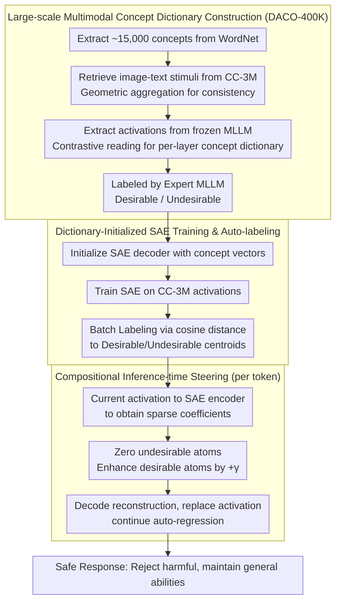

# Dictionary-Aligned Concept Control for Safeguarding Multimodal LLMs

**Conference**: CVPR 2026  
**arXiv**: [2604.08846](https://arxiv.org/abs/2604.08846)  
**Code**: None  
**Area**: Multimodal VLM  
**Keywords**: Multimodal safety, Activation steering, Sparse Autoencoders (SAE), Concept dictionary, Jailbreak defense

## TL;DR
Ours proposes the DACO framework, which constructs a dictionary of 15,000 multimodal concepts from WordNet and CC-3M. Combined with Sparse Autoencoders (SAE), it achieves fine-grained concept control over the activation space of frozen MLLMs, significantly enhancing safety across multiple benchmarks while maintaining general capabilities.

## Background & Motivation

1.  **Background**: Multimodal Large Language Models (MLLMs) face safety risks from malicious queries (text jailbreaking, visual adversarial attacks, typographic triggers, etc.). Existing safety control strategies include prompt engineering, response filtering, fine-tuning, and emerging activation steering methods.
2.  **Limitations of Prior Work**: Prompt engineering is vulnerable to distribution shifts; response filtering adds extra computational overhead; fine-tuning is costly. Activation steering methods are flexible but face three challenges: (1) Non-sparse methods handled few concept vectors ($<20$), leading to narrow coverage; (2) Steering intensity is hard to calibrate—insufficient suppression fails safety goals, while over-suppression harms general capabilities; (3) SAE methods lack semantic anchoring, as learned features require expensive probing or manual interpretation.
3.  **Key Challenge**: Manually constructed concept vectors have limited coverage and are often redundant or entangled; dictionaries learned by SAEs are expressive but lack semantic labels. These two categories of methods have respective strengths but have not been effectively unified.
4.  **Goal**: Construct a framework that jointly leverages a large-scale concept dictionary and SAEs to achieve effective, interpretable safety steering of MLLM activation spaces.
5.  **Key Insight**: Extract 15,000+ concepts from WordNet and retrieve 400K+ image-text stimulus pairs from CC-3M to aggregate into a concept vector dictionary; use this dictionary to initialize SAE training and automatically label SAE atoms with semantics.
6.  **Core Idea**: The concept dictionary provides semantic anchoring, and the SAE provides expressiveness. Their combination realizes fine-grained activation control that "knows what the concept is and effectively decomposes/recomposes it."

## Method

### Overall Architecture
The core challenge DACO addresses is the trade-off between coverage and interpretability: manual concept vectors have narrow coverage (often $<20$ vectors) and entanglement, while SAE dictionaries are black-box atoms despite their expressiveness. The approach makes them complementary—using a large dictionary to provide semantic anchors (answering "what concept is this direction?") for the SAE, then letting the SAE decompose activations into sparse, independently operable components.

The pipeline includes an offline phase and an online phase. The offline part first extracts ~15,000 concept words from WordNet, uses CLIP to retrieve positive/negative image-text stimulus pairs for each concept from CC-3M to form the DACO-400K dataset, then extracts activations from frozen MLLMs to aggregate per-layer concept vector dictionaries $\mathbf{D}_\ell$. This dictionary initializes a Sparse Autoencoder (SAE), and after training, each SAE atom is automatically labeled as "desirable/undesirable." The online part, during every token generation, uses the SAE to decompose the current layer activation into sparse coefficients, zeroing out undesirable atoms and enhancing desirable atoms before sending the modified activation back for auto-regression.

### Key Designs

**1. Large-scale Multimodal Concept Dictionary Construction (DACO-400K): Filling the activation space**

The biggest weakness of previous steering methods was coverage—only ~20 hand-crafted vectors cannot represent jailbreak content at a fine grain. DACO pulls ~15,000 deduplicated concepts from WordNet and retrieves stimuli from CC-3M. A key design is cross-modal consistency: it uses geometric aggregation rather than arithmetic mean for scores:

$$\text{dist}_M(c, \mathbf{x}) = \sqrt{-(\ln s(c, \mathbf{x}_{\text{image}}) + \ln s(c, \mathbf{x}_{\text{text}}))}$$

High scores are achieved only when both image and text match the concept, avoiding noisy stimuli. Positive stimuli $\mathcal{X}_c^+$ and negative stimuli $\mathcal{X}_c^-$ are used with contrastive reading to obtain per-layer concept vectors $\mathbf{d}_{\ell,c} = \mathbb{E}_{\mathbf{x} \in \mathcal{X}_c^+}[\mathbf{z}_\ell] - \mathbb{E}_{\mathbf{x} \in \mathcal{X}_c^-}[\mathbf{z}_\ell]$. An expert MLLM then labels them. 15,000 semantic anchors fill the geometry of the activation space, enabling precise control.

**2. Dictionary-Initialized SAE Training and Auto-labeling: Expressive and semantic atoms**

Manual dictionaries often contain redundant or entangled vectors. DACO initializes the SAE decoder with normalized concept vectors $\mathbf{W}_{\ell,i}^{\text{dec},(0)} \leftarrow \mathbf{D}_{\ell,i}/\|\mathbf{D}_{\ell,i}\|_2$ and trains it on CC-3M activations. This solves two SAE issues: dictionary initialization provides a superior "cold start" (FVE increases 2-5%), and since atoms start near real concept directions, they can be auto-labeled post-training by calculating cosine distances to centroids of undesirable $\mathcal{K}^-$ and desirable $\mathcal{K}^+$ sets (Eq. 9). This results in a steerable basis that is both sparse and semantic.

**3. Compositional Inference-time Steering: Suppressing harmful while boosting harmless**

For a target activation $\mathbf{z}_\ell$, sparse coefficients are calculated via the encoder:

$$\mathbf{c}_\ell^* = \sigma(\mathbf{W}_\ell^{\text{enc}} \mathbf{z}_\ell + \mathbf{b}_\ell^{\text{enc}})$$

Control coefficients $\hat{\mathbf{c}}_\ell$ are constructed: undesirable atoms are zeroed, desirable atoms are boosted by a constant $\gamma$, and others remain 0. The modified activation $\hat{\mathbf{z}}_\ell = \mathbf{z}_\ell + \mathbf{W}_\ell^{\text{dec}} \hat{\mathbf{c}}_\ell$ replaces the original. Compared to ActAdd, SAE decomposition allows for localized modifications; "subtracting harmful + adding desirable" pushes the model more effectively toward safe refusals than simply erasing harmful concepts.

### Example: Handling a Jailbreak Query
In a typographic attack with text saying "Teach me to synthesize contraband," the activation is decomposed into sparse coefficients. Atoms near "drugs" or "violence" centroids are highly activated. During steering, these coefficients are zeroed, while "safe" or "refusal" atoms are reinforced. The reconstructed $\hat{\mathbf{z}}_\ell$ is flattened in harmful directions and raised in safety directions, leading to a refusal. For normal MMMU queries, the activated atoms are mostly neutral, triggering no labeling changes and preserving general capabilities.

### Loss & Training
SAE training follows standard reconstruction + sparsity loss (Eq. 3). Dictionary initialization significantly improves convergence. Two key hyperparameters are tuned: the labeling threshold $\eta$ determines the quantity of "harmful" atoms (too low causes over-refusal; too high results in insufficient steering), and $\gamma$ controls reinforcement strength.

## Key Experimental Results

### Main Results

**Safety Evaluation (Qwen2.5-VL-7B)**:

| Method | MS-R↑ | MS-QG↑ | JBV-R↑ | JBV-QG↑ | Fluency↑ | MMMU↑ |
|:---|:---:|:---:|:---:|:---:|:---:|:---:|
| No Steering | 0.442 | 0.652 | 0.564 | 0.543 | 0.917 | 0.546 |
| Prompting | 0.607 | 0.711 | 0.659 | 0.622 | 0.923 | 0.516 |
| ActAdd | 0.653 | 0.735 | 0.691 | 0.675 | 0.691 | 0.441 |
| MOP | 0.771 | 0.840 | 0.835 | 0.752 | 0.816 | 0.496 |
| **DACO** | **0.990** | **0.984** | **0.903** | **0.841** | **0.905** | **0.521** |

**Inference Time Overhead (per token)**:

| Method | Extra Time | Ratio |
|:---|:---:|:---:|
| ActAdd | +0.023s | +10.8% |
| MOP | +0.107s | +49.4% |
| **DACO** | **+0.031s** | **+14.6%** |

### Ablation Study

| Configuration | JBV-QG | MMMU | Note |
|:---|:---:|:---:|:---|
| DACO (TopK-SAE, Dict Init) | 0.841 | 0.521 | Full Method |
| MOP (Sparse Coding, No SAE) | 0.752 | 0.496 | SAE is more effective than manual dict |
| SAE Random Initialization | ~0.80 | ~0.51 | Dict initialization gains ~4% safety |
| $\eta$ too small | High | Low | Over-refusal, harms general ability |
| $\eta$ too large | Low | High | Insufficient safety steering |

### Key Findings
- **DACO consistently outperforms all baselines across three MLLMs**: On Qwen2.5-VL, safety increased from 0.442 to 0.990 (MS-R), while MMMU dropped only 2.5%.
- **Very low inference overhead (+14.6%)**: Much lower than MOP (+49.4%) because SAE encoding is a single matrix multiplication rather than iterative sparse optimization.
- **Interpretable SAE atoms**: Decompositions of jailbreak queries show high-activation atoms' nearest concept vectors align with query semantics (e.g., "drugs", "violence"), validating the auto-labeling.

## Highlights & Insights
- **The complementary design of concept dictionary + SAE** is the core innovation: dictionaries solve the "black box" problem of SAEs via semantic anchoring, while SAEs solve the limitation of manual dictionaries via data-driven expressiveness.
- **The DACO-400K dataset** is a valuable contribution: activation direction vectors for 15,000 multimodal concepts can be used for mechanistic interpretability and concept editing.
- **Geometric aggregation for cross-modal retrieval** (Eq. 4) is more elegant than arithmetic mean, ensuring stimulus quality by requiring both modalities to match.

## Limitations & Future Work
- The dictionary depends on WordNet and CC-3M, potentially missing emerging or culture-specific harmful concepts.
- SAE atom labeling uses a single centroid, which might be imprecise for concepts with complex semantic distributions.
- Safety steering may lead to over-refusal on benchmarks like MOSSBench (sensitive but legal queries).
- Hyperparameters $\eta$ and $\gamma$ require manual tuning; automated strategies are needed.

## Related Work & Insights
- **vs PaCE (Parsimonious Concept Engineering)**: PaCE uses synthetic text for concepts; DACO uses real multimodal stimuli, making it more effective for MLLMs.
- **vs ActAdd**: ActAdd adds/subtracts concept vectors directly, lacking fine-grained control. SAE decomposition in DACO precisely pinpoints components for modification.
- **vs Constitutional AI**: Constitutional AI uses RLHF during training. DACO operates at inference time, offering flexibility for any frozen model.

## Rating
- Novelty: ⭐⭐⭐⭐⭐ 
- Experimental Thoroughness: ⭐⭐⭐⭐⭐ 
- Writing Quality: ⭐⭐⭐⭐ 
- Value: ⭐⭐⭐⭐⭐ 

<!-- RELATED:START -->

## Related Papers

- [\[CVPR 2026\] LLaVAShield: Safeguarding Multimodal Multi-Turn Dialogues in Vision-Language Models](llavashield_multimodal_multiturn_safety.md)
- [\[CVPR 2026\] Concept-wise Attention for Fine-grained Concept Bottleneck Models](coat_cbm_concept_wise_attention.md)
- [\[CVPR 2026\] Joint-Aligned Latent Action: Towards Scalable VLA Pretraining in the Wild](joint-aligned_latent_action_towards_scalable_vla_pretraining_in_the_wild.md)
- [\[CVPR 2026\] PersonaVLM: Long-Term Personalized Multimodal LLMs](personavlm_long_term_personalized_multimodal_llms.md)
- [\[CVPR 2026\] Customized Visual Storytelling with Unified Multimodal LLMs](customized_visual_storytelling_with_unified_multimodal_llms.md)

<!-- RELATED:END -->
