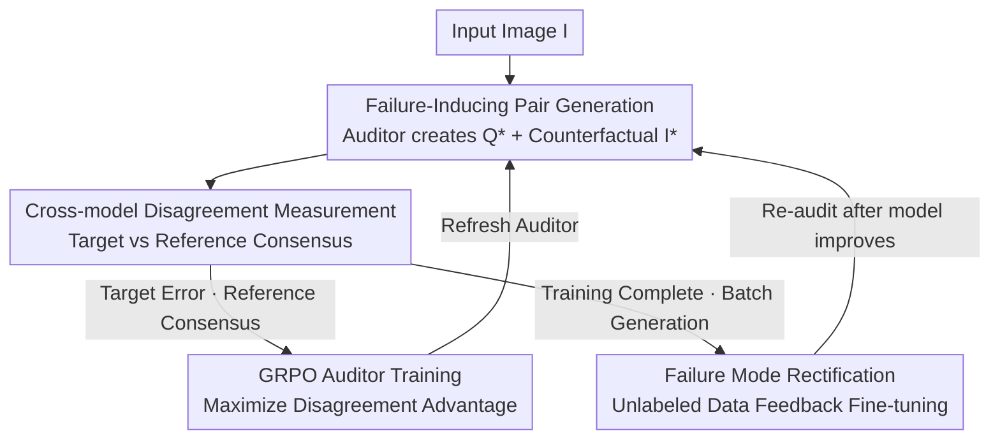

# Differences That Matter: Auditing Models for Capability Gap Discovery and Rectification

**Conference**: CVPR 2026  
**Paper**: [CVF Open Access](https://openaccess.thecvf.com/content/CVPR2026/html/Liu_Differences_That_Matter_Auditing_Models_for_Capability_Gap_Discovery_and_CVPR_2026_paper.html)  
**Code**: Project Page https://auditdm.github.io/ (Code not yet open-sourced)  
**Area**: Model Auditing / Multimodal VLM Evaluation  
**Keywords**: Model Auditing, Capability Gap Discovery, Cross-model Disagreement, GRPO, Unlabeled Data Generation  

## TL;DR
AuditDM fine-tunes an MLLM as an "auditor" to actively generate image-text pairs that induce failures in the target model while maintaining consensus among a set of reference models. This systematically uncovers the target model's capability blind spots and converts them into unlabeled training data for feedback—resulting in PaliGemma2-3B outperforming its official 28B version across multiple benchmarks.

## Background & Motivation
**Background**: Mainstream MLLM evaluation relies on fixed benchmarks (VQAv2, AI2D, MMBench, etc.) to report an aggregate score, where higher scores typically indicate superiority.

**Limitations of Prior Work**: Fixed benchmarks suffer from two fundamental flaws. First, closed-set evaluation is restricted by preset knowledge boundaries, inevitably leaving blind spots and introducing inherent selection bias. Second, benchmarks compress complex behaviors into sparse scores, masking heterogeneous differences across data slices; crucial capability gaps are often entangled and concentrated in the long tail. Consequently, practitioners may know "which model ranks higher" but cannot answer critical questions like "which inputs fail, which skills have improved, or where the model remains fragile."

**Key Challenge**: After model retraining, fine-tuning, or edge deployment, target capabilities may improve, but the impact on broader capabilities remains opaque. Relying on manual online testing to find blind spots is expensive, slow, and non-scalable.

**Goal**: To propose an automated evaluation paradigm that can (1) systematically discover capability gaps, (2) categorize gaps into interpretable weakness categories, and (3) provide feedback to guide rectification.

**Key Insight**: The authors observe that "disagreements" between models serve as signals. If a group of reference models consistently answers a specific image-text pair correctly while the target model fails, that pair almost certainly hits a genuine blind spot of the target model (rather than the question being ambiguous).

**Core Idea**: Fine-tune an MLLM auditor using Reinforcement Learning (GRPO) to actively generate tricky questions and counterfactual images that "maximize cross-model disagreement." The exposed failure modes are then directly converted into unlabeled training data to be fed back into the target model.

## Method

### Overall Architecture
AuditDM is a reinforcement learning framework where an MLLM (Gemma3-4B in this work) is fine-tuned into an auditor $A$. Combined with a diffusion model, it generates image-text pairs $(Q^*, I^*)$ specifically designed to cause $M_{tar}$ to fail while maintaining consensus among reference models. The pipeline consists of two closed loops: **Discovery** (Auditor generates samples $\rightarrow$ measure cross-model disagreement $\rightarrow$ update auditor via GRPO) and **Rectification** (Trained auditor produces batch blind-spot data $\rightarrow$ fine-tune target model $\rightarrow$ refresh auditor after model improvement $\rightarrow$ re-audit).

Given an input image $I$ and a prompt $p$, the auditor takes two paths to generate samples: directly generating tricky questions $Q^*$, or leveraging a diffusion model $G$ or image editing model $E$ to create counterfactual images $I^*$. The generated pairs are fed to the target and reference models, and disagreement is measured by a binary "semantic consistency" discriminator. The auditor is updated only on samples where the "target answer conflicts with the collective consensus." Once trained, the auditor can produce targeted blind-spot samples in a single inference pass for any image.

### Key Designs

**1. Failure-Inducing Pair Generation: Attacking Textual and Visual Vulnerabilities**

AuditDM enables the auditor to "actively create questions" covering both text and vision. On the text side, the auditor generates complex, fine-grained probing questions $Q^* = A(I', p_q)$, forcing itself to identify difficult semantic concepts and learn the target model's weak patterns. On the vision side, the auditor creates counterfactual images $I^*$: either by writing a description $C = A(I, p_c)$ with intentional challenging elements for a diffusion model $G$ to synthesize $I_g = G(C)$, or by generating editing instructions $E = A(I, p_e)$ for an image editing model to modify the original image $I_e = E(I, \mathcal{E})$. Practical implementation uses three pairing levels: $(Q^*, I^*)$, $(Q^*, I)$, and $(Q, I^*)$. Precise image editing is highlighted for its interpretability, as it helps isolate which visual factor drives model behavior.

**2. Cross-model Disagreement: Consensus as "Cheap Ground Truth"**

To determine if a target model's failure on unlabeled generated samples is genuine, the authors use a reference model ensemble's consensus as an oracle. When auditing a model, the system searches for $(Q^*, I^*)$ that maximizes the disagreement between $M_{tar}$ and the ensemble consensus. The disagreement signal is defined as:

$$s(Q^*, I^*) = D\big(M_{tar}(Q^*, I^*),\ M_{ref}(Q^*, I^*)\big)$$

where $D$ is a binary semantic consistency discriminator (1 if semantics differ, 0 if identical). This mechanism relies on two assumptions: (1) **Answerability**—if the ensemble agrees, the pair is likely meaningful and answerable; (2) **Target-only-correct Rarity**—cases where only the target model is correct while the ensemble is wrong are extremely rare. Thus, ensemble consensus serves as a strong proxy for "truth."

**3. GRPO Auditor Training: Optimizing Disagreement via Language Interface**

Since question generation is a discrete, non-differentiable language task, the authors use Group Relative Policy Optimization (GRPO). For each generated pair, the disagreement signal $s(Q^*, I^*)$ is calculated and normalized within the group to obtain the advantage:

$$\hat{A}^k(Q^*, I^*) = \frac{s^k(Q^*, I^*) - \mathrm{mean}_j[s^j(Q^*, I^*)]}{\mathrm{std}_j[s^j(Q^*, I^*)] + \epsilon}$$

Optimizing the GRPO objective encourages the auditor to generate samples that maximize cross-model disagreement. This produces human-readable failure modes (e.g., "clock reading," "size comparison") rather than isolated errors.

**4. Failure Mode Rectification: Closing the Loop with Unlabeled Data**

To fix the model without overfitting to isolated failure samples, two strategies are used: (1) **Augmented Labeled Data**: Using the auditor to expand the original training set with samples covering identified weaknesses. (2) **Bootstrapped Unlabeled Data**: Generating questions, new images, and pseudo-labels from an unlabeled pool using different auditor checkpoints. This forms a continuous cycle: "Create blind-spot data $\rightarrow$ Retrain $\rightarrow$ Re-audit."

### Loss & Training
The auditor is fine-tuned using Gemma3-4B for 1K steps with AdamW, an initial learning rate of $3\times10^{-6}$ (10% warm-up + cosine decay to $1\times10^{-6}$), and a global batch size of 256. FLUX.1-dev is used for image generation and FLUX.1-Kontext-dev for image editing. Target models include PaliGemma2 and Gemma3.

## Key Experimental Results

### Effectiveness of Blind-spot Discovery
Using 20K image-text pairs from VQAv2, AuditDM and a baseline (prompt engineering) generated new pairs to test PaliGemma2-3B. Accuracy was verified using Gemini 2.5 Pro + GPT-5 API to measure "Search Success Rate" for valid errors.

| Method | Search Success Rate (20K trials) |
|------|------|
| Baseline (Prompt engineering only) | 21.4% |
| AuditDM (Ours) | **91.1%** |

The fine-tuned auditor is over 4 times more efficient than the baseline. Interestingly, AuditDM revealed that the 28B version of PaliGemma2 was actually **worse than the 3B version** in categories like hallucination avoidance, counting, and color recognition.

### Main Results (PaliGemma2-3B, 448px²)

| Model | VQAv2 | GQA | OK-VQA | AI2D | DocVQA | ChartQA | RefCOCO | COCOCap |
|------|-------|-----|--------|------|--------|---------|---------|---------|
| PaliGemma2-10B | 85.8 | 68.3 | 68.6 | 84.4 | 76.6 | 66.4 | 78.2 | 145.0 |
| PaliGemma2-28B | 85.8 | 68.3 | 70.6 | 84.6 | 76.1 | 61.3 | 77.3 | 145.2 |
| PaliGemma2-3B | 84.8 | 68.1 | 64.1 | 76.0 | 73.6 | 54.0 | 76.3 | 143.4 |
| **3B + AuditDM** | **86.7**(+1.9) | **71.1**(+3.0) | 69.2(+5.1) | **85.3**(+9.3) | **77.5**(+3.9) | 63.8(+9.8) | 77.8(+1.5) | 145.1(+1.7) |

The 3B model with AuditDM significantly improved across all benchmarks, notably **surpassing the official 28B version** on VQAv2, AI2D, DocVQA, and GQA.

### Ablation Study (PaliGemma2-3B, 224px²)
**Key Findings**:
- **Probing questions contribute the most**: Specifically effective in GQA and AI2D, suggesting that asking more informative questions is the most effective way to improve MLLMs.
- **Image Editing > Image Generation**: Editing introduces fewer artifacts/biases, though its search diversity is lower.
- **Task Sensitivity**: Grounding tasks (RefCOCO) require precise image editing to maintain bounding box validity, while OCR/Chart tasks (AI2D) suffer from diffusion models' inability to render accurate text/charts.

## Highlights & Insights
- **"Disagreement as signal"**: Bypasses the need for expensive manual labeling by using model inconsistency as a proxy for truth.
- **Auditing as a closed loop**: Converting discovered blind spots into training data creates a continuous path for improvement.
- **Empirical evidence that larger is not always more robust**: AuditDM exposed specific failure modes in the 28B model that were absent in the 3B model, indicating that the larger model's decision boundaries may be more fragile.
- **Portability**: The RL-based auditing on a natural language interface is applicable to other domains like code or text LLMs.

## Limitations & Future Work
- **Image generation bottleneck**: Diffusion models struggle with fine-grained OCR tasks and complex charts, leading to performance drops in those specific areas.
- **Computational cost**: The simultaneous use of MLLMs and diffusion models in the pipeline is resource-intensive.
- **Risk of shared bias**: If the entire reference ensemble sharing the same pre-training paradigm has a systemic bias, the auditor might misinterpret "ensemble-wide blind spots" as individual target errors.

## Related Work & Insights
- **vs. Traditional Benchmarks**: AuditDM is open-set, proactive, interpretable, and provides a direct path for model rectification.
- **vs. Adversarial Attacks**: Unlike security-focused attacks, AuditDM targets inherent capability weaknesses through optimization-free single-inference failure discovery.
- **vs. Self-Evolution**: While similar to self-instruct methods, AuditDM explicitly trains a model-specific auditor to bridge target-specific capability gaps.

## Rating
- Novelty: ⭐⭐⭐⭐⭐ 
- Experimental Thoroughness: ⭐⭐⭐⭐⭐ 
- Writing Quality: ⭐⭐⭐⭐ 
- Value: ⭐⭐⭐⭐⭐ 

<!-- RELATED:START -->

## Related Papers

- [\[CVPR 2026\] Concept Regions Matter: Benchmarking CLIP with a New Cluster-Importance Approach](concept_regions_matter_benchmarking_clip_with_a_new_cluster-importance_approach.md)
- [\[CVPR 2026\] CapNav: Benchmarking Vision Language Models on Capability-conditioned Indoor Navigation](capnav_benchmarking_vision_language_models_on_capability-conditioned_indoor_navi.md)
- [\[CVPR 2026\] Unleashing the Intrinsic Visual Representation Capability of Multimodal Large Language Models](unleashing_the_intrinsic_visual_representation_capability_of_multimodal_large_la.md)
- [\[CVPR 2026\] Is the Modality Gap a Bug or a Feature? A Robustness Perspective](is_the_modality_gap_a_bug_or_a_feature_a_robustness_perspective.md)
- [\[CVPR 2026\] ReCALL: Recalibrating Capability Degradation for MLLM-based Composed Image Retrieval](recall_recalibrating_capability_degradation_for_mllm-based_composed_image_retrie.md)

<!-- RELATED:END -->
## Related Papers

- [\[CVPR 2026\] Language Does Matter for Cross-Domain Few-Shot Visual Feature Enhancement](language_does_matter_for_cross-domain_few-shot_visual_feature_enhancement.md)
- [\[ICLR 2026\] Missing Mass for Differentially Private Domain Discovery](../../ICLR2026/others/missing_mass_for_differentially_private_domain_discovery.md)
- [\[ICML 2026\] Target-Agnostic Calibration under Distribution Shift with Frequency-Aware Gradient Rectification](../../ICML2026/others/target-agnostic_calibration_under_distribution_shift_with_frequency-aware_gradie.md)
- [\[AAAI 2026\] Bridging the Skills Gap: A Course Model for Modern Generative AI Education](../../AAAI2026/others/bridging_the_skills_gap_a_course_model_for_modern_generative_ai_education.md)
- [\[ACL 2025\] I0T: Embedding Standardization Method Towards Zero Modality Gap](../../ACL2025/others/i0t_embedding_standardization_method_towards_zero_modality_gap.md)

<!-- RELATED:END -->
