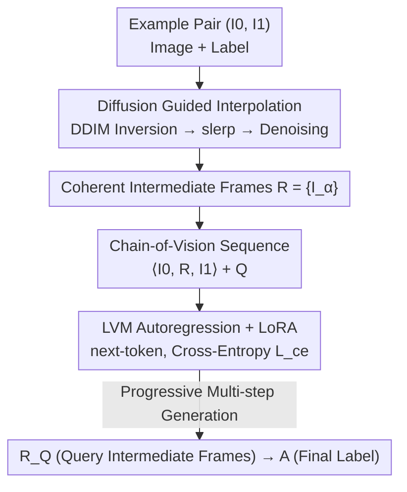

# Diffusion Guided Chain-of-Vision for Large Autoregressive Vision Models

**Conference**: CVPR 2026  
**Paper**: [CVF Open Access](https://openaccess.thecvf.com/content/CVPR2026/html/Wang_Diffusion_Guided_Chain-of-Vision_for_Large_Autoregressive_Vision_Models_CVPR_2026_paper.html)  
**Code**: https://github.com/wxy1006/CoV (Yes, marked as Code will be released)  
**Area**: Multimodal VLM  
**Keywords**: Chain-of-Vision, Visual In-context Learning, Autoregressive Vision Models, Diffusion-guided Interpolation, Multi-step Generation

## TL;DR
This paper transfers the Chain-of-Thought concept from language models to pure visual Large Autoregressive Models (LVM). By using a pre-trained diffusion model to generate a sequence of visually coherent intermediate frames in the image space as a "task-agnostic reasoning process" inserted into the input sequence, it transforms LVM downstream tasks (segmentation, depth, pose, etc.) from "single-step direct output" to "multi-step progressive generation," achieving stable performance gains across seven visual tasks and three model scales.

## Background & Motivation
**Background**: Pure visual autoregressive models represented by LVM quantize images into 256 tokens using VQGAN and perform next-token prediction. They rely on visual in-context learning (ICL) by concatenating "example image + example label + query image" in the input sequence, supporting multi-tasking through a unified interface without task-specific heads.

**Limitations of Prior Work**: This paradigm faces two major obstacles. First, performance is highly dependent on visual prompt engineering and example selection, with significant degradation under domain shift and high deployment costs (a common issue for methods like Chain-of-Focus and prompt selection). Second, while language models can explicitly output a CoT reasoning chain to decompose complex problems, pure visual autoregressive models only have a "input $\to$ output" single-step path, lacking standardized multi-step output channels for task decomposition.

**Key Challenge**: CoT is effective in LLMs because text naturally permits the writing of intermediate reasoning steps. However, the visual modality lacks inherent "intermediate steps," and more importantly, lacks a unified intermediate supervisory signal across different tasks—one cannot manually define a set of "intermediate reasoning images" for segmentation, depth, and pose tasks.

**Goal**: To equip pure visual models with an explicit, multi-step visual output channel that is task-free (a single mechanism adaptable to all tasks) without introducing any special tokens or task markers.

**Key Insight**: The authors observe that pre-trained diffusion models induce a reliable "probability flow" in image space. Intermediate images sampled along this flow demonstrate coherent visual transitions. Treating these intermediate images between "source image $\to$ target label" as a natural "chain-of-vision" supervision resolves the problem of "where intermediate steps come from."

**Core Idea**: Generate coherent intermediate frames between "input image $\to$ target label" using diffusion interpolation and insert them as a visual CoT into the autoregressive sequence. This enables the LVM to learn progressive multi-step generation, thereby reducing the perplexity of final label generation and improving downstream performance.

## Method

### Overall Architecture
The method addresses the lack of intermediate reasoning steps in pure visual models. The overall strategy is to **offline generate a sequence of intermediate frames for each image-label pair using a diffusion model $\to$ insert this sequence into the in-context visual sequence $\to$ allow the LVM to autoregressively generate both the intermediate frames and the final label using a standard next-token objective.**

Specifically, given an example pair $(I_0, I_1)$ (image and label), diffusion interpolation first generates intermediate frames $R=\{I_\alpha\}$. These are concatenated into an extended visual sentence $\langle I_0, R, I_1\rangle + Q$. The LVM (with a LoRA adapter) performs next-token prediction on this sequence, first generating the intermediate frames $R_Q$ for the query, followed by the final label $A$. The entire process requires no special delimiters and is learned via a unified cross-entropy next-token objective. The generation of intermediate frames and the sequence utilization are decoupled: the former is offline data construction on the diffusion side, and the latter is fine-tuning and inference on the LVM side.

### Key Designs

**1. Chain-of-Vision prompting: Inserting intermediate frames into visual sentences to turn single-step output into multi-step progression**

Targeting the limitation where pure visual autoregressive models only have an "input $\to$ output" single-step path. Standard visual ICL follows $\langle I_0, I_1\rangle + Q \to A$, where the model jumps directly from the query to the label. This paper explicitly inserts intermediate representations $R$ from the example pair into the sequence:

$$\langle I_0, R, I_1\rangle + Q \to R_Q + A,$$

requiring the model to not only generate the final label $A$ but also the intermediate steps $R_Q$ for the query itself. The joint distribution is decomposed autoregressively and optimized using the same next-token objective:

$$p(A, R_Q \mid Q;\ \langle I_0, R, I_1\rangle) = \prod_{t=T_0+1}^{T} p\big(v_t \mid v_{<t}, Q;\ \theta\big),$$

where $v_t$ contains tokens for both the intermediate representation $R_Q$ and the final label $A$. The brilliance of this design is that it **introduces no special tokens or task markers**—it fully utilizes the LVM's existing interface of "everything as a token sequence, unified via cross-entropy $L_{ce}$," making it naturally task-agnostic across segmentation, depth, and pose. The authors relate this to CoT in LLMs: intermediate steps provide a "reasoning scaffold," which significantly lowers the Perplexity (PPL) of final label generation (e.g., on a 7B model, multi-step supervision drops PPL from dozens to the teens).

**2. Diffusion Guided Interpolation: Using probability flow for "visually coherent" intermediate frames rather than pixel mixing**

CoV requires intermediate frames $R$. The simplest approach, RGB-space linear interpolation $r_\alpha = (1-\alpha)I_0 + \alpha I_1$, merely overlays two images, creating ghosting effects and failing to generate new content, serving as an unfaithful supervision signal. This paper instead leverages the highly structured latent space of a pre-trained diffusion model (Stable Diffusion v2.1) to sample along its probability flow. The process follows three steps:

1.  **DDIM Inversion**: Determinstically invert the source and target images into latent noise $z_T^0, z_T^1$. DDIM's deterministic dynamics ensure stable inversion and identity preservation.
2.  **Spherical Linear Interpolation (slerp)**: Perform slerp on the noise space to obtain intermediate noise:

$$z_T^\alpha = \frac{\sin\big((1-\alpha)\theta\big)}{\sin\theta}\, z_T^0 + \frac{\sin(\alpha\theta)}{\sin\theta}\, z_T^1,\qquad \theta = \arccos\frac{(z_T^0)^\top z_T^1}{\lVert z_T^0\rVert\,\lVert z_T^1\rVert}.$$

Slerp is used because diffusion noise approximately lies on a high-dimensional sphere; spherical interpolation maintains the norm and stays on the probability flow.

3.  **DDIM Denoising**: Perform DDIM denoising on $z_T^\alpha$ to generate the final intermediate image $I_\alpha$. Since the generation trajectory stays within the learned probability flow, the resulting frames are smooth, coherent, and structure-preserving.

Notably, **no classifier-free guidance or text conditioning** is used during inversion or denoising, relying purely on the diffusion prior. This makes it truly task-free. Compared to linear interpolation, it excels in structure-sensitive tasks (segmentation, pose, edge detection) by presenting a true multi-step refinement process.

### Loss & Training
A unified next-token cross-entropy $L_{ce}$ is used without task-specific losses. For the adaptation phase, LoRA (rank 32, alpha 64) fine-tuning is applied to LVM-300M / 1B / 7B, freezing the backbone to preserve generalization. The VQGAN tokenizer uses a downsampling factor of 16 and a codebook size of 8192, resulting in a 16×16 token grid for 256×256 images. AdamW + cosine scheduler, with a batch size of 172K tokens. 300M/1B models were trained for 50 epochs, and 7B for 20 epochs (taking ~12 hours on 32 H20 GPUs). 10,000 image-label pairs were sampled per task for interpolation; 50-step DDIM was used.

## Key Experimental Results

### Main Results
evaluated across seven visual tasks (segmentation, pose, colorization, surface normal, edge detection, depth, low-light enhancement) and three LVM scales. The table below highlights Segmentation (MS-COCO, IoU/P-ACC), Pose (LPIPS), Depth (A.Rel/S.Rel), and Low-light (PSNR). FT = LoRA fine-tuning, Diff. interp. = Diffusion guided interpolation.

| Model | Config | Seg IoU↑ | Seg P-ACC↑ | Pose LPIPS↓ | Depth A.Rel↓ | Low-light PSNR↑ |
|------|------|-----------|-------------|-------------|-------------|------------|
| LVM-300M | CoF [80] | 0.135 | 0.229 | 0.418 | - | - |
| LVM-300M | FT w/o interp. | 0.383 | 0.517 | 0.308 | 0.519 | 17.12 |
| LVM-300M | FT + Lin. interp. | 0.426 | 0.539 | 0.312 | 0.515 | 18.52 |
| LVM-300M | **FT + Diff. interp.** | **0.441** | **0.566** | **0.295** | **0.477** | **18.97** |
| LVM-1B | FT w/o interp. | 0.424 | 0.553 | 0.266 | 0.442 | 18.74 |
| LVM-1B | **FT + Diff. interp.** | **0.471** | **0.596** | **0.250** | **0.419** | **19.42** |
| LVM-7B | FT w/o interp. | 0.463 | 0.591 | 0.235 | 0.331 | 18.87 |
| LVM-7B | FT + Lin. interp. | 0.487 | 0.594 | 0.235 | 0.326 | 19.40 |
| LVM-7B | **FT + Diff. interp.** | **0.500** | **0.612** | **0.221** | **0.315** | **20.45** |

Three consistent conclusions: ① Multi-step supervision (any interpolation) is significantly better than direct fine-tuning; ② Diffusion interpolation consistently outperforms linear interpolation (winning all 14 metrics on 7B); ③ Performance scales positively with model size.

### Ablation Study
Fixed 7B, single-task fine-tuning, investigating **interpolation length** and **number of example pairs** (Seg IoU, Depth S.Rel).

| Dimension | Method | Setting | Seg IoU↑ | Depth S.Rel↓ |
|------|------|------|-----------|-------------|
| Length | LVM-7B Baseline | len 2 | 0.475 | 0.070 |
| Length | Lin. interp. | len 8 | 0.505 | 0.062 |
| Length | Diff. interp. | len 4 | 0.510 | 0.060 |
| Length | Diff. interp. | len 8 | **0.533** | **0.050** |
| Pairs | Lin. interp. | 3-pair | 0.515 | 0.054 |
| Pairs | Diff. interp. | 2-pair | 0.532 | 0.051 |
| Pairs | Diff. interp. | 3-pair | **0.540** | **0.049** |

### Key Findings
- **Higher Information Efficiency for Diffusion Interpolation**: Diffusion interpolation with length 4 (IoU 0.510) exceeds linear interpolation at length 8 (IoU 0.505). Similarly, 2 pairs with diffusion (IoU 0.532) outperform 3 pairs with linear (0.515), utilizing the context budget more effectively.
- **Smaller Models Benefit More**: On Depth S.Rel, diffusion interpolation reduced error by 0.021 for 300M and 0.023 for 1B, but only 0.009 for 7B. This suggests explicit multi-step supervision is a powerful way to "augment" small-capacity models.
- **Perplexity Perspective**: In MS-COCO segmentation, 3-step generation significantly lowers the target label PPL across all scales, explaining why multi-step generation makes the prediction distribution more certain.
- **Diminishing Returns**: Increasing length from 6 $\to$ 8 only reduced S.Rel by 0.004, indicating marginal utility beyond a certain length.

## Highlights & Insights
- **"Diffusion Probability Flow = Free Visual Reasoning Chain"**: The most significant insight is solving the lack of defined/supervised intermediate visual steps by using the probability flow of pre-trained diffusion models as ready-made, task-free supervision.
- **Zero-Intrusion Integration**: No new tokens or architectural changes are required; only LoRA is used. Changing the input sequence organization transforms "single-step" into "multi-step," making it highly reusable.
- **Slerp over Lerp**: Using spherical interpolation to preserve norms in high-dimensional noise space is a crucial detail that ensures the trajectory stays on the learned probability flow.
- **Information Efficiency Analysis**: Comparing short-chain vs. long-chain and fewer vs. more examples provides a more convincing argument for the method's superiority than raw peak performance alone.

## Limitations & Future Work
- **Dependency on Offline Diffusion Interpolation**: Generating 10,000 pairs per task with 50-step DDIM involves significant data construction overhead, and quality is capped by SD v2.1 priors.
- **Authenticity of Intermediate Frames**: The method assumes frames on the probability flow are "reasonable reasoning steps," but there is no direct semantic/quantitative evaluation of whether these frames match human intuition for problem-solving.
- **Diminishing Returns with Scaling**: The 7B results show narrower gains, leaving the value of this approach for much larger models an open question.
- **Fixed/Manual Hyperparameters**: The choice of $\alpha=0.33, 0.67$ and sequence length is still manual; adaptive chain lengths based on task difficulty could be explored.

## Related Work & Insights
- **vs Chain-of-Focus (CoF) [80]**: CoF uses "salient regions" for guidance but produces only a single output; CoV produces a true multi-step sequence that is task-free. CoF metrics (300M IoU 0.135) are far lower than the proposed method (0.441).
- **vs Linear Interpolation Baseline**: Pure RGB mixing causes ghosting, whereas diffusion interpolation maintains structural integrity—proving visual coherence is key to effective supervision.
- **vs Image Interpolation/Morphing (DiffMorpher, etc.)**: While prior works target generation quality, this paper uses interpolation as a means to supervise multi-step generation in downstream autoregressive models.
- **vs LLM CoT**: Bridges the gap by replacing natural language reasoning steps with diffusion probability flows.

## Rating
- Novelty: ⭐⭐⭐⭐⭐ Using diffusion probability flow as task-free visual CoT supervision elegantly solves the define-less intermediate step problem.
- Experimental Thoroughness: ⭐⭐⭐⭐ Solid results across seven tasks and three scales with comprehensive ablations, though lacking detailed analysis of data construction costs.
- Writing Quality: ⭐⭐⭐⭐ Clear framework and formulas; well-explained sequences and interpolation steps.
- Value: ⭐⭐⭐⭐ A zero-intrusion, reusable multi-step generation paradigm with clear benefits for medium/small LVMs.

<!-- RELATED:START -->

## Related Papers

- [\[CVPR 2026\] Beyond Layer-Wise Merging: Chain-of-Merging for Vision-Language Models](beyond_layer-wise_merging_chain-of-merging_for_vision-language_models.md)
- [\[CVPR 2026\] Language-guided Frequency Modulation for Large Vision-Language Models](language-guided_frequency_modulation_for_large_vision-language_models.md)
- [\[CVPR 2026\] AutoTraces: Autoregressive Trajectory Forecasting via Multimodal Large Language Models](autotraces_autoregressive_trajectory_forecasting_via_multimodal_large_language_m.md)
- [\[CVPR 2026\] LLaDA-V: Large Language Diffusion Models with Visual Instruction Tuning](llada-v_large_language_diffusion_models_with_visual_instruction_tuning.md)
- [\[CVPR 2026\] WeMMU: Enhanced Bridging of Vision-Language Models and Diffusion Models via Noisy Query Tokens](wemmu_enhanced_bridging_of_vision-language_models_and_diffusion_models_via_noisy.md)

<!-- RELATED:END -->
