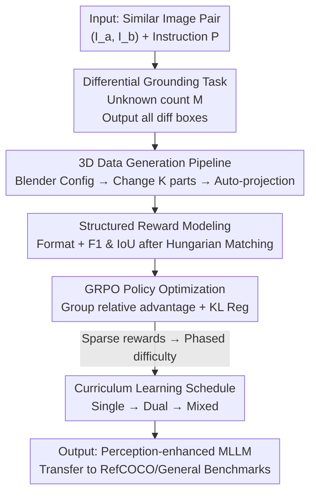

# DiG: Differential Grounding for Enhancing Fine-Grained Perception in Multimodal Large Language Models

**Conference**: CVPR 2026  
**Paper**: [CVF Open Access](https://openaccess.thecvf.com/content/CVPR2026/html/Tao_DiG_Differential_Grounding_for_Enhancing_Fine_Grained_Perception_in_Multimodal_Large_CVPR_2026_paper.html)  
**Code**: To be confirmed  
**Area**: Multimodal VLM  
**Keywords**: Fine-grained perception, differential grounding, proxy task, reinforcement learning GRPO, curriculum learning  

## TL;DR
This paper proposes **Differential Grounding (DiG)** as a proxy task—giving the model two highly similar images and requiring it to localize all differences using bounding boxes without knowing the total count. Combined with Blender-automated data generation, GRPO reinforcement learning, and curriculum learning, the fine-grained visual perception of Qwen3-VL is significantly enhanced and successfully transfers to downstream grounding tasks like RefCOCO and general multimodal benchmarks.

## Background & Motivation
**Background**: Multimodal Large Language Models (MLLMs) have achieved high performance in "global scene understanding" tasks such as image captioning and VQA, effectively aligning global visual semantics with textual reasoning.

**Limitations of Prior Work**: MLLMs remain weak in **fine-grained visual perception** and **precise spatial reasoning**. SOTA models frequently overlook small object additions/deletions, subtle color shifts, or missing elements. The root cause is that the pre-training paradigm provides supervision for high-level semantic alignment but lacks the fine-grained signals necessary to cultivate sensitivity to details.

**Key Challenge**: Applying reinforcement learning (RL) post-training to address this weakness faces significant hurdles. Fine-tuning directly on visual grounding (e.g., RefCOCO) often leads to overfitting and degraded generalization. Existing proxy tasks, such as jigsaw puzzles or hallucination detection, are not specifically designed for fine-grained perception and fail to foster sufficient sensitivity to visual details.

**Goal**: To identify a proxy task that precisely reinforces fine-grained perception, allows for large-scale automatic generation and verification, and does not compromise generalization.

**Key Insight**: Distinguishing differences between two similar images requires an object-by-object fine-grained comparison. This "spot-the-difference" process naturally forces attention onto local details. The authors formalize this as a verifiable grounding problem: localizing all differential regions.

## Method

### Overall Architecture
DiG consists of four components: first, formalizing "differential grounding" as a task (inputting two similar images + instructions to output all difference boxes); second, using a Blender 3D rendering pipeline for **automated** generation of image pairs with "controlled differences and perfect labels"; third, performing reinforcement post-training using three structured rewards and GRPO; and finally, using curriculum learning to gradually increase task difficulty from "1 difference" to "multiple mixed differences" to resolve optimization challenges caused by sparse rewards in the early stages. The entire pipeline requires no manual annotation, relying solely on the renderer for ground-truth.

### Key Designs

**1. Differential Grounding Task (DiG): Forcing Region-by-Region Comparison**

**Core Idea**: Addressing the lack of detail sensitivity caused by high-level semantic supervision in pre-training. The task is defined as: given a tuple $X=(I_a, I_b, P)$, where $I_a$ is the reference and $I_b$ is a similar image with $M$ subtle changes, the instruction $P$ requires localizing all differences. The model outputs a sequence $O=(o_1,\dots,o_T)$, parsed into a set of predicted boxes $B_{pred}=\{b_i\}_{i=1}^N$, where $b_i=[x_{min},y_{min},x_{max},y_{max}]$. The ground-truth is $B_{gt}=\{b^{gt}_j\}_{j=1}^M$. Crucially, **the model is not told the value of $M$**, forcing it to infer the number of differences through exhaustive object-by-object and attribute-by-attribute comparison.

**2. 3D Rendering Data Pipeline: Automated Grounding with Perfect Labels**

**Design Motivation**: Standard grounding datasets like RefCOCO are expensive to label and limited in diversity. The Blender-based pipeline programmatically generates base 3D scenes (specifying object shapes, materials, colors, sizes, and positions) to render $I_a$. Then, it samples $K$ from $[1,N]$, selects $K$ objects, and applies random attribute changes (shape/color/size/material or add/delete) to render $I_b$. This ensures $(I_a, I_b)$ are visually coherent except for $K$ localized regions. **Labels are automatic and perfect**, as 2D projection boxes are read directly from the 3D renderer.

**3. Structured Rewards + Hungarian Matching: Stable Optimization for Generative MLLMs**

**Mechanism**: To handle open-ended text outputs and the correspondence problem between multiple predicted and ground-truth boxes, three reward components are used. **Format reward** $r_{format}$ is a binary constraint enforcing machine-readable list outputs. **Accuracy reward** $r_{acc}$ uses the **Hungarian algorithm** for one-to-one bipartite matching between $B_{pred}$ and $B_{gt}$ based on L1 distance and GIoU. After matching, it computes a detection-level F1 score (measuring "completeness" via precision $p=n_m/N$ and recall $r=n_m/M$) and mean IoU (measuring "localization precision"):

$$r_{acc} = \lambda_1 F_1 + \lambda_2 \text{IoU}$$

The total reward integrates these signals:

$$r = (1-\alpha)\,r_{acc} + \alpha\,r_{format}$$

Bipartite matching ensures stable gradient feedback, preventing the model from being rewarded for high IoU on only a subset of objects.

**4. GRPO Policy Optimization: Group-Relative Multi-modal Generation**

The policy $\pi_\theta$ is optimized using Group Relative Policy Optimization. For each input, $G$ candidate responses $\{O^{(g)}\}$ are sampled and scored. The group-relative advantage is calculated as:

$$A_g = \frac{r_g - \text{mean}(\{r_i\})}{\text{std}(\{r_i\})}$$

This advantage is applied to each token in $O^{(g)}$ with a clipped surrogate objective and a KL divergence penalty $\beta\,D_{KL}(\pi_\theta\|\pi_{ref})$ to prevent the policy from collapsing.

**5. Curriculum Learning Schedule: Overcoming Sparse Rewards**

**Mechanism**: Addressing the **reward sparsity** where models initially fail to localize any differences correctly, leading to near-zero rewards. Training is divided into stages: starting with **single-difference** samples to establish the mapping between visual perturbations and box predictions, then moving to **dual-difference** samples for compositional reasoning, and finally to **mixed-difference** samples without providing the count $M$ to maximize the perception limit.

### Loss & Training
The training corpus includes approximately 4.8K image pairs (1.6K each for single/dual/mixed differences). Qwen3-VL-8B-Thinking and Qwen3-VL-4B-Thinking serve as backbones. Models are trained using the EasyR1 framework with GRPO and KL regularization following the difficulty curriculum.

## Key Experimental Results

### Main Results

Perception Benchmarks (HalBench / HRB8K / POPE / V* / VSR / CV-Bench / MMVP, Average AVG):

| Model | HalBench | V* | VSR | MMVP | AVG |
|------|----------|-----|------|------|-----|
| Qwen3-VL-4B-Thinking | 70.1 | 79.1 | 82.5 | 80.0 | 78.9 |
| + DiG (Ours 4B) | 73.8 (↑3.8) | 79.1 | 83.9 (↑1.4) | 79.0 (↓1.0) | 79.9 (↑1.0) |
| Qwen3-VL-8B-Thinking | 73.3 | 79.1 | 82.6 | 77.3 | 79.3 |
| + DiG (Ours 8B) | 76.7 (↑3.4) | 81.2 (↑2.1) | 83.0 (↑0.4) | 78.7 (↑1.4) | 80.5 (↑1.2) |

General Multimodal Benchmarks (Transferability):

| Model | MMBench | MMStar | SQA_I | MME | AI2D |
|------|---------|--------|-------|------|------|
| Qwen3-VL (4B) | 83.7 | 66.7 | 86.9 | 1592.4 | 81.0 |
| + DiG (Ours 4B) | 84.5 (↑0.8) | 70.2 (↑3.5) | 89.2 (↑2.3) | 1643.4 (↑51.0) | 82.2 (↑1.2) |
| Qwen3-VL (8B) | 85.5 | 71.7 | 90.3 | 1648.4 | 82.5 |
| + DiG (Ours 8B) | 87.2 (↑2.2) | 72.7 (↑1.0) | 90.5 (↑0.2) | 1665.9 (↑17.5) | 84.1 (↑1.6) |

Ours (8B) achieved an average gain of 2–3 points on grounding benchmarks (RefCOCO/+/g), showing that "spot-the-difference" training transfers directly to referring expression comprehension.

### Ablation Study

Reward Component Ablation (Tab.4):

| Format | IoU | F1 | RefCOCO val@50 | HalBench | MMB | AI2D | Note |
|--------|-----|-----|----------------|----------|------|------|------|
| ✓ | ✗ | ✗ | – | – | – | – | Format only; fails to learn localization |
| ✓ | ✓ | ✗ | 84.2 | 70.8 | 83.2 | 81.7 | IoU only: high overlap but misses objects |
| ✓ | ✗ | ✓ | 87.8 | 72.8 | 84.4 | 82.1 | F1 only: better detection, spatially unstable |
| ✓ | ✓ | ✓ | **88.6** | **73.8** | **84.5** | **82.2** | Full: Complementary detection & spatial precision |

### Key Findings
- **F1 is more critical than IoU in rewards**: Training only with IoU allows the model to miss differences while maintaining high overlap on detected ones.
- **Curriculum stages are cumulative**: Each stage (Single → Dual → Mixed) progressively improves performance, proving that starting easy is essential for stabilizing RL with sparse rewards.
- **Small models can outperform larger ones**: The 4B/8B models with DiG converge to or exceed the performance of larger proprietary systems on several benchmarks.

## Highlights & Insights
- **"Unknown difference count" is the key**: Formalizing "spot-the-difference" as an open-inference task forces exhaustive region-by-region comparison, effectively pushing the limits of fine-grained perception.
- **3D Rendering = Perfect Labels + Difficulty Scaling**: Rendering provides a "controlled and verifiable" data paradigm that eliminates manual labeling costs while allowing precise control over task difficulty.
- **Hungarian Matching bridges RL and Generative Grounding**: Using bipartite matching for F1/IoU rewards provides stable gradients for multi-object detection in generative models.

## Limitations & Future Work
- Training data is limited to Blender-synthesized geometric scenes (CLEVR-style), creating a domain gap with natural images.
- The scale of the corpus (4.8K pairs) and the maximum number of differences (4) are relatively small; scaling behavior remains a topic for further study.
- Slight regressions on specific benchmarks (e.g., 4B on MMVP) suggest that differential grounding might have negative transfer effects on certain sub-tasks.
- Future work could involve using diffusion-based editing to generate difference pairs on real images to bridge the domain gap.

## Related Work & Insights
- **vs Perception-R1**: While both use RL for grounding, Perception-R1 relies on traditional grounding tasks and labels. DiG uses an automated proxy task that is scalable and offers better generalization.
- **vs RefCOCO Fine-tuning**: Direct fine-tuning on RefCOCO is constrained by labeling costs and prone to task-specific overfitting. In contrast, DiG enhances the underlying perceptual ability which then transfers to RefCOCO.

## Rating
- **Novelty**: ⭐⭐⭐⭐⭐ (The "spot-the-difference" proxy task with unknown counts is an elegant solution for fine-grained perception)
- **Experimental Thoroughness**: ⭐⭐⭐⭐ (Extensive benchmark coverage and ablations, though synthetic data scale is small)
- **Writing Quality**: ⭐⭐⭐⭐ (Clear logic from motivation to reward design)
- **Value**: ⭐⭐⭐⭐ (Provides a low-cost, verifiable post-training paradigm for perception)

<!-- RELATED:START -->

...

## Related Papers

- [\[CVPR 2026\] OddGridBench: Exposing the Lack of Fine-Grained Visual Discrepancy Sensitivity in Multimodal Large Language Models](oddgridbench_exposing_the_lack_of_fine-grained_visual_discrepancy_sensitivity_in.md)
- [\[CVPR 2026\] CropVLM: Learning to Zoom for Fine-Grained Vision-Language Perception](cropvlm_learning_to_zoom_for_fine_grained_vision_language_perception.md)
- [\[CVPR 2026\] Grounding Everything in Tokens for Multimodal Large Language Models](grounding_everything_in_tokens_for_multimodal_large_language_models.md)
- [\[CVPR 2026\] Same or Not? Enhancing Visual Perception in Vision-Language Models](same_or_not_enhancing_visual_perception_in_vision-language_models.md)
- [\[CVPR 2026\] Fine-Grained Post-Training Quantization for Large Vision Language Models with Quantization-Aware Integrated Gradients](fine-grained_post-training_quantization_for_large_vision_language_models_with_qu.md)

<!-- RELATED:END -->
