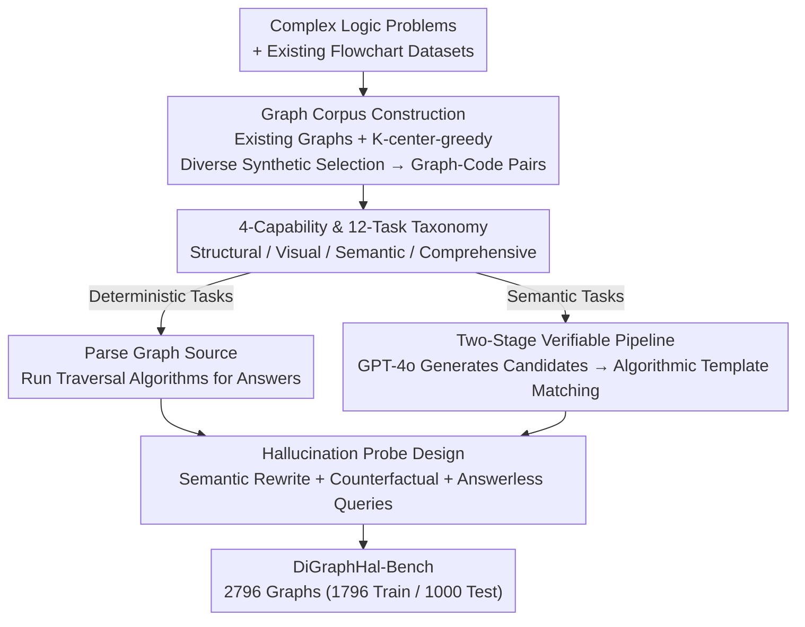
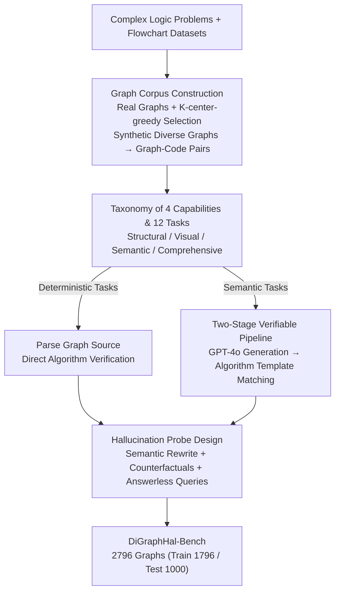

# DiGraphHal-Bench: Evaluating Multimodal Large Language Models on Complex Directed Graphs

**Conference**: CVPR 2026  
**Paper**: [CVF Open Access](https://openaccess.thecvf.com/content/CVPR2026/html/Fan_DiGraphHal-Bench_Evaluating_Multimodal_Large_Language_Models_on_Complex_Directed_Graphs_CVPR_2026_paper.html)  
**Code**: https://github.com/DouziLBean/DiGraphHal-Bench (Yes)  
**Area**: Multimodal VLM  
**Keywords**: MLLM hallucination, directed graph understanding, VQA benchmark, fine-grained reasoning, automatically verifiable construction

## TL;DR
DiGraphHal-Bench is the first large-scale VQA benchmark specifically for "complex directed graphs." It systematically evaluates MLLM hallucinations and compositional reasoning across 2,796 real flowcharts via four capability dimensions and 12 fine-grained tasks. By employing a two-stage pipeline of "LLM generation + algorithmic deterministic verification," it ensures both scale and reliability without manual annotation. Results indicate that even frontier models like GPT-5 and Gemini 2.5 frequently hallucinate during graph structural reasoning; while SFT provides some relief, the core challenge remains largely unresolved.

## Background & Motivation
**Background**: Research into MLLM hallucinations has predominantly focused on natural images, analyzing cross-modal inconsistencies such as "whether an object exists in the image." Existing graph understanding benchmarks either rely on synthetic graphs (GITA, VisionGraph, VGA) that test only pure topology (e.g., shortest paths, cycle detection) while lacking semantic and visual complexity, or utilize real-world graphs (FlowVQA, FlowCE, MindBench) that are either small in scale or introduce biases through LLM-based scoring.

**Limitations of Prior Work**: Directed graphs serve as the "visual language" for workflows and logical processes in engineering, biology, and medicine. Misinterpreting a single edge can lead to critical failures. However, graph understanding requires models to reason **simultaneously** across three levels: topological structure, visual layout, and semantic content. Current benchmarks fail to evaluate these three aspects in a unified manner, and there is no systematic study on how hallucinations emerge from their interaction.

**Key Challenge**: Benchmark construction faces a long-standing "scale $\leftrightarrow$ quality" dilemma. Large-scale datasets often rely on LLMs for automated QA generation, but the resulting answers are untrustworthy and inherit model biases. Conversely, high-quality human annotation is difficult to scale. FlowVQA utilizes GPT-4o for generation and scoring, achieving scale but introducing bias, while FlowCE is reliable but limited to a few hundred images.

**Goal**: ① Construct a large-scale directed graph benchmark that is both semantically rich and structurally faithful; ② Ensure QA answers remain credible at scale (independent of manual labeling or LLM scoring); ③ Decompose graph understanding into diagnostic fine-grained capabilities to pinpoint where MLLMs fail.

**Key Insight**: The authors observe that "graph tasks with deterministic answers" can be **verified algorithmically**. Given the source code of a graph (Mermaid/Graphviz), finding paths, detecting cycles, or comparing structural differences are deterministic graph traversal problems where answers can be computed by a program rather than predicted by a model. This allows for the decoupling of "LLM-based diverse question generation" from "algorithm-based deterministic answer verification."

**Core Idea**: A "template-guided LLM generation + deterministic algorithm verification" two-stage pipeline is used to bypass the scale-quality dilemma. This is coupled with a fine-grained taxonomy of four capabilities and 12 tasks to conduct the first unified evaluation of hallucinations and compositional reasoning in MLLMs on directed graphs.

## Method

### Overall Architecture
DiGraphHal-Bench is not a model but a **benchmark and construction pipeline**. The pipeline consists of two phases: first, constructing a graph corpus across six professional domains with graph-code pairs (each image paired with Mermaid and Graphviz source code); then, generating VQA pairs at scale based on a taxonomy of four capabilities and 12 tasks. Generation is branched by task nature: **Deterministic tasks** (pathfinding, cycle detection, structural difference comparison) directly parse the source code and run traversal algorithms to produce ground truth. **Semantic tasks** (natural language queries) follow a two-stage pipeline—GPT-4o generates diverse candidate questions, which are then algorithmically mapped back to "logical templates" to compute standard answers; candidates that fail to match are discarded. This results in 2,796 graphs (1,796 training / 1,000 testing) with zero manual annotation. The evaluation involves 13 open- and closed-source MLLMs, including an SFT ablation on Qwen2.5-VL-7B.

### Key Designs

**1. Fine-grained Taxonomy of 4 Capabilities and 12 Tasks: Decomposing Graph Comprehension**

The benchmark is structured as a four-level capability tree: three **Foundational Capabilities** (Structural, Visual, Semantic) and one **Comprehensive Capability**, totaling 12 fine-grained tasks. Structural tasks test topology: Graph Parsing (enumerating nodes/edges), Graph2Code (translating images to Mermaid/Graphviz), and Masked Subpath Query (similar to masked language modeling, filling in subpaths based on structural constraints). Visual tasks focus on non-trivial layouts: Edge Layout Perception (long, backflow, or crossing edges), Local Structure Comparison, Elements Localization (bounding boxes or 8-directional relative positions), Spatial Position Awareness (locating subgraphs in large canvases, including $5\times$ thumbnails for scale invariance), and Visual Attributes Perception (identifying nodes/edges by shape, color, or border style). Semantic tasks use Semantic Query vs. Semantic-Rewrite Query (synonym rewriting, shuffling wordings) to distinguish true semantic understanding from simple keyword matching. Comprehensive tasks combine all three levels, categorized into Non-Semantic (What/Which/How), Semantic, and Semantic-Rewrite levels of increasing linguistic ambiguity.

**2. Two-Stage Verifiable Construction Pipeline: Bypassing the Scale-Quality Dilemma**

This is the core contribution, addressing the unreliability of LLM generation and the non-scalability of manual labeling. Tasks are branched by answer determinism: For **deterministic tasks** like pathfinding, the LLM is not involved in generating answers; instead, source code is parsed and traversal algorithms generate the ground truth. For **semantic tasks** requiring natural language: **Stage 1 (LLM Construction)** uses GPT-4o guided by "masked subpath queries" and "semi-structured templates" to generate diverse candidate questions. **Stage 2 (Algorithmic Verification)** performs a two-step verification: first, it algorithmically maps each candidate question back to its source logical template (requiring a strict one-to-one match); second, it executes the algorithm corresponding to that template to compute the ground truth. This ensures LLMs provide diversity while algorithms guarantee factual correctness.

**3. Graph Corpus Construction: Real-world Graphs + Diversity-driven Synthetic Graphs**

To ensure both authenticity and structural diversity, the corpus utilizes two sources. First, **integrating existing datasets**: flowcharts are collected from FlowVQA (tutorials, code snippets) and BigDocs (random layouts) to mitigate "directional bias" (where models assume top-to-bottom flow). Second, **generating synthetic graphs for complex logic**: starting from complex problems (mathematical proofs, system workflows), a **K-center-greedy algorithm** selects a diverse subset of topics. LLMs then transcribe these into Mermaid and Graphviz source code. Crucially, every graph exists as a **graph-code pair**, enabling the algorithmic verification defined in Design 2.

**4. Hallucination Probe Design: Semantic Rewrite, Counterfactuals, and Answerless Queries**

The benchmark includes "anti-hallucination traps." First, **Semantic-Rewrite**: questions are synonymously rewritten to preserve meaning but change surface wording, forcing the model to perform true semantic grounding rather than keyword matching—this caused a systematic drop in performance across all models. Second, **counterfactual and answerless samples** are injected into Non-Semantic tasks to test if models fabricate answers for structures that do not exist in the graph. Third, **explicit visual-semantic binding** (e.g., "red node = emergency") tests whether models can align perceived visual attributes with assigned meanings, assessing their ability to ground "what they see" to "what it means."

## Key Experimental Results

### Main Results
The evaluation covers 13 MLLMs, including closed-source (GPT-4o, o3, GPT-5, Claude Sonnet 4.5, Gemini 2.5 Pro), large/medium open-source (GLM-4.5V, Qwen2.5-VL-72B, LLaVA-OV-72B), and small open-source (Qwen2.5-VL-7B, LLaVA-OV-7B, InternVL3.5-8B).

| Capability / Sub-task | Metric | GPT-5 | Gemini 2.5 | o3 | Qwen2.5-VL-7B |
|------|------|------|------|------|------|
| Structural·Graph Parsing (Full) | F1 | 96.00 | 97.89 | 95.48 | 86.90 |
| Structural·Masked SM-CP (Comp. Path) | F1 | 84.51 | 83.43 | 73.95 | 13.19 |
| Visual·Crossing Edges | F1 | 23.42 | 48.20 | 12.42 | 0.62 |
| Visual·Absolute Loc. Acc@0.5 | Acc | 7.58 | 9.18 | 7.38 | 0.23 |
| Visual·Edge Attributes | F1 | 78.65 | 88.43 | 73.61 | 27.54 |
| Semantic·Semantic Query | F1 | 76.37 | 75.94 | 71.63 | 37.72 |
| Comp.·Sem-Rewrite Path | F1 | 62.07 | 72.86 | 50.01 | 16.03 |

**Observation**: While most models excel at **basic recognition (Graph Parsing)**, performance collapses during fine-grained reasoning (masked completion, crossing edges, absolute localization). Even frontier models fail to meet basic reliability standards in these areas.

### Ablation Study (Qwen2.5-VL-7B Comprehensive Capability, F1, gain over Base in parentheses)
The authors trained five SFT variations: four specialists (one for each capability) and one curriculum-based model (Structural $\rightarrow$ Visual $\rightarrow$ Semantic $\rightarrow$ Comprehensive).

| Training Config | Non-Sem·Element | Non-Sem·Path | Sem·Element | Sem-Rewrite·Element |
|------|------|------|------|------|
| Base | 13.77 | 15.99 | 16.98 | 12.00 |
| Structural Specialist | 29.56 (+15.79) | 25.49 (+9.50) | 27.03 (+10.05) | 17.60 (+5.60) |
| Visual Specialist | 27.14 (+13.37) | 15.46 (−0.53) | 31.54 (+14.56) | 22.46 (+10.46) |
| Semantic Specialist | 12.47 (−1.30) | 19.81 (+3.82) | 17.39 (+0.41) | 10.90 (−1.10) |
| Comprehensive Specialist | 53.41 (+39.64) | 28.65 (+12.66) | 55.09 (+38.11) | 36.06 (+24.06) |
| Curriculum | 51.67 (+37.90) | 23.86 (+7.87) | 47.53 (+30.55) | 36.31 (+24.31) |

### Key Findings
- **"Edge blindness"**: Models identify node attributes well (Gemini node F1 89.88%), but edge attributes are consistently poor. This suggests MLLMs have a perceptual bias toward closed, prominent shapes (nodes) while being "blind" to thin, connector-like structures (edges).
- **Lack of Scale Invariance**: While relative position reasoning is decent (GPT-5 81.79%), absolute bounding box localization is abysmal across all models (below 10% Acc@0.5), especially on $5\times$ thumbnails.
- **Surface Matching over True Semantics**: All models suffer significant drops when the query is rewritten (Sem-Rewrite), proving they still rely on shallow keyword matching. *Note: GPT-5/o3 unexpectedly performed better on some Sem-Rewrite tasks, possibly due to semantic perturbation activating deeper generalized reasoning.*
- **Foundational Capabilities Drive Comprehensive Reasoning**: Structural SFT improved nearly all comprehensive tasks. However, Semantic-only training **harmed** element-centric reasoning (−1.30) by over-fitting to linguistic cues at the expense of visual-structural grounding. Curriculum learning suffered from **catastrophic forgetting**, performing worse than direct comprehensive training.

## Highlights & Insights
- **Decoupling LLM generation and algorithmic verification** is a highly transferable paradigm for any benchmark where ground truth can be derived from structured sources (e.g., code, tables, KGs).
- **Graph-code pairing** is the essential foundation: retaining executable symbolic representations is significantly more valuable than storing images alone for verifiable vision-language tasks.
- **Fine-grained taxonomy makes hallucinations "localizable"**: The benchmark provides diagnostic value by specifying exactly where a model fails (e.g., crossing edges vs. semantic rewriting).
- **"Edge blindness"** is a clean, reproducible discovery of a common defect in MLLM visual encoders.

## Limitations & Future Work
- **Synthetic graph dependency**: New synthetic data relies on LLMs to generate Mermaid/Graphviz code; while the logic is verifiable, the diversity of the transcription itself is not fully quantified.
- **SFT Backbone Bias**: SFT results are limited to Qwen2.5-VL-7B; findings like "curriculum forgetting" may vary with model scale.
- **Cross-task comparison**: Performance varies wildly across task types (high parsing vs. low localization), making direct horizontal score comparisons difficult.
- **Future Directions**: Improving visual encoders for thin structures, introducing explicit coordinate grounding for localization, and developing better scheduling to avoid catastrophic forgetting in curriculum learning.

## Related Work & Insights
- **vs. Synthetic Benchmarks (GITA / VisionGraph / VGA)**: These focus on pure topology in non-semantic graphs; Ours combines structure, vision, and semantics in unified real-world scenarios.
- **vs. Semantic Graph Benchmarks (VGCURE)**: VGCURE uses anonymous labels to avoid domain semantics; Ours explicitly binds visual attributes to meanings.
- **vs. Process Graph Benchmarks (FlowVQA / FlowCE)**: Ours resolves the scale-quality dilemma by replacing biased LLM-as-judge scoring with deterministic algorithmic verification while maintaining large-scale real-world complexity.

## Rating
- **Novelty**: ⭐⭐⭐⭐⭐ First unified VQA benchmark for complex directed graph hallucinations with a robust decoupling of generation and verification.
- **Experimental Thoroughness**: ⭐⭐⭐⭐⭐ Comprehensive evaluation across 13 models and 5 SFT variants with ability-level diagnostics.
- **Writing Quality**: ⭐⭐⭐⭐ The taxonomy and findings are clear, although dense tables and numerous sub-task abbreviations require careful attention.
- **Value**: ⭐⭐⭐⭐⭐ Exposes systemic flaws in MLLM graph understanding and provides a verifiable, reproducible foundation for future robust graph understanding research.
---system
SPECIAL INSTRUCTION: think silently. Silent thinking token budget: 8192 tokens.---
# DiGraphHal-Bench: Evaluating Multimodal Large Language Models on Complex Directed Graphs

**Conference**: CVPR 2026  
**Paper**: [CVF Open Access](https://openaccess.thecvf.com/content/CVPR2026/html/Fan_DiGraphHal-Bench_Evaluating_Multimodal_Large_Language_Models_on_Complex_Directed_Graphs_CVPR_2026_paper.html)  
**Code**: https://github.com/DouziLBean/DiGraphHal-Bench (Available)  
**Area**: Multimodal VLM  
**Keywords**: MLLM Hallucination, Directed Graph Understanding, VQA Benchmark, Fine-grained Reasoning, Automatically Verifiable Construction

## TL;DR
DiGraphHal-Bench is the first large-scale VQA benchmark targeting "complex directed graphs," systematically evaluating MLLM hallucinations and compositional reasoning across 2,796 real flowcharts through four capabilities and 12 fine-grained tasks. By leveraging a two-stage pipeline of "LLM generation + algorithmic deterministic verification," it achieves both scale and credibility with zero manual annotation. Results demonstrate that even frontier models like GPT-5/Gemini 2.5 frequently hallucinate on graph structural reasoning; while SFT mitigates this, it remains far from solved.

## Background & Motivation
**Background**: Research on MLLM hallucinations has focused almost exclusively on natural images—analyzing cross-modal inconsistencies such as "whether an object exists in the scene." Concurrently, graph understanding benchmarks either utilize synthetic graphs (GITA, VisionGraph, VGA) that test only pure topology (e.g., shortest paths/cycle detection) while lacking semantic and visual complexity, or utilize real graph benchmarks (FlowVQA, FlowCE, MindBench) that are either small in scale or introduce bias via LLM scoring.

**Limitations of Prior Work**: Directed graphs serve as the "visual language" of workflows and logical processes in engineering, biology, and medicine. Misinterpreting even a single edge can lead to critical failures. However, graph understanding requires models to reason across topological structure, visual layout, and semantic content **simultaneously**. Existing benchmarks lack a unified evaluation of these three dimensions and have not systematically studied how hallucinations emerge from their interaction.

**Key Challenge**: Benchmark construction faces a long-standing "scale $\leftrightarrow$ quality" dilemma: large-scale construction requires automated QA generation by LLMs, which is untrustworthy and inherits model biases; high-quality construction requires manual annotation, which cannot scale.

**Goal**: ① Construct a large-scale directed graph benchmark that is both semantically rich and structurally faithful; ② Ensure QA answer credibility at scale without manual labeling or LLM scoring; ③ Decompose graph understanding into diagnosable fine-grained capabilities to locate specific MLLM failure modes.

**Key Insight**: The authors discovered that "graph tasks with deterministic answers" can be **verified by algorithms**. Given the graph source code (Mermaid/Graphviz), operations like finding paths, identifying cycles, or comparing structural differences are deterministic graph traversal problems. Thus, standard answers can be programmatically derived rather than guessed by a model. This allows for the decoupling of "diverse question generation" (by LLMs) and "ground-truth answer derivation" (by algorithms).

**Core Idea**: A two-stage pipeline of "template-guided LLM generation + deterministic algorithm verification" is used to bypass the scale-quality dilemma, paired with a taxonomy of four capabilities and 12 tasks for the first unified evaluation of hallucinations and compositional reasoning on directed graphs.

## Method

### Overall Architecture
DiGraphHal-Bench is not merely a model but a **benchmark and construction pipeline**. The pipeline begins by building a graph corpus with paired graph-code data across six professional domains. Then, VQA pairs are generated based on the task taxonomy. For tasks with deterministic answers (e.g., pathfinding, cycle detection), standard answers are derived by parsing graph source code and running traversal algorithms. For semantic tasks (natural language questions), a two-stage pipeline is used: GPT-4o generates diverse candidate questions, and an algorithm maps these candidates back to "logical templates" to compute standard answers, discarding any non-matches. The final benchmark contains 2,796 graphs (1,796 for training, 1,000 for testing).

### Key Designs

**1. Taxonomy of 4 Capabilities and 12 Tasks: Decomposing "Graph Reading" into Diagnosable Problems**

The benchmark uses a four-level capability tree: three **Foundational Capabilities** (Structural, Visual, Semantic) and one **Comprehensive Capability**. Structural tasks evaluate topology (e.g., Graph Parsing, Graph2Code, Masked Subpath Query). Visual tasks focus on non-trivial layouts (e.g., Edge Layout Perception, Localization, Visual Attribute Perception). Semantic tasks distinguish between "true semantics" and "keyword matching" using Semantic Query vs. Semantic-Rewrite Query. The comprehensive tasks combine all three levels to test integrated reasoning.

**2. Two-Stage Verifiable Pipeline: Bypassing the "Scale-Quality" Dilemma**

The core contribution is the decoupling of question generation from answer derivation. For **deterministic tasks**, algorithms derive the ground truth directly from source code. For **semantic tasks**, **Stage 1 (LLM Construction)** uses GPT-4o to generate diverse candidate questions based on logical foundations. **Stage 2 (Algorithm Verification)** then maps questions back to their logical templates and executes algorithms to derive the standard answer. This avoids model bias inherent in "LLM-as-judge" approaches.

**3. Graph Corpus Construction: Combining Real and Synthetic Data**

The corpus integrates real-world flowcharts from existing datasets like FlowVQA and BigDocs while supplementing them with **synthetic graphs** to cover complex logic (e.g., mathematical proofs, system workflows). A **K-center-greedy algorithm** is used to select a diverse subset of topics. Crucially, every graph exists in a **graph-code pair**, allowing traversal algorithms to define ground truth.

**4. Hallucination Probe Design: Semantic Rewrite, Counterfactuals, and Answerless Queries**

Specific "traps" are designed to trigger hallucinations. **Semantic-Rewrite** changes wording while preserving meaning to test semantic grounding. **Counterfactuals and answerless queries** test whether models will "hallucinate" an answer when no logical solution exists in the graph. **Visual-Semantic Binding** tests whether models can align visual attributes (e.g., "red node = emergency") with their assigned logical meanings.

## Key Experimental Results

### Main Results
The evaluation spans 13 MLLMs. Key metrics (F1 score, averaged across Mermaid/Graphviz) are summarized below:

| Capability / Sub-task | Metric | GPT-5 | Gemini 2.5 | o3 | Qwen2.5-VL-7B |
| :--- | :--- | :--- | :--- | :--- | :--- |
| Structural·Graph Parsing (Full) | F1 | 96.00 | 97.89 | 95.48 | 86.90 |
| Structural·Masked Path (Complex) | F1 | 84.51 | 83.43 | 73.95 | 13.19 |
| Visual·Crossing Edge Perception | F1 | 23.42 | 48.20 | 12.42 | 0.62 |
| Visual·Absolute Localization | Acc@0.5 | 7.58 | 9.18 | 7.38 | 0.23 |
| Visual·Edge Attributes | F1 | 78.65 | 88.43 | 73.61 | 27.54 |
| Semantic·Semantic Query | F1 | 76.37 | 75.94 | 71.63 | 37.72 |
| Comp.·Sem-Rewrite Path | F1 | 62.07 | 72.86 | 50.01 | 16.03 |

**Observation**: Models perform well on basic identification (Graph Parsing) but fail significantly on fine-grained reasoning (e.g., crossing edges and absolute localization).

### Ablation Study (Qwen2.5-VL-7B Comprehensive Task, F1 score)
The study trained specialist models for specific capabilities and a curriculum-based model (Structural $\rightarrow$ Visual $\rightarrow$ Semantic $\rightarrow$ Comprehensive).

| Training Config | Non-Sem·Element | Non-Sem·Path | Sem·Element | Sem-Rewrite·Element |
| :--- | :--- | :--- | :--- | :--- |
| Base | 13.77 | 15.99 | 16.98 | 12.00 |
| Structural Specialist | 29.56 (+15.79) | 25.49 (+9.50) | 27.03 (+10.05) | 17.60 (+5.60) |
| Visual Specialist | 27.14 (+13.37) | 15.46 (-0.53) | 31.54 (+14.56) | 22.46 (+10.46) |
| Semantic Specialist | 12.47 (-1.30) | 19.81 (+3.82) | 17.39 (+0.41) | 10.90 (-1.10) |
| Comprehensive Specialist | 53.41 (+39.64) | 28.65 (+12.66) | 55.09 (+38.11) | 36.06 (+24.06) |
| Curriculum | 51.67 (+37.90) | 23.86 (+7.87) | 47.53 (+30.55) | 36.31 (+24.31) |

### Key Findings
- **"Edge Blindness"**: Models excel at node attributes but fail at edge attributes (e.g., Gemini F1 drops from 89.88% for nodes to lower for edges). MLLMs have a perceptual bias toward salient shapes while being "blind" to thin edge structures.
- **Lack of Scale Invariance**: While relative localization is acceptable, absolute bounding box localization failed across all models (IoU 0.5 below 10%), particularly on $5\times$ thumbnails.
- **Surface Matching vs. Semantic Understanding**: Semantic rewriting significantly degraded performance, proving models rely on shallow keyword matching.
- **Foundational Capabilities as Engines for Reasoning**: Structural and Visual specialists significantly boosted comprehensive reasoning, while Semantic-only training **damaged** element-centric reasoning by sacrificing visual grounding for linguistic priors.

## Highlights & Insights
- **Decoupling LLM Generation and Algorithmic Verification** is a superior paradigm for constructing benchmarks where answers can be programmatically derived from structured sources.
- **Graph-Code Pairing** serves as the foundational data structure, enabling traversal algorithms to produce ground truth.
- **Fine-grained Taxonomy** allows hallucinations to be "localized," pinpointing exactly whether a failure occurs at the topological, visual, or semantic level.
- **"Edge Blindness"** is a clean, reproducible discovery of a universal weakness in current MLLM visual encoders.

## Limitations & Future Work
- **Synthetic Dependency**: Synthetic graphs rely on LLM transcription into Mermaid/Graphviz, which may have limited diversity in layout representation.
- **Backbone Scope**: SFT experiments were limited to Qwen2.5-VL-7B; findings like curriculum learning failures might differ at larger scales.
- **Comparison Complexity**: Performance varies wildly between sub-tasks (e.g., Graph Parsing vs. Localization), making it difficult to define a single "unified" difficulty.
- **Prospects**: Addressing "edge blindness" in visual encoders and developing better memory scheduling to avoid catastrophic forgetting in curriculum learning.

## Related Work & Insights
- **Comparison to Synthetic Benchmarks (GITA/VGA)**: These use non-semantic synthetic graphs for pure topology; Ours integrates real-world semantics and visual complexity.
- **Comparison to Process Benchmarks (FlowVQA/FlowCE)**: FlowVQA inherits LLM bias via scoring; FlowCE lacks scale. Ours achieves both scale and objectivity through algorithmic verification.

## Rating
- **Novelty**: ⭐⭐⭐⭐⭐ (First unified benchmark for complex directed graph hallucinations; solid decoupling paradigm.)
- **Experimental Thoroughness**: ⭐⭐⭐⭐⭐ (Evaluated 13 models across 12 sub-tasks with specialized SFT explorations.)
- **Writing Quality**: ⭐⭐⭐⭐ (Clear taxonomy and key findings, though dense tables require effort to parse.)
- **Value**: ⭐⭐⭐⭐⭐ (Provides a diagnostic foundation for advancing robust graph understanding in MLLMs.)

## Related Papers

- [\[CVPR 2026\] Flat-Pack Bench: Evaluating Spatio-Temporal Understanding in Large Vision-Language Models through Furniture Assembly](flat-pack_bench_evaluating_spatio-temporal_understanding_in_large_vision-languag.md)
- [\[CVPR 2026\] VisRes Bench: On Evaluating the Visual Reasoning Capabilities of VLMs](visres_bench_on_evaluating_the_visual_reasoning_capabilities_of_vlms.md)
- [\[CVPR 2026\] ENC-Bench: A Benchmark for Evaluating MLLMs in Electronic Navigational Chart Understanding](enc-bench_a_benchmark_for_evaluating_multimodal_large_language_models_in_electro.md)
- [\[ACL 2026\] ErrorRadar: Benchmarking Complex Mathematical Reasoning of Multimodal Large Language Models Via Error Detection](../../ACL2026/multimodal_vlm/errorradar_benchmarking_complex_mathematical_reasoning_of_multimodal_large_langu.md)
- [\[ICLR 2026\] GTR-Bench: Evaluating Geo-Temporal Reasoning in Vision-Language Models](../../ICLR2026/multimodal_vlm/gtr-bench_evaluating_geo-temporal_reasoning_in_vision-language_mod.md)

<!-- RELATED:END -->

<!-- RELATED:START -->

## Related Papers

- [\[CVPR 2026\] Flat-Pack Bench: Evaluating Spatio-Temporal Understanding in Large Vision-Language Models through Furniture Assembly](flat-pack_bench_evaluating_spatio-temporal_understanding_in_large_vision-languag.md)
- [\[CVPR 2026\] ENC-Bench: A Benchmark for Evaluating MLLMs in Electronic Navigational Chart Understanding](enc-bench_a_benchmark_for_evaluating_multimodal_large_language_models_in_electro.md)
- [\[AAAI 2026\] VP-Bench: A Comprehensive Benchmark for Visual Prompting in Multimodal Large Language Models](../../AAAI2026/multimodal_vlm/vp-bench_a_comprehensive_benchmark_for_visual_prompting_in_m.md)
- [\[CVPR 2026\] VS-Bench: Evaluating VLMs for Strategic Abilities in Multi-Agent Environments](vs_bench_evaluating_vlms_for_strategic_abilities_in_multi_agent_environments.md)
- [\[CVPR 2026\] Grounding Everything in Tokens for Multimodal Large Language Models](grounding_everything_in_tokens_for_multimodal_large_language_models.md)

<!-- RELATED:END -->
