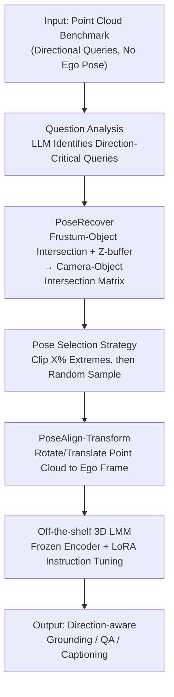

# Direction-aware 3D Large Multimodal Models

**Conference**: CVPR 2026  
**Paper**: [CVF Open Access](https://openaccess.thecvf.com/content/CVPR2026/html/Liu_Direction-aware_3D_Large_Multimodal_Models_CVPR_2026_paper.html)  
**Code**: https://github.com/liuQuan98/PoseAlign3D  
**Area**: 3D Large Models / Multimodal VLM  
**Keywords**: 3D LMM, ego pose, direction-aware, point cloud alignment, ScanNet

## TL;DR
Addressing the pain point where existing 3D point cloud benchmarks ask "left/right/front/back" questions without providing the ego pose—making directional problems inherently ill-posed—this paper introduces PoseRecover to automatically retrieve camera poses from RGB-D video extrinsics for each question. It then uses PoseAlign to transform and align the point cloud directly into that pose coordinate system for off-the-shelf 3D LMMs. Through instruction tuning alone, it achieves a relative improvement of 30% in ScanRefer mIoU and an 11.7% increase in LLM-as-judge accuracy for Scan2Cap.

## Background & Motivation
**Background**: General 3D Large Multimodal Models (3D LMMs, such as LL3DA, Chat-Scene, 3D-LLAVA) that can simultaneously perform grounding, referring, QA, and captioning in 3D scenes are a critical step toward the "visual cognitive core" of future embodied agents. To answer spatial direction questions like "Is the bathroom to the left or right of the bed?", these models must know the perspective—the ego pose.

**Limitations of Prior Work**: Mainstream indoor datasets such as ScanRefer, Multi3DRefer, ScanQA, Scan2Cap, and Nr3D are filled with directional questions (this paper finds that 40%–95% of questions are direction-critical), yet **they do not provide ego poses**. This is because they were originally annotated via "God's eye" third-person crowd-sourcing; where the annotator was standing or looking was never recorded and cannot be precisely recovered after the fact. Consequently, for a question like "on the left," the model's answer could be right or wrong regardless of its reasoning; the problem itself is ill-posed.

**Key Challenge**: Directional semantics (egocentric "to my left" / allocentric "to the left of the car") naturally require a reference coordinate system. Since many indoor objects (plates, tables) lack intrinsic orientation axes, allocentric reasoning often reverts to the ego agent. **Without ego pose, directional semantics have no anchor**, leaving even the strongest models with no basis for learning.

**Key Insight**: Previous works (SQA3D, View2Cap, Scene-LLM) have attempted to "create new datasets and treat ego pose as a latent variable for the model to infer." This paper argues that this is unnecessary—when embodied agents collect point clouds via SLAM, camera poses are a "free lunch" and are already available. Instead of making the model guess, it is better to provide the pose directly as input.

**Core Idea**: Redefine the paradigm—**do not modify the model to infer poses; instead, supplement existing benchmarks with poses and align the point clouds to them**. Use PoseRecover to automatically find the camera pose associated with each question, and use PoseAlign to align the point cloud to that pose, turning directional problems from "unsolvable" to "solvable."

## Method

### Overall Architecture
The entire method is a pipeline comprising "offline pose recovery → online point cloud alignment → off-the-shelf 3D LMM instruction tuning." **It does not modify the model backbone or the point cloud encoder, only manipulating the data side.**

In the first stage, PoseRecover is run offline: an LLM (GPT-OSS-20B) classifies questions into "direction-critical" or not. For each direction-critical question, the system exhaustively calculates the intersection rate between the "camera frustum and target objects" using camera extrinsics from raw ScanNet-v2 RGB-D sequences. Visibility is verified via a Z-buffer to store a "camera-object intersection matrix." In the second online stage, the corresponding column is retrieved according to the ground-truth object, and a selection strategy (Clip) samples an ego reference frame from the candidate poses. In the third stage, PoseAlign applies rotation and translation to the point cloud to align it with this pose coordinate system. This is then fed into an off-the-shelf 3D LMM for instruction tuning, training only the projection layer and LLM LoRA while freezing the point cloud encoder.

### Key Designs

**1. PoseRecover: Retrieving Camera Poses from RGB-D Extrinsics via Frustum-Object Intersection**

This step directly addresses the fundamental issue that benchmarks lack ego poses. While ScanNet-v2's raw RGB-D sequences contain camera intrinsics and extrinsics for every frame, the challenge is determining which frame corresponds to a specific text query. PoseRecover assumes that the frame where the camera clearly sees the mentioned object is the most likely perspective of the annotator.

The intersection rate is calculated based on annotation types. For segmentation masks, each point is projected onto the image plane $(u_i, v_i, 1)^\top = \lfloor K(x'_i, y'_i, z'_i)^\top / z'_i \rfloor$ to form a Z-buffer. Depth comparison is performed to count only **visible** points. The intersection rate is defined as the proportion of visible object points within the frustum: $\phi_{seg} = \frac{1}{|M_{obj}|} \sum_{k \in M_{obj}} \mathbb{I}[z'_k < Z^P_{u_k, v_k} + \delta]$. For bounding boxes, Monte-Carlo sampling is used to estimate the ratio $\phi_{box}$ within the frustum $F$. For point-only annotations, the normalized pixel distance $\phi_{point}$ to the image center is used. This vectorized implementation processes ScanNet-v2 in under 40 minutes, creating an offline camera-object intersection matrix. The **Z-buffer visibility check** is crucial; frustum intersection alone is insufficient as objects might be "inside the frustum but hidden behind a wall."

**2. Pose Selection Strategy: Using Clip to Balance Perspective Consistency and Data Diversity**

PoseRecover provides a **set** of candidate poses. The simplest "Top" strategy selects the pose with the highest intersection rate, but candidates often include perspectives from the opposite side (180° yaw difference), which flips directional semantics. This paper compares Top with Clip (discarding the highest and lowest $X\%$ of candidates before random sampling).

Clip serves two purposes: discarding extremes removes 180° flipped outliers to improve consistency, while random sampling within the middle range introduces ego-perspective jitter during training, **acting as a natural rotation-translation data augmentation**. This allowed the authors to disable all standard point cloud augmentations. Results show that as $X$ increases, yaw difference KDE converges toward 0, though $X=0.3$ is the default to maintain sufficient diversity.

**3. PoseAlign-Transform: Aligning Point Clouds to the Ego Frame**

The paper compares three ways to "inform" the model of the pose. PoseAlign-Transform directly applies a coordinate transformation to the point cloud: $(P_{aligned}|1)^\top = U T^{-1}(P|1)^\top$, where $T = \begin{bmatrix} R & t \\ 0 & 1 \end{bmatrix}$ is the camera extrinsic matrix and $U$ transforms the camera's "right-down-front" system to the "front-left-up" system common in pre-trained encoders. This ensures "left" and "right" have consistent egocentric representations. 

Two other paths serve as controls: PoseAlign-Embed encodes the 6-DoF pose as features added to the projection layer $f_{aligned} = f + \text{MLP}(\text{encode}(R, t, P_f))$, and PoseAlign-Prompt serializes the pose as numerical tokens. Both alternatives perform significantly worse. Transform is effective because pre-trained encoders are **coordinate-sensitive**; by aligning the point cloud, the model "understands" direction without being retrained, which explains why frozen encoders still yield massive improvements.

### Loss & Training
The entire process uses instruction tuning only. For Chat-Scene and 3D-LLAVA, the LLM LoRA and projection layers are trained while the 3D encoder is frozen. For LL3DA, only the Q-Former is trained. **Freezing the encoder is intentional** to prevent the model from developing a bias for objects on a specific axis and to ensure that all gains are strictly attributed to PoseAlign rather than the encoder learning pose-based shortcuts.

## Key Experimental Results

The evaluation uses ScanNet-v2 (1201 train / 312 val) across ScanRefer, Multi3DRefer, ScanQA, SQA3D, and Scan2Cap. Metrics include traditional scores (CiDEr, mIoU, etc.) and **LLM-as-judge accuracy (L-A)** using GPT-OSS-20B to determine semantic correctness.

### Main Results
Adding PoseAlign-Transform to four different 3D LMM architectures consistently improved performance. 3D-LLAVA + PoseAlign-Transform achieved the highest overall performance:

| Dataset | Metric | 3D-LLAVA | +PoseAlign-T | Gain |
| :--- | :--- | :--- | :--- | :--- |
| ScanRefer | mIoU | 42.6 | 55.4 | ∆30.0% |
| Multi3DRefer | mIoU | 48.1 | 54.3 | ∆12.9% |
| ScanQA | L-A | 45.7 | 47.3 | ∆3.5% |
| Scan2Cap | L-A | 28.1 | 31.4 | ∆11.7% |

Other backbones also benefited: Chat-Scene + PoseAlign-E increased ScanRefer A@0.5 from 46.4 to 46.9. In referring segmentation, 3D-LLAVA saw the largest gains (+12.8% and +6.2% mIoU respectively). Since the 3D encoder was frozen, these improvements stem entirely from the improved quality of the LLM-generated `<SEG>` tokens.

### Ablation Study
Comparing pose injection methods on 3D-LLAVA:

| Configuration | ScanRef | Multi3DRef | ScanQA | Scan2Cap | Description |
| :--- | :--- | :--- | :--- | :--- | :--- |
| Baseline | 42.6 | 48.1 | 45.7 | 28.1 | No pose |
| Baseline on PoseAlign-T data | 37.5 | 41.5 | 43.0 | 23.5 | General performance drop |
| Random Pose | 39.0 | 44.3 | 44.7 | 25.8 | Lower than baseline |
| PoseAlign-T (Clip X=0.3) | 55.4 | 54.3 | 47.3 | 31.4 | Default, most balanced |
| PoseAlign-T (Top) | 68.5 | 60.2 | 47.5 | 29.7 | Best segmentation, weaker QA |
| PoseAlign-E (Top) | 43.2 | 49.3 | 43.4 | 23.5 | Embedding, limited gain |
| PoseAlign-P (Top) | 44.2 | 49.4 | 44.9 | 28.1 | Text prompt, negligible gain |

### Key Findings
- **Transform outperforms Embed/Prompt**: Aligning the point cloud (Transform) is far superior to encoding poses as features or text. This confirms that leveraging the encoder's coordinate sensitivity is the correct path.
- **Frozen encoders show no shortcuts**: Testing the baseline model directly on PoseAlign-T transformed data resulted in a performance drop (ScanRefer 42.6 → 37.5), proving the frozen segmentation model does not treat pose as a shortcut.
- **Pose accuracy is critical**: Replacing PoseRecover with Random Poses yielded results worse than the baseline, proving that "finding the right perspective" is the prerequisite for improvement.
- **direction-critical subsets gain the most**: Baseline models fail significantly on directional questions. PoseAlign-T achieves its largest gains on these subsets (ScanQA CiDEr ∆4.9%), closing the gap between directional and non-directional tasks.

## Highlights & Insights
- **Sharp Observation**: Identifying that many directional benchmark questions are ill-posed—not due to model weakness, but missing context—reframes the problem from "making models stronger" to "making the problem complete."
- **Avoiding Latent Inference**: By recognizing that camera poses are "free" during SLAM collection and using them directly, the method avoids the complexity of generating new datasets or adding inference modules.
- **Simplicity of Alignment**: Applying coordinate transformations without changing architectures or adding modules leverages pre-trained coordinate-sensitive representations, achieving 30% mIoU gains with a frozen encoder.
- **Dual-purpose Clip**: A single strategy cleans outlier perspectives and provides data augmentation simultaneously, an elegant design.

## Limitations & Future Work
- **Dependency on RGB-D Sequences**: PoseRecover requires raw sequences and extrinsics, making it inapplicable to pure point clouds without video trajectories.
- **Recovered Poses vs. Ground Truth**: PoseRecover is a heuristic match. If an object is visible from multiple angles, the selected pose may not be the exact one used by the original annotator.
- **Skeleton Compatibility**: Architectures like Chat-Scene rely on pre-computed embeddings and cannot easily use the Transform method.

## Related Work & Insights
- **vs SQA3D**: SQA3D uses text descriptions to convey ego contexts, which can be ambiguous. This work provides numerical poses and aligns the point cloud, which is unambiguous and fits embodied workflows.
- **vs View2Cap**: View2Cap's Situation Grounding module attempts to **regress** camera poses from frustum-clipped point clouds; this work avoids regression errors by using existing poses for direct alignment.
- **vs Scene-LLM**: Scene-LLM uses a complex two-step reasoning (frustum then scene). This method is simpler, more universal, and fixes **existing** benchmarks instead of starting from scratch.

## Rating
- Novelty: ⭐⭐⭐⭐⭐ Reframing directional questions via ego pose alignment is a unique perspective.
- Experimental Thoroughness: ⭐⭐⭐⭐ Solid verification across 4 backbones and 5 datasets, though lacks cross-dataset generalization.
- Writing Quality: ⭐⭐⭐⭐ Clear motivation, complete formulas, and clean ablation attribution.
- Value: ⭐⭐⭐⭐⭐ A plug-and-play, instruction-tuning-only baseline that is universal for any 3D LMM.

<!-- RELATED:START -->

## Related Papers

- [\[CVPR 2026\] MASQuant: Modality-Aware Smoothing Quantization for Multimodal Large Language Models](masquant_modality-aware_smoothing_quantization_for_multimodal_large_language_mod.md)
- [\[CVPR 2026\] Grounded 3D-Aware Spatial Vision-Language Modeling](grounded_3d-aware_spatial_vision-language_modeling.md)
- [\[CVPR 2026\] CoVFT: Context-aware Visual Fine-tuning for Multimodal Large Language Models](covft_context-aware_visual_fine-tuning_for_multimodal_large_language_models.md)
- [\[CVPR 2026\] Taxonomy-Aware Representation Alignment for Hierarchical Visual Recognition with Large Multimodal Models](taxonomy-aware_representation_alignment_for_hierarchical_visual_recognition_with.md)
- [\[CVPR 2026\] Uncertainty-Aware Knowledge Distillation for Multimodal Large Language Models](uncertainty-aware_knowledge_distillation_for_multimodal_large_language_models.md)

<!-- RELATED:END -->
